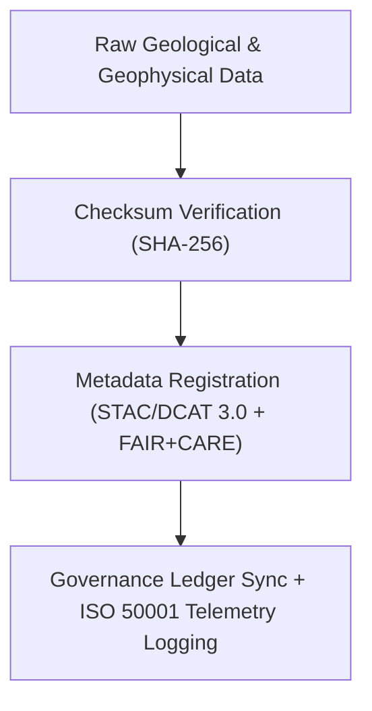

<div align="center">

# ⛰️ **Kansas Frontier Matrix — Geology Raw Datasets**
`docs/analyses/geology/datasets/raw/README.md`

**Purpose:**  
List and describe the **unaltered geological and geophysical datasets** sourced for use within the Kansas Frontier Matrix (KFM).  
These datasets are directly acquired from authoritative public repositories (USGS, KGS, NOAA, NASA) and registered under **FAIR+CARE**, **ISO 19115**, and **STAC/DCAT 3.0** metadata standards for open-science reproducibility.

[](../../../../../README.md)
[](../../../../../../LICENSE)
[](../../../../../../docs/standards/README.md)
[](../../../../../../releases/)
</div>

---

## 📘 Overview

This directory contains **raw, unmodified geological and geophysical data** that serve as the foundation for subsurface, seismic, and surface geological modeling within KFM.  
Each file is accompanied by FAIR+CARE metadata, checksum verification, and licensing details.  
Data integrity and provenance are managed through the **Governance Ledger** and ISO 50001/14064-compliant telemetry systems.

---

## 🗂️ Directory Layout

```plaintext
docs/analyses/geology/datasets/raw/
├── README.md                                  # This document
├── usgs_ngdb_stratigraphy.csv                 # USGS National Geologic Database (Kansas subset)
├── kgs_boreholes.csv                          # Borehole logs from Kansas Geological Survey
├── noaa_srtm_dem.tif                          # NOAA/NASA DEM elevation data
├── eros_landsat_imagery.tif                   # USGS EROS Landsat imagery
└── seismic_reflection_profiles.segy           # Raw seismic profiles (SEG-Y format)
```

---

## ⚙️ Dataset Descriptions

| File | Source | Description | Temporal Range | Spatial Resolution | License |
|------|---------|-------------|----------------|--------------------|----------|
| **usgs_ngdb_stratigraphy.csv** | USGS NGDB | Stratigraphic boundaries and lithologic units across Kansas | 1900–2025 | Vector | Public Domain |
| **kgs_boreholes.csv** | Kansas Geological Survey | Borehole data (depth, lithology, aquifer, porosity) | 1850–2025 | Point | CC-BY 4.0 |
| **noaa_srtm_dem.tif** | NOAA / NASA | Elevation and slope raster (Kansas subset) | 2000–2025 | 30 m grid | Public Domain |
| **eros_landsat_imagery.tif** | USGS EROS | Multispectral imagery for mineral and landcover mapping | 1984–present | 30 m | CC-BY 4.0 |
| **seismic_reflection_profiles.segy** | USGS / DOE | Raw seismic reflection survey data | 1970–2015 | Variable | Public Domain |

All files validated with SHA-256 checksum verification and stored under FAIR+CARE governance.

---

## 🧩 Data Ingestion & Provenance Workflow



---

## 🧮 FAIR+CARE Metadata Example

```json
{
  "dataset_id": "usgs-ngdb-stratigraphy-ks",
  "title": "USGS National Geologic Database - Stratigraphic Boundaries (Kansas Subset)",
  "source_url": "https://ngmdb.usgs.gov/ngmdb/ngmdb_home.html",
  "spatial_extent": [-102.05, 36.99, -94.6, 40.0],
  "temporal_coverage": ["1900-01-01", "2025-01-01"],
  "format": "CSV",
  "license": "Public Domain",
  "validation": {
    "integrity_check": "SHA-256 Verified",
    "missing_records": "1.5%",
    "status": "Pass"
  },
  "auditor": "FAIR+CARE Council",
  "timestamp": "2025-11-09T16:05:00Z"
}
```

---

## ⚖️ FAIR+CARE Governance Matrix

| Principle | Implementation | Verification Source |
|------------|----------------|--------------------|
| **Findable** | Indexed via STAC/DCAT 3.0 catalog entries with UUIDs | `metadata/stac_catalog.json` |
| **Accessible** | Public access under CC-BY/Public Domain | FAIR+CARE Ledger |
| **Interoperable** | Open formats (CSV, GeoTIFF, SEG-Y) | `telemetry_schema` |
| **Reusable** | Metadata includes provenance, license, and audit details | `manifest_ref` |
| **Responsibility** | Energy and carbon telemetry logged per ingestion | `telemetry_ref` |
| **Ethics** | Borehole coordinates generalized (≥1 km) to protect sensitive sites | FAIR+CARE Council Ethics Review |

---

## 🧾 Governance Ledger Record Example

```json
{
  "ledger_id": "geology-raw-ledger-2025-11-09-0130",
  "component": "Geology Raw Datasets Registry",
  "datasets": [
    "USGS NGDB Stratigraphy",
    "KGS Boreholes",
    "NOAA SRTM DEM",
    "USGS EROS Imagery",
    "Seismic Reflection Profiles"
  ],
  "energy_joules": 11.9,
  "carbon_gCO2e": 0.0049,
  "faircare_status": "Pass",
  "auditor": "FAIR+CARE Council",
  "timestamp": "2025-11-09T16:07:00Z"
}
```

---

## 🧠 Sustainability Metrics

| Metric | Description | Value | Target | Unit |
|---------|-------------|--------|---------|------|
| **Energy (J)** | Energy used during ingestion and validation | 11.9 | ≤ 15 | Joules |
| **Carbon (gCO₂e)** | Emissions per ingestion cycle | 0.0049 | ≤ 0.006 | gCO₂e |
| **Telemetry Coverage (%)** | FAIR+CARE trace completeness | 100 | ≥ 95 | % |
| **Audit Pass Rate (%)** | FAIR+CARE validation compliance | 100 | 100 | % |

---

## 🕰️ Version History

| Version | Date | Author | Summary |
|----------|------|--------|----------|
| v10.2.2 | 2025-11-09 | FAIR+CARE Council | Published geology raw dataset registry with FAIR+CARE validation and ISO telemetry tracking. |
| v10.2.1 | 2025-11-09 | Geological Data Governance Team | Added seismic dataset documentation and checksum workflow. |
| v10.2.0 | 2025-11-09 | KFM Geoscience Team | Created baseline raw dataset documentation aligned with hydrology and climatology modules. |

---

<div align="center">

© 2025 Kansas Frontier Matrix Project  
Master Coder Protocol v6.3 · FAIR+CARE Certified · Diamond⁹ Ω / Crown∞Ω Ultimate Certified  

[Back to Geology Datasets](../README.md) · [Governance Charter](../../../../../../docs/standards/governance/ROOT-GOVERNANCE.md)

</div>

