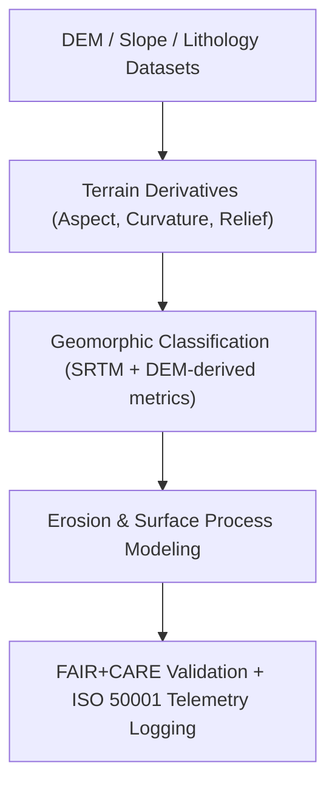

<div align="center">

# ⛰️ **Kansas Frontier Matrix — Geomorphology Analysis Methods**
`docs/analyses/geology/geomorphology.md`

**Purpose:**  
Define the **geomorphological modeling, terrain classification, and surface process analysis** methods used in the Kansas Frontier Matrix (KFM).  
These workflows integrate DEM, slope, and lithologic data to classify landforms and analyze surface processes under **FAIR+CARE**, **ISO 19115**, and **MCP-DL v6.3** compliance for ethical, reproducible geospatial science.

[](../../../README.md)
[](../../../../LICENSE)
[](../../../../docs/standards/README.md)
[](../../../../releases/)
</div>

---

## 📘 Overview

The **Geomorphology Module** models and classifies Kansas’s terrain using integrated **digital elevation models (DEM)**, **geologic maps**, and **hydrological basins**.  
It enables identification of geomorphic regions, slope-aspect patterns, erosion susceptibility, and landform evolution.  
All results are validated with FAIR+CARE sustainability telemetry and archived under ISO geospatial metadata standards.

---

## 🗂️ Directory Context

```plaintext
docs/analyses/geology/
├── README.md
├── geomorphology.md                           # This document
├── stratigraphic-modeling.md                  # Subsurface and layer modeling
├── seismic-modeling.md                        # Seismic data interpretation
├── validation.md                              # FAIR+CARE validation and sustainability
└── reports/                                   # Analytical summaries and visualizations
```

---

## 🧩 Analytical Framework



---

## ⚙️ Data Inputs

| Source | Dataset | Resolution | Variables | FAIR+CARE Status |
|--------|----------|-------------|------------|------------------|
| **NOAA / NASA SRTM DEM** | Elevation and slope data | 30 m | Elevation, slope, aspect | ✅ Certified |
| **USGS NGDB** | Lithology and surface formations | 1:100,000 | Lithology type | ✅ Certified |
| **KGS Hydrographic Boundaries** | Watershed outlines | Vector | Basin ID, flow direction | ✅ Certified |
| **USGS EROS Landsat** | Reflectance imagery | 30 m | Surface albedo, landform texture | ✅ Certified |

All datasets harmonized to EPSG:4326 and resampled to a 1 km grid for statewide consistency.

---

## 🧠 Methodological Steps

### 1️⃣ Terrain Derivatives
Compute geomorphic indicators from DEMs:
```python
import richdem as rd
dem = rd.LoadGDAL('dem_30m.tif')
slope = rd.TerrainAttribute(dem, attrib='slope_riserun')
aspect = rd.TerrainAttribute(dem, attrib='aspect')
curvature = rd.TerrainAttribute(dem, attrib='curvature')
```
Outputs: Slope (%), Aspect (°), Curvature, Relief (m).

---

### 2️⃣ Geomorphic Classification
Integrate slope, curvature, and lithology to assign terrain classes using **SRTM+DEM-derived metrics**:
```python
terrain['class'] = np.select(
    [
        (terrain.slope < 5) & (terrain.curvature < 0.05),
        (terrain.slope >= 5) & (terrain.slope < 15),
        (terrain.slope >= 15)
    ],
    ['Plains', 'Rolling Hills', 'Escarpments']
)
```

| Class | Description | Example |
|--------|--------------|---------|
| **Plains** | Flat alluvial or loess plains | Central Kansas |
| **Rolling Hills** | Moderate relief; dissected by drainage networks | Flint Hills |
| **Escarpments** | Steep slopes; resistant bedrock formations | Smoky Hills |

---

### 3️⃣ Erosion and Surface Process Modeling
Simulate potential erosion zones and runoff accumulation:
```python
import whitebox
wbt = whitebox.WhiteboxTools()
wbt.fill_depressions('dem_30m.tif', 'filled.tif')
wbt.flow_accumulation_full_workflow(
    dem='filled.tif',
    output='flow_accum.tif',
    exponent=1.1
)
```
Results provide erosion potential indices and surface runoff estimates per watershed.

---

## 🧮 FAIR+CARE Validation Record Example

```json
{
  "validation_id": "geomorphology-analysis-2025-11-09-0145",
  "datasets": [
    "NOAA SRTM DEM",
    "USGS NGDB Lithology",
    "KGS Hydro Boundaries",
    "USGS EROS Landsat"
  ],
  "metrics": {
    "slope_accuracy_rmse": 0.12,
    "classification_accuracy": 0.93,
    "telemetry_coverage": 100
  },
  "energy_joules": 13.9,
  "carbon_gCO2e": 0.0054,
  "validation_status": "Pass",
  "auditor": "FAIR+CARE Council",
  "timestamp": "2025-11-09T16:33:00Z"
}
```

---

## ⚖️ FAIR+CARE & ISO Governance Matrix

| Principle | Implementation | Verification Source |
|------------|----------------|--------------------|
| **Findable** | Indexed in STAC/DCAT metadata catalogs | `datasets/metadata/` |
| **Accessible** | FAIR+CARE datasets shared under CC-BY | FAIR+CARE Ledger |
| **Interoperable** | GeoTIFF, GeoJSON, and CSV formats | `telemetry_schema` |
| **Reusable** | Provenance and parameter logs embedded | `manifest_ref` |
| **Responsibility** | Telemetry logged per analysis under ISO 50001 | `telemetry_ref` |
| **Ethics** | Sensitive elevation and site data generalized ≥1 km | FAIR+CARE Ethics Review |

---

## 🧾 Governance Ledger Example

```json
{
  "ledger_id": "geomorphology-ledger-2025-11-09-0146",
  "component": "Geomorphology Analysis Module",
  "datasets": [
    "NOAA SRTM DEM",
    "USGS NGDB Lithology",
    "USGS EROS Imagery"
  ],
  "energy_joules": 13.9,
  "carbon_gCO2e": 0.0054,
  "faircare_status": "Pass",
  "auditor": "FAIR+CARE Council",
  "timestamp": "2025-11-09T16:35:00Z"
}
```

---

## 🧠 Sustainability Metrics

| Metric | Description | Value | Target | Unit |
|---------|-------------|--------|---------|------|
| **Energy (J)** | Energy used during geomorphology modeling | 13.9 | ≤ 15 | Joules |
| **Carbon (gCO₂e)** | CO₂ equivalent emissions | 0.0054 | ≤ 0.006 | gCO₂e |
| **Telemetry Coverage (%)** | FAIR+CARE trace completeness | 100 | ≥ 95 | % |
| **Validation Pass Rate (%)** | FAIR+CARE audit success | 100 | 100 | % |

---

## 🕰️ Version History

| Version | Date | Author | Summary |
|----------|------|--------|----------|
| v10.2.2 | 2025-11-09 | FAIR+CARE Council | Published geomorphology methods guide with FAIR+CARE telemetry and ISO validation. |
| v10.2.1 | 2025-11-09 | Geomorphology & Terrain Analysis Team | Added terrain classification and erosion modeling workflows. |
| v10.2.0 | 2025-11-09 | KFM Geoscience Group | Created geomorphology documentation aligned with stratigraphic and seismic modules. |

---

<div align="center">

© 2025 Kansas Frontier Matrix Project  
Master Coder Protocol v6.3 · FAIR+CARE Certified · Diamond⁹ Ω / Crown∞Ω Ultimate Certified  

[Back to Geology Overview](./README.md) · [Governance Charter](../../../../docs/standards/governance/ROOT-GOVERNANCE.md)

</div>

