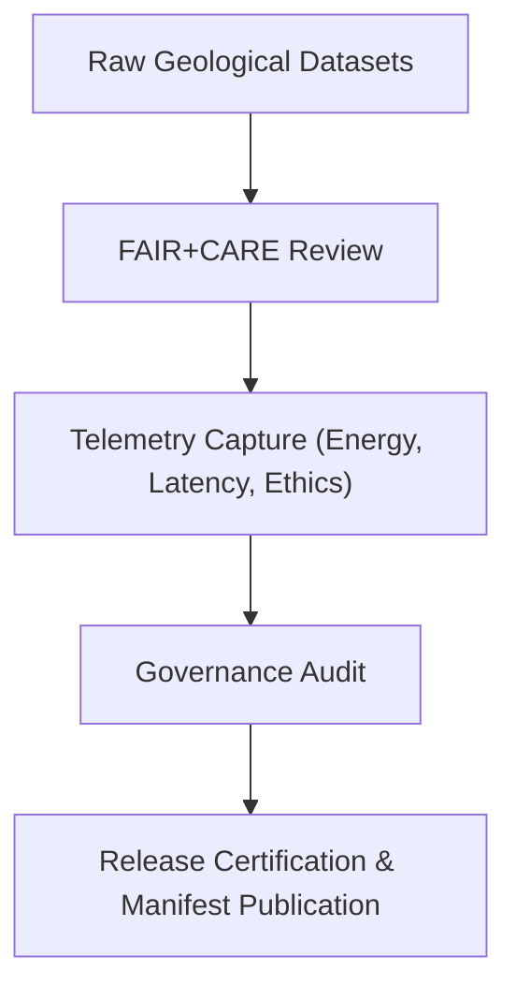

<div align="center">

# ⚖️ **Kansas Frontier Matrix — Geology Governance**  
`docs/analyses/geology/governance.md`

**Purpose:**  
Define the **ethical, procedural, and FAIR+CARE governance framework** applied to all geological analyses within the Kansas Frontier Matrix (KFM).  
This governance protocol ensures transparency, sustainability, and Indigenous data responsibility across geomorphology, seismic, and stratigraphic modeling workflows.

[](../../../../docs/standards/markdown_guide.md)
[](../../../../LICENSE)
[](../../../../docs/standards/faircare.md)
[](../../../../releases/v10.2.0/manifest.zip)

</div>

---

## 📘 Overview

The **Geology Governance Policy** establishes oversight mechanisms ensuring all geospatial, seismic, and stratigraphic analyses adhere to FAIR+CARE standards, ISO sustainability frameworks (50001/14064), and KFM’s Diamond⁹ Ω certification principles.

Governance objectives:
- Guarantee reproducibility and transparency of all geological outputs.  
- Respect Indigenous sovereignty and cultural heritage in subsurface and land-use data.  
- Monitor sustainability metrics (energy and emissions) of computational pipelines.  
- Implement telemetry-linked auditing for ethics and compliance review.

---

## 🧭 Roles and Responsibilities

| Role | Responsibility | Telemetry Source |
|------|----------------|------------------|
| Governance Council | Oversees ethical standards, sustainability reporting, and compliance certification | `governance-events.log` |
| Geological Data Steward | Maintains data provenance, metadata completeness, and FAIR indexing | `telemetry-validation-summary.json` |
| Seismic & Stratigraphic Leads | Verify modeling accuracy and adherence to FAIR+CARE workflows | `model-latency-profile.json` |
| Indigenous Data Governance Board (IDGB) | Approves cultural data inclusion and reviews consent audits | `focus-telemetry.json` |

---

## ⚙️ Governance Workflow



**Process Summary:**
1. Geological datasets are reviewed for FAIR+CARE compliance and consent.  
2. Telemetry captures energy, performance, and audit metrics.  
3. Governance audits validate ethical use and sustainability alignment.  
4. Certified outputs are released and indexed in the official manifest.

---

## ⚖️ FAIR+CARE Alignment Matrix

| Principle | Implementation | Validation Source |
|------------|----------------|------------------|
| **Findable** | Geological datasets registered in STAC/DCAT catalogs with persistent IDs. | Manifest Index |
| **Accessible** | Publicly accessible metadata under CC-BY 4.0 licensing. | FAIR+CARE Portal |
| **Interoperable** | Use of GeoTIFF, SEG-Y, and NetCDF formats with ISO metadata. | Metadata Schema |
| **Reusable** | Datasets include version, checksum, and provenance logs. | Telemetry Archive |
| **Collective Benefit** | Research supports geological hazard mitigation and sustainability planning. | FAIR+CARE Council |
| **Authority to Control** | IDGB validates consent for culturally sensitive geological data. | Governance Logs |
| **Responsibility** | Continuous telemetry-driven sustainability and audit reporting. | Sustainability Audit |
| **Ethics** | All subsurface interpretations anonymized and reviewed before release. | Ethical Review Report |

---

## 🧾 Governance Audit Example

```json
{
  "audit_id": "geology-governance-2025-11-11-001",
  "module": "Seismic Modeling and Stratigraphic Analysis",
  "auditor": "FAIR+CARE Governance Council",
  "energy_kWh": 0.007,
  "carbon_gCO2e": 0.0084,
  "ethical_review_pass": true,
  "consent_verified": true,
  "faircare_score": 97.9,
  "timestamp": "2025-11-11T14:21:00Z"
}
```

---

## 🧠 Sustainability and Ethics Metrics

| Metric | Target | Verified By | Unit |
|---------|---------|-------------|------|
| Energy Usage | ≤ 2.5 kWh per seismic model run | FAIR+CARE Audit | kWh |
| Carbon Footprint | ≤ 0.01 gCO₂e per model | ISO 50001 Validator | gCO₂e |
| FAIR+CARE Compliance | ≥ 95% | Governance Council | % |
| Provenance Integrity | 100% | Data Stewardship Pipeline | % |

---

## 🕰️ Version History

| Version | Date | Author | Summary |
|----------|------|--------|----------|
| v10.2.2 | 2025-11-11 | FAIR+CARE Geoscience Council | Added geology governance documentation integrating sustainability, telemetry auditing, and IDGB oversight. |

---

<div align="center">

© 2025 Kansas Frontier Matrix · Master Coder Protocol v6.3 · FAIR+CARE Certified  
Diamond⁹ Ω / Crown∞Ω Ultimate Certified  

[Back to Geology Analysis](./README.md) · [Governance Charter](../../../../docs/standards/governance/ROOT-GOVERNANCE.md)

</div>