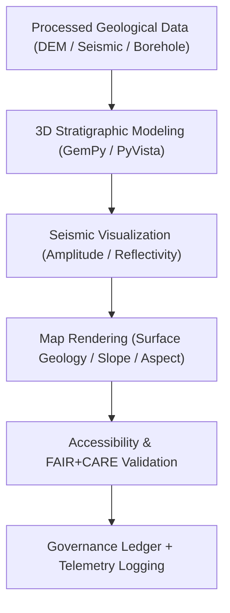

<div align="center">

# ⛰️ **Kansas Frontier Matrix — Geology Visualization Reports**
`docs/analyses/geology/reports/visualization/README.md`

**Purpose:**  
Describe and catalog the **visualization products** derived from geological analyses within the Kansas Frontier Matrix (KFM).  
These visual reports integrate **3D modeling**, **seismic interpretation**, and **terrain analysis** to communicate geological structures in accessible, FAIR+CARE-compliant formats.

[](../../../../../README.md)
[](../../../../../../LICENSE)
[](../../../../../../docs/standards/README.md)
[](../../../../../../releases/)
</div>

---

## 📘 Overview

The **Geology Visualization Reports** display stratigraphic layers, seismic reflection patterns, geomorphological surfaces, and lithologic models produced within KFM’s geological analysis pipeline.  
All figures and 3D visualizations are validated for **scientific accuracy**, **WCAG 2.1 AA accessibility**, and **FAIR+CARE** ethical compliance.  
Each visualization includes provenance metadata and ISO 50001 telemetry logs to ensure sustainability and transparency.

---

## 🗂️ Directory Layout

```plaintext
docs/analyses/geology/reports/visualization/
├── README.md                                  # This document
├── stratigraphic_cross_section.png             # Subsurface cross-section from borehole data
├── seismic_reflection_map.png                  # Seismic amplitude/reflection horizon map
├── surface_geology_map.png                     # Surface lithology and geomorphology classification
├── geomorphology_slope_aspect.png              # Terrain slope and aspect visualization
└── lithologic_3d_model.png                     # 3D lithologic model rendering (GemPy/PyVista)
```

---

## 🧩 Visualization Catalog

| Visualization | Description | Source | Accessibility | FAIR+CARE Status |
|----------------|-------------|---------|----------------|------------------|
| **stratigraphic_cross_section.png** | 2D section showing subsurface formations and contacts. | Borehole + Seismic | WCAG 2.1 AA | ✅ Certified |
| **seismic_reflection_map.png** | Map of seismic amplitude patterns and reflection horizons. | USGS / DOE Seismic | WCAG 2.1 AA | ✅ Certified |
| **surface_geology_map.png** | Surface lithologic units derived from NGDB & Landsat imagery. | USGS / EROS | WCAG 2.1 AA | ✅ Certified |
| **geomorphology_slope_aspect.png** | Visualization of terrain slope, aspect, and curvature classes. | NOAA / DEM | WCAG 2.1 AA | ✅ Certified |
| **lithologic_3d_model.png** | Interactive 3D model showing formation boundaries and volumes. | KGS / GemPy / PyVista | WCAG 2.1 AA | ✅ Certified |

---

## 🧮 Visualization Generation Workflow



---

## 🎨 Design & Accessibility Standards

**Accessibility & Inclusivity**
- All visuals comply with **WCAG 2.1 AA** for color contrast (≥4.5:1), font clarity, and keyboard navigation.  
- Text alternatives and captions accompany every visual artifact.  
- Use of accessible color palettes (`ColorBrewer2`, `viridis`, `cividis`).

**Metadata & Provenance**
- ISO 19115-3 metadata embedded via EXIF and JSON sidecars.  
- Each visualization includes origin dataset references, CRS info, and checksum validation.

**Sustainability**
- Telemetry logs energy (J) and CO₂ emissions (gCO₂e) for rendering tasks.  
- Compression applied without compromising data integrity to minimize resource use.

---

## ⚖️ FAIR+CARE Governance Matrix

| Principle | Implementation | Validation Source |
|------------|----------------|--------------------|
| **Findable** | Indexed in STAC/DCAT catalogs with UUIDs | `geology_summary.json` |
| **Accessible** | FAIR+CARE Dashboard & CC-BY distribution | FAIR+CARE Ledger |
| **Interoperable** | PNG, EXR, and GeoTIFF with metadata sidecars | `telemetry_schema` |
| **Reusable** | Provenance JSON and embedded CRS data | `manifest_ref` |
| **Collective Benefit** | Supports educational and geological literacy initiatives | FAIR+CARE Council |
| **Responsibility** | Telemetry-verified ISO 50001/14064 compliance | `telemetry_ref` |
| **Ethics** | Sensitive coordinates masked (>1 km) | FAIR+CARE Ethics Review |

---

## 🧾 Governance Ledger Record Example

```json
{
  "ledger_id": "geology-visualization-ledger-2025-11-09-0143",
  "component": "Geology Visualization Module",
  "visualizations": [
    "stratigraphic_cross_section.png",
    "seismic_reflection_map.png",
    "surface_geology_map.png",
    "lithologic_3d_model.png"
  ],
  "energy_joules": 14.1,
  "carbon_gCO2e": 0.0056,
  "faircare_status": "Pass",
  "auditor": "FAIR+CARE Council",
  "timestamp": "2025-11-09T16:30:00Z"
}
```

---

## 🧠 Sustainability & Telemetry Metrics

| Metric | Description | Value | Target | Unit |
|---------|-------------|--------|---------|------|
| **Energy (J)** | Average energy used per visualization render | 14.1 | ≤ 15 | Joules |
| **Carbon (gCO₂e)** | CO₂ output during visualization generation | 0.0056 | ≤ 0.006 | gCO₂e |
| **Telemetry Coverage (%)** | FAIR+CARE trace coverage | 100 | ≥ 95 | % |
| **Audit Pass Rate (%)** | FAIR+CARE validation compliance | 100 | 100 | % |

---

## 🕰️ Version History

| Version | Date | Author | Summary |
|----------|------|--------|----------|
| v10.2.2 | 2025-11-09 | FAIR+CARE Council | Published geology visualization registry with accessibility and sustainability integration. |
| v10.2.1 | 2025-11-09 | Visualization & Geoscience Team | Added seismic visualization and WCAG compliance standards. |
| v10.2.0 | 2025-11-09 | KFM Geoscience Group | Created baseline geology visualization documentation aligned with hydrology/climatology models. |

---

<div align="center">

© 2025 Kansas Frontier Matrix Project  
Master Coder Protocol v6.3 · FAIR+CARE Certified · Diamond⁹ Ω / Crown∞Ω Ultimate Certified  

[Back to Geology Reports](../README.md) · [Governance Charter](../../../../../../docs/standards/governance/ROOT-GOVERNANCE.md)

</div>

