<div align="center">

# 🖼️ **Kansas Frontier Matrix — Geology Results: Figures**  
`docs/analyses/geology/results/figures/README.md`

**Purpose:**  
Document and catalogue all **visualisation outputs** produced within the Geology Results module of the Kansas Frontier Matrix (KFM).  
These visuals—including subsurface cross-sections, terrain change maps, and structural model diagrams—are FAIR+CARE certified, embed full provenance metadata, and comply with WCAG 2.1 AA accessibility standards while being registered via telemetry and governance linkage.

[](../README.md)  
[](../../standards/faircare.md)  
[](../../../LICENSE)  
[](../../releases/v10.2.0/manifest.zip)

</div>

---

## 📘 Overview

The **Geology Results: Figures** directory contains final visual assets generated from modelling and analysis pipelines including seismic inversion maps, stratigraphic diagram overlays, geomorphological terrain change visuals, and structural interpretation schematics.  
Each file is accompanied by:
- Metadata side-car or embedded JSON capturing dataset reference, generation date, script version and checksum.  
- Accessibility features such as alt-text and legend descriptions.  
- Telemetry logs indicating runtime, energy consumption, and governance verification.  

This ensures reproducibility, transparency, and ethical data stewardship aligned with FAIR+CARE and Diamond-certification protocols.

---

## 🗂️ Directory Layout

```bash
docs/analyses/geology/results/figures/
 ├── README.md
 ├── subsurface-model-crosssection.png
 ├── terrain-change-map.svg
 ├── structural-fault-network.png
 └── geomorphology-erosion-heatmap.png
```

Each visual is versioned and referenced in the global manifest for traceability and multi-domain integration.

---

## 🧩 Visual Catalogue

| File                                   | Description                                                        | Key Metadata                                   |
|----------------------------------------|--------------------------------------------------------------------|------------------------------------------------|
| `subsurface-model-crosssection.png`     | Cross-section visualization of subsurface geology and recharge zones| `dataset_ref`, `model_version`, `alt_text`     |
| `terrain-change-map.svg`                | Map showing terrain elevation change over time                     | `time_span`, `units`, `checksum`                 |
| `structural-fault-network.png`          | Diagram of mapped fault lines and stratigraphic interfaces         | `input_layers`, `script_hash`, `caption`        |
| `geomorphology-erosion-heatmap.png`     | Heatmap depicting hillslope erosion rates in the study area        | `resolution`, `metric_units`, `telemetry_id`   |

---

## ⚙️ Generation & Validation Workflow

```mermaid
flowchart TD
  A["Model/Analysis Output (GeoTIFF/NetCDF)"] --> B["Visualization Engine (Python/R/GIS)"]
  B --> C["Metadata Embedding & Alt-Text Insertion"]
  C --> D["Accessibility Audit (WCAG 2.1 AA)"]
  D --> E["Telemetry Logging (Energy, Runtime, Gover­nance)"]
  E --> F["Manifest Registration & Release"]
```



This workflow ensures that each visual asset is traceable, audited, accessible and reusable for future cross-domain synthesis.

---

## ⚖️ FAIR+CARE Governance Summary

| Principle           | Implementation Summary                                                           |
|----------------------|----------------------------------------------------------------------------------|
| **Findable**          | Visuals indexed with UUIDs and manifest references                             |
| **Accessible**        | CC-BY license, alt-text, high-contrast design supporting WCAG 2.1 AA             |
| **Interoperable**     | Use of open formats (PNG, SVG) with machine-readable metadata                   |
| **Reusable**          | Provenance, versioning and telemetry logged                                     |
| **Collective Benefit**| Supports geological, hydrological and ecological integration                     |
| **Authority to Control**| Sensitive geological data anonymised or aggreg­ated per Indigenous protocols  |
| **Responsibility**    | Telemetry tracks energy usage and carbon emissions per render                   |
| **Ethics**            | Governance logs capture audit and consent events for sensitive datasets          |

---

## 🕰️ Version History

| Version | Date       | Author                          | Summary                                                       |
|---------|------------|----------------------------------|----------------------------------------------------------------|
| v10.2.2 | 2025-11-11 | FAIR+CARE Geology Results Council| Published figures documentation aligned with v10.2 schema and governance standards |

---

<div align="center">

© 2025 Kansas Frontier Matrix · Master Coder Protocol v6.3 · FAIR+CARE Certified · Diamond⁹ Ω / Crown∞Ω Ultimate Certified  
[⬅ Back to Geology Results](../README.md) · [Governance Charter](../../standards/governance/ROOT-GOVERNANCE.md)

</div>

