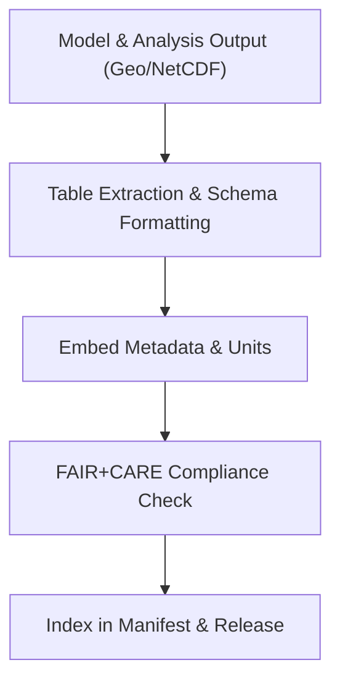

<div align="center">

# 📊 **Kansas Frontier Matrix — Geology Results: Tables**  
`docs/analyses/geology/results/tables/README.md`

**Purpose:**  
Document and catalogue all **tabular output datasets** produced by the Geology Results workflows within the Kansas Frontier Matrix (KFM).  
These tables contain modelling metrics, validation results, and sustainability statistics—each aligned with FAIR+CARE governance and Master Coder Protocol v6.3 best practices.

[](../README.md)  
[](../../standards/faircare.md)  
[](../../../LICENSE)  
[](../../releases/v10.2.0/manifest.zip)

</div>

---

## 📘 Overview

This folder holds all tabular artefacts from geological analysis streams, including modelling outputs (e.g., seismic inversion metrics, stratigraphic classifications), validation logs, and energy-use summaries.  
Each file follows naming conventions, embeds metadata (units, schema, provenance), and is indexed in the global manifest for traceability and reuse. :contentReference[oaicite:0]{index=0}

---

## 🗂️ Directory Layout

```bash
docs/analyses/geology/results/tables/
 ├── README.md
 ├── seismic-metrics.csv                  # Summary of seismic modelling performance
 ├── stratigraphy-validation.csv           # Validation results for stratigraphic layers
 ├── geomorphology-change-index.csv        # Change index table for terrain/landform shifts
 └── energy-usage-summary.csv               # Energy & carbon usage metrics for geology workflows
```

Each table has an accompanying side-car metadata file (`.json` or `.yaml`) containing:
- dataset_id  
- generation_date  
- source_methods  
- version  
- checksum  

---

## 🧾 Table Descriptions

| File Name                          | Description                                           | Format |
|-----------------------------------|-------------------------------------------------------|--------|
| `seismic-metrics.csv`              | AUC, precision, recall, drift indices for seismic models | CSV    |
| `stratigraphy-validation.csv`      | Accuracy, confusion matrix, and validation split stats | CSV    |
| `geomorphology-change-index.csv`   | Temporal change index values for terrain/landform change | CSV    |
| `energy-usage-summary.csv`         | kWh consumed, gCO₂e emissions, runtime per job         | CSV    |

---

## ⚙️ Creation & Validation Workflow



This workflow ensures tables are standardized, transparent, and aligned with cross-domain integration.

---

## ⚖️ FAIR+CARE Governance Alignment

| Principle        | Implementation                                                   |
|-------------------|------------------------------------------------------------------|
| **Findable**      | Unique dataset IDs, manifest index, persistent links            |
| **Accessible**    | Open formats (CSV) with metadata clear for reuse                |
| **Interoperable** | Consistent units and column schemas across tables               |
| **Reusable**      | Provenance metadata, versioning, checksums included             |
| **Collective Benefit** | Supports multi-domain synthesis across geology, hydrology     |
| **Authority to Control** | Data derived from Indigenous programs aggregated appropriately    |
| **Responsibility** | Energy usage captured in tables; sustainability tracked         |
| **Ethics**         | Sensitive location data abstracted in tables where needed       |

---

## 🕰️ Version History

| Version | Date       | Author                     | Summary                                                   |
|---------|------------|-----------------------------|-----------------------------------------------------------|
| v10.2.2 | 2025-11-11 | FAIR+CARE Geology Results Council | Published tables documentation aligned with schema v3 and governance protocols |

---

<div align="center">

© 2025 Kansas Frontier Matrix · Master Coder Protocol v6.3 · FAIR+CARE Certified · Diamond⁹ Ω / Crown∞Ω Ultimate Certified  
[⬅ Back to Geology Results](../README.md) · [Governance Charter](../../standards/governance/ROOT-GOVERNANCE.md)

</div>

