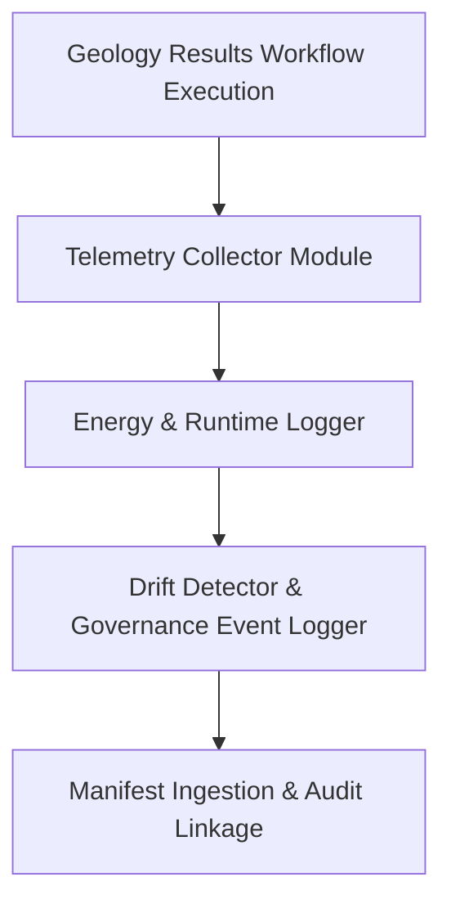

<div align="center">

# 📡 **Kansas Frontier Matrix — Geology Results: Telemetry Logs**  
`docs/analyses/geology/results/telemetry-logs/README.md`

**Purpose:**  
Provide documentation for all **telemetry and governance logs** created during the provenance, execution, and audit phases of the Geology Results workflows within the Kansas Frontier Matrix (KFM).  
These logs capture runtime metrics, energy usage, governance events, and FAIR+CARE audit trails to ensure full traceability and ethical stewardship.

[](../../README.md)  
[](../../standards/faircare.md)  
[](../../../LICENSE)  
[](../../releases/v10.2.0/manifest.zip)

</div>

---

## 📘 Overview

This directory archives telemetry-logs corresponding to the Geology Results module, including execution logs, energy and carbon metrics, model drift detection, and governance/audit event logs.  
Telemetric data supports reproducibility, sustainability monitoring, and ethical compliance across geological workflows. Telemetry is defined as the automated collection and transmission of performance and operational metrics for analysis. :contentReference[oaicite:0]{index=0}

---

## 🗂️ Directory Layout

```bash
docs/analyses/geology/results/telemetry-logs/
 ├── README.md                            # This document
 ├── execution-log.json                   # JSON record of each workflow run (timestamps, version, status)
 ├── energy-usage.csv                     # CSV of energy consumption and carbon equivalent per job
 ├── drift-detection.log                  # Log of any schema/model drift alerts detected during results publication
 └── governance-events.log                 # Audit log capturing FAIR+CARE reviews, consent checks, and release approvals
```

Each log file links to its corresponding artefact in the manifest and includes metadata such as run_id, datasets_used, software_version, and faircare_score.

---

## 🧾 Log File Descriptions

| File                          | Description                                                   | Format   | Validation Check            |
|-------------------------------|---------------------------------------------------------------|----------|------------------------------|
| `execution-log.json`          | Records workflow runs: start/end times, exit status, run_id   | JSON     | Telemetry ingestion test      |
| `energy-usage.csv`            | Tracks kWh consumed, gCO₂e emitted, job_type, runtime        | CSV      | Sustainability audit         |
| `drift-detection.log`         | Captures data/schema drift warnings, version mismatches       | LOG      | Versioning consistency check |
| `governance-events.log`       | Contains audit events: consent granted, review completed      | LOG      | Audit trail completeness     |

---

## ⚙️ Telemetry & Governance Workflow



1. Workflow execution emits run metadata and telemetry events.  
2. Collector module logs energy usage, runtime, and job metadata.  
3. Drift detection monitors schema/model changes and logs warnings.  
4. Governance events capture audit pass/failed statuses, FAIR+CARE reviews.  
5. All logs are indexed into the manifest and available for traceability.

---

## ⚖️ FAIR+CARE & Telemetry Alignment

| Principle             | Implementation                                           |
|------------------------|----------------------------------------------------------|
| **Findable**           | Telemetry logs indexed with unique run IDs in manifest   |
| **Accessible**         | Published under CC-BY with persistent identifiers        |
| **Interoperable**      | JSON/CSV/LOG formats with standard schema and metadata   |
| **Reusable**           | Telemetry data used for audits, sustainability tracking  |
| **Collective Benefit** | Enables cross-domain reproducibility and ethical oversight |
| **Responsibility**     | Tracks energy/carbon footprint of modelling workflows    |
| **Ethics**             | Logs include governance reviews, consent checks, audits  |

---

## 🕰️ Version History

| Version | Date       | Author                            | Summary                                           |
|---------|------------|-----------------------------------|---------------------------------------------------|
| v10.2.2 | 2025-11-11 | FAIR+CARE Geology Telemetry Council| Telemetry-logs README created aligned with schema v3 and governance standards |

---

<div align="center">

© 2025 Kansas Frontier Matrix · Master Coder Protocol v6.3 · FAIR+CARE Certified · Diamond⁹ Ω / Crown∞Ω Ultimate Certified  
[⬅ Back to Geology Results](../README.md) · [Governance Charter](../../standards/governance/ROOT-GOVERNANCE.md)

</div>

