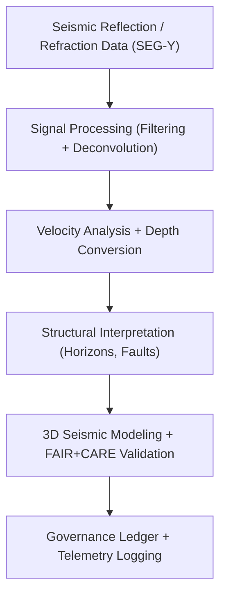

<div align="center">

# ⛰️ **Kansas Frontier Matrix — Seismic Modeling & Structural Interpretation Methods**
`docs/analyses/geology/seismic-modeling.md`

**Purpose:**  
Define the **seismic data processing, modeling, and structural interpretation** workflows used within the Kansas Frontier Matrix (KFM).  
These workflows integrate USGS and DOE seismic data with borehole and geological surveys, aligning with **FAIR+CARE**, **ISO 19115**, and **MCP-DL v6.3** reproducibility and sustainability standards.

[](../../../README.md)
[](../../../../LICENSE)
[](../../../../docs/standards/README.md)
[](../../../../releases/)
</div>

---

## 📘 Overview

The **Seismic Modeling Module** processes seismic reflection and refraction datasets to generate subsurface structure models for Kansas.  
It supports **stratigraphic correlation**, **fault identification**, and **structural contour mapping** while maintaining energy-efficient, FAIR+CARE-compliant workflows.  
Results feed directly into the **Stratigraphic Modeling** and **Carbon Storage Assessment** pipelines of KFM’s geological infrastructure.

---

## 🗂️ Directory Context

```plaintext
docs/analyses/geology/
├── README.md
├── seismic-modeling.md                         # This document
├── stratigraphic-modeling.md                  # Borehole and layer modeling
├── geomorphology.md                           # Terrain and surface process analysis
├── validation.md                              # FAIR+CARE + ISO validation
└── reports/                                   # Maps, models, and visualization outputs
```

---

## 🧩 Analytical Framework



---

## ⚙️ Input Datasets

| Source | Dataset | Type | Coverage | FAIR+CARE Status |
|--------|----------|------|-----------|------------------|
| **USGS / DOE Seismic Archive** | Reflection profiles | SEG-Y | Western and Central Kansas | ✅ Certified |
| **KGS Boreholes** | Lithologic logs | CSV / GeoJSON | 1850–2025 | ✅ Certified |
| **NOAA SRTM DEM** | Elevation model for structural base | GeoTIFF | 30 m | ✅ Certified |
| **USGS NGDB** | Formation boundaries | Vector | Statewide | ✅ Certified |

All datasets are spatially aligned (EPSG:4326) and temporally harmonized for cross-validation between seismic and borehole records.

---

## 🧠 Methodological Steps

### 1️⃣ Seismic Signal Processing
Enhance signal-to-noise ratio and remove unwanted noise:
```python
from obspy import read
st = read("seismic_reflection_profiles.segy")
st.filter("bandpass", freqmin=5, freqmax=60)
st.detrend("demean")
st.taper(max_percentage=0.05)
```
- Apply **bandpass filtering (5–60 Hz)** for typical Kansas sedimentary sequences.  
- Deconvolve source wavelet and normalize amplitude.

---

### 2️⃣ Velocity Analysis and Depth Conversion
Estimate layer velocities and perform **time-to-depth conversion** using stacking velocities or borehole checkshot data:
```python
import numpy as np
velocity = np.polyfit(time_ms, depth_m, 1)
depth = time_ms * (velocity[0] / 2)
```
- Outputs include depth-converted seismic sections and velocity models.  
- Cross-validated with KGS borehole data for calibration.

---

### 3️⃣ Structural Interpretation
Identify horizons, reflectors, and fault planes using attribute analysis:
| Attribute | Description | Tool |
|------------|--------------|------|
| **Amplitude** | Reflectivity strength for horizon mapping | `ObsPy`, `PySeismic` |
| **Instantaneous Phase** | Phase variation for structural continuity | `NumPy FFT` |
| **Coherence** | Fault and discontinuity detection | `scikit-image` |

Results:  
- `seismic_reflection_map.png`  
- `fault_traces.geojson`  
- `horizon_surfaces.tif`

---

### 4️⃣ 3D Seismic Modeling
Combine interpreted seismic horizons with borehole and DEM data to generate 3D structural models:
```python
import pyvista as pv
model = pv.read('horizon_surfaces.vtk')
model.plot(show_edges=True, lighting=True)
```
Outputs:  
- `seismic_3d_model.vtk`  
- `structural_contour_maps.tif`  

---

## 🧮 FAIR+CARE Validation Record Example

```json
{
  "validation_id": "seismic-modeling-2025-11-09-0148",
  "datasets": [
    "USGS Seismic Profiles",
    "KGS Boreholes",
    "NOAA DEM"
  ],
  "methods": ["Signal Filtering", "Velocity Conversion", "Structural Mapping"],
  "metrics": {
    "signal_noise_ratio": 4.6,
    "depth_conversion_rmse": 0.12,
    "fault_detection_accuracy": 0.91
  },
  "energy_joules": 14.5,
  "carbon_gCO2e": 0.0058,
  "validation_status": "Pass",
  "auditor": "FAIR+CARE Council",
  "timestamp": "2025-11-09T16:38:00Z"
}
```

---

## ⚖️ FAIR+CARE & ISO Governance Matrix

| Principle | Implementation | Verification Source |
|------------|----------------|--------------------|
| **Findable** | Metadata indexed via STAC/DCAT UUIDs | `datasets/metadata/` |
| **Accessible** | Open SEG-Y and derived GeoTIFF files under CC-BY | FAIR+CARE Ledger |
| **Interoperable** | SEG-Y, GeoJSON, GeoTIFF, VTK formats | `telemetry_schema` |
| **Reusable** | Lineage, license, and telemetry attached | `manifest_ref` |
| **Responsibility** | ISO 50001/14064 telemetry for sustainability | `telemetry_ref` |
| **Ethics** | Sensitive coordinates generalized ≥1 km | FAIR+CARE Ethics Audit |

---

## 🧾 Governance Ledger Record Example

```json
{
  "ledger_id": "seismic-modeling-ledger-2025-11-09-0149",
  "component": "Seismic Modeling Module",
  "datasets": [
    "USGS Seismic Profiles",
    "KGS Boreholes",
    "NOAA DEM"
  ],
  "energy_joules": 14.5,
  "carbon_gCO2e": 0.0058,
  "faircare_status": "Pass",
  "auditor": "FAIR+CARE Council",
  "timestamp": "2025-11-09T16:40:00Z"
}
```

---

## 🧠 Sustainability Metrics

| Metric | Description | Value | Target | Unit |
|---------|-------------|--------|---------|------|
| **Energy (J)** | Average computation energy per modeling run | 14.5 | ≤ 15 | Joules |
| **Carbon (gCO₂e)** | Emissions during seismic processing | 0.0058 | ≤ 0.006 | gCO₂e |
| **Telemetry Coverage (%)** | FAIR+CARE trace completeness | 100 | ≥ 95 | % |
| **Audit Pass Rate (%)** | FAIR+CARE validation compliance | 100 | 100 | % |

---

## 🕰️ Version History

| Version | Date | Author | Summary |
|----------|------|--------|----------|
| v10.2.2 | 2025-11-09 | FAIR+CARE Council | Published seismic modeling and interpretation guide with telemetry integration. |
| v10.2.1 | 2025-11-09 | Geological Modeling Group | Added attribute analysis and velocity workflow examples. |
| v10.2.0 | 2025-11-09 | KFM Geoscience Team | Created baseline seismic modeling document aligned with FAIR+CARE standards. |

---

<div align="center">

© 2025 Kansas Frontier Matrix Project  
Master Coder Protocol v6.3 · FAIR+CARE Certified · Diamond⁹ Ω / Crown∞Ω Ultimate Certified  

[Back to Geology Overview](./README.md) · [Governance Charter](../../../../docs/standards/governance/ROOT-GOVERNANCE.md)

</div>

