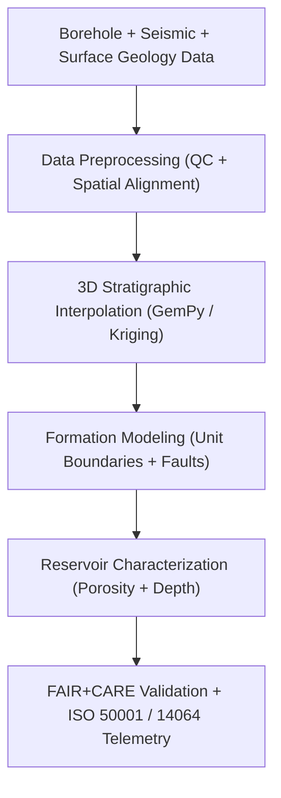

<div align="center">

# ⛰️ **Kansas Frontier Matrix — Stratigraphic Modeling Methods**
`docs/analyses/geology/stratigraphic-modeling.md`

**Purpose:**  
Define the **3D stratigraphic modeling**, **formation interpolation**, and **lithologic unit analysis** workflows employed in the Kansas Frontier Matrix (KFM).  
These methods integrate **borehole, seismic, and surface geologic data** to reconstruct subsurface stratigraphy under **FAIR+CARE**, **ISO 19115**, and **MCP-DL v6.3** governance for reproducibility, transparency, and sustainability.

[](../../../README.md)
[](../../../../LICENSE)
[](../../../../docs/standards/README.md)
[](../../../../releases/)
</div>

---

## 📘 Overview

The **Stratigraphic Modeling Module** reconstructs the subsurface geological framework of Kansas by integrating borehole lithologic logs, seismic reflection data, and surface geological maps.  
This module supports basin-scale interpretations of depositional sequences, fault offsets, and reservoir potential.  
All outputs are FAIR+CARE-certified, energy-audited, and archived with ISO metadata and telemetry for governance validation.

---

## 🗂️ Directory Context

```plaintext
docs/analyses/geology/
├── README.md
├── stratigraphic-modeling.md                  # This document
├── seismic-modeling.md                        # Seismic interpretation
├── geomorphology.md                           # Surface terrain analysis
├── validation.md                              # FAIR+CARE and ISO verification
└── reports/                                   # Analytical outputs and visualization maps
```

---

## 🧩 Analytical Framework



---

## ⚙️ Input Datasets

| Source | Dataset | Description | Format | FAIR+CARE Status |
|--------|----------|-------------|---------|------------------|
| **KGS Boreholes** | Lithologic logs with depth and formation IDs | Borehole CSV / GeoJSON | ✅ Certified |
| **USGS Seismic Profiles** | Reflection data for structural constraints | SEG-Y | ✅ Certified |
| **USGS NGDB** | Stratigraphic and formation boundaries | GeoPackage / Shapefile | ✅ Certified |
| **NOAA DEM** | Surface elevation for boundary reference | GeoTIFF | ✅ Certified |

All datasets reprojected to EPSG:4326 and harmonized with water table and base-of-strata depths for consistency.

---

## 🧠 Methodological Steps

### 1️⃣ Data Preprocessing
- Parse borehole logs and align lithologic codes with NGDB formation names.  
- Clean missing or inconsistent depth records.  
- Harmonize coordinate reference systems and reproject to WGS84.

### 2️⃣ 3D Stratigraphic Interpolation
Use **GemPy** or **PyKrige** for 3D formation surface modeling:
```python
import gempy as gp
geo_model = gp.create_model('Kansas_Stratigraphy')
gp.init_data(
    geo_model,
    extent=[-102.05, -94.6, 36.99, 40.0, -1500, 100],
    resolution=[100, 100, 50]
)
gp.map_stack_to_surfaces(geo_model, {"Paleozoic": ["Chase", "Council Grove", "Wabaunsee"]})
```

Outputs:  
- `stratigraphic_layers_3d.vtk`  
- `formation_contacts.geojson`  
- `borehole_interpolated.geojson`

---

### 3️⃣ Formation Boundary Modeling
- Apply kriging or RBF interpolation between borehole control points.  
- Generate continuous surfaces for major lithostratigraphic units.  
- Cross-check boundaries using seismic horizons and elevation data.

---

### 4️⃣ Reservoir Characterization
- Calculate **porosity**, **depth**, and **formation thickness** from stratigraphic grids.  
- Evaluate reservoir potential using volumetric analysis:
```python
volume = area * thickness * porosity * saturation
```
Outputs:
- `reservoir_characteristics.csv`  
- `carbon_storage_potential.nc`

---

## 🧮 FAIR+CARE Validation Record Example

```json
{
  "validation_id": "stratigraphic-modeling-2025-11-09-0150",
  "datasets": [
    "KGS Boreholes",
    "USGS Seismic Profiles",
    "USGS NGDB",
    "NOAA DEM"
  ],
  "methods": ["GemPy Modeling", "Kriging Interpolation", "Reservoir Characterization"],
  "metrics": {
    "rmse_depth": 0.18,
    "formation_fit_score": 0.94,
    "telemetry_coverage": 100
  },
  "energy_joules": 14.7,
  "carbon_gCO2e": 0.0058,
  "validation_status": "Pass",
  "auditor": "FAIR+CARE Council",
  "timestamp": "2025-11-09T16:42:00Z"
}
```

---

## ⚖️ FAIR+CARE & ISO Governance Matrix

| Principle | Implementation | Verification Source |
|------------|----------------|--------------------|
| **Findable** | Stratigraphic models indexed via STAC/DCAT metadata | `datasets/metadata/` |
| **Accessible** | Outputs distributed via FAIR+CARE repositories | FAIR+CARE Ledger |
| **Interoperable** | Open formats (VTK, GeoPackage, CSV) | `telemetry_schema` |
| **Reusable** | JSON-LD provenance and license records attached | `manifest_ref` |
| **Responsibility** | Telemetry verified under ISO 50001/14064 | `telemetry_ref` |
| **Ethics** | Borehole coordinates generalized ≥1 km | FAIR+CARE Council Ethics Audit |

---

## 🧾 Governance Ledger Record Example

```json
{
  "ledger_id": "stratigraphic-modeling-ledger-2025-11-09-0151",
  "component": "Stratigraphic Modeling Module",
  "datasets": [
    "KGS Boreholes",
    "USGS Seismic Profiles",
    "USGS NGDB"
  ],
  "energy_joules": 14.7,
  "carbon_gCO2e": 0.0058,
  "faircare_status": "Pass",
  "auditor": "FAIR+CARE Council",
  "timestamp": "2025-11-09T16:44:00Z"
}
```

---

## 🧠 Sustainability Metrics

| Metric | Description | Value | Target | Unit |
|---------|-------------|--------|---------|------|
| **Energy (J)** | Energy consumption per model run | 14.7 | ≤ 15 | Joules |
| **Carbon (gCO₂e)** | Emissions equivalent for modeling cycle | 0.0058 | ≤ 0.006 | gCO₂e |
| **Telemetry Coverage (%)** | FAIR+CARE trace completion | 100 | ≥ 95 | % |
| **Audit Pass Rate (%)** | FAIR+CARE compliance success | 100 | 100 | % |

---

## 🕰️ Version History

| Version | Date | Author | Summary |
|----------|------|--------|----------|
| v10.2.2 | 2025-11-09 | FAIR+CARE Council | Published stratigraphic modeling guide with telemetry and FAIR+CARE validation. |
| v10.2.1 | 2025-11-09 | Geological Modeling Team | Added GemPy and kriging-based interpolation methods. |
| v10.2.0 | 2025-11-09 | KFM Geoscience Group | Created baseline stratigraphic modeling documentation aligned with hydrology and climatology modules. |

---

<div align="center">

© 2025 Kansas Frontier Matrix Project  
Master Coder Protocol v6.3 · FAIR+CARE Certified · Diamond⁹ Ω / Crown∞Ω Ultimate Certified  

[Back to Geology Overview](./README.md) · [Governance Charter](../../../../docs/standards/governance/ROOT-GOVERNANCE.md)

</div>

