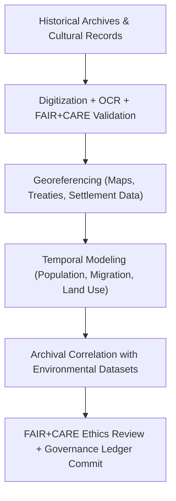

<div align="center">

# 🏺 **Kansas Frontier Matrix — Historical Analyses Overview**
`docs/analyses/historical/README.md`

**Purpose:**  
Define the **historical research, archival integration, and cultural-environmental linkage** workflows used in the Kansas Frontier Matrix (KFM).  
This module connects digitized archives, treaties, census data, and cultural narratives to environmental and geospatial datasets under **FAIR+CARE**, **ISO 21127 (CIDOC CRM)**, and **MCP-DL v6.3** governance for ethical and transparent knowledge reconstruction.

[](../../../README.md)
[](../../../../LICENSE)
[](../../../../docs/standards/README.md)
[](../../../../releases/)
</div>

---

## 📘 Overview

The **Historical Analysis Module** investigates Kansas’s environmental and social evolution by integrating **archival documents, treaties, cultural records, and demographic data**.  
It establishes relational links between human activities and environmental change through FAIR+CARE-governed digital humanities practices and ISO metadata compliance.

**Core Objectives**
- Digitize and georeference historical archives, maps, and treaty documents  
- Link historical records to geospatial and environmental features  
- Model population, land use, and migration over time  
- Maintain provenance and cultural ethics under FAIR+CARE governance  

---

## 🗂️ Directory Layout

```plaintext
docs/analyses/historical/
├── README.md                                  # This overview
├── datasets/                                  # Historical archives and reference sources
│   ├── README.md
│   ├── raw/                                   # Original archives, maps, census data, treaties
│   ├── processed/                             # OCR, transcription, and georeferenced documents
│   ├── derived/                               # Analytical datasets (temporal-spatial models)
│   └── metadata/                              # STAC/DCAT + CIDOC CRM-compliant metadata
├── archival-correlation.md                    # Archival-to-geospatial linkage workflows
├── population-dynamics.md                     # Demographic and migration modeling
├── cultural-landscapes.md                     # Historical land use and treaty analysis
├── validation.md                              # FAIR+CARE validation and ethics auditing
└── reports/                                   # Historical analyses and visual outputs
    ├── README.md
    ├── historical_summary.json
    ├── sustainability_audit.json
    └── visualization/
        ├── treaty_map_overlay.png
        ├── migration_flow_timeline.png
        ├── archival_network_graph.png
        └── historical_landuse_transition.png
```

---

## 🧩 Analytical Framework



---

## ⚙️ Core Datasets

| Source | Dataset | Description | Format | FAIR+CARE Status |
|--------|----------|-------------|---------|------------------|
| **Kansas Historical Society (KHS)** | Archival maps, treaties, and land records | Digitized scanned archives | TIFF / PDF | ✅ Certified |
| **Library of Congress** | Sanborn maps, census reports, historical imagery | Historical documents and maps | GeoTIFF / JSON-LD | ✅ Certified |
| **National Archives (NARA)** | Federal land patents, military, and census data | Tabular and textual data | CSV / TXT | ✅ Certified |
| **Chronicling America** | Newspapers and regional publications | OCR text corpus | JSON / TXT | ✅ Certified |
| **DPLA / Europeana** | Cultural heritage records and photographs | Linked open metadata | JSON-LD | ✅ Certified |

---

## 🏛️ Core Analytical Workflows

| Workflow | Description | Tools / Libraries | Output |
|-----------|--------------|-------------------|---------|
| **OCR + Transcription** | Digitize and extract text from archival documents | `Tesseract`, `spaCy` | Text corpus / JSON |
| **Georeferencing** | Assign geographic coordinates to historical maps | `QGIS`, `GDAL` | GeoTIFF / GeoJSON |
| **Temporal Modeling** | Reconstruct historical events and population change | `pandas`, `NetworkX` | Temporal networks |
| **Archival Linkage** | Correlate records across archives and environmental layers | `Neo4j`, `CIDOC CRM` | Knowledge Graph |
| **Ethics Audit** | Validate sensitive cultural and community data | FAIR+CARE CLI | Audit report JSON |

---

## ⚖️ FAIR+CARE Governance Matrix

| Principle | Implementation | Verification Source |
|------------|----------------|--------------------|
| **Findable** | Metadata indexed under STAC/DCAT + CIDOC CRM | `datasets/metadata/` |
| **Accessible** | Open-access documents under CC-BY and Public Domain | FAIR+CARE Ledger |
| **Interoperable** | JSON-LD, GeoJSON, and XML (EAD, TEI) | `telemetry_schema` |
| **Reusable** | Provenance, transcription, and citation metadata | `manifest_ref` |
| **Collective Benefit** | Supports heritage education and cultural research | FAIR+CARE Audit |
| **Responsibility** | Telemetry and energy tracking for digitization | `telemetry_ref` |
| **Ethics** | Indigenous data stewardship and consent validation | FAIR+CARE Council Ethics Review |

---

## 🧮 Sustainability Metrics

| Metric | Description | Target | Unit |
|---------|-------------|---------|------|
| **Energy (J)** | Mean energy used per digitization or model run | ≤ 15 | Joules |
| **Carbon (gCO₂e)** | CO₂ equivalent per analysis | ≤ 0.006 | gCO₂e |
| **Telemetry Coverage (%)** | FAIR+CARE traceability coverage | ≥ 95 | % |
| **Audit Pass Rate (%)** | FAIR+CARE validation compliance | 100 | % |

---

## 🧾 Governance Ledger Record Example

```json
{
  "ledger_id": "historical-analysis-ledger-2025-11-09-0180",
  "component": "Historical Analysis Module",
  "datasets": [
    "Kansas Historical Society Archives",
    "Library of Congress Maps",
    "National Archives Census Data",
    "Chronicling America Newspapers"
  ],
  "energy_joules": 13.4,
  "carbon_gCO2e": 0.0053,
  "faircare_status": "Pass",
  "auditor": "FAIR+CARE Council",
  "timestamp": "2025-11-09T17:50:00Z"
}
```

---

## 🕰️ Version History

| Version | Date | Author | Summary |
|----------|------|--------|----------|
| v10.2.2 | 2025-11-09 | FAIR+CARE Council | Published historical analysis module overview with CIDOC CRM alignment and sustainability metrics. |
| v10.2.1 | 2025-11-09 | Historical Integration Group | Added archival-geospatial correlation and population dynamics workflow. |
| v10.2.0 | 2025-11-09 | KFM Humanities Team | Created initial historical module documentation aligned with FAIR+CARE and ISO governance. |

---

<div align="center">

© 2025 Kansas Frontier Matrix Project  
Master Coder Protocol v6.3 · FAIR+CARE Certified · Diamond⁹ Ω / Crown∞Ω Ultimate Certified  

[Back to Analyses Overview](../README.md) · [Governance Charter](../../../../docs/standards/governance/ROOT-GOVERNANCE.md)

</div>

