<div align="center">

# 🏺 **Kansas Frontier Matrix — Historical Analyses Overview**  
`docs/analyses/historical/README.md`

**Purpose**  
Establish the comprehensive framework for **historical research, archival data integration, and cultural–environmental linkage** in the Kansas Frontier Matrix (KFM).  
This module connects digitized archives, treaties, census records, and cultural narratives with environmental and geospatial datasets under **FAIR+CARE**, **ISO 21127 (CIDOC CRM)**, and **MCP-DL v6.3** governance.

[](../../../README.md)  
[](../../../LICENSE)  
[](../../standards/faircare.md)  
[](../../../releases/)
</div>

---

## 📘 Overview

The **Historical Analyses Module** explores Kansas’s cultural, demographic, and environmental evolution through integration of **archival, treaty, and census data** with KFM’s geospatial and environmental layers.

This overview README:

- Defines how historical analyses fit into the **KFM pipeline**  
  *(Deterministic ETL → STAC/DCAT/PROV catalogs → Neo4j graph → API → React/MapLibre/Cesium → Story Nodes → Focus Mode).*  
- Specifies where historical **code, configs, and datasets live** across `docs/`, `data/`, and `src/`.  
- Describes **cataloging and provenance requirements** so historical work is STAC/DCAT/PROV-aligned and graph-insertable.  
- Establishes **FAIR+CARE and sovereignty safeguards** for potentially sensitive cultural and site-level information.

**Primary objectives**

- Digitize and georeference archival documents and maps from Kansas and surrounding regions.  
- Correlate historical records with environmental, land-use, and infrastructure datasets.  
- Model population, migration, and cultural change through time in a graph-friendly way.  
- Maintain transparent provenance, telemetry, and ethical metadata across all workflows.

---

## 🗂️ Directory Layout

**Docs module**

```bash
📁 docs/
└── 📁 analyses/
    └── 📁 historical/
        ├── 📄 README.md                      # This overview (Analyses Guide)
        ├── 📁 datasets/
        │   ├── 📄 README.md                  # Dataset catalog + STAC/DCAT crosswalks
        │   ├── 📁 raw/                       # Human-readable notes on raw inputs
        │   ├── 📁 processed/                 # Notes for canonical processed layers
        │   ├── 📁 derived/                   # Notes for model outputs / inferences
        │   └── 📁 metadata/                  # STAC Items, DCAT Datasets, PROV logs
        ├── 📄 archival-correlation.md        # Methods: archives ↔ environment ↔ graph
        ├── 📄 population-dynamics.md         # Methods: demography, migration, flows
        ├── 📄 cultural-landscapes.md         # Methods: cultural & ecological landscapes
        ├── 📄 validation.md                  # Validation & CI/CD patterns for this module
        └── 📁 reports/
            ├── 📄 README.md                  # How reports are generated + Story Nodes
            ├── 🧾 historical_summary.json    # Machine-readable summary bundle
            ├── 🧾 sustainability_audit.json  # Energy, carbon, FAIR+CARE audits
            └── 📁 visualization/
                ├── 🖼️ treaty_map_overlay.png
                ├── 🖼️ migration_flow_timeline.png
                ├── 🖼️ archival_network_graph.png
                └── 🖼️ historical_landuse_transition.png
```

**Data module**

```bash
📁 data/
├── 📁 sources/
│   └── 📁 historical/              # Source manifests: license, URIs, acquisition metadata
├── 📁 raw/
│   └── 📁 historical/              # Original downloads / scans / rasters
├── 📁 work/
│   └── 📁 historical/              # ETL work products (intermediate, non-canonical)
├── 📁 processed/
│   └── 📁 historical/              # Canonical processed datasets
└── 📁 stac/
    └── 📁 historical/              # STAC Items & Collections for historical assets
```

**Code module**

```bash
📁 src/
├── 📁 pipelines/
│   └── 📁 historical/              # Deterministic ETL + OCR + georeferencing jobs
├── 📁 graph/
│   └── 📁 historical/              # Neo4j models: Events, Places, Agents, Artefacts
├── 📁 api/
│   └── 📁 historical/              # API endpoints powering frontend/Focus Mode
└── 📁 web/
    └── 📁 story-nodes/
        └── 📁 historical/          # Story Node configs + layouts for the UI
```

These structures remain the source of truth for where new historical analyses, datasets, and Story Node configurations are added.

---

## 🧭 Context

Historical analyses in KFM interleave with other domains:

- **Archaeology:** Shared sites, cultural landscapes, and temporal layers require consistent **generalization policies** (H3/donut/masking) for culturally sensitive locations.  
- **Ecology & climate:** Historical land-use, flood events, droughts, and infrastructure interact with modern environmental data for **change-through-time** analyses.  
- **Archives & datasets layer:** This module consumes archival datasets cataloged in the broader `data/` and `docs/` ecosystem and exposes cleaned variants back through STAC/DCAT.

Use this README as the **entry point** for any new historical analysis or dataset proposal; all new work should reference this module and its standards.

---

## 🧱 Architecture

Historical analysis follows the canonical KFM stack:

- **Deterministic ETL (`src/pipelines/historical/`)**  
  - Config-driven OCR, georeferencing, and tabular transforms.  
  - Pinned input datasets in `data/raw/historical/` → canonical outputs in `data/processed/historical/`.  

- **Cataloging (`data/stac/historical/` + global DCAT)**  
  - Every significant asset is represented as a STAC Item/Collection and a DCAT Dataset.  

- **Graph integration (`src/graph/historical/`)**  
  - Mapping into Neo4j using CIDOC CRM patterns (e.g., events, places, actors, artefacts).  

- **API layer (`src/api/historical/`)**  
  - Read-only endpoints that serve curated historical views to the frontend and Focus Mode.  

- **Frontend (`src/web/story-nodes/historical/`)**  
  - React/MapLibre/Cesium components that present historical Story Nodes, timelines, and overlays.

---

## 🗺️ Diagrams

### Historical Analysis Flow (Conceptual)

```mermaid
flowchart TD
    A["Historical Archives & Cultural Records"]
        --> B["Digitization · OCR · FAIR+CARE Validation"]
    B --> C["Georeferencing (Maps, Treaties, Settlement Data)"]
    C --> D["Temporal Modeling (Population, Migration, Land Use)"]
    D --> E["Archival Correlation with Environmental Layers"]
    E --> F["Graph Ingestion (Neo4j · CIDOC CRM · PROV-O)"]
    F --> G["Story Nodes & Focus Mode Timelines"]
    G --> H["Governance Ledger Commit · Telemetry"]
```



This flow is implemented via deterministic pipelines and documented configurations so each step is reproducible and traceable.

---

## 📦 Data & Metadata

### Core Datasets

| Source                                  | Dataset                        | Description                                | Format             | FAIR+CARE |
|-----------------------------------------|--------------------------------|--------------------------------------------|--------------------|-----------|
| **Kansas Historical Society (KHS)**     | Archival maps, treaties, deeds | Digitized documents & land records         | TIFF / PDF         | ✅        |
| **Library of Congress**                 | Sanborn maps, census archives  | Historical cartography & reports           | GeoTIFF / JSON-LD  | ✅        |
| **National Archives (NARA)**            | Federal land & census data     | Tabular / textual federal records          | CSV / TXT          | ✅        |
| **Chronicling America**                | Newspapers & publications      | OCR text corpus of Kansas-relevant papers  | JSON / TXT         | ✅        |
| **DPLA / Europeana**                    | Cultural heritage media        | Linked open heritage metadata              | JSON-LD            | ✅        |

### Dataset cataloging

Every dataset in `data/processed/historical/` must have:

- A **source manifest** in `data/sources/historical/` documenting license, source URI, and acquisition metadata.  
- A **STAC Item or Collection** in `data/stac/historical/`.  
- A **DCAT Dataset** record in the global catalog.  

All of these must be linked back to this module and to their producing activities via PROV.

---

## 🌐 STAC, DCAT & PROV Alignment

Historical datasets must be modeled for catalogs and provenance:

- **STAC (SpatioTemporal Asset Catalog)**  
  - `id`: stable, human-meaningful identifier (e.g., `kfm-hist-khs-treaty-maps-v1`).  
  - `geometry` / `bbox`: treaty areas, settlements, or map footprints (generalized if sensitive).  
  - `datetime` / `interval`: coverage of the historical period represented.  
  - `assets`: pointers to TIFF, GeoTIFF, JSON, CSV, and thumbnails.

- **DCAT (Data Catalog Vocabulary)**  
  - `title`, `description`, `license`, `creator`, `temporalCoverage`, `spatialCoverage`.  
  - `dct:provenance` referencing PROV entities and KFM governance docs.  
  - Links back to relevant Story Nodes and analyses.

- **PROV-O (Provenance Ontology)**  
  - **Entities:** datasets, OCR corpora, georeferenced rasters, tabular outputs.  
  - **Activities:** ETL runs, digitization sessions, georeferencing tasks, audits.  
  - **Agents:** KFM services, contributors, FAIR+CARE Council.

All ETL runs must emit machine-readable PROV logs alongside historical outputs, stored under:

- `data/processed/historical/<dataset>/prov/`  
- `docs/analyses/historical/datasets/metadata/`

---

## 🧠 Story Node & Focus Mode Integration

Historical analyses are surfaced to users through **Story Nodes** and **Focus Mode**:

- **Story Nodes**  
  - Each major topic (e.g., treaty sequences, railroad expansion, dust bowl migrations) is represented as a series of Story Nodes with:
    - Title, temporal extent, spatial footprint, and linked entities in Neo4j.  
    - References back to this README and module methods (for reproducibility).  

- **Focus Mode**  
  - Uses timeline + map overlays from `docs/analyses/historical/reports/visualization/` (e.g., `migration_flow_timeline.png`).  
  - Pulls live data via API endpoints in `src/api/historical/`.  
  - Respects **data generalization rules** for sensitive locations, especially overlapping with archaeological sites or living communities.

When creating a new historical Story Node, authors should:

1. Reference the relevant **datasets** and **ETL configs** by ID.  
2. Ensure corresponding **STAC/DCAT records** exist and are linked.  
3. Add a short **FAIR+CARE note** explaining any redactions or generalizations.

---

## ⚖ FAIR+CARE & Governance

### FAIR+CARE Governance Matrix

| Principle              | Implementation                                              | Verification / Location                  |
|------------------------|-------------------------------------------------------------|------------------------------------------|
| **Findable**           | Indexed via STAC/DCAT + CIDOC CRM tags                     | `docs/analyses/historical/datasets/metadata/` |
| **Accessible**         | CC-BY / public-domain access when allowed                  | FAIR+CARE ledger entries                 |
| **Interoperable**      | JSON-LD / GeoJSON / TEI / EAD where appropriate            | Telemetry + schema validation            |
| **Reusable**           | Full provenance & citation metadata per dataset            | `manifest_ref`, PROV logs                |
| **Collective Benefit** | Emphasizes cultural heritage research and community value  | FAIR+CARE audits, Council review         |
| **Responsibility**     | Energy & telemetry tracking per ETL/inference run          | `telemetry_ref` bundle                   |
| **Ethics**             | Indigenous data stewardship checks; generalized locations  | Ethics review notes in governance ledger |

Any dataset involving **tribal nations, sacred sites, or sensitive cultural materials** should:

- Go through a **CARE and sovereignty review** prior to publication.  
- Use generalization and masking patterns defined in the relevant data standards.  
- Explicitly record redactions and generalization strategies in the metadata.

---

## 🧪 Validation & CI/CD

Validation for historical analyses is split across:

- **Schema & catalog validation**
  - STAC JSON schema validation for `data/stac/historical/`.  
  - DCAT and PROV JSON-LD validation in `docs/analyses/historical/datasets/metadata/`.  

- **Graph validation**
  - Neo4j constraints for CIDOC CRM-aligned node labels and relationships.  
  - No ungoverned edges between sensitive sites and public coordinates.

- **FAIR+CARE & telemetry**
  - Every pipeline run emits telemetry into the bundle referenced by `telemetry_ref`.  
  - Governance ledger entries are updated for major releases.

### Sustainability & Telemetry Metrics

| Metric                     | Description                         | Target  | Unit   |
|----------------------------|-------------------------------------|---------|--------|
| **Energy (J)**             | Avg. energy per digitization task   | ≤ 15    | Joules |
| **Carbon (gCO₂e)**         | CO₂e per analysis run               | ≤ 0.006 | gCO₂e  |
| **Telemetry Coverage (%)** | Artefacts with telemetry & PROV     | ≥ 95    | %      |
| **Audit Pass Rate (%)**    | FAIR+CARE checklist pass rate       | 100     | %      |

### Governance Ledger Record Example

```json
{
  "ledger_id": "historical-analysis-ledger-2025-11-11-0190",
  "component": "Historical Analysis Module",
  "datasets": [
    "Kansas Historical Society Archives",
    "Library of Congress Maps",
    "National Archives Census Data",
    "Chronicling America Newspapers"
  ],
  "energy_joules": 13.1,
  "carbon_gCO2e": 0.0052,
  "faircare_status": "Pass",
  "auditor": "FAIR+CARE Council",
  "timestamp": "2025-11-11T17:45:00Z"
}
```

Ledger entries are stored alongside sustainability audits in:

- `docs/analyses/historical/reports/sustainability_audit.json`  
- `data/processed/historical/<dataset>/prov/ledger/`

---

## 🕰️ Version History

| Version     | Date       | Author / Steward              | Summary                                                                 |
|-------------|------------|------------------------------|-------------------------------------------------------------------------|
| **v11.2.4** | 2025-12-07 | FAIR+CARE Council            | Aligned with KFM-MDP v11.2.4; normalized emoji directory trees; added STAC/DCAT/PROV alignment, diagrams, Story Node & Focus Mode integration, CI/CD sections, and emoji footer. |
| **v10.2.2** | 2025-11-11 | FAIR+CARE Council            | Historical module overview; metrics and CIDOC CRM mapping verified.     |
| **v10.2.1** | 2025-11-09 | Historical Integration Group | Added archival–geospatial linkage & population dynamics workflow.       |
| **v10.2.0** | 2025-11-09 | KFM Humanities Team          | Initial release aligned with FAIR+CARE and ISO governance.              |

---

<div align="center">

© 2025 Kansas Frontier Matrix Project · 🧭 KFM Core  

📜 Master Coder Protocol v6.3 · ⚖️ FAIR+CARE Certified  
💠 Diamond⁹ Ω · 👑 Crown∞Ω Ultimate Certified  

🔙 [Back to Analyses Index](../README.md) · 📜 [Governance Charter](../../standards/governance/ROOT-GOVERNANCE.md) · 📘 [Markdown Protocol v11.2.4](../../standards/kfm_markdown_protocol_v11.2.4.md)

</div>
