<div align="center">

# 🏺 **Kansas Frontier Matrix — Historical Analyses Overview**  
`docs/analyses/historical/README.md`

**Purpose:**  
Establish the comprehensive framework for **historical research, archival data integration, and cultural-environmental linkage** in the Kansas Frontier Matrix (KFM).  
This module connects digitized archives, treaties, census records, and cultural narratives with environmental and geospatial datasets under **FAIR+CARE**, **ISO 21127 (CIDOC CRM)**, and **MCP-DL v6.3** governance.

[](../../../README.md)  
[](../../../../LICENSE)  
[](../../../../docs/standards/faircare.md)  
[](../../../../releases/)
</div>

---

## 📘 Overview

The **Historical Analyses Module** explores Kansas’s cultural, demographic, and environmental evolution through integration of **archival, treaty, and census data**.  
It formalizes methods to reconstruct human–environment interactions under FAIR+CARE ethics and CIDOC CRM semantic structure.

**Objectives**
- Digitize and georeference archival documents and maps  
- Correlate historical records with environmental and land-use datasets  
- Model population, migration, and cultural change through time  
- Maintain transparent provenance and ethical metadata across all workflows  

---

## 🗂️ Directory Layout

```bash
docs/analyses/historical/
├── README.md
├── datasets/
│   ├── README.md
│   ├── raw/
│   ├── processed/
│   ├── derived/
│   └── metadata/
├── archival-correlation.md
├── population-dynamics.md
├── cultural-landscapes.md
├── validation.md
└── reports/
    ├── README.md
    ├── historical_summary.json
    ├── sustainability_audit.json
    └── visualization/
        ├── treaty_map_overlay.png
        ├── migration_flow_timeline.png
        ├── archival_network_graph.png
        └── historical_landuse_transition.png
```

---

## 🧩 Analytical Framework

```mermaid
flowchart TD
    A["Historical Archives & Cultural Records"]
    --> B["Digitization · OCR · FAIR+CARE Validation"]
    B --> C["Georeferencing (Maps, Treaties, Settlement Data)"]
    C --> D["Temporal Modeling (Population, Migration, Land Use)"]
    D --> E["Archival Correlation with Environmental Layers"]
    E --> F["Ethics Review & Governance Ledger Commit"]
```



---

## ⚙️ Core Datasets

| Source | Dataset | Description | Format | FAIR+CARE |
|---------|----------|-------------|---------|-----------|
| **Kansas Historical Society (KHS)** | Archival maps, treaties, deeds | Digitized documents & land records | TIFF / PDF | ✅ |
| **Library of Congress** | Sanborn maps, census archives | Historical cartography & reports | GeoTIFF / JSON-LD | ✅ |
| **National Archives (NARA)** | Federal land & census data | Tabular / textual records | CSV / TXT | ✅ |
| **Chronicling America** | Newspapers & publications | OCR text corpus | JSON / TXT | ✅ |
| **DPLA / Europeana** | Cultural heritage media | Linked open metadata | JSON-LD | ✅ |

---

## 🏛️ Analytical Workflows

| Workflow | Description | Tools | Output |
|-----------|-------------|-------|---------|
| **OCR + Transcription** | Digitize & extract text from archives | `Tesseract`, `spaCy` | JSON text corpus |
| **Georeferencing** | Spatially align maps & treaties | `QGIS`, `GDAL` | GeoTIFF / GeoJSON |
| **Temporal Modeling** | Simulate population & migration trends | `pandas`, `NetworkX` | Temporal graphs |
| **Archival Linkage** | Connect records ↔ environmental data | `Neo4j`, `CIDOC CRM` | Knowledge graph |
| **Ethics Audit** | Verify cultural & community data handling | FAIR+CARE CLI | Audit JSON |

---

## ⚖️ FAIR+CARE Governance Matrix

| Principle | Implementation | Verification |
|------------|----------------|---------------|
| **Findable** | Indexed via STAC / DCAT + CIDOC CRM | `datasets/metadata/` |
| **Accessible** | CC-BY / Public-domain access | FAIR+CARE Ledger |
| **Interoperable** | JSON-LD / GeoJSON / XML (EAD / TEI) | Telemetry Schema |
| **Reusable** | Provenance & citation metadata | `manifest_ref` |
| **Collective Benefit** | Promotes cultural heritage research | FAIR+CARE Audit |
| **Responsibility** | Energy & telemetry tracking | `telemetry_ref` |
| **Ethics** | Indigenous data stewardship validation | Council Ethics Review |

---

## 🧮 Sustainability Metrics

| Metric | Description | Target | Unit |
|---------|-------------|---------|------|
| **Energy (J)** | Avg. energy per digitization task | ≤ 15 | Joules |
| **Carbon (gCO₂e)** | CO₂ eq per analysis run | ≤ 0.006 | gCO₂e |
| **Telemetry Coverage (%)** | Traceable artefacts | ≥ 95 | % |
| **Audit Pass Rate (%)** | FAIR+CARE compliance | 100 | % |

---

## 🧾 Governance Ledger Record Example

```json
{
  "ledger_id": "historical-analysis-ledger-2025-11-11-0190",
  "component": "Historical Analysis Module",
  "datasets": [
    "Kansas Historical Society Archives",
    "Library of Congress Maps",
    "National Archives Census Data",
    "Chronicling America Newspapers"
  ],
  "energy_joules": 13.1,
  "carbon_gCO2e": 0.0052,
  "faircare_status": "Pass",
  "auditor": "FAIR+CARE Council",
  "timestamp": "2025-11-11T17:45:00Z"
}
```

---

## 🕰️ Version History

| Version | Date | Author | Summary |
|----------|------|---------|----------|
| **v10.2.2** | 2025-11-11 | FAIR+CARE Council | Updated & aligned historical module overview; verified metrics + CIDOC CRM mapping. |
| **v10.2.1** | 2025-11-09 | Historical Integration Group | Added archival-geospatial linkage & population dynamics workflow. |
| **v10.2.0** | 2025-11-09 | KFM Humanities Team | Initial release aligned with FAIR+CARE + ISO governance. |

---

<div align="center">

© 2025 Kansas Frontier Matrix Project  
Master Coder Protocol v6.3 · FAIR+CARE Certified · Diamond⁹ Ω / Crown∞Ω Ultimate Certified  

[Back to Analyses Overview](../README.md) · [Governance Charter](../../../../docs/standards/governance/ROOT-GOVERNANCE.md)

</div>
