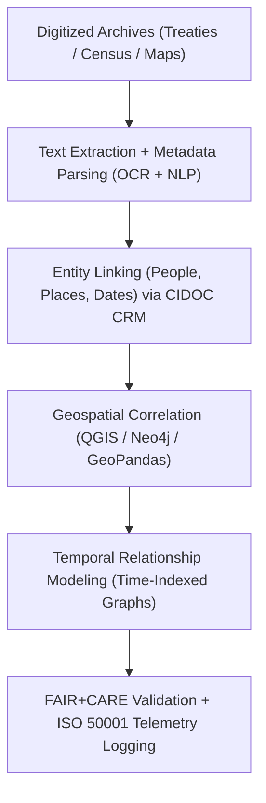

<div align="center">

# 🏺 **Kansas Frontier Matrix — Archival Correlation & Geospatial Linkage Methods**  
`docs/analyses/historical/archival-correlation.md`

**Purpose:**  
Define the **archival linkage and geospatial correlation methodologies** used to connect historical records, maps, treaties, and demographic datasets within the Kansas Frontier Matrix (KFM).  
These workflows employ **FAIR+CARE**, **CIDOC CRM**, and **ISO 21127** standards to establish semantic, spatial, and temporal relationships between archival materials and modern datasets.

[](../../../README.md)
[](../../../LICENSE)
[](../../standards/README.md)
[](../../../releases/)

</div>

---

## 📘 Overview

The **Archival Correlation Module** links historical archives, census data, and treaties to geospatial datasets to reveal how human activities shaped Kansas’s environmental and cultural landscapes.  
Through semantic graph mapping and georeferencing, archival materials are integrated into FAIR+CARE-compliant temporal–spatial models governed under the **CIDOC CRM** heritage data ontology and related standards (e.g., ISO 21127).

Key outcomes:

- Unified historical–geospatial graph of people, places, events, and boundaries.
- Reusable methods for **treaty, census, and map correlation** across time.
- Provenance-rich outputs suitable for **Story Nodes** and **Focus Mode** exploration.

---

## 🗂️ Directory Layout

```text
📁 repo-root/
├── 📁 docs/
│   ├── 📁 analyses/
│   │   └── 📁 historical/
│   │       ├── 📄 README.md                      # Historical analyses index
│   │       ├── 📄 archival-correlation.md        # This document
│   │       ├── 📄 population-dynamics.md         # Demographic & migration modeling
│   │       ├── 📄 cultural-landscapes.md         # Cultural geography & heritage sites
│   │       └── 📄 validation.md                  # FAIR+CARE validation & ethics auditing
│   └── 📁 standards/
│       └── 📁 governance/
│           └── 📄 ROOT-GOVERNANCE.md             # Governance charter (see governance_ref)
├── 📁 src/
│   ├── 📁 pipelines/
│   │   └── 📁 historical/
│   │       └── 📁 archival_correlation/
│   │           ├── 📄 config.yml                 # ETL + correlation config (deterministic)
│   │           ├── 📄 etl_archives.py            # Archive ingestion, OCR, NLP
│   │           ├── 📄 geospatial_linkage.py      # Treaty boundaries & site linkage
│   │           └── 📄 temporal_modeling.py       # Time-indexed graph construction
│   ├── 📁 graph/
│   │   └── 📁 historical/
│   │       ├── 📄 cidoc_schema.cql              # CIDOC CRM-aligned Neo4j schema
│       │   └── 📄 loaders_archival.cql          # Loaders for archival correlation outputs
│   ├── 📁 api/
│   │   └── 📁 historical/
│   │       └── 📄 archival_correlation_api.py   # API for correlated archival views
│   └── 📁 web/
│       └── 📁 historical/
│           └── 📄 ArchivalCorrelationView.tsx   # React / MapLibre / timeline UI
├── 📁 data/
│   ├── 📁 raw/
│   │   └── 📁 archival/
│   │       ├── 📁 scans/                        # TIFF / PDF sources
│   │       └── 📁 metadata/                     # JSON / CSV archival metadata
│   ├── 📁 processed/
│   │   └── 📁 archival_correlation/
│   │       ├── 📄 archival_linkages.graphml
│   │       ├── 📄 entity_alignment.json
│   │       ├── 📄 cidoc_mapping.ttl
│   │       ├── 📄 geospatial_correlation.geojson
│   │       └── 📄 temporal_network.json
│   └── 📁 stac/
│       └── 📁 analyses/
│           └── 📁 archival_correlation/
│               └── 📄 item-*.json               # STAC Items for correlation outputs
├── 📁 schemas/
│   └── 📁 telemetry/
│       └── 📄 analyses-historical-archival-correlation-v3.json  # (telemetry_schema)
└── 📁 .github/
    └── 📁 workflows/
        └── 📄 analyses-historical-ci.yml        # Lint, schema, and provenance checks
```

- **Primary document:** `docs/analyses/historical/archival-correlation.md`
- **Primary pipeline:** `src/pipelines/historical/archival_correlation/`
- **Primary outputs:** `data/processed/archival_correlation/` + `data/stac/analyses/archival_correlation/`
- **Governance & validation:** `docs/standards/governance/ROOT-GOVERNANCE.md`, `docs/analyses/historical/validation.md`

---

## 🧭 Context

The archival correlation workflow is the **bridge layer** between:

- **Historical sources**  
  Scanned treaties, maps, census rolls, and newspaper articles.
- **Modern geospatial datasets**  
  USGS/NOAA base layers, boundaries, and environmental datasets.
- **KFM knowledge graph & Story Nodes**  
  CIDOC CRM–aligned entities and relationships used in Neo4j, Story Nodes, and Focus Mode.

This document defines:

- How ingestion, NLP, geospatial correlation, and temporal modeling are **configured and versioned**.
- How outputs are made **FAIR+CARE-compliant** with explicit provenance.
- How the methods integrate into the **KFM ETL → STAC/DCAT/PROV → Neo4j → API → Web** pipeline.

---

## 🧱 Architecture

### 🧩 Analytical Framework



Core architectural principles:

- **Deterministic ETL**  
  All transformations are driven by `config.yml` under git version control with explicit dataset versions.
- **CIDOC CRM alignment**  
  People, places, events, and archival objects map to CIDOC CRM classes and properties, enabling rich cross-collection queries.
- **Graph-first design**  
  Outputs are shaped to be ingestible into Neo4j with clear labels and relationships, forming a backbone for Story Nodes.

### 🧠 Methodological Steps

#### 1️⃣ Archival Ingestion & NLP Parsing

- Use **Tesseract OCR** (or equivalent) and **spaCy NLP** for named entity extraction.
- Align identified entities (people, locations, dates) with CIDOC CRM classes and controlled vocabularies.

```python
import spacy

nlp = spacy.load("en_core_web_sm")
with open("treaty_text.txt", "r", encoding="utf-8") as f:
    doc = nlp(f.read())

entities = [(ent.text, ent.label_) for ent in doc.ents]
```

Outputs (stored under `data/processed/archival_correlation/`):

- `ocr_text/*.txt`
- `entities_raw.json`
- `entities_normalized.json`

---

#### 2️⃣ Entity Linking & Graph Construction

- Entities are matched against controlled vocabularies (e.g., authority files, toponyms) and linked in the **Neo4j knowledge graph**.

```cypher
CREATE (p:Person:CIDOC_E21 {name:'John Smith'})
CREATE (t:Treaty:CIDOC_E7 {name:'Kaw Land Cession 1859'})
CREATE (l:Place:CIDOC_E53 {name:'Council Grove, KS'})

CREATE (p)-[:SIGNED {role:'signatory'}]->(t)
CREATE (t)-[:OCCURRED_AT]->(l)
```

Key artifacts:

- `archival_linkages.graphml`
- `entity_alignment.json`
- `cidoc_mapping.ttl`

---

#### 3️⃣ Geospatial Correlation

- Extract or harmonize coordinates from historical and modern maps.
- Use GeoPandas (or equivalent) for overlay operations and treaty boundary validation.

```python
import geopandas as gpd

treaty = gpd.read_file("treaty_boundaries.geojson")
archives = gpd.read_file("archival_sites.geojson")

joined = gpd.sjoin(treaty, archives, how="inner", predicate="intersects")
```

Outputs:

- `geospatial_correlation.geojson`
- `linked_archival_map.png`
- `treaty_coverage_stats.json`

---

#### 4️⃣ Temporal Modeling

- Encode historical events and relationships in **time-indexed graphs**.
- Represent dynamic linkages between archives, people, and locations over time.

```python
from networkx import DiGraph

G = DiGraph()
G.add_edge("Treaty 1859", "Settlement", year=1859, relation="TRIGGERED")
```

Outputs:

- `temporal_network.json`
- `archival_timeline_chart.png`

---

## 📦 Data & Metadata

### Input Datasets

| Source             | Dataset                             | Description                               | Format        | FAIR+CARE Status |
|--------------------|-------------------------------------|-------------------------------------------|--------------|------------------|
| **KHS / LOC**      | Archival scans and metadata         | Letters, treaties, land maps              | TIFF / JSON  | ✅ Certified     |
| **NARA / Census**  | Historical population & property    | County and household-level data           | CSV          | ✅ Certified     |
| **USGS / NOAA**    | Historical and modern base maps     | Elevation, boundaries, settlements        | GeoTIFF      | ✅ Certified     |
| **Chronicling America** | Newspaper corpus               | OCR text and publication metadata         | JSON         | ✅ Certified     |

Metadata expectations:

- Each dataset has a **source manifest** under `data/sources/`.
- Each processed dataset has a **STAC Item** under `data/stac/analyses/archival_correlation/`.
- DCAT metadata catalogs describe overall collections and their temporal/spatial coverage.

---

## 🌐 STAC, DCAT & PROV Alignment

- **STAC Items** (`data/stac/analyses/archival_correlation/item-*.json`)
  - `id`: `archival-correlation-<run-id>`
  - `bbox` / `geometry`: coverage of treaty/archival locations.
  - `properties.datetime`: primary temporal anchor for the analysis run.
  - `assets`: links to `geospatial_correlation.geojson`, `archival_linkages.graphml`, timelines, and map PNGs.

- **DCAT Catalog/Distribution**
  - `title`: "Kansas Archival Correlation & Geospatial Linkage Outputs"
  - `license`: `CC-BY 4.0` (mirrors `license` front-matter).
  - `distribution`: STAC Items, Neo4j export snapshots, and analytical reports.

- **PROV-O**
  - `prov:Entity`: input datasets, intermediate outputs, final correlation sets.
  - `prov:Activity`: ETL ingestion, OCR, NLP tagging, geospatial overlay, graph loading.
  - `prov:Agent`: archival correlation pipeline, FAIR+CARE Council, specific auditors.
  - Relations:
    - `prov:wasGeneratedBy`: correlation outputs → correlation run.
    - `prov:used`: correlation run → specific input datasets.
    - `prov:wasDerivedFrom`: derived maps/timelines → original archives and base maps.

---

## 🧪 Validation & CI/CD

### FAIR+CARE Validation Record Example

```json
{
  "validation_id": "archival-correlation-2025-11-09-0192",
  "datasets": [
    "KHS Archives",
    "NARA Census",
    "LOC Maps",
    "Chronicling America Corpus"
  ],
  "metrics": {
    "ocr_accuracy": 98.6,
    "entity_linkage_precision": 0.91,
    "spatial_alignment_rmse_km": 1.2
  },
  "energy_joules": 13.9,
  "carbon_gCO2e": 0.0055,
  "validation_status": "Pass",
  "auditor": "FAIR+CARE Council",
  "timestamp": "2025-11-09T18:30:00Z"
}
```

Validation expectations:

- Executed as part of `analyses-historical-ci.yml`.
- Fails CI if:
  - OCR accuracy or linkage precision drop below agreed thresholds.
  - Telemetry is missing or schema-invalid.

---

### 🧾 Governance Ledger Record Example

```json
{
  "ledger_id": "archival-correlation-ledger-2025-11-09-0193",
  "component": "Archival Correlation Module",
  "datasets": [
    "KHS Archives",
    "NARA Census",
    "LOC Sanborn Maps"
  ],
  "energy_joules": 13.9,
  "carbon_gCO2e": 0.0055,
  "faircare_status": "Pass",
  "auditor": "FAIR+CARE Council",
  "timestamp": "2025-11-09T18:32:00Z"
}
```

Ledger entries:

- Are persisted to `telemetry_ref` and validated against `telemetry_schema`.
- Provide a **governance-facing trail** for audits, re-analysis, and long-term monitoring.

---

### 🌱 Sustainability Metrics

| Metric                    | Description                                   | Value  | Target | Unit   |
|---------------------------|-----------------------------------------------|--------|--------|--------|
| **Energy (J)**            | Energy consumed during correlation analysis   | 13.9   | ≤ 15   | Joules |
| **Carbon (gCO₂e)**        | CO₂ equivalent emissions                      | 0.0055 | ≤ 0.006| gCO₂e  |
| **Telemetry Coverage (%)**| FAIR+CARE trace coverage                      | 100    | ≥ 95   | %      |
| **Validation Pass Rate (%)** | FAIR+CARE audit success                   | 100    | 100    | %      |

These metrics are emitted as part of each run and are **non-optional** for production pipelines.

---

## ⚖ FAIR+CARE & Governance

### FAIR+CARE & ISO Governance Matrix

| Principle        | Implementation                                                        | Verification Source     |
|------------------|------------------------------------------------------------------------|-------------------------|
| **Findable**     | Linked entities indexed with STAC/DCAT UUIDs and CIDOC CRM IRIs       | `datasets/metadata/`    |
| **Accessible**   | FAIR+CARE datasets and graphs shared under CC-BY license              | FAIR+CARE Ledger        |
| **Interoperable**| JSON-LD, RDF, TTL, GeoJSON formats for cultural data                  | `telemetry_schema`      |
| **Reusable**     | Provenance, NLP, and linkage metadata stored with manifests           | `manifest_ref`          |
| **Responsibility** | ISO 50001 telemetry for OCR and graph computation                  | `telemetry_ref`         |
| **Ethics**       | Indigenous and personal records anonymized per CARE Principles        | FAIR+CARE Ethics Audit  |

Governance constraints:

- Use generalized locations or redacted geometries for **culturally sensitive sites**.
- Flag any restricted materials explicitly (rather than omitting them silently).
- Ensure Story Node narratives are backed by graph facts and documented provenance.

---

## 🧠 Story Node & Focus Mode Integration

- Each major correlation output (e.g., **treaty ↔ settlement linkage**, **census ↔ landscape change**) is represented as a **Story Node** with:
  - Title, narrative, temporal extent, spatial extent.
  - Links to underlying graph entities (people, places, events).
- Focus Mode uses:
  - `geospatial_correlation.geojson` for map overlays.
  - `temporal_network.json` for time-sliced narrative exploration.
  - Validation and ledger records for **trust indicators** and provenance panels.

Clients should rely on the **API layer** (`archival_correlation_api.py`) rather than querying the graph directly.

---

## 🕰️ Version History

| Version  | Date       | Author / Steward              | Summary                                                                                       |
|----------|-----------:|-------------------------------|-----------------------------------------------------------------------------------------------|
| v10.2.2  | 2025-11-09 | FAIR+CARE Council             | Published archival correlation documentation with CIDOC CRM and ISO telemetry validation.     |
| v10.2.1  | 2025-11-09 | Historical Knowledge Graph Team | Added Neo4j and geospatial linkage workflows.                                               |
| v10.2.0  | 2025-11-09 | KFM Humanities Team           | Baseline archival correlation guide aligned with FAIR+CARE ethics and CIDOC ontology.        |

---

<div align="center">

© 2025 Kansas Frontier Matrix Project  
Master Coder Protocol v6.3 · FAIR+CARE Certified · 🏺 Diamond⁹ Ω / 👑 Crown∞Ω Ultimate Certified  

[🏛️ Back to Historical Overview](./README.md) · [🏗️ Architecture Index](../../architecture/README.md) · [⚖️ Governance Charter](../../standards/governance/ROOT-GOVERNANCE.md)

</div>
