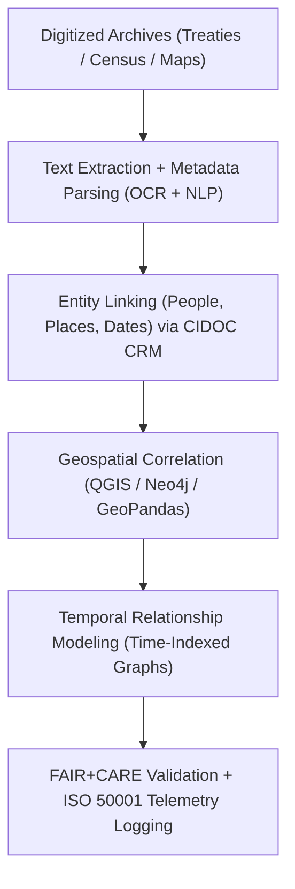

<div align="center">

# 🏺 **Kansas Frontier Matrix — Archival Correlation & Geospatial Linkage Methods**  
`docs/analyses/historical/archival-correlation.md`

**Purpose:**  
Define the **archival linkage and geospatial correlation methodologies** used to connect historical records, maps, treaties, and demographic datasets within the Kansas Frontier Matrix (KFM).  
These workflows employ **FAIR+CARE**, **CIDOC CRM**, and **ISO 21127** standards to establish semantic, spatial, and temporal relationships between archival materials and modern datasets.

[](../../../README.md)
[](../../../../LICENSE)
[](../../../../docs/standards/README.md)
[](../../../../releases/)

</div>

---

## 📘 Overview

The **Archival Correlation Module** links historical archives, census data, and treaties to geospatial datasets to reveal how human activities shaped Kansas’s environmental and cultural landscapes.  
Through semantic graph mapping and georeferencing, archival materials are integrated into FAIR+CARE-compliant temporal-spatial models governed under **CIDOC CRM** heritage data ontology, and made queryable via the KFM Neo4j backbone and Story Node pipelines.

---

## 🗂️ Directory Layout

```text
📁 repo-root/
├── 📁 docs/
│   └── 📁 analyses/
│       └── 📁 historical/
│           ├── 📄 README.md                           # Historical analyses index
│           ├── 📄 archival-correlation.md             # This document
│           ├── 📄 population-dynamics.md              # Historical demographic & migration modeling
│           ├── 📄 cultural-landscapes.md              # Cultural geography & heritage site analyses
│           ├── 📄 validation.md                       # FAIR+CARE validation & ethics auditing
│           └── 📁 reports/                            # Analytical & visualization outputs
├── 📁 src/
│   ├── 📁 pipelines/
│   │   └── 📁 historical/
│   │       └── 📁 archival_correlation/
│   │           ├── 📄 etl_archives.py                 # Deterministic archival ETL
│   │           ├── 📄 geospatial_linkage.py           # Treaty ↔ location correlation
│   │           └── 📄 cidoc_export.py                 # CIDOC CRM / RDF exports
│   ├── 📁 graph/
│   │   └── 📁 historical/
│   │       └── 📄 archival_schema.cypher              # Nodes/edges for archives & linkages
│   ├── 📁 api/
│   │   └── 📁 historical/
│   │       └── 📄 archival_routes.py                  # Archival correlation API endpoints
│   └── 📁 web/
│       └── 📁 historical/
│           └── 📄 ArchivalCorrelationView.tsx         # Story Node / Focus Mode UI
├── 📁 data/
│   └── 📁 historical/
│       ├── 📁 raw/                                   # Raw archives, census, maps
│       ├── 📁 work/                                  # Intermediate OCR / NLP / joins
│       ├── 📁 processed/                             # Final correlation outputs
│       └── 📁 stac/                                  # STAC Items & Collections for archival assets
└── 📁 .github/
    └── 📁 workflows/
        └── 📄 historical-analyses-ci.yml             # Lint, schema, lineage & FAIR+CARE checks
```

---

## 🧭 Context

The archival correlation methods described here sit in the KFM pipeline as:

> **Deterministic ETL → STAC/DCAT/PROV catalogs → Neo4j knowledge graph → API layer → React/MapLibre/Cesium frontend → Story Nodes → Focus Mode.**

- **Upstream:** digitized archives (treaties, maps, census records) and their source manifests in `data/historical/raw/` plus associated STAC/DCAT metadata.
- **Core processing:** OCR + NLP, entity linking, geospatial correlation, and temporal graph modeling executed by `src/pipelines/historical/archival_correlation/*`.
- **Downstream:** Neo4j nodes/edges representing people, places, events, and documents; Story Nodes used for historical narratives in Focus Mode; and FAIR+CARE governance records for audits.

This document is the **canonical reference** for how archival sources are linked and validated before entering the KFM graph and narrative layers.

---

## 🧱 Architecture

### 🧩 Analytical Framework



The architecture is intentionally **graph-first**:

- Archives are modeled as **CIDOC CRM entities** (e.g., `E31_Document`, `E53_Place`, `E21_Person`) and ingested into Neo4j with explicit provenance.
- Geospatial linkages are stored as relationships between **events**, **places**, and **documents**, enabling spatiotemporal queries and Story Node extraction.
- All processing steps log energy and carbon telemetry to support **ISO 50001**-aligned sustainability metrics.

### 🧠 Methodological Steps

#### 1️⃣ Archival Ingestion & NLP Parsing

- Use **Tesseract OCR** and **spaCy NLP** for named entity extraction.
- Align identified entities (e.g., people, locations, dates) with CIDOC CRM classes.

```python
import spacy

nlp = spacy.load("en_core_web_sm")
with open("treaty_text.txt") as f:
    doc = nlp(f.read())

entities = [(ent.text, ent.label_) for ent in doc.ents]
```

Outputs (stored under `data/historical/work/`):

- `ocr_text/*.txt`
- `named_entities.json`
- `archival_metadata.json`

---

#### 2️⃣ Entity Linking & Graph Construction

- Entities are matched against controlled vocabularies and linked in a **Neo4j knowledge graph**.

```cypher
CREATE (p:Person {name:'John Smith'})
CREATE (t:Treaty {name:'Kaw Land Cession 1859'})
CREATE (l:Location {name:'Council Grove, KS'})

CREATE (p)-[:SIGNED]->(t)
CREATE (t)-[:OCCURRED_AT]->(l)
```

Key graph entities:

- `:ArchiveItem`, `:Person`, `:Place`, `:Event`, `:Treaty`
- Relationships such as `:MENTIONS`, `:LOCATED_IN`, `:SIGNED`, `:OCCURRED_AT`, `:DERIVED_FROM`

Outputs:

- `archival_linkages.graphml`
- `entity_alignment.json`
- `cidoc_mapping.ttl`

All of the above are PROV-annotated with activities and agents for reproducibility.

---

#### 3️⃣ Geospatial Correlation

- Extract coordinates from maps and link them to archival entities.
- Use GeoPandas for overlay operations and treaty boundary validation.

```python
import geopandas as gpd

treaty = gpd.read_file("treaty_boundaries.geojson")
archives = gpd.read_file("archival_sites.geojson")

joined = gpd.sjoin(treaty, archives, how="inner", predicate="intersects")
```

Outputs:

- `geospatial_correlation.geojson`
- `linked_archival_map.png`
- STAC Items for derived layers in `data/historical/stac/`

---

#### 4️⃣ Temporal Modeling

- Encode historical events and relationships in **time-indexed graphs**.
- Represent dynamic linkages between archives, people, and locations over time.

```python
from networkx import DiGraph

G = DiGraph()
G.add_edge("Treaty 1859", "Settlement", year=1859)
```

Outputs:

- `temporal_network.json`
- `archival_timeline_chart.png`
- Time-indexed Neo4j relationships using OWL-Time / KFM temporal conventions

---

## 📦 Data & Metadata

### ⚙️ Input Datasets

| Source                 | Dataset                               | Description                               | Format        | FAIR+CARE Status |
|------------------------|----------------------------------------|-------------------------------------------|--------------|------------------|
| **KHS / LOC**          | Archival scans and metadata            | Letters, treaties, land maps              | TIFF / JSON  | ✅ Certified      |
| **NARA / Census**      | Historical population and property     | County and household-level data           | CSV          | ✅ Certified      |
| **USGS / NOAA**        | Historical and modern base maps        | Elevation, boundaries, settlements        | GeoTIFF      | ✅ Certified      |
| **Chronicling America**| Newspaper corpus for cross-reference   | OCR text and publication metadata         | JSON         | ✅ Certified      |

- STAC/DCAT records for these datasets live under `data/historical/stac/` and the central catalog.
- Each dataset is linked to this document via `manifest_ref`, `sbom_ref`, and DCAT `dct:conformsTo` pointing at CIDOC CRM and FAIR+CARE standards.

---

## ⚖ FAIR+CARE & Governance

### 🧮 FAIR+CARE Validation Record Example

```json
{
  "validation_id": "archival-correlation-2025-11-09-0192",
  "datasets": [
    "KHS Archives",
    "NARA Census",
    "LOC Maps",
    "Chronicling America Corpus"
  ],
  "metrics": {
    "ocr_accuracy": 98.6,
    "entity_linkage_precision": 0.91,
    "spatial_alignment_rmse_km": 1.2
  },
  "energy_joules": 13.9,
  "carbon_gCO2e": 0.0055,
  "validation_status": "Pass",
  "auditor": "FAIR+CARE Council",
  "timestamp": "2025-11-09T18:30:00Z"
}
```

---

### ⚖️ FAIR+CARE & ISO Governance Matrix

| Principle        | Implementation                                                          | Verification Source     |
|------------------|--------------------------------------------------------------------------|-------------------------|
| **Findable**     | Linked entities indexed with STAC/DCAT UUIDs and CIDOC CRM IRIs         | `datasets/metadata/`    |
| **Accessible**   | FAIR+CARE datasets and graphs shared under CC-BY license                | FAIR+CARE Ledger        |
| **Interoperable**| JSON-LD, RDF, TTL, GeoJSON formats for cultural data                    | `telemetry_schema`      |
| **Reusable**     | Provenance, NLP, and linkage metadata stored                            | `manifest_ref`          |
| **Responsibility** | ISO 50001 telemetry for OCR and graph computation                     | `telemetry_ref`         |
| **Ethics**       | Indigenous and personal records anonymized per CARE Principles          | FAIR+CARE Ethics Audit  |

---

### 🧾 Governance Ledger Record Example

```json
{
  "ledger_id": "archival-correlation-ledger-2025-11-09-0193",
  "component": "Archival Correlation Module",
  "datasets": [
    "KHS Archives",
    "NARA Census",
    "LOC Sanborn Maps"
  ],
  "energy_joules": 13.9,
  "carbon_gCO2e": 0.0055,
  "faircare_status": "Pass",
  "auditor": "FAIR+CARE Council",
  "timestamp": "2025-11-09T18:32:00Z"
}
```

---

### 🌱 Sustainability Metrics

| Metric                    | Description                                    | Value  | Target | Unit    |
|---------------------------|-----------------------------------------------|--------|--------|---------|
| **Energy (J)**            | Energy consumed during archival correlation   | 13.9   | ≤ 15   | Joules  |
| **Carbon (gCO₂e)**        | CO₂ equivalent emissions                      | 0.0055 | ≤ 0.006| gCO₂e   |
| **Telemetry Coverage (%)**| FAIR+CARE trace coverage                      | 100    | ≥ 95   | %       |
| **Validation Pass Rate (%)** | FAIR+CARE audit success                   | 100    | 100    | %       |

---

## 🕰️ Version History

| Version | Date       | Author               | Summary                                                                                          |
|--------:|-----------:|---------------------|--------------------------------------------------------------------------------------------------|
| v10.2.2 | 2025-11-09 | FAIR+CARE Council   | Published archival correlation documentation with CIDOC CRM and ISO telemetry validation.       |
| v10.2.1 | 2025-11-09 | Historical KG Team  | Added Neo4j and geospatial linkage workflows.                                                   |
| v10.2.0 | 2025-11-09 | KFM Humanities Team | Created baseline archival correlation guide aligned with FAIR+CARE ethics and CIDOC ontology.   |

---

<div align="center">

© 2025 Kansas Frontier Matrix Project  
Master Coder Protocol v6.3 · FAIR+CARE Certified · Diamond⁹ Ω / Crown∞Ω Ultimate Certified  

[🏺 Historical Overview](./README.md) • [⚖️ Governance Charter](../../../../docs/standards/governance/ROOT-GOVERNANCE.md)

</div>
