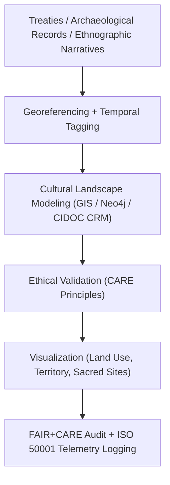

<div align="center">

# 🏺 **Kansas Frontier Matrix — Cultural Landscapes & Heritage Geography Methods**  
`docs/analyses/historical/cultural-landscapes.md`

**Purpose:**  
Define the **heritage geography and cultural landscape reconstruction methodologies** used in the Kansas Frontier Matrix (KFM).  
This framework integrates **archaeological records, treaties, ethnographic sources, and environmental data** to model spatial–temporal transformations in Kansas’s historical and cultural ecosystems under **FAIR+CARE**, **CIDOC CRM**, and **ISO 19115/21127** standards.

[](../../../README.md)
[](../../../LICENSE)
[](../../standards/README.md)
[](../../../releases/)

</div>

---

## 📘 Overview

The **Cultural Landscapes Module** reconstructs interactions between human communities and the Kansas environment across time.  
It combines ethnographic narratives, treaty geographies, archaeological datasets, and landscape ecology models to produce multi-layered cultural maps governed under **FAIR+CARE** ethics and **CIDOC CRM** heritage interoperability, then exposes these as Story Nodes and Focus Mode views via the KFM Neo4j graph and API stack.

Key goals:

- Model **territories, cultural routes, sacred spaces, and land-use changes** over time.
- Integrate **qualitative narratives** (oral histories, field notes) with **quantitative layers** (GIS, environmental rasters).
- Maintain strong **provenance, ethics, and sustainability** guarantees for all cultural data handling.

---

## 🗂️ Directory Layout

```text
📁 repo-root/
├── 📁 docs/
│   └── 📁 analyses/
│       └── 📁 historical/
│           ├── 📄 README.md                             # Historical analyses index
│           ├── 📄 archival-correlation.md               # Archival linkage & geospatial correlation
│           ├── 📄 population-dynamics.md                # Demographic & migration modeling
│           ├── 📄 cultural-landscapes.md                # This document
│           ├── 📄 validation.md                         # FAIR+CARE validation & ethics auditing
│           └── 📁 reports/                              # Analytical & visualization outputs
├── 📁 src/
│   ├── 📁 pipelines/
│   │   └── 📁 historical/
│   │       └── 📁 cultural_landscapes/
│   │           ├── 📄 etl_cultural_sites.py             # Deterministic ETL for cultural sites & narratives
│   │           ├── 📄 treaty_ethnography_join.py        # Treaty ↔ ethnography ↔ site joining
│   │           └── 📄 landscape_models.py               # Cultural landscape & territory models
│   ├── 📁 graph/
│   │   └── 📁 historical/
│   │       └── 📄 cultural_landscapes_schema.cypher     # Nodes/edges for landscapes & heritage relations
│   ├── 📁 api/
│   │   └── 📁 historical/
│   │       └── 📄 cultural_landscapes_routes.py         # API endpoints for landscape queries
│   └── 📁 web/
│       └── 📁 historical/
│           └── 📄 CulturalLandscapesView.tsx            # Story Node / Focus Mode UI
├── 📁 data/
│   └── 📁 historical/
│       ├── 📁 raw/                                      # Raw KHS/BIA/ethnographic/USGS inputs
│       ├── 📁 work/                                     # Intermediate overlays, joins & grids
│       ├── 📁 processed/                                # Final cultural landscape products
│       └── 📁 stac/                                     # STAC Items & Collections for derived layers
├── 📁 schemas/
│   └── 📁 telemetry/
│       └── 📄 analyses-historical-cultural-landscapes-v3.json  # (telemetry_schema)
└── 📁 .github/
    └── 📁 workflows/
        └── 📄 historical-analyses-ci.yml                # Lint, schema, lineage & FAIR+CARE checks
```

- **Primary document:** `docs/analyses/historical/cultural-landscapes.md`  
- **Primary pipeline:** `src/pipelines/historical/cultural_landscapes/`  
- **Primary outputs:** `data/processed/historical/` + `data/stac/historical/`  
- **Governance & validation:** `docs/standards/governance/ROOT-GOVERNANCE.md`, `docs/analyses/historical/validation.md`

---

## 🧭 Context

The cultural landscapes workflow is the **heritage geography layer** in the KFM stack:

> **Deterministic ETL → STAC/DCAT/PROV catalogs → Neo4j knowledge graph → API layer → React/MapLibre/Cesium frontend → Story Nodes → Focus Mode.**

- **Upstream:**  
  - Treaty and territorial maps (BIA, KHS).  
  - Archaeological site registries.  
  - Ethnographic narratives and field notes.  
  - Environmental rasters (USGS/NOAA terrain, hydrology, land cover).

- **Core processing:**  
  - Georeferencing, temporal tagging, and ontology mapping (CIDOC CRM).  
  - Landscape modeling that links communities, sites, and environmental features.  

- **Downstream:**  
  - Neo4j subgraph of cultural landscapes, territories, and environmental contexts.  
  - Story Nodes for sensitive heritage geographies in Focus Mode.  
  - FAIR+CARE and sustainability telemetry for ongoing audits.

This document is the **canonical reference** for how cultural landscape layers are constructed and governed before they appear in public-facing KFM experiences.

---

## 🧱 Architecture

### 🧩 Analytical Framework



Architectural characteristics:

- **Graph-first & geography-aware**  
  All key entities (communities, sites, territories, environmental units) are first-class nodes with typed spatial geometries and temporal scopes.
- **CIDOC CRM & ISO alignment**  
  Core classes and properties follow CIDOC CRM and ISO 19115/21127, with KFM extensions where necessary.
- **Defense-in-depth for ethics & sensitivity**  
  Sensitive sites and narratives are flagged, generalized, or redacted according to CARE, with explicit metadata.

### 🧠 Methodological Steps

#### 1️⃣ Data Integration & Georeferencing

- Digitize and align treaty maps, archaeological sites, and ethnographic spatial references.  
- Harmonize using **WGS84** with ~1 km grid alignment for generalized public layers (internal workflows may use higher precision under access controls).

```python
import geopandas as gpd

treaties = gpd.read_file("treaty_boundaries.geojson")
sites = gpd.read_file("cultural_sites.geojson")

joined = gpd.overlay(treaties, sites, how="union")
```

Outputs (typically under `data/historical/work/`):

- `treaty_boundaries_aligned.geojson`
- `cultural_sites_aligned.geojson`
- `treaty_site_union.geojson`

---

#### 2️⃣ Temporal Tagging

- Assign temporal attributes (occupation periods, event years, or broader eras).  
- Represent cultural transformations via epochs such as **Pre-Contact**, **Post-Treaty**, **Industrialization**, **Modern**.

```python
sites["epoch"] = sites["year"].apply(
    lambda y: "Pre-Contact" if y < 1800
    else "Post-Treaty" if y < 1900
    else "Modern"
)
```

Outputs:

- `sites_temporal.geojson`
- `epoch_summary.json`

---

#### 3️⃣ Cultural Landscape Modeling

- Construct graph-based relationships between sites, communities, and environmental features using **CIDOC CRM** and KFM historical ontologies.

```cypher
CREATE (s:Site:CIDOC_E27 {name:'Council Grove', type:'Historic Settlement'})
CREATE (t:Treaty:CIDOC_E7 {name:'Kaw Treaty of 1859'})
CREATE (e:Environment {name:'Neosho River Corridor', type:'Riparian Zone'})

CREATE (s)-[:ASSOCIATED_WITH]->(t)
CREATE (s)-[:LOCATED_IN]->(e)
```

Outputs (under `data/historical/processed/`):

- `cultural_network.graphml`
- `heritage_landscape_map.geojson`
- `cidoc_landscape_mapping.ttl`

---

#### 4️⃣ Visualization & Interpretation

- Generate GIS maps showing territorial transitions, site clusters, and environmental context.  
- Overlay hydrological, vegetative, and demographic layers for integrated analysis.

Outputs (under `docs/analyses/historical/reports/` + STAC-referenced assets):

- `cultural_landscape_overview.png`
- `temporal_site_density.tif`
- `treaty_cultural_overlay.geojson`

These are served to clients via `CulturalLandscapesView.tsx`.

---

## 📦 Data & Metadata

### ⚙️ Core Datasets

| Source                              | Dataset                                  | Description                                          | Coverage        | FAIR+CARE Status |
|-------------------------------------|-------------------------------------------|------------------------------------------------------|-----------------|------------------|
| **Kansas Historical Society (KHS)** | Archaeological & cultural site registry   | Site coordinates, descriptions, temporal context     | Statewide       | ✅ Certified      |
| **U.S. Bureau of Indian Affairs**   | Treaty & territorial boundary maps        | Historical boundaries and land cession data          | 1800–1900       | ✅ Certified      |
| **Smithsonian / NAA**              | Ethnographic field notes                  | Oral histories, community place names, migrations    | 1850–1950       | ✅ Certified      |
| **USGS / NOAA**                    | Geophysical & landform data              | Terrain, hydrology, vegetation zones                 | Continuous      | ✅ Certified      |

Metadata expectations:

- **Source manifests** in `data/sources/` detail licensing, collection context, and access constraints.
- **STAC Items** in `data/historical/stac/` describe spatial/temporal coverage and derived products.
- **DCAT catalogs** describe high-level collections, linking back to this analysis via `manifest_ref`.

---

## 🌐 STAC, DCAT & PROV Alignment

- **STAC Items** (`data/historical/stac/cultural_landscapes/item-*.json`)  
  - `id`: `cultural-landscapes-<run-id>`  
  - `bbox` / `geometry`: coverage of modeled cultural landscapes.  
  - `properties.datetime`: primary analysis timestamp.  
  - `assets`: references to `heritage_landscape_map.geojson`, PNGs, and density rasters.

- **DCAT**  
  - Catalog title: "Kansas Cultural Landscapes & Heritage Geography".  
  - `license`: `CC-BY 4.0`.  
  - Distributions: STAC Items, Neo4j snapshot exports, derived GIS products.

- **PROV-O**  
  - `prov:Entity`: raw datasets, intermediate overlays, final landscape outputs.  
  - `prov:Activity`: ETL, georeferencing, temporal tagging, modeling, visualization.  
  - `prov:Agent`: cultural landscapes pipeline, FAIR+CARE Council, auditors.  
  - Relations:
    - `prov:wasGeneratedBy`: cultural landscape outputs → model run.
    - `prov:used`: model run → raw and intermediate datasets.
    - `prov:wasDerivedFrom`: derived landscapes → underlying treaties, sites, and environmental layers.

---

## 🧪 Validation & CI/CD

### 🧮 FAIR+CARE Validation Record Example

```json
{
  "validation_id": "cultural-landscapes-2025-11-09-0194",
  "datasets": [
    "KHS Cultural Sites",
    "BIA Treaty Maps",
    "Smithsonian Ethnographic Records",
    "USGS Topography"
  ],
  "metrics": {
    "georef_rmse_km": 0.9,
    "ontology_compliance": 100,
    "telemetry_coverage": 100
  },
  "energy_joules": 14.0,
  "carbon_gCO2e": 0.0055,
  "validation_status": "Pass",
  "auditor": "FAIR+CARE Council",
  "timestamp": "2025-11-09T18:35:00Z"
}
```

Validation & CI/CD:

- Implemented in `.github/workflows/historical-analyses-ci.yml`.
- CI checks:
  - Telemetry conforms to `telemetry_schema`.
  - FAIR+CARE metrics meet configured thresholds.
  - All outputs have corresponding STAC Items and PROV entries.

---

### 🧾 Governance Ledger Record Example

```json
{
  "ledger_id": "cultural-landscapes-ledger-2025-11-09-0195",
  "component": "Cultural Landscapes Module",
  "datasets": [
    "KHS Cultural Sites",
    "BIA Treaty Maps",
    "Smithsonian Ethnographic Data",
    "USGS Topography"
  ],
  "energy_joules": 14.0,
  "carbon_gCO2e": 0.0055,
  "faircare_status": "Pass",
  "auditor": "FAIR+CARE Council",
  "timestamp": "2025-11-09T18:37:00Z"
}
```

Ledger entries:

- Persisted to `telemetry_ref` and validated against `telemetry_schema`.
- Form the long-term audit trail for sustainability and ethics reviews.

---

### 🌱 Sustainability Metrics

| Metric                    | Description                                   | Value  | Target | Unit   |
|---------------------------|-----------------------------------------------|--------|--------|--------|
| **Energy (J)**            | Energy used during GIS and network modeling   | 14.0   | ≤ 15   | Joules |
| **Carbon (gCO₂e)**        | CO₂ emissions per workflow                    | 0.0055 | ≤ 0.006| gCO₂e  |
| **Telemetry Coverage (%)**| FAIR+CARE telemetry trace completeness        | 100    | ≥ 95   | %      |
| **Audit Pass Rate (%)**   | FAIR+CARE validation compliance               | 100    | 100    | %      |

These metrics are **required** for production-grade runs and must be reproducible from logs and manifests.

---

## ⚖ FAIR+CARE & Governance

### FAIR+CARE & ISO Governance Matrix

| Principle         | Implementation                                                         | Verification Source     |
|-------------------|-------------------------------------------------------------------------|-------------------------|
| **Findable**      | Metadata indexed via STAC/DCAT and CIDOC CRM IRIs                      | `datasets/metadata/`    |
| **Accessible**    | FAIR+CARE public repository access (CC-BY / Public Domain where allowed) | FAIR+CARE Ledger      |
| **Interoperable** | GeoJSON, RDF, and CSV formats mapped to CIDOC ontology                 | `telemetry_schema`      |
| **Reusable**      | Provenance metadata and ontology mappings embedded                     | `manifest_ref`          |
| **Responsibility**| ISO 50001 telemetry ensures sustainable GIS computation                | `telemetry_ref`         |
| **Ethics**        | Indigenous and heritage site coordinates generalized ≥ 5 km            | FAIR+CARE Ethics Review |

Governance constraints:

- **Generalize or mask** locations of sensitive cultural or sacred sites in public outputs.
- Explicitly label redactions (e.g., `"location_status": "generalized_for_cultural_sensitivity"`).
- Ensure community governance and consent processes are respected where applicable.

---

## 🧠 Story Node & Focus Mode Integration

- Each major cultural landscape pattern (e.g., **territorial shift**, **river corridor use**, **ceremonial route**) is represented as a **Story Node** with:
  - Narrative text.
  - Temporal extent (start/end, or epochs).
  - Spatial extent (generalized polygons or regions).
  - Links to underlying Neo4j entities and STAC assets.

- Focus Mode uses:
  - `heritage_landscape_map.geojson` for layered map overlays.
  - `temporal_site_density.tif` for time-sliced visualizations.
  - FAIR+CARE & sustainability telemetry to surface **trust and governance** indicators to users.

Client applications should access cultural landscape data through the **API layer** (`cultural_landscapes_routes.py`) rather than direct graph queries.

---

## 🕰️ Version History

| Version | Date       | Author / Steward          | Summary                                                                                             |
|--------:|-----------:|---------------------------|-----------------------------------------------------------------------------------------------------|
| v10.2.2 | 2025-11-09 | FAIR+CARE Council        | Published cultural landscape methods with CIDOC CRM mapping, FAIR+CARE validation, and energy metrics. |
| v10.2.1 | 2025-11-09 | Heritage Geography Group | Added ontology modeling, GIS integration workflows, and landscape models.                           |
| v10.2.0 | 2025-11-09 | KFM Humanities Team      | Baseline cultural landscape documentation aligned with FAIR+CARE governance and ecology modules.    |

---

<div align="center">

© 2025 Kansas Frontier Matrix Project  
Master Coder Protocol v6.3 · FAIR+CARE Certified · 🏺 Diamond⁹ Ω / 👑 Crown∞Ω Ultimate Certified  

[🏺 Historical Overview](./README.md) • [🏗️ Architecture Index](../../architecture/README.md) • [⚖️ Governance Charter](../../standards/governance/ROOT-GOVERNANCE.md)

</div>
