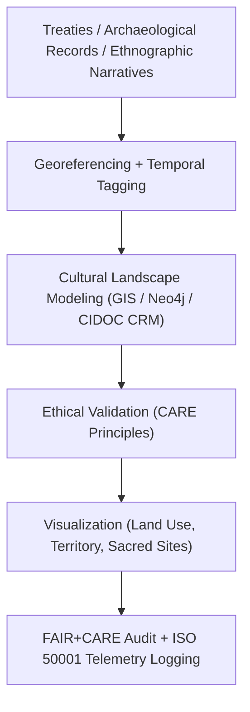

<div align="center">

# 🏺 **Kansas Frontier Matrix — Cultural Landscapes & Heritage Geography Methods**
`docs/analyses/historical/cultural-landscapes.md`

**Purpose:**  
Define the **heritage geography and cultural landscape reconstruction methodologies** used in the Kansas Frontier Matrix (KFM).  
This framework integrates **archaeological records, treaties, ethnographic sources, and environmental data** to model spatial-temporal transformations in Kansas’s historical and cultural ecosystems under **FAIR+CARE**, **CIDOC CRM**, and **ISO 19115/21127** standards.

[](../../../README.md)
[](../../../../LICENSE)
[](../../../../docs/standards/README.md)
[](../../../../releases/)
</div>

---

## 📘 Overview

The **Cultural Landscapes Module** reconstructs the interaction between human communities and the Kansas environment across time.  
It combines ethnographic narratives, treaty geographies, archaeological datasets, and landscape ecology models to produce multi-layered cultural maps governed under **FAIR+CARE** ethics and **CIDOC CRM** heritage interoperability.

---

## 🗂️ Directory Context

```plaintext
docs/analyses/historical/
├── README.md
├── archival-correlation.md
├── population-dynamics.md
├── cultural-landscapes.md                      # This document
├── validation.md
└── reports/
```

---

## 🧩 Analytical Framework



---

## ⚙️ Core Datasets

| Source | Dataset | Description | Coverage | FAIR+CARE Status |
|--------|----------|-------------|-----------|------------------|
| **Kansas Historical Society (KHS)** | Archaeological and cultural site registry | Site coordinates, descriptions, temporal context | Statewide | ✅ Certified |
| **U.S. Bureau of Indian Affairs (BIA)** | Treaty and territorial boundary maps | Historical boundaries and land cession data | 1800–1900 | ✅ Certified |
| **Smithsonian / NAA** | Ethnographic field notes | Oral histories, community place names, migrations | 1850–1950 | ✅ Certified |
| **USGS / NOAA** | Geophysical and landform data | Terrain, hydrology, vegetation zones | Continuous | ✅ Certified |

---

## 🧠 Methodological Steps

### 1️⃣ Data Integration & Georeferencing
- Digitize and align treaty maps, archaeological sites, and ethnographic spatial references.  
- Harmonize using WGS84 coordinate system with 1 km grid alignment.  

```python
import geopandas as gpd
treaties = gpd.read_file("treaty_boundaries.geojson")
sites = gpd.read_file("cultural_sites.geojson")
joined = gpd.overlay(treaties, sites, how="union")
```

---

### 2️⃣ Temporal Tagging
- Assign temporal attributes (e.g., occupation periods, event years).  
- Represent cultural transformations over discrete epochs (pre-contact, settlement, industrialization).

```python
sites["epoch"] = sites["year"].apply(lambda y: "Pre-Contact" if y < 1800 else "Post-Treaty" if y < 1900 else "Modern")
```

---

### 3️⃣ Cultural Landscape Modeling
- Construct graph-based relationships between sites, communities, and environmental features using **CIDOC CRM** ontology.

```cypher
CREATE (s:Site {name:'Council Grove', type:'Historic Settlement'})
CREATE (t:Treaty {name:'Kaw Treaty of 1859'})
CREATE (s)-[:ASSOCIATED_WITH]->(t)
```

Outputs:  
- `cultural_network.graphml`  
- `heritage_landscape_map.geojson`

---

### 4️⃣ Visualization & Interpretation
- Generate GIS maps showing territorial transitions and cultural interactions.  
- Overlay hydrological, vegetative, and demographic layers for integrated analysis.

Outputs:  
- `cultural_landscape_overview.png`  
- `temporal_site_density.tif`  
- `treaty_cultural_overlay.geojson`

---

## 🧮 FAIR+CARE Validation Record Example

```json
{
  "validation_id": "cultural-landscapes-2025-11-09-0194",
  "datasets": [
    "KHS Cultural Sites",
    "BIA Treaty Maps",
    "Smithsonian Ethnographic Records",
    "USGS Topography"
  ],
  "metrics": {
    "georef_rmse_km": 0.9,
    "ontology_compliance": 100,
    "telemetry_coverage": 100
  },
  "energy_joules": 14.0,
  "carbon_gCO2e": 0.0055,
  "validation_status": "Pass",
  "auditor": "FAIR+CARE Council",
  "timestamp": "2025-11-09T18:35:00Z"
}
```

---

## ⚖️ FAIR+CARE & ISO Governance Matrix

| Principle | Implementation | Verification Source |
|------------|----------------|--------------------|
| **Findable** | Metadata indexed via STAC/DCAT and CIDOC CRM IRIs | `datasets/metadata/` |
| **Accessible** | FAIR+CARE public repository access (CC-BY/Public Domain) | FAIR+CARE Ledger |
| **Interoperable** | GeoJSON, RDF, and CSV formats mapped to CIDOC ontology | `telemetry_schema` |
| **Reusable** | Provenance metadata and ontology mappings embedded | `manifest_ref` |
| **Responsibility** | ISO 50001 telemetry ensures sustainable GIS computation | `telemetry_ref` |
| **Ethics** | Indigenous and heritage site coordinates generalized ≥5 km | FAIR+CARE Ethics Review |

---

## 🧾 Governance Ledger Record Example

```json
{
  "ledger_id": "cultural-landscapes-ledger-2025-11-09-0195",
  "component": "Cultural Landscapes Module",
  "datasets": [
    "KHS Cultural Sites",
    "BIA Treaty Maps",
    "Smithsonian Ethnographic Data",
    "USGS Topography"
  ],
  "energy_joules": 14.0,
  "carbon_gCO2e": 0.0055,
  "faircare_status": "Pass",
  "auditor": "FAIR+CARE Council",
  "timestamp": "2025-11-09T18:37:00Z"
}
```

---

## 🧠 Sustainability Metrics

| Metric | Description | Value | Target | Unit |
|---------|-------------|--------|---------|------|
| **Energy (J)** | Energy used during GIS and network modeling | 14.0 | ≤ 15 | Joules |
| **Carbon (gCO₂e)** | CO₂ emissions per workflow | 0.0055 | ≤ 0.006 | gCO₂e |
| **Telemetry Coverage (%)** | FAIR+CARE telemetry trace completeness | 100 | ≥ 95 | % |
| **Audit Pass Rate (%)** | FAIR+CARE validation compliance | 100 | 100 | % |

---

## 🕰️ Version History

| Version | Date | Author | Summary |
|----------|------|--------|----------|
| v10.2.2 | 2025-11-09 | FAIR+CARE Council | Published cultural landscape methods with CIDOC CRM mapping and sustainability metrics. |
| v10.2.1 | 2025-11-09 | Heritage Geography Group | Added ontology modeling and GIS integration workflows. |
| v10.2.0 | 2025-11-09 | KFM Humanities Team | Created baseline cultural landscape documentation aligned with FAIR+CARE governance and ecology modules. |

---

<div align="center">

© 2025 Kansas Frontier Matrix Project  
Master Coder Protocol v6.3 · FAIR+CARE Certified · Diamond⁹ Ω / Crown∞Ω Ultimate Certified  

[Back to Historical Overview](./README.md) · [Governance Charter](../../../../docs/standards/governance/ROOT-GOVERNANCE.md)

</div>

