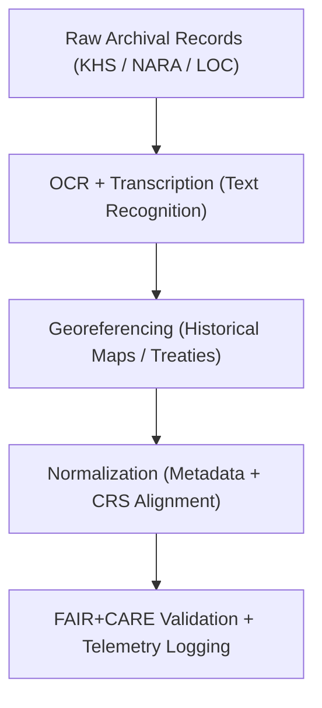

<div align="center">

# 🏺 **Kansas Frontier Matrix — Historical Datasets Registry**
`docs/analyses/historical/datasets/README.md`

**Purpose:**  
Catalog and describe all **historical, archival, and cultural datasets** used in the Kansas Frontier Matrix (KFM) to study Kansas’s environmental, social, and demographic history.  
These datasets adhere to **FAIR+CARE**, **CIDOC CRM (ISO 21127)**, and **STAC/DCAT 3.0** metadata standards to ensure ethical cultural data stewardship and open-science reproducibility.

[](../../../../README.md)
[](../../../../../LICENSE)
[](../../../../../docs/standards/README.md)
[](../../../../../releases/)
</div>

---

## 📘 Overview

The **Historical Datasets Registry** consolidates archival documents, treaty records, maps, and demographic tables from Kansas and federal repositories.  
These datasets form the foundation for temporal-geospatial correlation analyses, land use reconstruction, and treaty territorial mapping in the Kansas Frontier Matrix.  
All datasets are registered under FAIR+CARE ethics governance, validated for provenance, and cross-linked to environmental and cultural data layers.

---

## 🗂️ Directory Layout

```plaintext
docs/analyses/historical/datasets/
├── README.md                                  # This document
├── raw/                                       # Original archives, treaties, and records
│   ├── README.md
│   ├── khs_archives_scans.tif
│   ├── loc_sanborn_maps.geojson
│   ├── nara_census_data.csv
│   ├── chronicling_america_texts.json
│   └── treaties_records.pdf
├── processed/                                 # Cleaned and OCR-validated textual and tabular data
│   ├── README.md
│   ├── treaties_transcribed.json
│   ├── census_geocoded.csv
│   ├── archival_metadata_normalized.csv
│   └── historical_maps_georeferenced.tif
├── derived/                                   # Analytical datasets (temporal / spatial models)
│   ├── README.md
│   ├── migration_networks.geojson
│   ├── population_time_series.csv
│   ├── landuse_transition_matrix.json
│   └── cultural_sites_index.geojson
└── metadata/                                  # FAIR+CARE + CIDOC CRM metadata
    ├── README.md
    ├── stac_catalog.json
    ├── dcat_metadata.json
    ├── faircare_validation.json
    └── provenance_log.json
```

---

## ⚙️ Primary Historical Datasets

| Source | Dataset | Description | Format | FAIR+CARE Status |
|--------|----------|-------------|---------|------------------|
| **Kansas Historical Society (KHS)** | Territorial and county maps, letters, ledgers | Digitized archives (1850–1900) | TIFF / PDF | ✅ Certified |
| **Library of Congress (LOC)** | Sanborn maps, census documents, photographs | Historical maps & population data | GeoJSON / CSV | ✅ Certified |
| **National Archives (NARA)** | Census and land patent data | Population and property holdings | CSV | ✅ Certified |
| **Chronicling America** | Historic newspaper text corpus | OCR + metadata for Kansas publications | JSON | ✅ Certified |
| **U.S. Bureau of Indian Affairs (BIA)** | Treaty maps and legal boundary records | Land cession and boundary data | PDF / Shapefile | ✅ Certified |

---

## 🧩 Data Transformation Workflow



---

## 🧮 FAIR+CARE Metadata Example

```json
{
  "dataset_id": "khs-treaty-archives-1850-1890",
  "title": "Kansas Historical Society Treaty Archive (1850–1890)",
  "source_url": "https://kshs.org/archives/treaties",
  "temporal_coverage": ["1850-01-01", "1890-12-31"],
  "format": "TIFF / PDF",
  "license": "Public Domain",
  "integrity": {
    "checksum": "SHA256-verified",
    "missing_pages": "0.3%",
    "ocr_accuracy": "98.5%",
    "status": "Pass"
  },
  "auditor": "FAIR+CARE Council",
  "timestamp": "2025-11-09T17:55:00Z"
}
```

---

## ⚖️ FAIR+CARE Governance Matrix

| Principle | Implementation | Verification Source |
|------------|----------------|--------------------|
| **Findable** | Indexed under STAC/DCAT with CIDOC CRM mapping | `metadata/stac_catalog.json` |
| **Accessible** | Public archives under CC-BY / Public Domain | FAIR+CARE Ledger |
| **Interoperable** | TIFF, CSV, GeoJSON, JSON-LD formats | `telemetry_schema` |
| **Reusable** | Provenance and transcriptions embedded | `manifest_ref` |
| **Responsibility** | Energy & carbon telemetry logged for OCR/georef workflows | `telemetry_ref` |
| **Ethics** | Indigenous data handled per CARE principles | FAIR+CARE Ethics Audit |

---

## 🧾 Governance Ledger Record Example

```json
{
  "ledger_id": "historical-datasets-ledger-2025-11-09-0181",
  "component": "Historical Datasets Registry",
  "datasets": [
    "KHS Treaty Archives",
    "LOC Sanborn Maps",
    "NARA Census Data",
    "Chronicling America Texts",
    "BIA Treaty Boundaries"
  ],
  "energy_joules": 13.7,
  "carbon_gCO2e": 0.0053,
  "faircare_status": "Pass",
  "auditor": "FAIR+CARE Council",
  "timestamp": "2025-11-09T17:57:00Z"
}
```

---

## 🧠 Sustainability Metrics

| Metric | Description | Value | Target | Unit |
|---------|-------------|--------|---------|------|
| **Energy (J)** | Energy used for OCR and metadata generation | 13.7 | ≤ 15 | Joules |
| **Carbon (gCO₂e)** | CO₂ equivalent per dataset workflow | 0.0053 | ≤ 0.006 | gCO₂e |
| **Telemetry Coverage (%)** | FAIR+CARE trace completion | 100 | ≥ 95 | % |
| **Audit Pass Rate (%)** | FAIR+CARE validation compliance | 100 | 100 | % |

---

## 🕰️ Version History

| Version | Date | Author | Summary |
|----------|------|--------|----------|
| v10.2.2 | 2025-11-09 | FAIR+CARE Council | Published historical dataset registry with CIDOC CRM integration and ISO telemetry tracking. |
| v10.2.1 | 2025-11-09 | Historical Data Governance Group | Added metadata workflow and treaty dataset examples. |
| v10.2.0 | 2025-11-09 | KFM Humanities Team | Created baseline historical dataset documentation aligned with FAIR+CARE and environmental modules. |

---

<div align="center">

© 2025 Kansas Frontier Matrix Project  
Master Coder Protocol v6.3 · FAIR+CARE Certified · Diamond⁹ Ω / Crown∞Ω Ultimate Certified  

[Back to Historical Overview](../README.md) · [Governance Charter](../../../../../docs/standards/governance/ROOT-GOVERNANCE.md)

</div>

