<div align="center">

# 🏺 **Kansas Frontier Matrix — Historical Datasets Registry**  
`docs/analyses/historical/datasets/README.md`

**Purpose:**  
Provide a canonical registry of all **historical, archival, and cultural datasets** integrated into the Kansas Frontier Matrix (KFM) for reconstructing Kansas’s environmental, demographic, and cultural history.  
Each dataset follows **FAIR+CARE**, **CIDOC CRM (ISO 21127)**, and **STAC/DCAT** metadata standards to guarantee ethical stewardship, interoperability, and reproducibility across KFM pipelines.

[](../../../../README.md)  
[](../../../../LICENSE)  
[](../../../standards/faircare.md)  
[](../../../../releases/)

</div>

---

## 📘 Overview

The **Historical Datasets Registry** aggregates the canonical archival and cultural datasets that underpin KFM’s historical analyses (archival correlation, cultural landscapes, and population dynamics).  

These collections—spanning treaties, censuses, cultural archives, ethnographic sources, and historical maps—form the evidential backbone for:

- Spatial–temporal modelling and treaty territorial reconstruction  
- Historical demographic and migration analysis  
- Cultural landscapes and heritage geography  

Every dataset listed here is:

- **Versioned and cataloged** in STAC/DCAT,  
- **Governed under FAIR+CARE** with explicit sensitivity flags, and  
- **Traceable** via PROV, SBOMs, manifests, and telemetry.

This document is the **entry point** for discovering and auditing all historical data used by KFM.

---

## 🗂️ Directory Layout

```text
📁 repo-root/
├── 📁 docs/
│   └── 📁 analyses/
│       └── 📁 historical/
│           ├── 📄 README.md                          # Historical analyses index
│           ├── 📁 datasets/
│           │   └── 📄 README.md                      # This registry
│           ├── 📄 archival-correlation.md            # Archival linkage & geospatial correlation
│           ├── 📄 cultural-landscapes.md             # Cultural geography & heritage methods
│           ├── 📄 population-dynamics.md             # Demography & migration methods
│           └── 📄 validation.md                      # FAIR+CARE validation & ethics auditing
├── 📁 data/
│   └── 📁 historical/
│       ├── 📁 raw/
│       │   ├── 📁 khs_archives/                      # KHS scans, ledgers, maps
│       │   ├── 📁 loc_sanborn/                       # LOC Sanborn maps & reports
│       │   ├── 📁 nara_census/                       # NARA census tables & rolls
│       │   ├── 📁 chronicling_america/               # Newspaper OCR & metadata
│       │   └── 📁 bia_treaties/                      # BIA treaty maps & boundary files
│       ├── 📁 processed/
│       │   ├── 📁 treaties_transcribed/              # Treaty texts & normalized metadata
│       │   ├── 📁 census_geocoded/                   # Census linked to geographies
│       │   ├── 📁 archival_metadata_normalized/      # Harmonized archival metadata
│       │   └── 📁 historical_maps_georeferenced/     # Georeferenced historical maps/rasters
│       ├── 📁 derived/
│       │   ├── 📁 migration_networks/                # Flows & connectivity layers
│       │   ├── 📁 population_time_series/            # Longitudinal indicators
│       │   ├── 📁 landuse_transition/                # Land-use/cover change matrices
│       │   └── 📁 cultural_sites_index/              # Consolidated heritage site indices
│       ├── 📁 metadata/
│       │   ├── 📄 stac_catalog.json                  # Historical STAC catalog root
│       │   ├── 📄 dcat_metadata.json                 # DCAT descriptions & distributions
│       │   ├── 📄 faircare_validation.json           # Dataset-level FAIR+CARE reports
│       │   └── 📄 provenance_log.json                # PROV-style dataset lineage log
│       └── 📁 validation/
│           ├── 📄 schema-checks.json                 # JSON schema & STAC/DCAT checks
│           ├── 📄 faircare-dataset-audit.json        # Ethics & sensitivity audit results
│           ├── 📄 checksum-ledger.csv                # File integrity records
│           └── 📄 validation-summary.log             # Human-readable validation summary
├── 📁 data/
│   └── 📁 stac/
│       └── 📁 historical/
│           └── 📁 datasets/
│               └── 📄 catalog.json                   # STAC catalog for historical datasets
├── 📁 schemas/
│   └── 📁 telemetry/
│       └── 📄 analyses-historical-datasets-v3.json   # (telemetry_schema)
└── 📁 .github/
    └── 📁 workflows/
        └── 📄 historical-analyses-ci.yml             # Lint, schema, lineage & FAIR+CARE checks
```

---

## 🧭 Context

The Historical Datasets Registry sits **upstream** of all historical analyses:

> **Data Sources → Deterministic ETL → STAC/DCAT/PROV catalogs → Neo4j historical graph → API layer → React/MapLibre/Cesium → Story Nodes → Focus Mode.**

This document:

- Enumerates the **canonical dataset families** used in:
  - `archival-correlation`, `cultural-landscapes`, and `population-dynamics` analyses,
- Defines how they are **organized under `data/historical/**`**,  
- Describes their **licensing and sensitivity**, and  
- Provides **anchors for STAC/DCAT/PROV records** and validation outputs.

Any new historical dataset entering KFM **must** be reflected here (or in a referenced sub-registry) before it is treated as production-grade.

---

## 🧱 Architecture

### 🧩 Data Transformation Workflow

```mermaid
flowchart TD
  A["Raw Archival & Historical Records (KHS / LOC / NARA / BIA / Chronicling America)"]
    --> B["Ingestion & OCR / Transcription"]
  B --> C["Georeferencing & Spatial Harmonization"]
  C --> D["Metadata Normalization (CIDOC CRM + STAC/DCAT)"]
  D --> E["Derivation (Networks, Time Series, Land-Use, Indices)"]
  E --> F["FAIR+CARE Validation · Checksums · Telemetry Logging"]
```



Workflow characteristics:

- **Deterministic & config-driven** ETL for each dataset family (`config.yml` per pipeline).  
- **Separation of concerns**: raw vs processed vs derived vs metadata vs validation.  
- **Full provenance tracking** from raw sources to analytical products used by Story Nodes.

---

## 📦 Data & Metadata

### ⚙️ Primary Historical Datasets (Canonical Families)

| Source                             | Dataset Family                     | Description                                        | Formats              | FAIR+CARE |
|------------------------------------|------------------------------------|----------------------------------------------------|----------------------|----------|
| **Kansas Historical Society (KHS)**| Territorial & county maps, letters, ledgers | Digitized archives (approx. 1850–1900)   | TIFF / PDF / CSV     | ✅        |
| **Library of Congress (LOC)**     | Sanborn maps, census reports, photographs | Historical cartography & demographic reports | GeoJSON / TIFF / CSV | ✅        |
| **National Archives (NARA)**      | Census & land patent records       | Population, property & patent data                 | CSV / fixed-width    | ✅        |
| **Chronicling America**           | Historical newspaper corpus        | OCR text & metadata for Kansas publications        | JSON / TXT           | ✅        |
| **U.S. Bureau of Indian Affairs** | Treaty maps & legal boundary files | Land cession, reservation & boundary records       | PDF / SHP / GeoJSON  | ✅        |

Each family is assigned:

- A **registry ID** (e.g., `khs-archives`, `loc-sanborn`, `nara-census`, `bia-treaties`),  
- A **STAC Collection ID** (e.g., `kfm-historical-khs-archives`), and  
- A set of **DCAT distributions** describing derivative products.

---

### 🧮 FAIR+CARE Dataset Metadata Example

```json
{
  "dataset_id": "khs-treaty-archives-1850-1890",
  "title": "Kansas Historical Society Treaty Archive (1850–1890)",
  "source_url": "https://kshs.org/archives/treaties",
  "temporal_coverage": ["1850-01-01", "1890-12-31"],
  "spatial_coverage": "Kansas · Territorial & early statehood",
  "format": ["TIFF", "PDF"],
  "license": "Public Domain",
  "integrity": {
    "checksum": "SHA256-verified",
    "missing_pages": 0.003,
    "ocr_accuracy": 0.985,
    "status": "Pass"
  },
  "sensitivity": "General (non-sensitive; cultural review complete)",
  "auditor": "FAIR+CARE Council",
  "timestamp": "2025-11-11T18:05:00Z"
}
```

This example is stored under `data/historical/metadata/faircare_validation.json` and linked via STAC/DCAT/PROV.

---

## 🌐 STAC, DCAT & PROV Alignment

### STAC

- Root historical catalog: `data/historical/metadata/stac_catalog.json`  
- Datasets registry catalog: `data/stac/historical/datasets/catalog.json`  

Each dataset family creates one or more **STAC Collections**, e.g.:

- `kfm-historical-khs-archives`
- `kfm-historical-loc-sanborn`
- `kfm-historical-nara-census`
- `kfm-historical-chronicling-america`
- `kfm-historical-bia-treaties`

Each **STAC Item** contains:

- `id`: meaningful, e.g., `khs-archives-treaties-1850-1890-v10.2.2`  
- `properties["kfm:dataset_id"]`: registry ID from this document  
- `properties["kfm:release_version"]`: `v10.2.2`  
- `assets`: raw, processed, and derived files with appropriate roles & media types.

### DCAT

- Historical datasets are exposed via a **DCAT catalog** at `data/historical/metadata/dcat_metadata.json`.  
- Each family appears as a DCAT `Dataset` with `Distribution`s for:
  - Raw archival collections  
  - Processed versions (transcriptions, georeferenced maps)  
  - Derived analytical products (networks, time series, indices)

### PROV-O

- `prov:Entity`  
  - Raw entities: e.g., `khs-archives-raw`, `nara-census-raw-1880`.  
  - Processed entities: e.g., `khs-treaties-transcribed-v10.2.2`.  
- `prov:Activity`  
  - ETL, OCR, georeferencing, normalization, derivation, validation.  
- `prov:Agent`  
  - KFM pipelines, FAIR+CARE Council, specific curators/auditors.

Relations:

- `prov:used` — activities reference their raw/processed inputs.  
- `prov:wasGeneratedBy` — datasets point to the ETL or modeling run that produced them.  
- `prov:wasDerivedFrom` — derived layers (e.g., migration networks) reference their source collections (e.g., census + treaties).

---

## ⚖ FAIR+CARE & Governance

### FAIR+CARE Governance Matrix

| Principle        | Implementation                                                                | Verification Source              |
|------------------|-------------------------------------------------------------------------------|----------------------------------|
| **Findable**     | Indexed under STAC/DCAT with CIDOC CRM mapping & KFM registry IDs            | `data/historical/metadata/stac_catalog.json` |
| **Accessible**   | Public archives under CC-BY or Public Domain; restricted sets via governance | FAIR+CARE Ledger & registry notes |
| **Interoperable**| TIFF, CSV, GeoJSON, JSON-LD, RDF formats with shared ontologies              | `telemetry_schema`               |
| **Reusable**     | Provenance, transcription metadata, and release manifests embedded           | `manifest_ref`                   |
| **Responsibility** | Energy & carbon telemetry recorded during ETL and processing               | `telemetry_ref`                  |
| **Ethics**       | Indigenous & culturally sensitive data handled under CARE & sovereignty norms| FAIR+CARE Ethics Audit           |

Key governance constraints:

- **Sensitive sites & narratives** (e.g., sacred places, private community histories) are either:
  - Generalized (coarse geometries, reduced detail), or  
  - Kept in controlled-access layers with clear policy metadata.  
- Every dataset in this registry must have:
  - A **FAIR+CARE record** (as above),  
  - A **checksum entry** in `checksum-ledger.csv`, and  
  - A **validation status** recorded in `faircare-dataset-audit.json`.

---

## 🧪 Validation & CI/CD

### 🧾 Governance Ledger Record Example

```json
{
  "ledger_id": "historical-datasets-ledger-2025-11-11-0192",
  "component": "Historical Datasets Registry",
  "datasets": [
    "KHS Treaty Archives",
    "LOC Sanborn Maps",
    "NARA Census Data",
    "Chronicling America Texts",
    "BIA Treaty Boundaries"
  ],
  "energy_joules": 13.6,
  "carbon_gCO2e": 0.0053,
  "faircare_status": "Pass",
  "auditor": "FAIR+CARE Council",
  "timestamp": "2025-11-11T18:10:00Z"
}
```

This record is stored under `data/historical/validation/faircare-dataset-audit.json` and referenced by telemetry for KFM releases.

### 🌱 Sustainability Metrics

| Metric                    | Description                                   | Value  | Target | Unit   |
|---------------------------|-----------------------------------------------|--------|--------|--------|
| **Energy (J)**            | Mean energy per OCR/georeferencing/ingest task | 13.6   | ≤ 15   | Joules |
| **Carbon (gCO₂e)**        | CO₂ equivalent per dataset processing workflow | 0.0053 | ≤ 0.006| gCO₂e  |
| **Telemetry Coverage (%)**| Traceability of dataset lineage & validation   | 100    | ≥ 95   | %      |
| **Audit Pass Rate (%)**   | FAIR+CARE validation success                   | 100    | 100    | %      |

CI requirements (`historical-analyses-ci.yml`):

- Validate telemetry against `telemetry_schema`.  
- Confirm that all registered datasets appear in:
  - STAC/DCAT catalogs,  
  - checksum ledger, and  
  - FAIR+CARE validation records.  
- Fail builds if **any dataset** marked as `required_for_release: true` lacks a complete registry entry.

---

## 🕰️ Version History

| Version  | Date       | Author / Steward        | Summary                                                                                           |
|----------|-----------:|-------------------------|---------------------------------------------------------------------------------------------------|
| v10.2.2  | 2025-11-11 | FAIR+CARE Council       | Aligned Historical Datasets Registry with STAC/DCAT/PROV patterns; added validation & telemetry linkage. |
| v10.2.1  | 2025-11-09 | Data Governance Group   | Added FAIR+CARE metadata templates and treaty dataset examples.                                  |
| v10.2.0  | 2025-11-07 | KFM Humanities Team     | Created baseline documentation for the Historical Datasets module.                               |

---

<div align="center">

© 2025 Kansas Frontier Matrix Project  
Master Coder Protocol v6.3 · FAIR+CARE Certified · 🏺 Diamond⁹ Ω / 👑 Crown∞Ω Ultimate Certified  

[🏺 Historical Overview](../README.md) • [📚 Analyses Index](../README.md#analyses) • [⚖️ Governance Charter](../../../standards/governance/ROOT-GOVERNANCE.md)

</div>
