<div align="center">

# 🏺 **Kansas Frontier Matrix — Historical Datasets Registry**  
`docs/analyses/historical/datasets/README.md`

**Purpose:**  
Provide a comprehensive registry of all **historical, archival, and cultural datasets** integrated into the Kansas Frontier Matrix (KFM) for reconstructing Kansas’s environmental, demographic, and cultural history.  
Each dataset follows **FAIR+CARE**, **CIDOC CRM (ISO 21127)**, and **STAC/DCAT 3.0** metadata standards to guarantee ethical stewardship, interoperability, and reproducibility.

[](../../../../README.md)  
[](../../../../../LICENSE)  
[](../../../../../docs/standards/faircare.md)  
[](../../../../../releases/)
</div>

---

## 📘 Overview

The **Historical Datasets Registry** aggregates canonical archival and cultural datasets that underpin the historical analyses in KFM v10.  
These datasets—spanning treaties, census tables, cultural archives, and maps—provide the evidential backbone for spatial-temporal modelling, treaty territorial reconstruction, and socio-environmental analysis.  
All records are **validated, versioned, and cross-linked** to ensure traceability and alignment with the FAIR+CARE data governance charter.

---

## 🗂️ Directory Layout

```bash
docs/analyses/historical/datasets/
├── README.md
├── raw/
│   ├── README.md
│   ├── khs_archives_scans.tif
│   ├── loc_sanborn_maps.geojson
│   ├── nara_census_data.csv
│   ├── chronicling_america_texts.json
│   └── treaties_records.pdf
├── processed/
│   ├── README.md
│   ├── treaties_transcribed.json
│   ├── census_geocoded.csv
│   ├── archival_metadata_normalized.csv
│   └── historical_maps_georeferenced.tif
├── derived/
│   ├── README.md
│   ├── migration_networks.geojson
│   ├── population_time_series.csv
│   ├── landuse_transition_matrix.json
│   └── cultural_sites_index.geojson
├── metadata/
│   ├── README.md
│   ├── stac_catalog.json
│   ├── dcat_metadata.json
│   ├── faircare_validation.json
│   └── provenance_log.json
└── validation/
    ├── README.md
    ├── schema-checks.json
    ├── faircare-dataset-audit.json
    ├── checksum-ledger.csv
    └── validation-summary.log
```

---

## ⚙️ Primary Historical Datasets

| Source | Dataset | Description | Format | FAIR+CARE |
|--------|----------|-------------|---------|-----------|
| **Kansas Historical Society (KHS)** | Territorial and county maps, letters, ledgers | Digitized archives (1850–1900) | TIFF / PDF | ✅ |
| **Library of Congress (LOC)** | Sanborn maps, census reports, photographs | Historical cartography and demographic data | GeoJSON / CSV | ✅ |
| **National Archives (NARA)** | Census and land patent records | Population and property data | CSV | ✅ |
| **Chronicling America** | Historical newspaper corpus | OCR text and metadata for Kansas publications | JSON | ✅ |
| **U.S. Bureau of Indian Affairs (BIA)** | Treaty maps and legal boundary files | Land cession and reservation records | PDF / SHP | ✅ |

---

## 🧩 Data Transformation Workflow

```mermaid
flowchart TD
  A["Raw Archival Records (KHS / LOC / NARA)"]
  --> B["OCR + Transcription (Text Recognition)"]
  B --> C["Georeferencing (Historical Maps & Treaties)"]
  C --> D["Normalization (Metadata + CRS Alignment)"]
  D --> E["FAIR+CARE Validation · Telemetry Logging"]
```



Each dataset passes through standardized transformation pipelines (OCR → Spatial → Ethical → Validated), ensuring auditability and data lineage preservation across releases.

---

## 🧮 FAIR+CARE Metadata Example

```json
{
  "dataset_id": "khs-treaty-archives-1850-1890",
  "title": "Kansas Historical Society Treaty Archive (1850–1890)",
  "source_url": "https://kshs.org/archives/treaties",
  "temporal_coverage": ["1850-01-01", "1890-12-31"],
  "format": "TIFF / PDF",
  "license": "Public Domain",
  "integrity": {
    "checksum": "SHA256-verified",
    "missing_pages": "0.3%",
    "ocr_accuracy": "98.5%",
    "status": "Pass"
  },
  "auditor": "FAIR+CARE Council",
  "timestamp": "2025-11-11T18:05:00Z"
}
```

---

## ⚖️ FAIR+CARE Governance Matrix

| Principle | Implementation | Verification |
|------------|----------------|---------------|
| **Findable** | Indexed under STAC/DCAT with CIDOC CRM mapping | `metadata/stac_catalog.json` |
| **Accessible** | Public archives under CC-BY or Public Domain | FAIR+CARE Ledger |
| **Interoperable** | TIFF, CSV, GeoJSON, JSON-LD formats | `telemetry_schema` |
| **Reusable** | Provenance and transcription metadata embedded | `manifest_ref` |
| **Responsibility** | Energy & carbon telemetry recorded during processing | `telemetry_ref` |
| **Ethics** | Indigenous data stewardship under CARE principles | FAIR+CARE Ethics Audit |

---

## 🧾 Governance Ledger Record Example

```json
{
  "ledger_id": "historical-datasets-ledger-2025-11-11-0192",
  "component": "Historical Datasets Registry",
  "datasets": [
    "KHS Treaty Archives",
    "LOC Sanborn Maps",
    "NARA Census Data",
    "Chronicling America Texts",
    "BIA Treaty Boundaries"
  ],
  "energy_joules": 13.6,
  "carbon_gCO2e": 0.0053,
  "faircare_status": "Pass",
  "auditor": "FAIR+CARE Council",
  "timestamp": "2025-11-11T18:10:00Z"
}
```

---

## 🧠 Sustainability Metrics

| Metric | Description | Value | Target | Unit |
|---------|-------------|--------|---------|------|
| **Energy (J)** | Mean energy used per OCR/georeferencing task | 13.6 | ≤ 15 | Joules |
| **Carbon (gCO₂e)** | CO₂ equivalent per dataset process | 0.0053 | ≤ 0.006 | gCO₂e |
| **Telemetry Coverage (%)** | Traceability of dataset lineage | 100 | ≥ 95 | % |
| **Audit Pass Rate (%)** | FAIR+CARE validation success | 100 | 100 | % |

---

## 🕰️ Version History

| Version | Date | Author | Summary |
|----------|------|---------|----------|
| **v10.2.2** | 2025-11-11 | FAIR+CARE Council | Updated and aligned Historical Datasets Registry; added validation subdirectory and CIDOC CRM compliance. |
| **v10.2.1** | 2025-11-09 | Data Governance Group | Added FAIR+CARE metadata templates and treaty dataset examples. |
| **v10.2.0** | 2025-11-07 | KFM Humanities Team | Created baseline documentation for Historical Datasets module. |

---

<div align="center">

© 2025 Kansas Frontier Matrix Project  
Master Coder Protocol v6.3 · FAIR+CARE Certified · Diamond⁹ Ω / Crown∞Ω Ultimate Certified  

[Back to Historical Overview](../README.md) · [Governance Charter](../../../../../docs/standards/governance/ROOT-GOVERNANCE.md)

</div>
