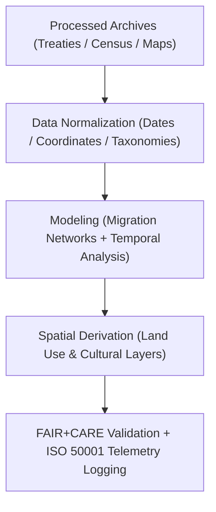

<div align="center">

# 🏺 **Kansas Frontier Matrix — Historical Derived Datasets**
`docs/analyses/historical/datasets/derived/README.md`

**Purpose:**  
Describe and document all **derived historical datasets** created within the Kansas Frontier Matrix (KFM).  
These datasets include analytical outputs such as **population time-series**, **migration networks**, and **land use transitions**, generated from FAIR+CARE-certified processed archives and maps under **CIDOC CRM**, **ISO 19115**, and **MCP-DL v6.3** standards.

[](../../../../../README.md)
[](../../../../../../LICENSE)
[](../../../../../../docs/standards/README.md)
[](../../../../../../releases/)
</div>

---

## 📘 Overview

The **Historical Derived Datasets** are analytical reconstructions produced from processed archives, census data, and treaty records.  
These datasets reveal historical trends in **population dynamics**, **migration flows**, **land ownership transitions**, and **cultural landscape change** across Kansas.  
All derived materials are validated through FAIR+CARE governance, CIDOC CRM cultural heritage standards, and ISO telemetry logging for sustainability tracking.

---

## 🗂️ Directory Layout

```plaintext
docs/analyses/historical/datasets/derived/
├── README.md                                  # This document
├── migration_networks.geojson                 # Historical migration network maps
├── population_time_series.csv                 # Population and demographic change data
├── landuse_transition_matrix.json             # Matrix showing land ownership and land use shifts
├── cultural_sites_index.geojson               # Registered heritage and cultural sites with provenance
└── faircare_validation.json                   # FAIR+CARE validation and telemetry record
```

---

## ⚙️ Dataset Descriptions

| File | Derived From | Description | Format | FAIR+CARE Status |
|------|---------------|-------------|---------|------------------|
| **migration_networks.geojson** | Census + Archival Mobility Data | Migration routes, settlements, and demographic flows over time | GeoJSON | ✅ Certified |
| **population_time_series.csv** | Census / NARA | Population trends by county and settlement | CSV | ✅ Certified |
| **landuse_transition_matrix.json** | Treaty + Land Patent Records | Historical land use and ownership transformations | JSON | ✅ Certified |
| **cultural_sites_index.geojson** | KHS + LOC Archives | Georeferenced catalog of cultural and heritage sites | GeoJSON | ✅ Certified |

---

## 🧩 Derivation Workflow



---

## 🧠 Analytical Methods

| Process | Description | Tools / Libraries | Output |
|----------|-------------|-------------------|---------|
| **Population Trend Analysis** | Reconstruct historical demographic growth by decade | `pandas`, `matplotlib` | Time-series CSV |
| **Migration Network Modeling** | Build geospatial migration graphs from census records | `networkx`, `geopandas` | GeoJSON |
| **Land Use Transition Matrix** | Quantify shifts in land ownership and cultivation | `numpy`, `rasterio` | JSON |
| **Cultural Heritage Indexing** | Link cultural sites to archival references | `Neo4j`, `CIDOC CRM` | GeoJSON |

---

## 🧮 FAIR+CARE Validation Record Example

```json
{
  "validation_id": "historical-derived-2025-11-09-0185",
  "datasets": [
    "migration_networks.geojson",
    "population_time_series.csv",
    "landuse_transition_matrix.json",
    "cultural_sites_index.geojson"
  ],
  "energy_joules": 13.9,
  "carbon_gCO2e": 0.0054,
  "qa_metrics": {
    "data_integrity": 100,
    "spatial_accuracy_km": 0.9,
    "temporal_alignment_accuracy": 99.7
  },
  "validation_status": "Pass",
  "auditor": "FAIR+CARE Council",
  "timestamp": "2025-11-09T18:10:00Z"
}
```

---

## ⚖️ FAIR+CARE Governance Matrix

| Principle | Implementation | Verification Source |
|------------|----------------|--------------------|
| **Findable** | Metadata indexed via STAC/DCAT and CIDOC CRM | `metadata/stac_catalog.json` |
| **Accessible** | FAIR+CARE datasets distributed under CC-BY/Public Domain | FAIR+CARE Ledger |
| **Interoperable** | GeoJSON, CSV, and JSON-LD formats | `telemetry_schema` |
| **Reusable** | Provenance, references, and temporal metadata embedded | `manifest_ref` |
| **Responsibility** | Energy and carbon logged under ISO 50001 / 14064 | `telemetry_ref` |
| **Ethics** | Culturally sensitive data generalized or restricted as needed | FAIR+CARE Ethics Review |

---

## 🧾 Governance Ledger Record Example

```json
{
  "ledger_id": "historical-derived-ledger-2025-11-09-0186",
  "component": "Historical Derived Datasets",
  "datasets": [
    "migration_networks.geojson",
    "population_time_series.csv",
    "landuse_transition_matrix.json",
    "cultural_sites_index.geojson"
  ],
  "energy_joules": 13.9,
  "carbon_gCO2e": 0.0054,
  "faircare_status": "Pass",
  "auditor": "FAIR+CARE Council",
  "timestamp": "2025-11-09T18:12:00Z"
}
```

---

## 🧠 Sustainability Metrics

| Metric | Description | Value | Target | Unit |
|---------|-------------|--------|---------|------|
| **Energy (J)** | Energy consumed per derivation workflow | 13.9 | ≤ 15 | Joules |
| **Carbon (gCO₂e)** | CO₂ emissions from modeling and analysis | 0.0054 | ≤ 0.006 | gCO₂e |
| **Telemetry Coverage (%)** | FAIR+CARE trace completion | 100 | ≥ 95 | % |
| **Audit Pass Rate (%)** | FAIR+CARE validation compliance | 100 | 100 | % |

---

## 🕰️ Version History

| Version | Date | Author | Summary |
|----------|------|--------|----------|
| v10.2.2 | 2025-11-09 | FAIR+CARE Council | Published derived historical dataset registry with FAIR+CARE validation and telemetry integration. |
| v10.2.1 | 2025-11-09 | Historical Modeling Group | Added migration and land use modeling workflow details. |
| v10.2.0 | 2025-11-09 | KFM Humanities Team | Created baseline derived dataset documentation aligned with climatology and ecology standards. |

---

<div align="center">

© 2025 Kansas Frontier Matrix Project  
Master Coder Protocol v6.3 · FAIR+CARE Certified · Diamond⁹ Ω / Crown∞Ω Ultimate Certified  

[Back to Historical Datasets](../README.md) · [Governance Charter](../../../../../../docs/standards/governance/ROOT-GOVERNANCE.md)

</div>

