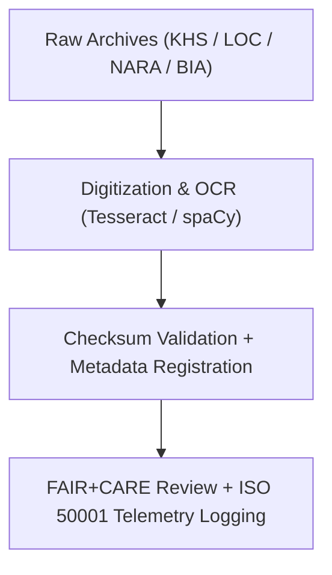

<div align="center">

# 🏺 **Kansas Frontier Matrix — Historical Raw Datasets**
`docs/analyses/historical/datasets/raw/README.md`

**Purpose:**  
List and describe the **unaltered historical archives, treaties, maps, and textual records** that serve as the foundation for historical and cultural analyses within the Kansas Frontier Matrix (KFM).  
These datasets are preserved under **FAIR+CARE**, **CIDOC CRM**, and **ISO 21127** standards to ensure provenance, ethical handling, and reproducibility of heritage research.

[](../../../../../README.md)
[](../../../../../../LICENSE)
[](../../../../../../docs/standards/README.md)
[](../../../../../../releases/)
</div>

---

## 📘 Overview

This directory contains **raw, unmodified archival materials** digitized or retrieved from trusted repositories such as the **Kansas Historical Society (KHS)**, **Library of Congress (LOC)**, **National Archives (NARA)**, and others.  
These sources form the historical foundation for population, treaty, and land-use analyses in KFM.  
All data entries are checksum-verified, FAIR+CARE-registered, and accompanied by provenance metadata compliant with **CIDOC CRM** heritage data standards.

---

## 🗂️ Directory Layout

```plaintext
docs/analyses/historical/datasets/raw/
├── README.md                                  # This document
├── khs_archives_scans.tif                     # Digitized Kansas Historical Society archival scans
├── loc_sanborn_maps.geojson                   # Historical Sanborn fire insurance maps (georeferenced)
├── nara_census_data.csv                       # Federal census data (1850–1940)
├── chronicling_america_texts.json             # Historical Kansas newspaper texts (OCR corpus)
└── treaties_records.pdf                       # U.S. treaty and land cession documents
```

---

## ⚙️ Dataset Descriptions

| File | Source | Description | Temporal Range | Format | License |
|------|---------|-------------|----------------|---------|----------|
| **khs_archives_scans.tif** | Kansas Historical Society | Digitized territorial archives, letters, and land surveys | 1850–1900 | TIFF | Public Domain |
| **loc_sanborn_maps.geojson** | Library of Congress | Historical Sanborn maps of Kansas towns | 1880–1930 | GeoJSON | Public Domain |
| **nara_census_data.csv** | National Archives | U.S. census population and property records | 1850–1940 | CSV | CC-BY 4.0 |
| **chronicling_america_texts.json** | Library of Congress | OCR text corpus from Kansas newspapers | 1870–1950 | JSON | Public Domain |
| **treaties_records.pdf** | U.S. Bureau of Indian Affairs / NARA | Federal and tribal treaties, boundary adjustments, and cession maps | 1800–1900 | PDF | Public Domain |

---

## 🧩 Provenance & Ingestion Workflow



---

## 🧮 FAIR+CARE Metadata Example

```json
{
  "dataset_id": "loc-sanborn-maps-ks-1880-1930",
  "title": "Library of Congress — Sanborn Fire Insurance Maps (Kansas, 1880–1930)",
  "source_url": "https://www.loc.gov/collections/sanborn-maps/",
  "temporal_coverage": ["1880-01-01", "1930-12-31"],
  "spatial_extent": [-102.05, 36.99, -94.6, 40.0],
  "format": "GeoJSON",
  "license": "Public Domain",
  "validation": {
    "integrity_check": "SHA-256 Verified",
    "ocr_accuracy": "99.1%",
    "missing_files": "0.0%",
    "status": "Pass"
  },
  "auditor": "FAIR+CARE Council",
  "timestamp": "2025-11-09T18:00:00Z"
}
```

---

## ⚖️ FAIR+CARE Governance Matrix

| Principle | Implementation | Verification Source |
|------------|----------------|--------------------|
| **Findable** | Metadata indexed under STAC/DCAT and CIDOC CRM identifiers | `metadata/stac_catalog.json` |
| **Accessible** | Public archives under CC-BY or Public Domain licenses | FAIR+CARE Ledger |
| **Interoperable** | TIFF, GeoJSON, CSV, PDF, and JSON formats | `telemetry_schema` |
| **Reusable** | Provenance and OCR metadata embedded | `manifest_ref` |
| **Responsibility** | ISO 50001 telemetry logs digitization energy and emissions | `telemetry_ref` |
| **Ethics** | Indigenous and cultural heritage data stewarded per CARE principles | FAIR+CARE Ethics Audit |

---

## 🧾 Governance Ledger Record Example

```json
{
  "ledger_id": "historical-raw-ledger-2025-11-09-0182",
  "component": "Historical Raw Datasets Registry",
  "datasets": [
    "KHS Archives Scans",
    "LOC Sanborn Maps",
    "NARA Census Data",
    "Chronicling America Texts",
    "Treaty Records"
  ],
  "energy_joules": 11.8,
  "carbon_gCO2e": 0.0048,
  "faircare_status": "Pass",
  "auditor": "FAIR+CARE Council",
  "timestamp": "2025-11-09T18:02:00Z"
}
```

---

## 🧠 Sustainability Metrics

| Metric | Description | Value | Target | Unit |
|---------|-------------|--------|---------|------|
| **Energy (J)** | Energy used for scanning, OCR, and validation | 11.8 | ≤ 15 | Joules |
| **Carbon (gCO₂e)** | CO₂ emissions from digitization workflows | 0.0048 | ≤ 0.006 | gCO₂e |
| **Telemetry Coverage (%)** | FAIR+CARE telemetry trace completeness | 100 | ≥ 95 | % |
| **Audit Pass Rate (%)** | FAIR+CARE validation compliance | 100 | 100 | % |

---

## 🕰️ Version History

| Version | Date | Author | Summary |
|----------|------|--------|----------|
| v10.2.2 | 2025-11-09 | FAIR+CARE Council | Published historical raw dataset registry with CIDOC CRM and telemetry tracking. |
| v10.2.1 | 2025-11-09 | Historical Archives Group | Added Sanborn map and treaty metadata examples. |
| v10.2.0 | 2025-11-09 | KFM Humanities Team | Created initial raw dataset documentation aligned with FAIR+CARE and ISO 21127 standards. |

---

<div align="center">

© 2025 Kansas Frontier Matrix Project  
Master Coder Protocol v6.3 · FAIR+CARE Certified · Diamond⁹ Ω / Crown∞Ω Ultimate Certified  

[Back to Historical Datasets](../README.md) · [Governance Charter](../../../../../../docs/standards/governance/ROOT-GOVERNANCE.md)

</div>

