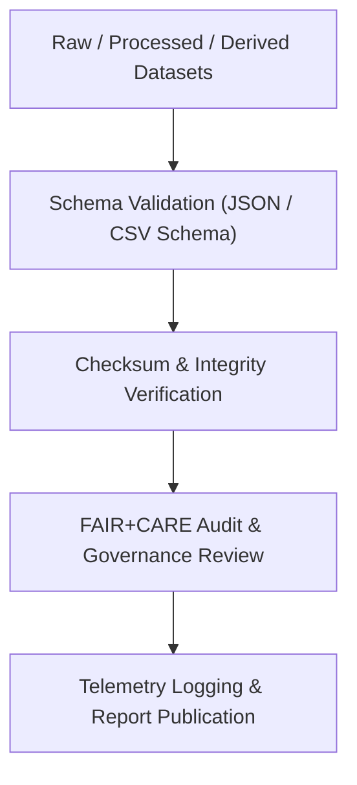

<div align="center">

# ✅ **Kansas Frontier Matrix — Historical Datasets Validation Directory**  
`docs/analyses/historical/datasets/validation/README.md`

**Purpose:**  
Ensure **data quality, schema conformance, and ethical governance verification** of all historical datasets used in Kansas Frontier Matrix (KFM) analyses.  
This directory contains automated validation reports, FAIR+CARE compliance checks, checksum ledgers, and schema definitions confirming integrity across raw, processed, and derived datasets.

[](../../../../README.md)  
[](../../../../../docs/standards/faircare.md)  
[](../../../../../LICENSE)  
[](../../../../../releases/v10.2.0/manifest.zip)

</div>

---

## 📘 Overview

The *Validation* directory serves as the **quality assurance hub** for all historical datasets integrated into the KFM knowledge ecosystem.  
It documents integrity checks, FAIR+CARE ethical audits, and machine-readable schema validations that confirm reproducibility and conformance to MCP-DL v6.3.

Each file under this directory provides:
- **Schema validation outputs** verifying structural consistency (field types, units, CRS).
- **Checksum and hash ledgers** ensuring immutability and traceability across releases.
- **FAIR+CARE audits** documenting data ethics, provenance, and access transparency.
- **Automated validation logs** generated by GitHub Actions and telemetry pipelines.

---

## 🗂️ Directory Layout

```bash
docs/analyses/historical/datasets/validation/
├── README.md                            # This overview
├── schema-checks.json                   # Results of schema conformance checks
├── faircare-dataset-audit.json          # FAIR+CARE ethical and provenance validation
├── checksum-ledger.csv                  # SHA-256 hashes of dataset files
├── metadata-integrity-report.json       # Cross-validation of metadata and manifests
└── validation-summary.log               # Combined automated validation output
```

---

## ⚙️ Validation Workflow Integration



**Process Summary**
1. All datasets undergo automated schema checks using `frictionless validate` and JSON Schema definitions.  
2. Checksums are computed (SHA-256) and logged for each dataset version.  
3. FAIR+CARE compliance audit verifies accessibility, provenance, and ethics metadata.  
4. Results are stored here and referenced in `data/stac/historical_datasets_v10.json` and telemetry reports.

---

## 🧾 Validation Schema Fields

| Field | Description | Example |
|-------|-------------|----------|
| **dataset_id** | Unique identifier for validated dataset | `khs_archival_maps_1850_1910` |
| **schema_version** | Version of validation schema applied | `v3.1.0` |
| **validation_status** | PASS / WARN / FAIL | `PASS` |
| **records_checked** | Total records validated | `128,437` |
| **checksum_sha256** | File integrity hash | `9b4a3e7f…c12d` |
| **issues_found** | Count of structural or ethical warnings | `0` |
| **auditor** | Process or team performing validation | `FAIR+CARE Automation CI` |
| **timestamp** | ISO 8601 date/time of validation run | `2025-11-11T18:00:00Z` |

---

## 🧩 FAIR+CARE & Compliance Alignment

| Principle | Implementation |
|------------|----------------|
| **Findable** | Indexed in STAC catalog and validation manifest. |
| **Accessible** | Results published in JSON/CSV under open license. |
| **Interoperable** | Schema uses JSON-LD + DCAT alignment for automation. |
| **Reusable** | Validation metadata linked to dataset provenance records. |
| **CARE – Collective Benefit** | Ensures historical and cultural data integrity benefits descendant communities. |
| **CARE – Responsibility** | Prevents misuse through transparent audit trails and governance logs. |

---

## 🕰️ Version History

| Version | Date | Author | Summary |
|----------|------|---------|----------|
| **v10.2.2** | 2025-11-11 | FAIR+CARE Data Standards Council | Added validation schema, checksum ledger, and FAIR+CARE audit structure. |
| **v10.2.1** | 2025-11-09 | KFM Data Quality Team | Integrated automated CI validation reports and telemetry linkage. |
| **v10.2.0** | 2025-11-07 | Frontier Matrix Maintainers | Established validation directory and README template. |

---

<div align="center">

© 2025 Kansas Frontier Matrix Project  
Master Coder Protocol v6.3 · FAIR+CARE Certified · Diamond⁹ Ω / Crown∞Ω Ultimate Certified  

[⬅ Back to Historical Datasets](../README.md) · [Governance Charter](../../../../../docs/standards/governance/ROOT-GOVERNANCE.md)

</div>

