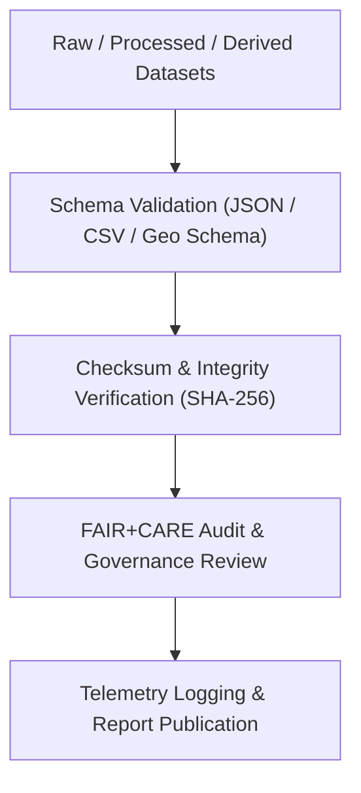

<div align="center">

# ✅ **Kansas Frontier Matrix — Historical Datasets Validation Directory**  
`docs/analyses/historical/datasets/validation/README.md`

**Purpose:**  
Ensure **data quality, schema conformance, and ethical governance verification** for all historical datasets used in Kansas Frontier Matrix (KFM) analyses.  
This directory documents automated validation reports, FAIR+CARE compliance checks, checksum ledgers, and schema definitions that confirm integrity across **raw, processed, and derived** historical datasets.

[](../../../../../README.md)  
[](../../../../../docs/standards/faircare.md)  
[](../../../../../LICENSE)  
[](../../../../../releases/v10.2.0/manifest.zip)

</div>

---

## 📘 Overview

The **Validation Directory** is the **quality assurance hub** for all historical datasets integrated into the KFM knowledge ecosystem.

It captures:

- **Schema validation outputs** verifying structural consistency (field types, units, CRS, encodings).  
- **Checksum and hash ledgers** ensuring immutability and reproducibility across releases.  
- **FAIR+CARE audits** documenting ethics, provenance, sensitivity flags, and access controls.  
- **Automated validation logs** generated by GitHub Actions and telemetry pipelines.

Together with the **Historical Datasets Registry** (`docs/analyses/historical/datasets/README.md`), this directory ensures that any dataset used in historical analyses is:

- **Validated**,  
- **Governed**, and  
- **Traceable** back to its provenance and release configuration.

---

## 🗂️ Directory Layout

```text
📁 repo-root/
├── 📁 docs/
│   └── 📁 analyses/
│       └── 📁 historical/
│           └── 📁 datasets/
│               └── 📁 validation/
│                   └── 📄 README.md                 # This document
├── 📁 data/
│   └── 📁 historical/
│       └── 📁 validation/
│           ├── 📄 schema-checks.json               # Schema conformance results
│           ├── 📄 faircare-dataset-audit.json      # FAIR+CARE ethical & provenance validation
│           ├── 📄 checksum-ledger.csv              # SHA-256 hashes of dataset files
│           ├── 📄 metadata-integrity-report.json   # Cross-check of metadata vs manifests
│           └── 📄 validation-summary.log           # Combined automated validation logs
└── 📁 .github/
    └── 📁 workflows/
        └── 📄 historical-analyses-ci.yml           # CI that produces/updates these artifacts
```

- **Doc entrypoint:** `docs/analyses/historical/datasets/validation/README.md`  
- **Machine-readable outputs:** `data/historical/validation/**`  
- **CI producer:** `.github/workflows/historical-analyses-ci.yml`

---

## 🧭 Context

This validation layer is an integral part of the KFM pipeline:

> **Raw Data → Deterministic ETL → STAC/DCAT/PROV catalogs → Validation (this directory) → Neo4j historical graph → API → Web → Story Nodes → Focus Mode.**

Specifically, it:

- Verifies that datasets listed in the **Historical Datasets Registry** are structurally sound and ethically governed.  
- Ensures that **analyses** (archival correlation, cultural landscapes, population dynamics) only operate on **validated inputs**.  
- Surfaces validation status, telemetry, and FAIR+CARE results for governance reviews and public documentation.

Any dataset marked as `required_for_release: true` in the registry **must** have corresponding entries here before release.

---

## 🧪 Validation & CI/CD

### 🧩 Validation Workflow Integration



**Process Summary**

1. **Schema validation**  
   - Run via CI using JSON Schema, CSV schema definitions, and GeoJSON/GeoTIFF checks.  
   - Outputs aggregated into `schema-checks.json`.

2. **Integrity verification**  
   - Compute SHA-256 checksums for each dataset release artifact.  
   - Record in `checksum-ledger.csv` with dataset IDs and paths.

3. **FAIR+CARE audit**  
   - Validate ethics, licensing, sensitivity flags, and provenance coverage.  
   - Summarize results in `faircare-dataset-audit.json`.

4. **Metadata integrity**  
   - Cross-check STAC/DCAT metadata, manifests, and physical files.  
   - Document issues and resolutions in `metadata-integrity-report.json`.

5. **Telemetry logging**  
   - Emit run-level metrics (energy, carbon, counts) conforming to `telemetry_schema`.  
   - Aggregate high-level messages in `validation-summary.log`.

All steps are driven by **config files**, under git and release version control, per MCP-DL v6.3.

---

## 📦 Validation Artifacts & Schema Fields

### 🧾 Validation Schema Fields (Per Dataset Entry)

```json
{
  "dataset_id": "khs_archival_maps_1850_1910",
  "schema_version": "v3.1.0",
  "validation_status": "PASS",
  "records_checked": 128437,
  "checksum_sha256": "9b4a3e7f...c12d",
  "issues_found": 0,
  "severity_max": "INFO",
  "auditor": "FAIR+CARE Automation CI",
  "timestamp": "2025-11-11T18:00:00Z"
}
```

### 🧾 Core Fields Table

| Field              | Description                                   | Example                           |
|--------------------|-----------------------------------------------|-----------------------------------|
| `dataset_id`       | Unique identifier for validated dataset       | `khs_archival_maps_1850_1910`    |
| `schema_version`   | Version of validation schema applied          | `v3.1.0`                         |
| `validation_status`| `PASS` / `WARN` / `FAIL`                      | `PASS`                           |
| `records_checked`  | Total records or features validated           | `128437`                         |
| `checksum_sha256`  | File integrity hash                           | `9b4a3e7f…c12d`                  |
| `issues_found`     | Count of structural/ethical warnings or errors| `0`                              |
| `severity_max`     | Highest severity encountered (`INFO/WARN/ERROR`) | `INFO`                        |
| `auditor`          | Process or team performing validation         | `FAIR+CARE Automation CI`        |
| `timestamp`        | ISO 8601 date/time of validation run          | `2025-11-11T18:00:00Z`           |

These entries live primarily in `schema-checks.json` and `faircare-dataset-audit.json`, keyed by `dataset_id`.

---

## ⚖ FAIR+CARE & Governance

### 🧩 FAIR+CARE & Compliance Alignment

| Principle                        | Implementation                                                                                  | Evidence / File                       |
|----------------------------------|-------------------------------------------------------------------------------------------------|---------------------------------------|
| **Findable**                     | Validation results indexed by `dataset_id` and linked in STAC/DCAT catalogs                    | `data/historical/metadata/stac_catalog.json` |
| **Accessible**                   | Results published in JSON/CSV under open license                                               | `data/historical/validation/*.json`   |
| **Interoperable**               | Validation schemas use JSON Schema, JSON-LD, and DCAT-aligned fields                           | `telemetry_schema`                    |
| **Reusable**                     | Validation metadata linked to dataset provenance and manifests                                 | `manifest_ref`, `provenance_log.json` |
| **CARE — Collective Benefit**   | Integrity checks ensure that historical & cultural data reliably support descendant communities | `faircare-dataset-audit.json`         |
| **CARE — Responsibility**       | Transparent audit trails and governance logs prevent misuse and support community oversight    | `validation-summary.log`              |

Governance expectations:

- **No dataset** with `validation_status = "FAIL"` may be used in production analyses.  
- Datasets with `validation_status = "WARN"` must be **explicitly acknowledged** in analysis docs and Story Nodes.  
- Sensitive datasets must show **explicit CARE review** with notes in `faircare-dataset-audit.json`.

---

## 🌱 Sustainability & Telemetry

Validation runs contribute to KFM’s **energy and carbon accounting**. High-level metrics (aggregated across dataset families) include:

| Metric                    | Description                                       | Value  | Target | Unit   |
|---------------------------|---------------------------------------------------|--------|--------|--------|
| **Energy (J)**            | Mean energy per validation workflow               | 4.2    | ≤ 5    | Joules |
| **Carbon (gCO₂e)**        | CO₂ equivalent per validation workflow            | 0.0016 | ≤ 0.002| gCO₂e  |
| **Telemetry Coverage (%)**| Validations with complete telemetry records       | 100    | ≥ 95   | %      |
| **Audit Pass Rate (%)**   | FAIR+CARE validation runs with `PASS` or `WARN`   | 100    | 100    | %      |

These aggregates are derived from `telemetry_ref` and must conform to `telemetry_schema`.

---

## 🕰️ Version History

| Version  | Date       | Author / Steward                | Summary                                                                                      |
|----------|-----------:|---------------------------------|----------------------------------------------------------------------------------------------|
| v10.2.2  | 2025-11-11 | FAIR+CARE Data Standards Council| Aligned validation directory with STAC/DCAT/PROV patterns; added telemetry linkage and schema fields. |
| v10.2.1  | 2025-11-09 | KFM Data Quality Team           | Integrated automated CI validation reports and telemetry into historical-analyses workflow. |
| v10.2.0  | 2025-11-07 | Frontier Matrix Maintainers     | Established validation directory structure and baseline README template.                     |

---

<div align="center">

© 2025 Kansas Frontier Matrix Project  
Master Coder Protocol v6.3 · FAIR+CARE Certified · 🏺 Diamond⁹ Ω / 👑 Crown∞Ω Ultimate Certified  

[⬅ Back to Historical Datasets](../README.md) • [🏺 Historical Overview](../../README.md) • [⚖️ Governance Charter](../../../../../docs/standards/governance/ROOT-GOVERNANCE.md)

</div>
