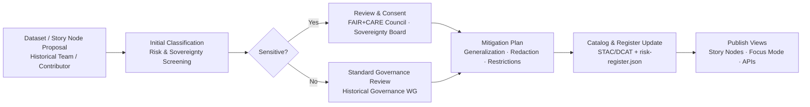
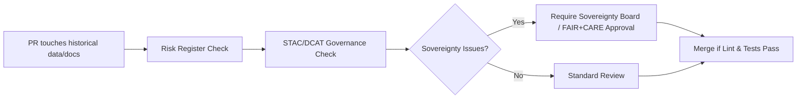

<div align="center">

# ⚖️ **Kansas Frontier Matrix — Historical Analyses Governance**  
`docs/analyses/historical/governance.md`

**Purpose**  
Define the **governance, risk, and ethics framework** for historical analyses in the Kansas Frontier Matrix (KFM), including archival materials, treaties, demographic records, and cultural narratives.  

This guide specifies how **sensitive historical and cultural information** is classified, generalized, reviewed, and surfaced through Story Nodes and Focus Mode, in alignment with **FAIR+CARE**, Indigenous sovereignty policies, and KFM-wide governance standards.

[](../../README.md)  
[](../../../LICENSE)  
[](../../standards/faircare.md)  
[](../../../releases/)

</div>

---

## 📘 Overview

This document governs how **historical content** is handled within KFM, including:

- Archival maps, treaties, land deeds, and legal records.  
- Census and demographic datasets.  
- Newspapers, oral histories, and cultural narratives.  
- Historical interpretations connected to environmental, archaeological, or hydrological data.

Key objectives:

- Classify historical datasets and Story Nodes by **sensitivity and risk tier**.  
- Define **generalization and masking rules** for locations, names, and events.  
- Ensure **Indigenous data sovereignty**, community consent, and contextual integrity.  
- Integrate governance decisions into **STAC/DCAT metadata, PROV bundles, and lineage CI**.  
- Provide clear rules for **what Focus Mode and Story Nodes may or may not surface**.

This guide is **normative** for any work under `docs/analyses/historical/` and associated datasets in `data/*/historical/`.

---

## 🗂️ Directory Layout

Historical governance interacts with analyses, datasets, and standards in the following structure:

```text
📁 Kansas-Frontier-Matrix/
├── 📁 docs/
│   ├── 📁 standards/
│   │   ├── 📄 kfm_markdown_protocol_v11.2.5.md        # Markdown protocol (global)
│   │   ├── 📄 FAIRCARE-GUIDE.md                       # FAIR+CARE principles & patterns
│   │   ├── 📁 governance/
│   │   │   └── 📄 ROOT-GOVERNANCE.md                  # Root governance charter
│   │   └── 📁 sovereignty/
│   │       └── 📄 INDIGENOUS-DATA-PROTECTION.md       # Sovereignty & Indigenous data policy
│   └── 📁 analyses/
│       └── 📁 historical/
│           ├── 📄 README.md                           # Historical Analyses Overview
│           ├── 📄 governance.md                       # This governance guide
│           ├── 📁 datasets/
│           │   ├── 📄 README.md                       # Historical datasets catalog + risk flags
│           │   └── 🧾 risk-register.json              # Machine-readable risk tiers & approvals
│           ├── 📁 methods/                            # Methods (correlation, population, etc.)
│           │   └── 📄 README.md                       # Methods index
│           └── 📁 reports/
│               └── 📄 README.md                       # Historical reports & Story Node bundles
├── 📁 data/
│   ├── 📁 sources/
│   │   └── 📁 historical/                             # Source manifests (license, rights, risk)
│   ├── 📁 raw/
│   │   └── 📁 historical/                             # Raw archives & scans (restricted, LFS/DVC)
│   ├── 📁 processed/
│   │   └── 📁 historical/                             # Cleaned / normalized data (risk-tagged)
│   └── 📁 stac/
│       └── 📁 historical/                             # STAC Items w/ risk + sovereignty metadata
└── 📁 dist/
    └── 📁 historical/
        ├── 🧾 provenance/                             # PROV-O bundles for historical workflows
        └── 🧾 storynode/                              # Story Node bundles for historical narratives
```

**Directory governance rules (normative):**

- `docs/analyses/historical/datasets/risk-register.json` is the **canonical machine-readable risk registry** for historical datasets.  
- All datasets under `data/processed/historical/` must have:
  - A **source manifest** (`data/sources/historical/*`).  
  - A corresponding **STAC Item** with risk and sovereignty fields.  
  - Entries or references in the **risk register** and DCAT catalog.  
- Any new file under `docs/analyses/historical/` describing methods, datasets, or Story Nodes **must** link back to this governance guide.

---

## 🧭 Context

Historical analyses operate at the intersection of:

- **Cultural heritage & archaeology** – overlapping sites, oral histories, and material remains.  
- **Environmental and hydrological change** – droughts, floods, land-use shifts.  
- **Indigenous sovereignty and community rights** – where control and context over data are critical.  

This governance guide is subordinate to:

- `docs/standards/governance/ROOT-GOVERNANCE.md` (root governance).  
- `docs/standards/faircare.md` (FAIR+CARE implementation).  
- `docs/standards/sovereignty/INDIGENOUS-DATA-PROTECTION.md` (sovereignty and Indigenous data).

Where conflicts arise:

- **Sovereignty and Indigenous data protection policies take priority**.  
- Historical analyses may be **restricted, generalized, or entirely omitted** from public views to honor community decisions.

---

## 🧱 Architecture

### Governance Workflow (Conceptual)



### Roles

- **Historical Governance Working Group (HGWG)**  
  - Maintains this document, the risk register, and review processes.  

- **FAIR+CARE Council**  
  - Ensures analyses uphold FAIR+CARE principles and sustainability metrics.  

- **Sovereignty Board / Indigenous Partners**  
  - Hold authority over Indigenous and culturally sensitive data, including the right to **veto**, **limit**, or **require redaction** of content.

- **Implementation Teams (Pipelines, API, Web)**  
  - Ensure downstream systems (ETL, graph, API, UI) actually enforce governance decisions.

---

## 📦 Data & Metadata

### Risk Tiers

Historical datasets and Story Nodes are classified into risk tiers:

| Tier | Label        | Description                                                                                     | Examples                                      |
|------|--------------|-------------------------------------------------------------------------------------------------|-----------------------------------------------|
| 0    | Open         | Widely available, low sensitivity, already public.                                             | Historic weather data, public census aggregates. |
| 1    | Caution      | Contains potentially sensitive historical information but with low contemporary risk.          | 19th c. property records, old newspaper ads.  |
| 2    | Sensitive    | Cultural, religious, or community-specific info; contemporary implications possible.           | Sacred site references, burial ground proximity. |
| 3    | Restricted   | Explicit Indigenous or community-controlled content; legal or ethical restrictions apply.      | Tribal archives under specific MOUs.          |

### Required Fields in Risk Register

Each dataset entry in `docs/analyses/historical/datasets/risk-register.json` **MUST** include at minimum:

- `dataset_id` – stable identifier.  
- `title` – human-readable name.  
- `risk_tier` – integer 0–3.  
- `sensitivity_reason` – short text explanation.  
- `sovereignty_scope` – e.g., “Tribal Nation”, “Local Community”, “None”.  
- `governance_decision` – e.g., “allow-open”, “allow-generalized”, “internal-only”, “deny”.  
- `generalization_profile` – reference to a profile (e.g., `h3_k7_donut`, `names_redacted`).  
- `approving_body` – HGWG, FAIR+CARE Council, Sovereignty Board, etc.  
- `decision_timestamp` – ISO8601 timestamp.  

Example snippet:

```json
{
  "dataset_id": "kfm-hist-treaty-maps-khs-v1",
  "title": "KHS Treaty and Land Cession Maps (Kansas Region)",
  "risk_tier": 2,
  "sensitivity_reason": "Treaty boundaries intersect with contemporary tribal territories and sacred sites.",
  "sovereignty_scope": "Tribal Nations in Kansas & neighboring regions",
  "governance_decision": "allow-generalized",
  "generalization_profile": "h3_k6_donut_5km",
  "approving_body": "Sovereignty Board · FAIR+CARE Council",
  "decision_timestamp": "2025-12-04T20:15:00Z"
}
```

---

## 🌐 STAC, DCAT & PROV Alignment

### STAC Governance Fields (Historical)

Historical STAC Items under `data/stac/historical/` **MUST** include governance-related fields such as:

```json
{
  "kfm:risk_tier": 2,
  "kfm:governance_ref": "docs/analyses/historical/governance.md@v11.2.4",
  "kfm:risk_register_id": "kfm-hist-treaty-maps-khs-v1",
  "kfm:sovereignty_scope": "Tribal Nations in Kansas & neighboring regions",
  "care:maskingApplied": true,
  "care:generalization_profile": "h3_k6_donut_5km"
}
```

These fields must be consistent with:

- `docs/analyses/historical/datasets/risk-register.json`  
- Sovereignty and Indigenous data policies.  

### DCAT / PROV-O Alignment

In the DCAT catalog and PROV graph:

- Historical datasets appear as `dcat:Dataset` with:
  - `dct:provenance` pointing at PROV bundles and governance decisions.  
  - `dct:rights` and `dct:accessRights` reflecting risk tier and sovereignty.  

- Governance decisions may be modeled as PROV entities and activities:
  - `prov:Activity`: historical governance review session.  
  - `prov:Entity`: governance decision record.  
  - `prov:Agent`: HGWG, Sovereignty Board, FAIR+CARE Council.

This enables **traceable governance**: consumers can see not only how data was produced, but also how it was approved and constrained.

---

## 🧠 Story Node & Focus Mode Integration

Historical governance applies directly to **how narratives are presented**:

### Story Nodes

- Each historical Story Node involving sensitive or Indigenous content **MUST** include:

  - `risk_tier` and `governance_decision`.  
  - A reference to the relevant entries in the risk register and STAC Items.  
  - A short governance note describing:
    - Any generalization (spatial or textual).  
    - Any omissions or redactions (“some locations omitted for cultural sensitivity”).

- Story Nodes **MUST NOT**:
  - Reveal precise coordinates of restricted sites (Tier 2–3).  
  - Reproduce restricted archival text (e.g., sacred narratives) without explicit consent.  
  - Suggest deterministic or authoritative interpretations that exceed what sources support.

### Focus Mode

When a user activates Focus Mode on historical layers:

- Focus Mode **may**:
  - Summarize governance fields (risk tier, scope, generalization profile).  
  - Explain why certain details are generalized or omitted.  
  - Offer reflective context (e.g., acknowledging data gaps, community perspectives).

- Focus Mode **must not**:
  - Override or “fill in” redacted information.  
  - Infer sensitive locations or identities from generalized data.  
  - Present speculative narratives as fact.

Implementations should treat `ai_transform_prohibited` as **hard constraints** for historical governance content.

---

## 🧪 Validation & CI/CD

Governance for historical analyses is enforced through CI:

### Checks

For any PR affecting `docs/analyses/historical/`, `data/*/historical/`, or relevant Story Nodes:

- **Risk Register Validation**
  - Ensure all referenced `dataset_id`s exist in `risk-register.json`.  
  - Verify `risk_tier`, `governance_decision`, and `generalization_profile` fields are present and valid.

- **STAC/DCAT Metadata Check**
  - Confirm `kfm:risk_tier`, `kfm:risk_register_id`, and `kfm:governance_ref` are present on historical STAC Items.  

- **Sovereignty Compliance**
  - For entries with `sovereignty_scope != "None"`:
    - CI checks that a governance decision exists and is not `"allow-open"` without explicit Sovereignty Board approval.

- **Docs & Markdown**
  - Validate this file and related historical docs against KFM-MDP v11.2.5:
    - YAML schema, required sections, Version History, and footer.

### Example CI Gate (Conceptual)



No historical dataset or Story Node may be promoted to a public or shared environment if these checks fail.

---

## ⚖ FAIR+CARE & Governance

### FAIR+CARE Governance Matrix (Historical Analyses)

| Principle                         | Historical Implementation                                                                                          |
|-----------------------------------|--------------------------------------------------------------------------------------------------------------------|
| **Findable**                      | Historical datasets indexed with risk-tiered metadata; governance links in STAC/DCAT and this doc.                |
| **Accessible**                    | Access decisions reflect risk tiers, sovereignty, and original source rights; open where appropriate.             |
| **Interoperable**                 | Governance metadata modeled with STAC, DCAT, PROV-O, and CIDOC-CRM concepts.                                       |
| **Reusable**                      | Documentation of provenance, governance decisions, and constraints, so others can responsibly reuse data.         |
| **CARE – Collective Benefit**     | Prioritizes uses that support education, heritage preservation, and community-defined goals.                      |
| **CARE – Authority to Control**   | Respects community and tribal rights over data; governance decisions made with or by affected communities.        |
| **CARE – Responsibility**         | Explicitly documents uncertainty, limitations, and potential harms; mandates generalization where risks exist.    |
| **CARE – Ethics**                 | Prohibits sensationalization, misrepresentation, or erasure; requires respectful, contextual narratives.          |

Governance decisions must **never** be treated as purely technical; they are ethical and social commitments as well as data policies.

---

## 🕰️ Version History

| Version   | Date       | Author / Steward                              | Summary                                                                                                      |
|----------:|-----------:|-----------------------------------------------|--------------------------------------------------------------------------------------------------------------|
| **v11.2.4** | 2025-12-07 | FAIR+CARE Council · Historical Governance WG | Initial governance guide for historical analyses; aligned with KFM-MDP v11.2.5; defined risk tiers, STAC/DCAT/PROV alignment, Story Node & Focus Mode rules, and CI governance checks. |

---

<div align="center">

⚖️ **Kansas Frontier Matrix — Historical Analyses Governance**  
FAIR+CARE · Sovereignty-Respecting · Provenance-Aware  

[🔙 Back to Historical Analyses](./README.md) · [📂 Analyses Index](../README.md) · [⚖ Governance Charter](../../standards/governance/ROOT-GOVERNANCE.md) · [📘 Markdown Protocol v11.2.5](../../standards/kfm_markdown_protocol_v11.2.5.md)

</div>

