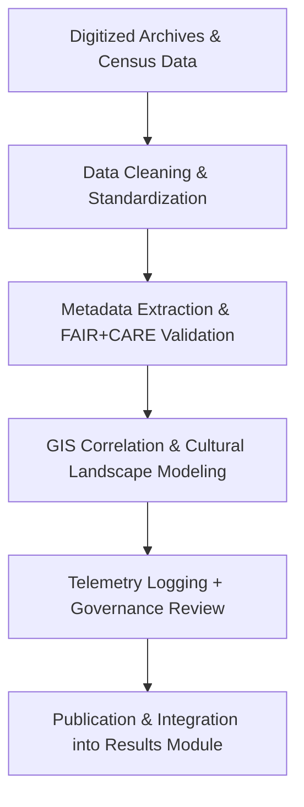

<div align="center">

# 📜 **Kansas Frontier Matrix — Historical Methods**  
`docs/analyses/historical/methods/README.md`

**Purpose:**  
Document and govern all **analytical, archival, and interpretive methodologies** used in the Historical Domain of the Kansas Frontier Matrix (KFM).  
These methods include archival correlation, population reconstruction, and cultural landscape analysis, all adhering to FAIR+CARE, ISO metadata standards, and the Master Coder Protocol v6.3.

[](../../../../../../docs/standards/markdown_guide.md)
[](../../../../../../LICENSE)
[](../../../../../../docs/standards/faircare.md)
[](../../../../../../releases/v10.2.0/manifest.zip)

</div>

---

## 📘 Overview

The **Historical Methods** directory defines the analytical foundation for reconstructing Kansas’s socio-environmental history, integrating archival, demographic, and cultural datasets.  
All methodologies are designed to promote reproducibility, ethical stewardship, and cross-domain integration with ecology, hydrology, and geology domains.

Methodological categories include:
- **Archival Correlation** — Digitization and temporal alignment of historical documents and maps.  
- **Cultural Landscape Reconstruction** — GIS-based modeling of settlement, trade, and territorial change.  
- **Population Dynamics** — Time-series estimation of demographic shifts.  
- **Ethical Archival Practices** — CARE-compliant data governance and Indigenous consent management.  

---

## 🗂️ Directory Layout

```bash
methods/
 ├── README.md
 ├── summary-findings.md
 ├── figures/
 │    └── README.md
 ├── tables/
 │    └── README.md
 ├── telemetry-logs/
 │    └── README.md
 └── governance.md
```

Each subdirectory follows FAIR+CARE and MCP-DL documentation conventions with embedded provenance and telemetry tracking.

---

## 🧩 Methodological Framework

| Method | Description | Tools / Frameworks | FAIR+CARE Focus |
|--------|--------------|-------------------|-----------------|
| **Archival Correlation** | Aligns digitized records, treaties, and maps across time. | `OpenRefine`, `Python Pandas`, `ArcGIS Pro` | Provenance reconstruction |
| **Cultural Landscapes Analysis** | Maps territorial changes, land use, and settlements using historical maps. | `QGIS`, `GDAL`, `Rasterio` | Consent-based spatial transparency |
| **Population Dynamics** | Reconstructs population growth and migration patterns from census & archive data. | `R (tidyverse)`, `Python (NumPy)` | Representation accuracy |
| **Validation & Provenance Tracking** | Integrates archival metadata with FAIR+CARE auditing. | `spaCy`, `Neo4j`, `FAIR Audit API` | Ethical traceability |

---

## ⚙️ Methodological Workflow



Each workflow emits telemetry logs documenting sustainability, accuracy, and ethics validation.

---

## ⚖️ FAIR+CARE Governance Matrix

| Principle | Implementation | Verification Source |
|------------|----------------|--------------------|
| **Findable** | Historical data indexed under DCAT 3.0 schema with persistent UUIDs. | `datasets/metadata/` |
| **Accessible** | Open-access under CC-BY 4.0 with sensitive content filtered by consent. | FAIR+CARE Ledger |
| **Interoperable** | Metadata harmonized with other domains via STAC/DCAT pipelines. | `telemetry_schema` |
| **Reusable** | Provenance, rights, and archival lineage stored in JSON-LD. | `manifest_ref` |
| **Collective Benefit** | Enables inclusive cultural heritage restoration and education. | FAIR+CARE Audit |
| **Authority to Control** | Indigenous and community consent metadata enforced. | IDGB Validation |
| **Responsibility** | Telemetry tracks archival sustainability metrics. | `telemetry_ref` |
| **Ethics** | Sensitive cultural information anonymized or aggregated. | Governance Council |

---

## 🕰️ Version History

| Version | Date | Author | Summary |
|----------|------|--------|----------|
| v10.2.2 | 2025-11-11 | FAIR+CARE Historical Methods Council | Created Historical Methods documentation aligned with FAIR+CARE and MCP-DL v6.3 standards. |

---

<div align="center">

© 2025 Kansas Frontier Matrix · Master Coder Protocol v6.3 · FAIR+CARE Certified  
Diamond⁹ Ω / Crown∞Ω Ultimate Certified  

[Back to Historical Overview](../README.md) · [Governance Charter](../../../../../../docs/standards/governance/ROOT-GOVERNANCE.md)

</div>

