<div align="center">

# 📜 **Kansas Frontier Matrix — Historical Methods**  
`docs/analyses/historical/methods/README.md`

**Purpose**  
Document and govern all **analytical, archival, and interpretive methodologies** used in the Historical Domain of the Kansas Frontier Matrix (KFM).  
These methods cover archival correlation, population reconstruction, and cultural landscape analysis, and are designed to be **reproducible, FAIR+CARE-aligned, sovereignty-respecting, and catalog-ready** (STAC/DCAT/PROV).

[](../../../../README.md)  
[](../../../../LICENSE)  
[](../../../standards/faircare.md)  
[](../../../../releases/)

</div>

---

## 📘 Overview

The **Historical Methods** module defines the analytical foundation for reconstructing **Kansas’s socio-environmental history**, integrating:

- **Archival sources** – maps, treaties, deeds, newspapers, photos, oral histories.  
- **Demographic data** – census tables, tax records, settlement lists.  
- **Contextual layers** – ecological, hydrological, and infrastructure datasets.  

Goals:

- Provide a **methods index** for all historical analyses under `docs/analyses/historical/`.  
- Ensure methods are **reproducible, documented, and PROV-traceable**.  
- Embed FAIR+CARE and sovereignty considerations into methods themselves, not just outputs.  
- Make methods **graph-compatible** so key steps can be represented in the Neo4j knowledge graph (CIDOC-CRM + PROV-O).

Methodological categories include:

- **Archival Correlation** — Digitization, entity extraction, and temporal/spatial alignment of historical documents and maps.  
- **Cultural Landscape Reconstruction** — GIS-based modeling of settlement, land use, trade, and territorial change.  
- **Population Dynamics** — Time-series and spatial estimation of demographic shifts.  
- **Ethical & Sovereignty-Aware Practice** — CARE-compliant data governance, Indigenous consent, and controlled narratives.  

This README is the **entry point** for any new historical method document or pipeline in KFM.

---

## 🗂️ Directory Layout

Historical methods use the following structure (emoji layout profile):

```text
📁 Kansas-Frontier-Matrix/
├── 📁 docs/
│   └── 📁 analyses/
│       └── 📁 historical/
│           ├── 📄 README.md                  # Historical Analyses Overview
│           ├── 📄 governance.md             # Governance & risk rules
│           ├── 📄 validation.md             # Validation & CI/CD for historical analyses
│           ├── 📁 methods/
│           │   ├── 📄 README.md             # This methods index
│           │   ├── 📄 archival-correlation.md   # Methods for archives ↔ maps ↔ environment
│           │   ├── 📄 population-dynamics.md    # Methods for demographic & migration modeling
│           │   └── 📄 cultural-landscapes.md    # Methods for cultural/ecological landscape analysis
│           └── 📁 reports/
│               └── 📄 README.md             # Historical reports & Story Node bundles
├── 📁 src/
│   └── 📁 pipelines/
│       └── 📁 historical/
│           ├── 📄 archival_pipeline.py      # Archival correlation pipeline
│           ├── 📄 population_pipeline.py    # Population dynamics pipeline
│           ├── 📄 landscapes_pipeline.py    # Cultural landscape pipeline
│           └── 📄 config_historical.yml     # Shared config: inputs, methods, parameters
├── 📁 data/
│   ├── 📁 sources/
│   │   └── 📁 historical/                   # Source manifests (license, rights, risk)
│   ├── 📁 raw/
│   │   └── 📁 historical/                   # Raw scans, rasters, tables (restricted)
│   ├── 📁 processed/
│   │   └── 📁 historical/                   # Cleaned, normalized, method-ready datasets
│   └── 📁 stac/
│       └── 📁 historical/                   # STAC Items & Collections for historical assets
└── 📁 dist/
    └── 📁 historical/
        ├── 🧾 provenance/                   # PROV-O bundles for historical workflows
        └── 🧾 storynode/                    # Story Node bundles referencing methods + datasets
```

**Layout rules (normative):**

- Each `.md` file shown must exist and follow KFM-MDP v11.2.5 (front-matter, H2 registry, footer).  
- New method docs under `docs/analyses/historical/methods/` **must** be added to this tree and linked from the tables below.  
- Historical pipelines under `src/pipelines/historical/` **must** reference this README and their specific method doc in comments/config.

---

## 🧭 Context

Historical methods sit at the intersection of:

- **Historical Analyses Overview** (`docs/analyses/historical/README.md`)  
  - Defines *what* questions we ask (themes, case studies, Story Nodes).  
- **Historical Governance** (`docs/analyses/historical/governance.md`)  
  - Defines *which data and narratives are allowed* and *how they must be generalized*.  
- **Historical Validation** (`docs/analyses/historical/validation.md`)  
  - Defines *how we test* datasets, methods, and Story Nodes for quality and ethical safety.  

Methods in this README are:

- The **“how” layer** — they describe procedures, algorithms, and modeling choices.  
- Expressed as **CIDOC-CRM E29 Design or Procedure** mapped into PROV-O plans.  
- Implemented as **config-driven pipelines** and documented analyses.

Any new pipeline or Story Node that uses historical data **must** identify which method(s) from this index it follows (or extend this index with a new method doc).

---

## 🧱 Architecture

### Method Families

| Method Family              | Doc                                 | Description                                                      | Typical Outputs                             |
|---------------------------|--------------------------------------|------------------------------------------------------------------|---------------------------------------------|
| **Archival Correlation**  | `archival-correlation.md`           | Aligns digitized records, treaties, and maps across time & space | Linked tables, georeferenced maps, graph edges |
| **Cultural Landscapes**   | `cultural-landscapes.md`            | Models territorial changes, land use, and settlements            | Time-stamped polygons, landscape narratives |
| **Population Dynamics**   | `population-dynamics.md`            | Reconstructs population and migration patterns                   | Demographic time-series, flows, indicators  |

These method docs:

- Specify algorithmic steps and assumptions.  
- Reference which **datasets** and **pipelines** implement them.  
- Define how to express results in **STAC/DCAT/PROV** and the knowledge graph.

### Methodological Framework (High-Level)

```mermaid
flowchart TD
    A["Historical Sources<br/>Archives · Census · Maps · Narratives"]
        --> B["Data Preparation<br/>Digitization · OCR · Normalization"]
    B --> C["Entity & Event Extraction<br/>Places · Persons · Events"]
    C --> D["Correlation & Modeling<br/>Archival · Population · Landscapes"]
    D --> E["Graph & Catalog Integration<br/>Neo4j · STAC · DCAT · PROV"]
    E --> F["Story Nodes & Focus Mode<br/>Historical Narratives · Timelines · Maps"]
```



Each stage is backed by one or more method docs from this README plus specific pipeline configs.

---

## 📦 Data & Metadata

Historical methods operate on structured, semi-structured, and unstructured data:

- **Archives & Registers** – deeds, treaties, court records, tax rolls.  
- **Census & Survey Data** – population counts, occupations, household information.  
- **Maps & Plans** – cadastral maps, Sanborn maps, historical atlases.  
- **Narratives** – newspapers, letters, oral histories (via OCR/NLP).  

For each method, datasets must:

- Have **source manifests** under `data/sources/historical/` with license, rights, and acquisition metadata.  
- Be represented in **STAC** (spatiotemporal assets) and **DCAT** (catalog).  
- Carry **risk and sovereignty metadata** as defined in `governance.md`.

Method docs should specify:

- Required **fields** and **schemas** (e.g., person/place/event attributes).  
- Expected **temporal granularity** (e.g., decade-level vs year-level).  
- Rules for **handling missing data** and **uncertainty representation**.

---

## 🌐 STAC, DCAT & PROV Alignment

This methods index is not itself a dataset but a **design/plan** that structures how datasets are modeled.

- In **STAC**, historical datasets that implement these methods should include:
  - `kfm:method_ref`: e.g., `"docs/analyses/historical/methods/archival-correlation.md@v11.2.4"`.  
  - `kfm:analysis_family`: `"archival_correlation"`, `"cultural_landscapes"`, `"population_dynamics"`, etc.

- In **DCAT**, method-aware datasets should include:
  - `dct:conformsTo` pointing at this README or a specific method doc.  
  - `dct:provenance` referencing PROV bundles that encode method steps.

- In **PROV-O**, each method is a `prov:Plan` (this doc + child docs), and each **pipeline run** is a `prov:Activity` using that plan and generating `prov:Entity` datasets.

The combination of:

- This methods index,  
- Specific method docs,  
- And STAC/DCAT/PROV links  

makes historical analyses **navigable and traceable** from data to narrative.

---

## 🧠 Story Node & Focus Mode Integration

Historical methods define how data is transformed into narrative:

- **Story Nodes** should:
  - Reference the **method family** and specific method doc(s) used.  
  - Distinguish between **data** (what sources say) and **interpretation** (what the analysis suggests).  
  - Include a short **methods note** summarizing key analytical choices (e.g., how population estimates were interpolated).

- **Focus Mode**:
  - May surface method summaries from this README and child method docs.  
  - Should expose **validation status** and **risk/sovereignty notes** for the datasets used in a Story Node.  
  - Must not invent un-documented methodology; it can only summarize or restate what these docs describe.

When designing Story Nodes that rely heavily on a particular family (e.g., `population-dynamics.md`), authors should:

1. Ensure that method doc is up-to-date and aligned with the actual pipeline code.  
2. Reference method IDs or doc paths in the Story Node metadata.  
3. Add governance and validation references as per `governance.md` and `validation.md`.

---

## 🧪 Validation & CI/CD

Historical methods are **enforced** through validation and CI:

- `.github/workflows/historical-validation.yml` and `.github/workflows/lineage.yml` must:
  - Check that **method references** in STAC/DCAT and Story Nodes correspond to actual docs.  
  - Verify that method docs have valid YAML front-matter and required sections (per KFM-MDP v11.2.5).  
  - Confirm that pipelines referencing these methods produce:
    - PROV bundles in `dist/historical/provenance/`.  
    - Validation reports in `dist/historical/validation/` (see validation guide).  

- For each method family, CI should also:
  - Run **sample or smoke tests** that verify method-specific assumptions (e.g., no impossible date ranges, consistent spatial units).  
  - Emit **telemetry** (e.g., number of records processed, error counts, energy/carbon metrics).

Failure modes:

- If a method doc is missing or structurally invalid → docs CI fails.  
- If datasets claim to use a method that doesn’t exist or fails validation → data/lineage CI fails.  
- If governance or sovereignty constraints for a method (e.g., handling of sacred sites in landscapes) are violated → governance CI fails.

---

## ⚖ FAIR+CARE & Governance

Historical methods are bound by FAIR+CARE and sovereignty policies:

- **FAIR**

  - **Findable:**  
    - Methods are documented in this README and child docs, linked from STAC/DCAT metadata.  
  - **Accessible:**  
    - Methods are open (CC-BY), while underlying data access respects original licenses and sovereignty rules.  
  - **Interoperable:**  
    - Methods reference shared ontologies (CIDOC-CRM, PROV-O) and data standards (STAC/DCAT).  
  - **Reusable:**  
    - Clear description of assumptions, limitations, and reproducibility details (e.g., configs, code locations).

- **CARE**

  - **Collective Benefit:**  
    - Methods prioritize uses that support education, community memory, and heritage preservation.  
  - **Authority to Control:**  
    - Methods involving Indigenous or community-controlled data must follow `sovereignty_policy`, including consent and veto rights.  
  - **Responsibility:**  
    - Methods must explicitly address biases, gaps, and uncertainties; they may advise **not** drawing certain conclusions.  
  - **Ethics:**  
    - Prohibits methods that inherently sensationalize trauma or erase marginalized perspectives; requires balanced, contextual use.

Any method that cannot be implemented **without violating** governance, FAIR+CARE, or sovereignty policies must be:

- Marked as **“not approved for production”** in its method doc.  
- Omitted from Story Nodes and Focus Mode until redesigned.

---

## 🕰️ Version History

| Version   | Date       | Author / Steward                     | Summary                                                                                                      |
|----------:|-----------:|--------------------------------------|--------------------------------------------------------------------------------------------------------------|
| **v11.2.4** | 2025-12-07 | FAIR+CARE Council · KFM Historical Team | Upgraded to KFM-MDP v11.2.5; added emoji directory layout; integrated governance & validation docs; defined method families, STAC/DCAT/PROV alignment, and Story Node & Focus Mode integration; updated release/telemetry refs. |
| v10.2.2  | 2025-11-11 | FAIR+CARE Historical Methods Council | Initial Historical Methods documentation aligned with FAIR+CARE and MCP-DL v6.3 standards.                   |

---

<div align="center">

📜 **Kansas Frontier Matrix — Historical Methods**  
Scientific Insight · FAIR+CARE · Sovereignty-Respecting · Provenance-Aware  

[🔙 Back to Historical Overview](../README.md) · [⚖ Historical Governance](../governance.md) · [✅ Historical Validation](../validation.md) · [📘 Markdown Protocol v11.2.5](../../../standards/kfm_markdown_protocol_v11.2.5.md)

</div>
