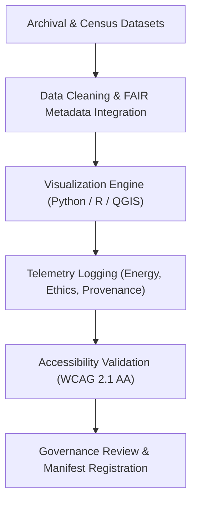

<div align="center">

# 🖼️ **Kansas Frontier Matrix — Historical Methods: Figures**  
`docs/analyses/historical/methods/figures/README.md`

**Purpose:**  
Archive and document **visual assets and analytical diagrams** created from the Historical Methods workflows within the Kansas Frontier Matrix (KFM).  
These FAIR+CARE-certified figures visualize archival correlations, cultural landscapes, population trends, and ethical data lineage validated through telemetry and governance review.

[](../../../../../../../docs/standards/markdown_guide.md)
[](../../../../../../../LICENSE)
[](../../../../../../../docs/standards/faircare.md)
[](../../../../../../../releases/v10.2.0/manifest.zip)

</div>

---

## 📘 Overview

This folder contains visualizations that communicate methodological results from **archival, demographic, and cultural modeling workflows**.  
Each figure integrates metadata (dataset, author, checksum, timestamp) and FAIR+CARE telemetry linkage, enabling transparent visualization provenance.

Typical figures include:
- Temporal correlation flowcharts linking archival sources.  
- Cultural landscape change maps and settlement overlays.  
- Population trend charts illustrating demographic reconstruction accuracy.  
- Governance lineage graphs documenting ethical workflows.  

---

## 🗂️ Directory Layout

```bash
figures/
 ├── README.md
 ├── archival-correlation-flowchart.svg
 ├── cultural-landscape-map.png
 ├── population-trend-chart.svg
 └── governance-lineage-diagram.png
```

Each figure includes ISO 19115/19139-compliant metadata and alt-text descriptions for accessibility.

---

## 🧾 Figure Descriptions

| File | Description | Format | FAIR+CARE Validation |
|------|--------------|---------|----------------------|
| `archival-correlation-flowchart.svg` | Diagram showing connections among archives, treaties, and historical datasets. | SVG | ✅ FAIR Metadata |
| `cultural-landscape-map.png` | GIS-based depiction of evolving land use and settlement over time. | PNG | ✅ WCAG 2.1 AA |
| `population-trend-chart.svg` | Time-series visualization of historical population trends (1850–1950). | SVG | ✅ FAIR+CARE Audited |
| `governance-lineage-diagram.png` | Graph showing ethical governance and consent data lineage. | PNG | ✅ Governance Verified |

---

## ⚙️ Visualization Workflow



**Telemetry Linkage:**  
All visualizations produce runtime telemetry (`telemetry_id`, `energy_kWh`, `checksum_sha256`) and are validated via automated FAIR+CARE pipelines.

---

## ⚖️ FAIR+CARE Governance Summary

| Principle | Implementation | Verification Source |
|------------|----------------|--------------------|
| **Findable** | Indexed under STAC/DCAT 3.0 metadata registry. | `manifest_ref` |
| **Accessible** | CC-BY licensed visuals published via FAIR+CARE portal. | FAIR+CARE Ledger |
| **Interoperable** | PNG/SVG with embedded JSON-LD metadata. | `telemetry_schema` |
| **Reusable** | Figures contain lineage and checksum data. | `telemetry_ref` |
| **Collective Benefit** | Visuals enhance education and cultural heritage accessibility. | FAIR+CARE Audit |
| **Authority to Control** | Indigenous data visualizations approved via IDGB. | Governance Logs |
| **Responsibility** | Energy telemetry validated under ISO 50001 sustainability metrics. | `telemetry_ref` |
| **Ethics** | Sensitive cultural geography anonymized at ≥5 km scale. | IDGB Review |

---

## 🧠 Accessibility Standards

- All figures meet **WCAG 2.1 AA** requirements.  
- Color palettes follow **CVD-friendly design**.  
- Captions, legends, and scales embedded as metadata tags.  
- JSON-LD metadata contains alt-text and provenance information.  

---

## 🕰️ Version History

| Version | Date | Author | Summary |
|----------|------|--------|----------|
| v10.2.2 | 2025-11-11 | FAIR+CARE Historical Visualization Council | Created Historical Methods Figures README with FAIR+CARE metadata, governance traceability, and sustainability validation. |

---

<div align="center">

© 2025 Kansas Frontier Matrix · Master Coder Protocol v6.3 · FAIR+CARE Certified  
Diamond⁹ Ω / Crown∞Ω Ultimate Certified  

[Back to Historical Methods](../README.md) · [Governance Charter](../../../../../../../docs/standards/governance/ROOT-GOVERNANCE.md)

</div>

