<div align="center">

# 🖼️ **Kansas Frontier Matrix — Historical Methods: Figures**  
`docs/analyses/historical/methods/figures/README.md`

**Purpose:**  
Archive and document **visual assets and analytical diagrams** created from Historical Methods workflows within the Kansas Frontier Matrix (KFM).  
These FAIR+CARE-certified figures visualize archival correlations, cultural landscapes, population trends, and ethical data lineage, with **telemetry-backed provenance** and governance review.

[](../../../../../README.md)  
[](../../../../../LICENSE)  
[](../../../../standards/faircare.md)  
[](../../../../../releases/v10.2.0/manifest.zip)

</div>

---

## 📘 Overview

This directory describes the **canonical figures** produced by KFM’s Historical Methods pipelines:

- **Archival Correlation Visuals**  
  Flowcharts and graphs linking treaties, maps, ledgers, and newspapers.
- **Cultural Landscape & Heritage Maps**  
  Spatial depictions of landscape transitions and cultural geographies.
- **Population & Demographic Charts**  
  Time-series plots and comparative graphics for population models.
- **Governance & Lineage Diagrams**  
  Visual explanations of FAIR+CARE workflows, consent, and provenance.

Each figure:

- Is generated by a **deterministic, config-driven pipeline**,  
- Is stored under `data/historical/derived/figures/` (with this README as narrative index),  
- Has a **JSON/JSON-LD sidecar** capturing metadata and FAIR+CARE status, and  
- Is registered in **STAC/DCAT** and linked to **telemetry** and **governance** artifacts.

---

## 🗂️ Directory Layout

```text
📁 repo-root/
├── 📁 docs/
│   └── 📁 analyses/
│       └── 📁 historical/
│           └── 📁 methods/
│               ├── 📄 README.md                      # (optional) historical methods index
│               ├── 📄 summary-findings.md            # Methods summary (findings & metrics)
│               └── 📁 figures/
│                   └── 📄 README.md                  # This document
├── 📁 data/
│   └── 📁 historical/
│       ├── 📁 derived/
│       │   └── 📁 figures/
│       │       ├── 📄 archival-correlation-flowchart.svg
│       │       ├── 📄 cultural-landscape-map.png
│       │       ├── 📄 population-trend-chart.svg
│       │       └── 📄 governance-lineage-diagram.png
│       └── 📁 metadata/
│           └── 📁 figures/
│               ├── 📄 archival-correlation-flowchart.metadata.json
│               ├── 📄 cultural-landscape-map.metadata.json
│               ├── 📄 population-trend-chart.metadata.json
│               └── 📄 governance-lineage-diagram.metadata.json
└── 📁 data/
    └── 📁 stac/
        └── 📁 historical/
            └── 📁 methods/
                └── 📁 figures/
                    └── 📄 catalog.json               # STAC catalog for figure assets
```

- **Docs entrypoint:** this README (human-readable registry)  
- **Figures (binary assets):** `data/historical/derived/figures/*`  
- **Figure metadata:** `data/historical/metadata/figures/*`  
- **STAC/DCAT exposure:** `data/stac/historical/methods/figures/catalog.json` + DCAT catalog

---

## 🧾 Figure Catalog

| Logical Name                        | Path (derived)                                   | Description                                                     | Format | FAIR+CARE |
|------------------------------------|--------------------------------------------------|-----------------------------------------------------------------|--------|----------|
| `archival-correlation-flowchart`   | `data/historical/derived/figures/archival-correlation-flowchart.svg` | Diagram showing archival/treaty/map linkages across time & space | SVG    | ✅        |
| `cultural-landscape-map`           | `data/historical/derived/figures/cultural-landscape-map.png`        | GIS-based depiction of evolving land use & settlement patterns   | PNG    | ✅        |
| `population-trend-chart`           | `data/historical/derived/figures/population-trend-chart.svg`        | Time-series visualization of historical population trends        | SVG    | ✅        |
| `governance-lineage-diagram`       | `data/historical/derived/figures/governance-lineage-diagram.png`    | Graph of ethical governance, consent, and data lineage           | PNG    | ✅        |

Each figure has a corresponding `.metadata.json` file with:

- `dataset_id` / `asset_id`  
- checksums, creation timestamps, and pipeline run IDs  
- FAIR+CARE and accessibility fields (e.g., alt-text, WCAG checks)  
- references to underlying datasets and Story Nodes

---

## 🧾 Figure Descriptions

### 1️⃣ `archival-correlation-flowchart.svg`

- **Purpose:** Visualize how archival sources (treaties, maps, ledgers, newspapers) are **linked and harmonized**.  
- **Content:**  
  - Nodes for source collections (KHS, LOC, NARA, BIA, Chronicling America).  
  - Edges indicating correlation steps (OCR → NLP → geocoding → graph insertion).  
  - Labels documenting CIDOC CRM classes and key relationships.  
- **Usage:**  
  - Documentation in `archival-correlation.md`.  
  - Story Nodes explaining “how KFM reads the archives.”

---

### 2️⃣ `cultural-landscape-map.png`

- **Purpose:** Map **landscape and cultural transitions** across Kansas over specific time ranges.  
- **Content:**  
  - Layered polygons for historical treaty boundaries and settlements.  
  - Symbolized cultural sites with generalized coordinates (≥ 5 km).  
  - Basemap from environmentally neutral sources (e.g., USGS, open data).  
- **Usage:**  
  - Documentation in `cultural-landscapes.md`.  
  - Visual assets for Focus Mode cultural narratives.

---

### 3️⃣ `population-trend-chart.svg`

- **Purpose:** Show **population trajectories** and demographic reconstruction accuracy over time.  
- **Content:**  
  - Lines for modeled vs. observed populations by region.  
  - Confidence bands, key event markers (e.g., droughts, policy shifts).  
  - Annotations for known archival gaps or methodological changes.  
- **Usage:**  
  - Documentation in `population-dynamics.md`.  
  - Story Nodes that highlight demographic inflection points.

---

### 4️⃣ `governance-lineage-diagram.png`

- **Purpose:** Make **governance, consent, and provenance** visually legible.  
- **Content:**  
  - Nodes representing datasets, pipelines, councils (FAIR+CARE, IDGB).  
  - Edges for approvals, audits, and consent processes.  
  - Indicators for restricted vs. open-access flows.  
- **Usage:**  
  - Governance training and documentation.  
  - Public-facing explanation of data rights and responsibilities.

---

## ⚙️ Visualization Workflow

```mermaid
flowchart TD
  A["Historical Methods Pipelines (Archival / Cultural / Population)"]
    --> B["Data Cleaning & FAIR+CARE Metadata Integration"]
  B --> C["Visualization Engine (Python / R / QGIS / MapLibre)"]
  C --> D["Telemetry Logging (Energy · Carbon · Provenance)"]
  D --> E["Accessibility Validation (WCAG 2.1 AA)"]
  E --> F["Governance Review & STAC/DCAT Registration"]
```



Key properties:

- **Config-driven rendering:** color schemes, time windows, and layers are set via config files under version control.  
- **Telemetry-linked:** each render produces a telemetry record (`telemetry_id`, energy, carbon, dataset references).  
- **Registered assets:** figures are registered as STAC `assets` and referenced in DCAT `distributions`.

---

## ⚖️ FAIR+CARE Governance Summary

| Principle              | Implementation                                                           | Verification Source                         |
|------------------------|---------------------------------------------------------------------------|---------------------------------------------|
| **Findable**           | Figures indexed in STAC/DCAT with stable `asset_id` and `dataset_id`     | `manifest_ref`, STAC catalog                |
| **Accessible**         | CC-BY 4.0-licensed visuals published via FAIR+CARE portals where allowed | FAIR+CARE Ledger                            |
| **Interoperable**      | PNG/SVG assets with embedded or sidecar JSON-LD metadata                 | `telemetry_schema`, metadata sidecars       |
| **Reusable**           | Each figure has checksums, provenance links, and validation status       | `telemetry_ref`, `*.metadata.json`          |
| **Collective Benefit** | Visuals support education, heritage work, and community storytelling     | FAIR+CARE Audit                             |
| **Authority to Control** | Indigenous-linked visuals approved and controlled via IDGB processes   | Governance & IDGB review logs               |
| **Responsibility**     | Rendering energy/carbon tracked via ISO 50001–aligned telemetry           | `telemetry_ref`                             |
| **Ethics**             | Sensitive cultural geographies generalized (≥ 5 km) and/or redacted       | FAIR+CARE + IDGB Ethics Review              |

---

## 🧠 Accessibility Standards

All figures **must** conform to:

- **WCAG 2.1 AA**:
  - Sufficient contrast ratios.  
  - Non-color cues (patterns, labels) for key distinctions.  
  - Legible fonts and size, especially for annotations.

- **Color Vision Deficiency (CVD)-friendly palettes**:
  - Avoid red–green critical contrasts.  
  - Use tested palettes (e.g., colorblind-safe schemes) in configs.

- **Metadata-rich assets**:
  - Alt-text and extended descriptions in JSON-LD sidecars.  
  - Captions, legends, and scale bars embedded in the graphic or metadata.  
  - Links back to underlying datasets and Story Nodes.

Accessibility validation results are stored in `*.metadata.json` (e.g., `{"wcag_2_1_aa": true, "cvd_checked": true}`).

---

## 🧮 Example Metadata Block (Sidecar)

```json
{
  "asset_id": "cultural-landscape-map-1820-1920-v10.2.2",
  "logical_name": "cultural-landscape-map",
  "path": "data/historical/derived/figures/cultural-landscape-map.png",
  "created_by": "historical_cultural_landscapes_pipeline",
  "created_at": "2025-11-11T14:30:00Z",
  "license": "CC-BY-4.0",
  "source_datasets": [
    "khs-archives-1820-1920",
    "bia-treaties-19c",
    "usgs-base-layers"
  ],
  "story_node_refs": [
    "SN-historical-landscapes-001",
    "SN-treaty-boundaries-004"
  ],
  "telemetry_id": "hist-methods-figures-telemetry-021",
  "faircare_compliance": 98.9,
  "energy_joules": 9.7,
  "carbon_gCO2e": 0.0038,
  "validation_status": "PASS",
  "accessibility": {
    "wcag_2_1_aa": true,
    "cvd_friendly_palette": true,
    "alt_text": "Map of Kansas showing cultural landscapes and treaty boundaries between 1820 and 1920."
  },
  "checksum_sha256": "a1b2c3d4...9e0f"
}
```

---

## 🕰️ Version History

| Version | Date       | Author / Steward                        | Summary                                                                                          |
|--------:|-----------:|-----------------------------------------|--------------------------------------------------------------------------------------------------|
| v10.2.2 | 2025-11-11 | FAIR+CARE Historical Visualization Council | Created Historical Methods Figures registry with FAIR+CARE metadata, governance traceability, accessibility, and sustainability validation. |

---

<div align="center">

© 2025 Kansas Frontier Matrix Project  
Master Coder Protocol v6.3 · FAIR+CARE Certified · 🖼️ Diamond⁹ Ω / 👑 Crown∞Ω Ultimate Certified  

[📚 Back to Historical Methods](../README.md) • [📜 Methods Summary Findings](../summary-findings.md) • [⚖️ Governance Charter](../../../../standards/governance/ROOT-GOVERNANCE.md)

</div>
