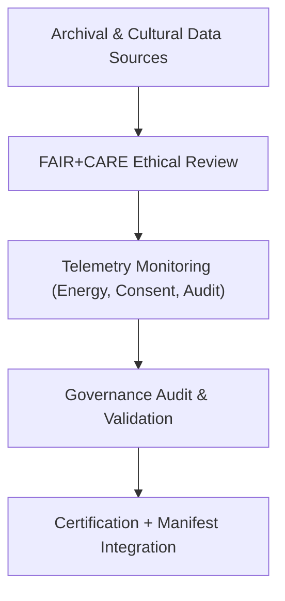

<div align="center">

# ⚖️ **Kansas Frontier Matrix — Historical Methods Governance**  
`docs/analyses/historical/methods/governance.md`

**Purpose:**  
Establish the **ethical, procedural, and sustainability governance framework** for all historical analytical methods in the Kansas Frontier Matrix (KFM).  
This document defines how FAIR+CARE governance principles are operationalized during archival correlation, cultural landscape reconstruction, and population modeling, ensuring transparency, consent, and reproducibility.

[](../../../../../../../docs/standards/markdown_guide.md)
[](../../../../../../../LICENSE)
[](../../../../../../../docs/standards/faircare.md)
[](../../../../../../../releases/v10.2.0/manifest.zip)

</div>

---

## 📘 Overview

The **Historical Methods Governance Protocol** ensures that all methodologies—ranging from archival data processing to cultural analysis—operate within a defined framework of transparency, consent, and environmental responsibility.  
Governance oversight applies across all submodules, datasets, and telemetry-linked processes.

Governance objectives:
- Protect the integrity and ethics of historical data usage.  
- Uphold Indigenous data sovereignty and consent validation.  
- Minimize environmental footprint through telemetry auditing.  
- Guarantee reproducibility through open metadata and FAIR+CARE reporting.  

---

## 🧭 Roles and Responsibilities

| Role | Responsibility | Linked Telemetry |
|------|----------------|------------------|
| FAIR+CARE Governance Council | Oversee compliance, review audits, and certify processes. | `governance-events.log` |
| Historical Data Steward | Maintain archival provenance, metadata completeness, and version control. | `validation-summary.jsonl` |
| Indigenous Data Governance Board (IDGB) | Approve consent-based data inclusion and cultural data anonymization. | `governance-events.log` |
| FAIR+CARE Sustainability Auditor | Verify energy efficiency, emissions logs, and ISO 50001 compliance. | `energy-consumption.csv` |

---

## ⚙️ Governance Workflow



1. Archival datasets undergo FAIR+CARE review for provenance and consent.  
2. Telemetry captures sustainability and ethical governance indicators.  
3. Governance audits validate compliance and issue certification.  
4. Certified results are indexed into the manifest and public registry.  

---

## ⚖️ FAIR+CARE Governance Matrix

| Principle | Implementation | Verification Source |
|------------|----------------|--------------------|
| **Findable** | Historical methods indexed via DCAT 3.0 metadata and persistent IDs. | `manifest_ref` |
| **Accessible** | Open-access metadata licensed under CC-BY 4.0. | FAIR+CARE Ledger |
| **Interoperable** | JSON-LD metadata and standardized archival schemas. | `telemetry_schema` |
| **Reusable** | Complete lineage, checksum, and consent fields documented. | `telemetry_ref` |
| **Collective Benefit** | Data contributes to cultural preservation and education. | Governance Council Review |
| **Authority to Control** | Indigenous communities validate access permissions. | IDGB Consent Records |
| **Responsibility** | Energy usage tracked and audited via ISO telemetry reports. | `energy-consumption.csv` |
| **Ethics** | Sensitive archival materials generalized or access-restricted. | Governance Audit Report |

---

## 🧾 Governance Ledger Record Example

```json
{
  "audit_id": "historical-methods-governance-2025-11-11-001",
  "module": "Archival Correlation and Cultural Landscape Methods",
  "energy_kWh": 0.0039,
  "carbon_gCO2e": 0.0052,
  "governance_status": "Pass",
  "faircare_score": 98.4,
  "consent_verified": true,
  "auditor": "FAIR+CARE Historical Council",
  "timestamp": "2025-11-11T15:00:00Z"
}
```

---

## 🧠 Sustainability and Ethical Standards

| Metric | Target | Verified By | Unit |
|---------|---------|-------------|------|
| Energy Usage | ≤ 1.5 | Sustainability Auditor | kWh |
| Carbon Footprint | ≤ 0.006 | FAIR+CARE Council | gCO₂e |
| FAIR+CARE Compliance | ≥ 95 | Governance Audit | % |
| Indigenous Consent | 100 | IDGB Validation | % |

---

## 🕰️ Version History

| Version | Date | Author | Summary |
|----------|------|--------|----------|
| v10.2.2 | 2025-11-11 | FAIR+CARE Historical Governance Council | Established governance framework for historical methods, integrating FAIR+CARE, ISO sustainability, and IDGB consent management. |

---

<div align="center">

© 2025 Kansas Frontier Matrix · Master Coder Protocol v6.3 · FAIR+CARE Certified  
Diamond⁹ Ω / Crown∞Ω Ultimate Certified  

[Back to Historical Methods](./README.md) · [Governance Charter](../../../../../../../docs/standards/governance/ROOT-GOVERNANCE.md)

</div>

