<div align="center">

# ⚖️ **Kansas Frontier Matrix — Historical Methods Governance**  
`docs/analyses/historical/methods/governance.md`

**Purpose**  
Define the **governance, approval, and risk framework** for all **historical methods** in the Kansas Frontier Matrix (KFM) — including archival correlation, population dynamics, and cultural landscape analysis — so that:

- Methods are **reviewed, versioned, and ethically constrained** before use.  
- Pipelines and Story Nodes **declare which methods they implement**.  
- Historical methods remain **FAIR+CARE-aligned, sovereignty-respecting, and PROV-traceable** across the entire KFM stack.

[](../../../../README.md)  
[](../../../../LICENSE)  
[](../../../standards/faircare.md)  
[](../../../../releases/)

</div>

---

## 📘 Overview

This document governs **how methods themselves** (not just datasets) are:

- Proposed and designed.  
- Reviewed for **ethical, historical, and sovereignty implications**.  
- Linked to **pipelines, datasets, and Story Nodes**.  
- Maintained, versioned, and decommissioned.

It complements:

- `docs/analyses/historical/README.md` – domain overview.  
- `docs/analyses/historical/governance.md` – data & narrative governance.  
- `docs/analyses/historical/methods/README.md` – methods index.  
- `docs/analyses/historical/validation.md` – validation framework.

In short: this file answers **“What does it mean for a historical method to be allowed and in good standing?”**

---

## 🗂️ Directory Layout

Governance for historical methods is embedded in the following structure:

```text
📁 Kansas-Frontier-Matrix/
├── 📁 docs/
│   └── 📁 analyses/
│       └── 📁 historical/
│           ├── 📄 README.md                         # Historical Analyses Overview
│           ├── 📄 governance.md                     # Historical data & narrative governance
│           ├── 📄 validation.md                     # Historical validation & CI rules
│           ├── 📁 methods/
│           │   ├── 📄 README.md                     # Methods index (this directory's entrypoint)
│           │   ├── 📄 governance.md                 # This methods governance guide
│           │   ├── 📄 archival-correlation.md       # Archival correlation methods
│           │   ├── 📄 population-dynamics.md        # Demography & migration methods
│           │   └── 📄 cultural-landscapes.md        # Cultural & environmental landscape methods
│           └── 📁 datasets/
│               └── 🧾 risk-register.json            # Dataset-level risk & governance registry
├── 📁 src/
│   └── 📁 pipelines/
│       └── 📁 historical/
│           ├── 📄 archival_pipeline.py              # Implements archival methods (governed here)
│           ├── 📄 population_pipeline.py            # Implements population methods
│           ├── 📄 landscapes_pipeline.py            # Implements landscape methods
│           └── 📄 config_historical.yml             # Method + dataset selection, parameters
└── 📁 dist/
    └── 📁 historical/
        ├── 🧾 provenance/                           # PROV-O bundles for historical pipelines
        └── 🧾 validation/                           # Validation reports for methods/datasets
```

**Directory-level governance rules:**

- Every method doc under `docs/analyses/historical/methods/` is considered a **governed method spec** (CIDOC E29 / PROV `prov:Plan`).  
- Pipelines in `src/pipelines/historical/` **must** reference one or more governed methods by doc path or `method_id`.  
- Method governance decisions (e.g., “not approved for sovereign data”) **must** be documented here and reflected in:
  - Pipeline configs (`config_historical.yml`).  
  - STAC/DCAT metadata for datasets generated using that method.  
  - Story Node metadata describing narratives built on those methods.

---

## 🧭 Context

Historical methods can introduce risk even when datasets are individually permitted. Examples:

- Aggregating multiple low-risk datasets into a **sensitive inference** about a community.  
- Applying methods that **overstate certainty** or **erase alternative interpretations**.  
- Generating outputs that **reveal patterns** (e.g., persecution, land loss) in ways that communities request be contextualized or constrained.

This governance guide sits **between**:

- **Data governance** (`../governance.md`) — what data is allowed and how it must be generalized.  
- **Validation** (`../validation.md`) — what tests must pass before results are accepted.  

It focuses on:

- **Method approval & lifecycle** – when a method is allowed, experimental, or deprecated.  
- **Sovereignty & ethics for methods** – which methods are barred or restricted for certain datasets.  
- **Mapping methods to provenance** – linking methods to OpenLineage runs, PROV bundles, and catalog metadata.

---

## 🧱 Architecture

### Method Governance Flow

```mermaid
flowchart LR
    A["Method Proposal\n(New or Revised)"]
        --> B["Preliminary Review\nHistorical Team"]
    B --> C{"Risk / Sovereignty Impact?"}
    C -->|High| D["Deep Review\nFAIR+CARE Council · Sovereignty Board"]
    C -->|Low/Moderate| E["Standard Review\nHistorical Governance WG"]
    D --> F["Governance Decision\nApprove · Conditional · Reject"]
    E --> F
    F --> G["Update Method Doc\n& Methods Index"]
    G --> H["Update Pipelines & Configs\nsrc/pipelines/historical/*"]
    H --> I["Update Catalog & PROV\nSTAC/DCAT · PROV-O · OpenLineage"]
```



### Method States

Each historical method must be tagged with one of:

- **`approved`** – may be used in production pipelines and Story Nodes, subject to dataset-level governance.  
- **`approved-conditional`** – may be used only with specified constraints (e.g., “aggregated outputs only”, “no coordinate-level display”).  
- **`experimental`** – allowed in research branches and internal experiments; not surfaced via public Story Nodes without explicit review.  
- **`deprecated`** – not recommended for new analyses; may be present for legacy reasons, but must not underlie new Story Nodes.  
- **`rejected`** – must not be used in any production or public context; kept only for archival reasons if at all.

These states should be recorded:

- In each method doc’s front-matter (`method_status`, if added) or in a shared **method registry** (see next section).  
- In pipeline configs indicating which methods are runnable in which environments (dev / staging / production).

---

## 📦 Data & Metadata

### Method Registry (Conceptual)

In addition to this Markdown guide, KFM may maintain a machine-readable **method registry**, e.g.:

- `docs/analyses/historical/methods/method-registry.json`

Each method entry might include:

- `method_id` – stable identifier, e.g., `hist-archival-correlation-v1`.  
- `doc_path` – e.g., `docs/analyses/historical/methods/archival-correlation.md@v11.2.4`.  
- `status` – `approved`, `approved-conditional`, `experimental`, `deprecated`, or `rejected`.  
- `allowed_risk_tiers` – list of dataset risk tiers for which method is permitted (e.g., `[0,1,2]`).  
- `sovereignty_constraints` – e.g., `"requires-sovereignty-review"`, `"tribal-mou-only"`.  
- `notes` – governance notes and conditions.  
- `approving_body` – e.g., `Historical Governance WG`, `Sovereignty Board`.  
- `decision_timestamp` – ISO8601.

Example:

```json
{
  "method_id": "hist-archival-correlation-v1",
  "doc_path": "docs/analyses/historical/methods/archival-correlation.md@v11.2.4",
  "status": "approved-conditional",
  "allowed_risk_tiers": [0, 1, 2],
  "sovereignty_constraints": "requires-sovereignty-review-for-tier-2",
  "notes": "Can be applied to treaty and land cession datasets only with H3 generalization and donut masking.",
  "approving_body": "Historical Governance WG · Sovereignty Board",
  "decision_timestamp": "2025-12-06T22:30:00Z"
}
```

Pipelines and Story Nodes can query this registry to ensure that their method usage is **legitimate and in-bounds**.

---

## 🌐 STAC, DCAT & PROV Alignment

Methods governance must be visible in catalogs and provenance:

### STAC

Historical STAC Items that implement governed methods should include:

```json
{
  "kfm:method_id": "hist-archival-correlation-v1",
  "kfm:method_doc": "docs/analyses/historical/methods/archival-correlation.md@v11.2.4",
  "kfm:method_status": "approved-conditional"
}
```

These properties:

- Allow users and tools to see **which methods shaped which datasets**.  
- Help Focus Mode explain **how** historical outputs were generated.  
- Provide quick checks to ensure deprecated or rejected methods are not active in current catalogs.

### DCAT

In DCAT:

- `dct:conformsTo` can point to method docs or this governance guide.  
- `dct:provenance` can link to PROV bundles that include the method’s `prov:Plan`.

### PROV-O

In PROV:

- Each governed method is modeled as a `prov:Plan`.  
- Each pipeline run is a `prov:Activity` that:
  - `prov:used` the method plan.  
  - `prov:generated` historical datasets or Story Node bundles.  
- Governance decisions themselves can appear as PROV entities (decision records) and activities (review meetings).

---

## 🧠 Story Node & Focus Mode Integration

Methods governance shapes **how narratives are permitted to use methods**:

- Story Nodes must declare:
  - Which method(s) they rely on (`method_id` or doc path).  
  - Any constraints applied (e.g., spatial generalization, redaction of names).  

- Story Nodes are **not allowed** to:
  - Imply that experimental or rejected methods are authoritative.  
  - Present method-driven inferences as direct archival “facts”.  
  - Ignore conditions like “aggregated-only” or “don’t display certain place-names”.

**Focus Mode**:

- May show short method summaries drawn from this governance doc and method docs.  
- Should highlight:
  - Method status (`approved`, `experimental`, etc.).  
  - Any important caveats (e.g., “method cannot distinguish between multiple interpretations here”).  
- Must not generate **new method claims** or override governance decisions.

Story Node JSON or config should include fields like:

```json
{
  "method_ids": ["hist-archival-correlation-v1", "hist-population-dynamics-v2"],
  "method_governance_ref": "docs/analyses/historical/methods/governance.md@v11.2.4"
}
```

---

## 🧪 Validation & CI/CD

Method governance is enforced via CI alongside historical validation.

### CI Responsibilities

`.github/workflows/historical-validation.yml` (or an adjacent workflow) should:

- Validate that **all method IDs** referenced in:
  - Pipelines (`src/pipelines/historical/*`).  
  - STAC/DCAT metadata (`data/stac/historical/*`).  
  - Story Node bundles (`dist/historical/storynode/*`).  
  correspond to entries in the method registry and/or real docs.

- Check that:
  - `status` of methods is compatible with the target environment (e.g., `experimental` methods not used in production).  
  - `allowed_risk_tiers` intersect correctly with datasets’ `kfm:risk_tier`.  
  - Sovereignty constraints are respected for high-risk datasets.

### CI Gate Examples

- **Block merge** if:
  - A pipeline uses a `method_id` with `status = rejected`.  
  - A Story Node uses a method **not present** in the registry.  
  - A method flagged as `approved-conditional` is used with incompatible risk tiers or without required masking.  

- **Require human approval** (FAIR+CARE or Sovereignty Board) if:
  - New methods are introduced with `status = approved-conditional`.  
  - Existing methods change from `approved` to `experimental` or `deprecated` and still underpin many datasets/Story Nodes.

Validation results and governance warnings related to methods should be written into:

- `dist/historical/validation/validation-<sha>.json` (see validation guide).  
- Telemetry referenced by `telemetry_ref`.

---

## ⚖ FAIR+CARE & Governance

This methods governance document implements FAIR+CARE for **how** historical analyses are done, not just **what** data they use.

- **FAIR**

  - Methods are:
    - **Findable** via this README, the methods index, and catalog links.  
    - **Accessible** under CC-BY for documentation, with clear constraints for code/data usage.  
    - **Interoperable** through use of ontologies and shared metadata vocabularies.  
    - **Reusable** because assumptions, limitations, and governance constraints are explicit.

- **CARE**

  - **Collective Benefit**  
    - Methods should be chosen and tuned to support community-defined goals (education, heritage, resilience), not only technical curiosity.  

  - **Authority to Control**  
    - For methods impacting Indigenous or community-controlled data, reviews by the Sovereignty Board or equivalent are **mandatory** before approval.  

  - **Responsibility**  
    - Method authors and maintainers are responsible for documenting potential harms, biases, and misinterpretations and for proposing mitigations.  

  - **Ethics**  
    - Methods that inherently sensationalize, decontextualize, or erase marginalized perspectives can be **rejected outright**, regardless of technical merit.

If a method cannot be reconciled with FAIR+CARE or sovereignty policies, it must be:

- Marked `rejected` or kept `experimental` and blocked from production.  
- Clearly labeled in its doc, pipeline configs, and method registry entries.

---

## 🕰️ Version History

| Version   | Date       | Author / Steward                              | Summary                                                                                                 |
|----------:|-----------:|-----------------------------------------------|---------------------------------------------------------------------------------------------------------|
| **v11.2.4** | 2025-12-07 | FAIR+CARE Council · Historical Governance WG | Initial Historical Methods Governance guide; aligned with KFM-MDP v11.2.5, Historical Methods README, and Historical Governance; defined method lifecycle, registry structure, STAC/DCAT/PROV mappings, Story Node & Focus Mode constraints, and CI enforcement. |

---

<div align="center">

⚖️ **Kansas Frontier Matrix — Historical Methods Governance**  
Scientific Insight · FAIR+CARE · Sovereignty-Respecting · CI-Enforced  

[📜 Historical Methods Index](./README.md) · [⚖ Historical Governance (Domain)](../governance.md) · [✅ Historical Validation](../validation.md) · [📘 Markdown Protocol v11.2.5](../../../standards/kfm_markdown_protocol_v11.2.5.md)

</div>
