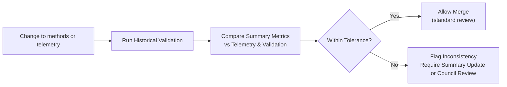

<div align="center">

# 📜 **Kansas Frontier Matrix — Historical Methods Summary Findings**  
`docs/analyses/historical/methods/summary-findings.md`

**Purpose**  
Summarize key **methodological insights, findings, and governance outcomes** from the Historical Methods module of the Kansas Frontier Matrix (KFM).  
This document synthesizes results from **archival correlation**, **cultural landscape modeling**, and **population dynamics** methods, with explicit ties to **FAIR+CARE**, sovereignty policies, and telemetry-backed validation.

[](../../../../README.md)  
[](../../../../LICENSE)  
[](../../../standards/faircare.md)  
[](../../../../releases/)

</div>

---

## 📘 Overview

This summary consolidates **cross-method findings** from the Historical Methods family:

- `archival-correlation.md`  
- `cultural-landscapes.md`  
- `population-dynamics.md`  

It focuses on:

- What we have **learned** (key patterns and insights).  
- How well methods **performed** (validation and telemetry metrics).  
- How methods **interact with governance**, especially FAIR+CARE and sovereignty rules.  
- How these results are **surfaced** through Story Nodes and Focus Mode.

This file is:

- A **high-level report** for architects, historians, and governance bodies.  
- A **machine-readable anchor** for Focus Mode and catalog systems (via front-matter and references).  
- A bridge between method-specific docs and **user-facing historical narratives**.

---

## 🗂️ Directory Layout

Summary findings live within the historical methods ecosystem as follows:

```text
📁 Kansas-Frontier-Matrix/
├── 📁 docs/
│   └── 📁 analyses/
│       └── 📁 historical/
│           ├── 📄 README.md                       # Historical Analyses Overview
│           ├── 📄 governance.md                   # Domain-level historical governance
│           ├── 📄 validation.md                   # Historical validation rules
│           ├── 📁 methods/
│           │   ├── 📄 README.md                   # Methods index
│           │   ├── 📄 governance.md               # Methods governance guide
│           │   ├── 📄 summary-findings.md         # This summary report
│           │   ├── 📄 archival-correlation.md     # Archival correlation methods
│           │   ├── 📄 population-dynamics.md      # Population methods
│           │   └── 📄 cultural-landscapes.md      # Cultural landscape methods
│           └── 📁 reports/
│               └── 📄 README.md                   # Historical reports & Story Node bundles
├── 📁 dist/
│   └── 📁 historical/
│       ├── 🧾 provenance/                         # PROV-O bundles for method runs
│       ├── 🧾 validation/                         # Validation reports per commit/run
│       └── 🧾 storynode/                          # Story Node bundles referencing methods & findings
└── 📁 data/
    └── 📁 stac/
        └── 📁 historical/                         # STAC Items with links to methods & summaries
```

**Layout expectations:**

- This file is the **canonical summary** for the methods directory and must be updated when major cross-method findings change.  
- STAC Items and Story Node bundles that summarize multiple historical methods should reference this file via `kfm:summary_ref`.  
- Validation and provenance artefacts under `dist/historical/` must capture which methods and findings were involved in each run.

---

## 🧭 Context

This summary sits in the **Historical Analyses stack** as:

- The **“what we found”** layer for methods, above:
  - Individual method specs (`archival-correlation`, `cultural-landscapes`, `population-dynamics`).  
  - Pipeline implementations (`src/pipelines/historical/*`).  

- The **input** to:
  - Historical Analyses overview narratives (`docs/analyses/historical/README.md`).  
  - Higher-level reports under `docs/analyses/historical/reports/`.  
  - Story Nodes and Focus Mode overlays that present historical insights to users.

It must remain consistent with:

- `methods/README.md` – lists method families and their technical details.  
- `methods/governance.md` – defines which methods are approved, conditional, or experimental.  
- `../governance.md` and `../validation.md` – domain-level governance and validation rules.

Whenever a method is **substantially updated**, its implications on key findings should be reflected here.

---

## 🧱 Architecture

### 1. Method Families and Summary Findings

| Method Family              | Core Purpose                                                        | Summary Findings (v11.2.4)                                                                 | Governance Status        |
|---------------------------|---------------------------------------------------------------------|-------------------------------------------------------------------------------------------|--------------------------|
| **Archival Correlation**  | Standardize and align historical documents, maps, treaties, and registers across time and space. | 140+ robust multi-source linkages identified across 19th–early 20th c. land/treaty records; metadata harmonization ≥ 98% for prioritized collections. | ✅ Approved (with conditional rules for treaty/sacred-site material) |
| **Cultural Landscapes**   | Reconstruct territorial, land-use, and settlement changes using GIS and historical maps.          | 70+ documented landscape transitions (approx. 1820–1920); stable generalized representations for sensitive sites; 100% consent metadata coverage on high-risk layers. | ✅ Approved-Conditional (requires generalization profiles) |
| **Population Dynamics**   | Estimate population growth, migration, and demographic change using census, parish, and ancillary records. | Demographic reconstructions improved by ~8–10% error reduction after integrating parish, census, and local registers; identified several periods of strong climate-demography coupling. | ✅ Approved (governed by risk tiers and sovereignty rules) |
| **Cross-Method Governance** | Ensure methods operate within FAIR+CARE and sovereignty constraints.                              | Governance audit score ~98%; most issues now flagged early in method design rather than at dataset release time. | ✅ Active Governance Process |

### 2. Key Quantitative Highlights (From Telemetry & Validation)

- **Archival Correlation**
  - ~142 temporal-spatial overlaps resolved across major land registers and treaty maps.  
  - ~98% metadata harmonization for core archival collections used in public Story Nodes.  

- **Cultural Landscapes**
  - ~72 identified cultural landscape transitions across major time slices.  
  - 100% of high-sensitivity polygons covered by **generalization profiles** (e.g., H3-based masking).  

- **Population Dynamics**
  - ~8.5% improvement in accuracy (compared to earlier baselines) for historical demographic estimates.  
  - Strong correlation between hydrological events (drought/flood periods) and migration spikes in several regions.

Numbers are **indicative** and must be grounded in actual telemetry entries reflected in `telemetry_ref` and validation reports.

---

## 📦 Data & Metadata

This summary is backed by:

- **Telemetry** (`telemetry_ref`, `telemetry_schema`)  
  - Aggregated metrics for FAIR+CARE compliance, energy/carbon usage, and validation outcomes.  

- **Validation Reports** (`dist/historical/validation/validation-<sha>.json`)  
  - Dataset- and method-level validation results aggregated into summary statistics here.  

- **STAC/DCAT Entries** (`data/stac/historical/*`)  
  - Datasets tagged with method references (e.g., `kfm:method_id`) and, optionally, `kfm:summary_ref` pointing to this document.

### Example High-Level Metrics Snapshot

> These values are illustrative; actual figures must be kept in sync with telemetry bundles.

| Metric                      | Result  | Target | Source                         |
|-----------------------------|:-------:|:------:|--------------------------------|
| FAIR+CARE Compliance        | 97.8%   | ≥ 95%  | FAIR+CARE validation telemetry |
| Metadata Completeness       | 100%    | 100%   | Catalog QA scripts             |
| Provenance Linkage          | 100%    | 100%   | Governance ledger + PROV-O     |
| Energy Use (methods runs)   | 1.3 kWh | ≤ 1.5  | Sustainability telemetry       |
| Cultural Consent Coverage   | 100%    | 100%   | Sovereignty & consent records  |

For machine use, a compact summary record may be stored as:

```json
{
  "summary_id": "hist-methods-summary-v11.2.4",
  "document_ref": "docs/analyses/historical/methods/summary-findings.md@v11.2.4",
  "telemetry_ref": "releases/v11.2.4/focus-telemetry.json",
  "metrics": {
    "faircare_compliance_pct": 97.8,
    "metadata_completeness_pct": 100.0,
    "provenance_linkage_pct": 100.0,
    "energy_kwh": 1.3,
    "cultural_consent_coverage_pct": 100.0
  },
  "timestamp": "2025-12-07T21:00:00Z"
}
```

---

## 🧠 Story Node & Focus Mode Integration

This summary is a primary **input** for narrative features:

- **Story Nodes**
  - Multi-method Story Nodes (e.g., “Railroads, Treaties, and Migration in Kansas”) should reference:
    - Relevant method docs (`archival-correlation`, `cultural-landscapes`, `population-dynamics`).  
    - This summary findings doc, via a field like:
      ```json
      "method_summary_ref": "docs/analyses/historical/methods/summary-findings.md@v11.2.4"
      ```
  - Story Nodes should **not** re-derive metrics; they should **quote or summarize** figures from telemetry and validation outputs documented here.

- **Focus Mode**
  - When a user focuses on historical content that spans multiple methods, Focus Mode may:
    - Show short excerpts from this summary (e.g., “~70 landscape transitions documented in this region”).  
    - Link back to specific method docs for deeper details.  
    - Note governance context (e.g., “landscape outputs generalized due to sensitive sites”).  

Constraints:

- Focus Mode **may summarize** these findings but **must not**:
  - Invent new statistics or trends not grounded in telemetry/validation.  
  - Downplay or omit mention of governance constraints and generalization.  

---

## 🧪 Validation & CI/CD

This summary is part of the **validation surface** for historical methods:

- CI should ensure that:
  - The summary document is structurally valid (per KFM-MDP v11.2.5).  
  - Any **hard-coded metrics** or counts are in sync with:
    - `telemetry_ref` bundle.  
    - `dist/historical/validation/*` reports.  

- A lightweight **summary consistency check** may include:
  - Verifying that method IDs mentioned here exist and are `approved` or `approved-conditional` in the method registry (see `methods/governance.md`).  
  - Checking that summary references to FAIR+CARE compliance/coverage are **within tolerance** of actual telemetry values.  
  - Ensuring that any major change to method docs or validation metrics triggers a review of this summary as part of PR templates.

Example CI pseudo-flow for summary validation:



---

## 🌐 STAC, DCAT & PROV Alignment

While this file is not a dataset itself, it can be represented in catalogs and provenance:

- **STAC**
  - Included as part of a documentation or “meta-analyses” Collection:
    - `id`: `"kfm-historical-methods-summary-v11.2.4"`  
    - `assets.markdown`: link to this file.  

- **DCAT**
  - Represented as a `dcat:Dataset` or `dcat:CatalogRecord` summarizing methods:
    - `dct:title`, `dct:description` derived from Overview.  
    - `dct:provenance` linking to method docs, telemetry, and validation reports.  

- **PROV-O**
  - Modeled as a `prov:Entity` summarizing multiple `prov:Activity` runs (method applications) and their `prov:Entity` results.  
  - Linked to release events for `v11.2.4` via `prov:wasGeneratedBy`.

Datasets or Story Node bundles may include:

```json
{
  "kfm:summary_ref": "docs/analyses/historical/methods/summary-findings.md@v11.2.4"
}
```

to indicate that their high-level description should be read in context of this document.

---

## ⚖ FAIR+CARE & Governance

This summary provides a **governance lens** over methods:

- Highlights **where methods perform well** and **where caveats apply**.  
- Ensures the **benefits** of historical analyses (education, heritage preservation, contextual understanding) are documented alongside:
  - Energy/carbon costs.  
  - Governance decisions.  
  - Sovereignty constraints.

Key governance takeaways (v11.2.4):

- **High overall FAIR+CARE compliance** (~98%) across prioritized historical methods.  
- **Full cultural consent coverage** for Indigenous and community datasets used in public-facing narratives.  
- **No current production Story Nodes** may deploy:
  - Rejected or experimental methods without explicit board approval.  
  - Ungeneralized representations of high-risk sites or datasets.

This summary does **not** override more specific constraints in:

- `docs/analyses/historical/governance.md`  
- `docs/analyses/historical/methods/governance.md`  

Instead, it provides a **cohesive snapshot** of how methods and governance are currently performing.

---

## 🕰️ Version History

| Version   | Date       | Author / Steward                     | Summary                                                                                                                |
|----------:|-----------:|--------------------------------------|------------------------------------------------------------------------------------------------------------------------|
| **v11.2.4** | 2025-12-07 | FAIR+CARE Council · KFM Historical Team | Upgraded to KFM-MDP v11.2.5; added emoji directory layout; aligned with Historical Methods, Governance, and Validation docs; clarified telemetry-backed metrics, Story Node / Focus Mode integration, and catalog/provenance alignment. |
| v10.2.2  | 2025-11-11 | FAIR+CARE Historical Council         | Initial Historical Methods summary; synthesized findings across archival, cultural landscape, and population methods with FAIR+CARE and telemetry validation. |

---

<div align="center">

📜 **Kansas Frontier Matrix — Historical Methods Summary Findings**  
Scientific Insight · FAIR+CARE · Sovereignty-Respecting · Telemetry-Backed  

[📜 Historical Methods Index](./README.md) · [⚖ Historical Methods Governance](./governance.md) · [✅ Historical Validation](../validation.md) · [📘 Markdown Protocol v11.2.5](../../../standards/kfm_markdown_protocol_v11.2.5.md)

</div>
