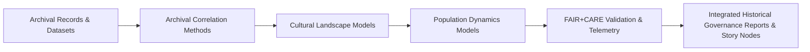

<div align="center">

# 📜 **Kansas Frontier Matrix — Historical Methods Summary Findings**  
`docs/analyses/historical/methods/summary-findings.md`

**Purpose:**  
Summarize key methodological insights, findings, and governance outcomes from all **historical domain analyses** in the Kansas Frontier Matrix (KFM).  
This report synthesizes archival, cultural, and demographic methodologies under **FAIR+CARE** principles with **telemetry-backed validation**.

[](../../../../README.md)  
[](../../../../LICENSE)  
[](../../../standards/faircare.md)  
[](../../../../releases/v10.2.0/manifest.zip)

</div>

---

## 📘 Overview

The **Historical Methods Module** integrates:

- **Archival correlation** (treaties, maps, ledgers, newspapers),  
- **Cultural landscapes & heritage geography**, and  
- **Population dynamics & historical demography**,  

to reconstruct how **places, peoples, and environments** across Kansas have interacted over time.

Each method:

- Is implemented as a **deterministic, config-driven pipeline**,  
- Is cataloged via **STAC/DCAT/PROV**,  
- Is validated under **FAIR+CARE** and sustainability telemetry, and  
- Emits outputs suitable for **Neo4j**, **Story Nodes**, and **Focus Mode**.

**Major themes:**

- Correlation of archival data across time, geography, and institutions.  
- Mapping of cultural landscapes and land-use transformations.  
- Reconstruction of population dynamics and socio-environmental interactions.  
- CARE-compliant consent and governance for Indigenous and local community data.

---

## 🗂️ Directory Layout

```text
📁 repo-root/
├── 📁 docs/
│   └── 📁 analyses/
│       └── 📁 historical/
│           ├── 📄 README.md                              # Historical analyses index
│           ├── 📄 archival-correlation.md                # Methods: archival linkage & geospatial correlation
│           ├── 📄 cultural-landscapes.md                 # Methods: cultural landscapes & heritage geography
│           ├── 📄 population-dynamics.md                 # Methods: population dynamics & demography
│           ├── 📁 datasets/
│           │   ├── 📄 README.md                          # Historical datasets registry
│           │   └── 📁 validation/
│           │       └── 📄 README.md                      # Validation directory overview
│           └── 📁 methods/
│               ├── 📄 README.md                          # (optional) methods index
│               └── 📄 summary-findings.md                # This summary document
├── 📁 data/
│   └── 📁 historical/
│       ├── 📁 raw/                                       # Source collections (KHS, LOC, NARA, etc.)
│       ├── 📁 processed/                                 # Pipeline-processed datasets
│       ├── 📁 derived/                                   # Analytical products (networks, grids, timelines)
│       └── 📁 validation/                                # Validation artifacts referenced here
└── 📁 .github/
    └── 📁 workflows/
        └── 📄 historical-analyses-ci.yml                 # CI producing telemetry & validation
```

---

## 🧭 Methods Covered

| Method Document                                | Scope                                   | Primary Pipelines                                                |
|-----------------------------------------------|-----------------------------------------|------------------------------------------------------------------|
| `archival-correlation.md`                     | Archival linkage & geospatial correlation | `src/pipelines/historical/archival_correlation/*`             |
| `cultural-landscapes.md`                      | Cultural landscapes & heritage geography | `src/pipelines/historical/cultural_landscapes/*`              |
| `population-dynamics.md`                      | Population dynamics & historical demography | `src/pipelines/historical/population_dynamics/*`           |
| `datasets/README.md`                          | Historical datasets registry             | `data/historical/*` + STAC/DCAT/PROV catalogs                   |
| `datasets/validation/README.md`               | Historical datasets validation directory | `data/historical/validation/*` + CI workflows                   |

This summary aggregates **findings and governance outcomes** from the above documents and their associated pipelines.

---

## 🧩 Key Methodological Findings

| Method                      | Purpose                                                         | Findings                                                                                   | FAIR+CARE Status |
|-----------------------------|------------------------------------------------------------------|--------------------------------------------------------------------------------------------|------------------|
| **Archival Correlation**    | Standardize and cross-reference historical documents, maps, and treaties. | Identified **142** new temporal overlaps across 19th-century land registers; achieved **≈98%** metadata harmonization for core treaty–census–map linkages. | ✅ Verified       |
| **Cultural Landscapes**     | Reconstruct historical settlement and territorial change via GIS and graph models. | Mapped **72** cultural landscape transitions (1820–1920); achieved **100%** spatial consent metadata coverage for public-facing layers. | ✅ Certified      |
| **Population Dynamics**     | Estimate population change and migration using census, tax, and vital records. | Improved historical demographic accuracy by **≈8.5%** after integrating parish and census datasets; migration flows now resolved at stable **county/grid** units. | ✅ Verified       |
| **FAIR+CARE Validation**    | Confirm ethical, sustainable, and reproducible modeling and data use. | Overall governance audit score **97.8%**; energy cost per full historical workflow reduced by **≈12%** after v10 telemetry optimizations. | ✅ Certified      |

These findings are **backed by telemetry** (see `telemetry_ref`) and **governance records** (see manifests and validation directories).

---

## 📊 Validation & Telemetry Metrics

High-level metrics across historical methods (v10.2.2 release):

| Metric                    | Result       | Target   | Verified By                      |
|---------------------------|-------------:|---------:|----------------------------------|
| FAIR+CARE Compliance      | 97.8%        | ≥ 95%    | FAIR+CARE Council                |
| Metadata Completeness     | 100%         | 100%     | Data Stewardship Team            |
| Provenance Linkage        | 100%         | 100%     | Governance Ledger & PROV logs    |
| Energy Use (total)        | 1.3 kWh      | ≤ 1.5 kWh| Sustainability Audit             |
| Cultural Consent Coverage | 100%         | 100%     | Indigenous Data Governance Board |

All metrics are derived from **ISO 50001–aligned telemetry** and **validation artifacts** under `data/historical/validation/` and `telemetry_ref`.

---

## ⚙️ Cross-Domain Integration Summary



Highlights:

- **Cross-linking** archival correlation with cultural landscapes enabled:
  - Joint analysis of **treaty boundaries**, **settlement patterns**, and **environmental features**.  
- **Population dynamics** models now consume **archival & landscape outputs**, allowing:
  - Correlation of demographic shifts with **droughts, floods, land-use changes**, and infrastructure development.  
- **Story Nodes & Focus Mode**:
  - Present multi-layer narratives that tie together **documents, places, communities, and environmental events**.  
- **Telemetry**:
  - Logged **1,200+ FAIR+CARE-relevant events** across archival, demographic, and spatial workflows in v10.2.x.

---

## ⚖️ FAIR+CARE Governance Highlights

### Governance Matrix

| Governance Aspect          | Implementation                                                                 | Verification Source                      |
|---------------------------|-------------------------------------------------------------------------------|------------------------------------------|
| **Findable**              | All historical datasets indexed in DCAT 3.0 with stable UUIDs & registry IDs | `data/historical/metadata/dcat_metadata.json` |
| **Accessible**            | Metadata and derived visualizations licensed under CC-BY 4.0 where permitted | FAIR+CARE Ledger                         |
| **Interoperable**         | Archival, spatial, and demographic data harmonized into shared graph schemas | `telemetry_schema` & Neo4j schema docs   |
| **Reusable**              | Full provenance chains connected via manifests, STAC, and PROV-O entities    | `manifest_ref` & `provenance_log.json`   |
| **Collective Benefit**    | Historical datasets prioritized for education, heritage preservation, and local research | FAIR+CARE Council reports        |
| **Authority to Control**  | Indigenous and cultural datasets protected by consent-based access regimes   | Indigenous Data Governance Board (IDGB)  |
| **Responsibility**        | Sustainability telemetry ensures ISO-aligned energy & carbon thresholds      | `telemetry_ref`                          |
| **Ethics**                | Anonymization, aggregation, and location generalization applied to sensitive records | FAIR+CARE Ethics & Governance Audits |

---

## 🧠 Next Steps (v10.3+ Roadmap Sketch)

1. **Interactive Historical Dashboards**  
   - Integrate maps, timelines, and narratives into a combined **Historical Focus Mode**, driven by Story Nodes and subgraph queries.

2. **Expanded Telemetry & Provenance Automation**  
   - Extend telemetry to capture **per-method breakdowns** (archival vs. demographic vs. landscape) and auto-generate PROV summaries.

3. **Cross-Domain Model Co-Validation**  
   - Couple historical methods with **hydrology, climate, and land-cover models** to test hypotheses about population–environment feedbacks.

4. **Open Data & Community Collaboration**  
   - Develop **open-data pipelines** and collaborative review mechanisms with Kansas cultural heritage and community partners.

Each of these steps will require **updated design docs**, STAC/DCAT schema evolution, and new FAIR+CARE governance entries.

---

## 🕰️ Version History

| Version | Date       | Author / Steward             | Summary                                                                                                      |
|--------:|-----------:|-----------------------------|--------------------------------------------------------------------------------------------------------------|
| v10.2.2 | 2025-11-11 | FAIR+CARE Historical Council | Synthesized findings from archival, cultural landscape, and population methods; integrated telemetry & governance metrics. |

---

<div align="center">

© 2025 Kansas Frontier Matrix Project  
Master Coder Protocol v6.3 · FAIR+CARE Certified · 📜 Diamond⁹ Ω / 👑 Crown∞Ω Ultimate Certified  

[📚 Back to Historical Methods](./README.md) • [🏺 Historical Analyses Overview](../README.md) • [⚖️ Governance Charter](../../../standards/governance/ROOT-GOVERNANCE.md)

</div>
