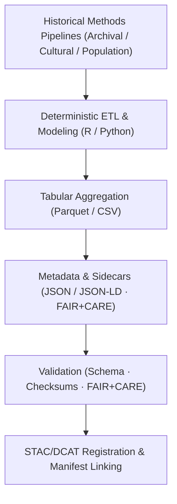

<div align="center">

# 📊 **Kansas Frontier Matrix — Historical Methods: Tables**  
`docs/analyses/historical/methods/tables/README.md`

**Purpose:**  
Document the **tabular datasets and outputs** derived from historical analytical methods within the Kansas Frontier Matrix (KFM).  
These tables summarize archival correlations, cultural landscape metrics, population reconstructions, and sustainability telemetry, each governed under **FAIR+CARE** and **Master Coder Protocol v6.3**.

[](../../../../../README.md)  
[](../../../../../LICENSE)  
[](../../../../../standards/faircare.md)  
[](../../../../../releases/v10.2.0/manifest.zip)

</div>

---

## 📘 Overview

This directory describes the **canonical tables** produced by KFM’s historical methods:

- **Archival Correlation**  
  Cross-references treaties, maps, ledgers, and newspapers.
- **Cultural Landscapes & Heritage Geography**  
  Encodes landscape transitions and cultural indices.
- **Population Dynamics & Demography**  
  Summarizes population change, migration, and key indicators.
- **Energy & Sustainability Telemetry**  
  Captures energy, carbon, and FAIR+CARE metrics for historical workflows.

Tables are:

- Produced by **deterministic, config-driven pipelines**,  
- Stored under `data/historical/**` with **STAC/DCAT/PROV** registration, and  
- Governed under **FAIR+CARE**, with explicit sensitivity and reuse metadata.

This document is a **human-readable index**; machine-readable metadata lives alongside the tables as JSON/JSON-LD sidecars.

---

## 🗂️ Directory Layout

```text
📁 repo-root/
├── 📁 docs/
│   └── 📁 analyses/
│       └── 📁 historical/
│           └── 📁 methods/
│               ├── 📄 README.md                  # (optional) historical methods index
│               ├── 📄 summary-findings.md        # Methods summary (findings & metrics)
│               └── 📁 tables/
│                   └── 📄 README.md              # This document
├── 📁 data/
│   └── 📁 historical/
│       ├── 📁 derived/
│       │   └── 📁 tables/
│       │       ├── 📄 archival-correlation-table.parquet
│       │       ├── 📄 cultural-landscape-indices.parquet
│       │       ├── 📄 population-dynamics-summary.parquet
│       │       └── 📄 energy-sustainability-log.parquet
│       └── 📁 metadata/
│           └── 📁 tables/
│               ├── 📄 archival-correlation-table.metadata.json
│               ├── 📄 cultural-landscape-indices.metadata.json
│               ├── 📄 population-dynamics-summary.metadata.json
│               └── 📄 energy-sustainability-log.metadata.json
└── 📁 data/
    └── 📁 stac/
        └── 📁 historical/
            └── 📁 methods/
                └── 📁 tables/
                    └── 📄 catalog.json           # STAC catalog for table assets
```

- **Docs entrypoint:** this file (narrative & table descriptions)  
- **Tables (canonical storage):** `data/historical/derived/tables/`  
- **Table metadata & FAIR+CARE:** `data/historical/metadata/tables/`  
- **STAC/DCAT exposure:** `data/stac/historical/methods/tables/catalog.json` + global DCAT catalog

---

## 📦 Core Historical Tables

### 🧾 Table Catalog

| File (logical)                         | Description                                                              | Typical Physical Format         | Primary Source Methods                      |
|---------------------------------------|--------------------------------------------------------------------------|---------------------------------|---------------------------------------------|
| `archival-correlation-table`          | Harmonized archival record table with treaty–map–document linkages       | Parquet / CSV                   | Archival Correlation                        |
| `cultural-landscape-indices`          | Indices of cultural/land-use transitions (e.g., 1820–1920)               | Parquet / CSV                   | Cultural Landscapes & Heritage Geography    |
| `population-dynamics-summary`         | Population model results by year/region (growth, migration, key metrics) | Parquet / CSV                   | Population Dynamics & Demography            |
| `energy-sustainability-log`           | Energy, carbon, and telemetry metrics for historical workflows           | Parquet / CSV                   | Telemetry & Sustainability Pipelines        |

> **Note:** Logical names above are mapped to versioned filenames, e.g.  
> `archival-correlation-table_v10.2.2.parquet`, tracked via STAC/DCAT and manifests.

---

## 🧾 Table Descriptions

### 1️⃣ `archival-correlation-table`

- **Purpose:**  
  Provide a **row-wise view** of correlated archival entities (treaties, maps, census entries, newspapers) with spatial and temporal keys.

- **Example columns:**

| Column                   | Type      | Description                                               |
|--------------------------|-----------|-----------------------------------------------------------|
| `correlation_id`         | string    | Stable ID for correlated record cluster                   |
| `archive_source`         | string    | KHS / LOC / NARA / BIA / Chronicling America / other     |
| `document_id`           | string    | Source document identifier                                |
| `place_id`              | string    | Linked place / location ID (Neo4j / CIDOC / STAC)        |
| `datetime`              | datetime  | Normalized temporal anchor                                |
| `correlation_confidence`| float     | Confidence score (0–1) for linkage                        |
| `story_node_refs`      | string[]  | IDs for Story Nodes using this correlation                |

- **Backed by:** `archival-correlation.md` methods & pipelines.

---

### 2️⃣ `cultural-landscape-indices`

- **Purpose:**  
  Quantify **cultural and land-use transitions** across Kansas over time (e.g., settlement intensity, landscape change, cultural presence indices).

- **Example columns:**

| Column            | Type      | Description                                               |
|-------------------|-----------|-----------------------------------------------------------|
| `landscape_cell_id` | string  | Grid or region ID (e.g., 1km grid, county)               |
| `year`            | int       | Year or representative epoch                             |
| `index_value`     | float     | Composite landscape index (0–1 or scaled)                |
| `index_kind`      | string    | E.g., `cultural_presence`, `landuse_transition`          |
| `confidence_score`| float     | Model confidence                                         |

- **Backed by:** `cultural-landscapes.md` methods & pipelines.

---

### 3️⃣ `population-dynamics-summary`

- **Purpose:**  
  Consolidate **population metrics** by region and time, including growth, density, and migration-derived indicators.

- **Example columns:**

| Column             | Type      | Description                                             |
|--------------------|-----------|---------------------------------------------------------|
| `geo_unit_id`      | string    | Region (county, tract, grid)                            |
| `year`             | int       | Census or modeled year                                  |
| `population`       | int       | Modeled or observed population                          |
| `net_change`       | int       | Change vs previous period                               |
| `growth_rate`      | float     | Growth rate (per period)                               |
| `migration_balance`| float     | Net migration index                                    |

- **Backed by:** `population-dynamics.md` methods & pipelines.

---

### 4️⃣ `energy-sustainability-log`

- **Purpose:**  
  Track **energy and carbon costs** of historical workflows (ETL, modeling, validation).

- **Example columns:**

| Column           | Type      | Description                                               |
|------------------|-----------|-----------------------------------------------------------|
| `run_id`         | string    | Unique workflow run identifier                            |
| `component`      | string    | `archival_correlation` / `cultural_landscapes` / `population_dynamics` |
| `energy_joules`  | float     | Energy consumed (J)                                      |
| `carbon_gCO2e`   | float     | Carbon emissions (gCO₂e)                                 |
| `records_processed` | int    | Number of records/entities processed                     |
| `timestamp`      | datetime  | Run completion time                                      |

- **Backed by:** telemetry & sustainability pipelines (`telemetry_ref`).

---

## ⚙️ Workflow for Table Generation



Key properties:

- **Config-driven:** all aggregations defined in pipeline `config.yml` (grouping keys, indicators, temporal windows).  
- **Re-runnable:** table outputs can be regenerated by re-running the same pipeline with the same config + data versions.  
- **Registered:** final tables are referenced in STAC/DCAT and in release `manifest_ref`.

---

## ⚖ FAIR+CARE Governance Matrix

| Principle              | Implementation                                                         | Verification Source         |
|------------------------|-------------------------------------------------------------------------|-----------------------------|
| **Findable**           | Tables indexed in STAC/DCAT with persistent UUIDs & `dataset_id`       | `manifest_ref`              |
| **Accessible**         | Open-access Parquet/CSV under CC-BY 4.0 (subject to sensitivity rules) | FAIR+CARE Ledger            |
| **Interoperable**      | CSV/Parquet with JSON-LD sidecars and shared schema fields             | `telemetry_schema`          |
| **Reusable**           | Provenance, versioning, checksums and FAIR+CARE scores stored in sidecars | `data/historical/metadata/tables/*` |
| **Collective Benefit** | Tables support historical education, heritage work, and public research | FAIR+CARE Audit             |
| **Authority to Control** | Indigenous-linked rows flagged & governed by consent-based rules     | IDGB / FAIR+CARE records    |
| **Responsibility**     | Sustainability metrics logged per workflow and per table                | `telemetry_ref`             |
| **Ethics**             | Sensitive cultural identifiers generalized or anonymized                | Governance & validation logs|

---

## 🧮 Example Metadata Block (Sidecar)

```json
{
  "dataset_id": "historic-landuse-index-2025-001",
  "logical_name": "cultural-landscape-indices",
  "source_archives": ["Kansas Historical Society", "Library of Congress"],
  "created_by": "FAIR+CARE Historical Methods Council",
  "license": "CC-BY-4.0",
  "columns": ["landscape_cell_id", "year", "index_value", "index_kind", "confidence_score"],
  "telemetry_id": "hist-methods-tables-telemetry-011",
  "faircare_compliance": 98.7,
  "energy_joules": 14.1,
  "carbon_gCO2e": 0.0056,
  "validation_status": "PASS",
  "timestamp": "2025-11-11T14:30:00Z"
}
```

This metadata lives under `data/historical/metadata/tables/` and is referenced from STAC/DCAT collections and PROV records.

---

## 🕰️ Version History

| Version | Date       | Author / Steward                    | Summary                                                                                               |
|--------:|-----------:|-------------------------------------|-------------------------------------------------------------------------------------------------------|
| v10.2.2 | 2025-11-11 | FAIR+CARE Historical Methods Council | Established historical methods tables registry with FAIR+CARE schema alignment and telemetry integration. |

---

<div align="center">

© 2025 Kansas Frontier Matrix Project  
Master Coder Protocol v6.3 · FAIR+CARE Certified · 📊 Diamond⁹ Ω / 👑 Crown∞Ω Ultimate Certified  

[📚 Back to Historical Methods](../README.md) • [📜 Methods Summary Findings](../summary-findings.md) • [⚖️ Governance Charter](../../../../../standards/governance/ROOT-GOVERNANCE.md)

</div>
