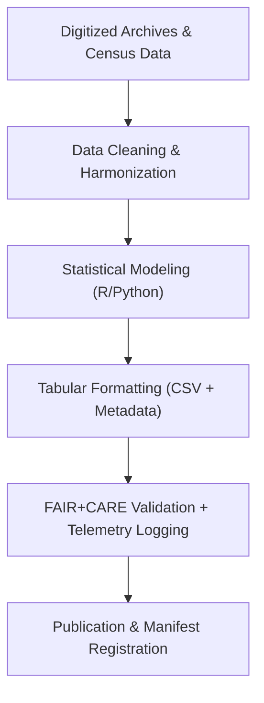

<div align="center">

# 📊 **Kansas Frontier Matrix — Historical Methods: Tables**  
`docs/analyses/historical/methods/tables/README.md`

**Purpose:**  
Provide documentation for **tabular datasets and outputs** derived from historical analytical methods within the Kansas Frontier Matrix (KFM).  
These tables summarize metadata, archival correlations, cultural landscape metrics, and population reconstructions, validated under FAIR+CARE governance and Master Coder Protocol v6.3 standards.

[](../../../../../../../docs/standards/markdown_guide.md)
[](../../../../../../../LICENSE)
[](../../../../../../../docs/standards/faircare.md)
[](../../../../../../../releases/v10.2.0/manifest.zip)

</div>

---

## 📘 Overview

This directory contains tabular files produced from historical analysis methods such as archival correlation, cultural landscape mapping, and demographic modeling.  
Each table provides harmonized historical data in machine-readable format with telemetry-linked provenance and FAIR+CARE validation metadata.

---

## 🗂️ Directory Layout

```bash
tables/
 ├── README.md
 ├── archival-correlation-table.csv         # Harmonized archival record table with metadata
 ├── cultural-landscape-indices.csv         # Landscape change indices (1820–1920)
 ├── population-dynamics-summary.csv        # Population model results by census year
 └── energy-sustainability-log.csv          # Energy, carbon, and telemetry metrics for workflows
```

Each table includes:
- Column descriptions  
- Dataset lineage references  
- FAIR+CARE metadata in JSON-LD sidecars  
- Checksums and timestamps for reproducibility  

---

## 🧾 Table Descriptions

| File | Description | Format | Validation |
|------|--------------|---------|-------------|
| `archival-correlation-table.csv` | Correlation of digitized archives, treaties, and manuscripts by date and region. | CSV | FAIR Schema v3 |
| `cultural-landscape-indices.csv` | Quantitative index of cultural and land-use transitions across Kansas. | CSV | FAIR+CARE Validator |
| `population-dynamics-summary.csv` | Summary of modeled population growth and migration patterns (1850–1950). | CSV | FAIR+CARE Validator |
| `energy-sustainability-log.csv` | Energy and carbon footprint of historical data digitization workflows. | CSV | ISO 50001 Audit |

---

## ⚙️ Workflow for Table Generation



Each processing step logs metadata (creation time, hash, FAIR+CARE compliance score) and energy usage into telemetry logs for sustainability auditing.

---

## ⚖️ FAIR+CARE Governance Matrix

| Principle | Implementation | Verification Source |
|------------|----------------|--------------------|
| **Findable** | Each table indexed in the STAC/DCAT metadata registry with persistent UUID. | `manifest_ref` |
| **Accessible** | Open-access CSV files under CC-BY 4.0 license. | FAIR+CARE Ledger |
| **Interoperable** | CSV and JSON-LD metadata with standardized schema fields. | `telemetry_schema` |
| **Reusable** | Includes provenance, versioning, and checksum validation. | FAIR+CARE Validator |
| **Collective Benefit** | Supports historical education and cultural heritage studies. | FAIR+CARE Audit |
| **Authority to Control** | Indigenous data access governed by consent-based metadata. | IDGB Council |
| **Responsibility** | Tracks sustainability metrics for archival digitization. | ISO 50001 Telemetry |
| **Ethics** | Sensitive cultural identifiers anonymized in tabular datasets. | Governance Logs |

---

## 🧮 Example Metadata Block

```json
{
  "dataset_id": "historic-landuse-index-2025-001",
  "source_archive": ["Kansas Historical Society", "Library of Congress"],
  "created_by": "FAIR+CARE Historical Methods Council",
  "license": "CC-BY-4.0",
  "columns": ["Region", "Year", "Index_Value", "Confidence_Score"],
  "telemetry_id": "hist-methods-tables-telemetry-011",
  "faircare_compliance": 98.7,
  "energy_kWh": 0.0041,
  "timestamp": "2025-11-11T14:30:00Z"
}
```

---

## 🕰️ Version History

| Version | Date | Author | Summary |
|----------|------|--------|----------|
| v10.2.2 | 2025-11-11 | FAIR+CARE Historical Methods Council | Created historical methods tables documentation with FAIR+CARE schema alignment and sustainability telemetry integration. |

---

<div align="center">

© 2025 Kansas Frontier Matrix · Master Coder Protocol v6.3 · FAIR+CARE Certified  
Diamond⁹ Ω / Crown∞Ω Ultimate Certified  

[Back to Historical Methods](../README.md) · [Governance Charter](../../../../../../../docs/standards/governance/ROOT-GOVERNANCE.md)

</div>

