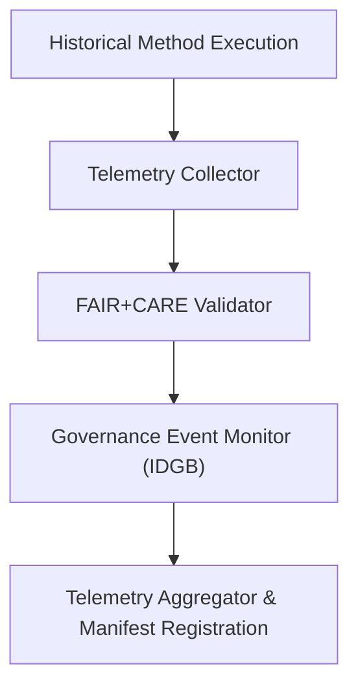

<div align="center">

# 📡 **Kansas Frontier Matrix — Historical Methods: Telemetry Logs**  
`docs/analyses/historical/methods/telemetry-logs/README.md`

**Purpose:**  
Archive and explain the **telemetry and audit logs** generated during execution of Historical Methods workflows within the Kansas Frontier Matrix (KFM).  
These logs document sustainability metrics, ethical governance actions, and FAIR+CARE validation events for reproducibility, accountability, and transparency.

[](../../../../../../../docs/standards/markdown_guide.md)
[](../../../../../../../LICENSE)
[](../../../../../../../docs/standards/faircare.md)
[](../../../../../../../releases/v10.2.0/manifest.zip)

</div>

---

## 📘 Overview

This directory contains telemetry logs linked to Historical Methods workflows such as archival correlation, demographic reconstruction, and landscape mapping.  
Each log provides granular runtime and governance data, including energy use, cultural consent triggers, and FAIR+CARE audit results.  
Telemetry records are automatically collected and referenced in the release manifest for traceability.

---

## 🗂️ Directory Layout

```bash
telemetry-logs/
 ├── README.md
 ├── execution-log.json             # Detailed record of workflow executions
 ├── energy-consumption.csv         # Energy and carbon metrics per job
 ├── governance-events.log          # FAIR+CARE and IDGB governance event triggers
 └── validation-summary.jsonl       # FAIR+CARE audit validation logs (JSON Lines)
```

Each log is validated under the telemetry schema (`analyses-historical-methods-telemetry-v3.json`) and indexed in `focus-telemetry.json`.

---

## 🧾 Log Descriptions

| File | Description | Format | Validation |
|------|--------------|---------|-------------|
| `execution-log.json` | Captures start, end, runtime, and status of all methods. | JSON | FAIR+CARE Schema Validation |
| `energy-consumption.csv` | Logs energy draw (kWh), compute resources, and CO₂ equivalent. | CSV | ISO 50001 Audit |
| `governance-events.log` | Records cultural consent actions, ethical flags, and Indigenous data approvals. | LOG | Governance-as-Code Validation |
| `validation-summary.jsonl` | Audit summaries of FAIR+CARE, provenance, and sustainability checks. | JSONL | Continuous Integration Pipeline |

---

## ⚙️ Telemetry Collection Workflow



1. Each historical method emits telemetry during execution.  
2. The collector aggregates sustainability, runtime, and ethical compliance data.  
3. Governance monitor logs all consent and IDGB validation events.  
4. Aggregated telemetry is validated, indexed, and published in the manifest.

---

## ⚖️ FAIR+CARE Governance Matrix

| Principle | Implementation | Verification Source |
|------------|----------------|--------------------|
| **Findable** | Telemetry files registered with UUIDs in release manifest. | `manifest_ref` |
| **Accessible** | Published under CC-BY 4.0 for public FAIR+CARE access. | FAIR+CARE Ledger |
| **Interoperable** | Standard JSON, CSV, and LOG formats under schema v3. | `telemetry_schema` |
| **Reusable** | Reproducible metadata and timestamps embedded in logs. | `telemetry_ref` |
| **Collective Benefit** | Ensures sustainable and ethical research documentation. | FAIR+CARE Audit |
| **Authority to Control** | Tracks IDGB validation and consent events. | Governance Logs |
| **Responsibility** | Energy and audit telemetry tracked via ISO 50001. | `energy-consumption.csv` |
| **Ethics** | Sensitive historical workflows audited and flagged by governance. | IDGB Reports |

---

## 🧠 Example Telemetry Record

```json
{
  "telemetry_id": "hist-methods-telemetry-2025-11-11-001",
  "workflow": "archival_correlation",
  "duration_seconds": 412,
  "energy_kWh": 0.0042,
  "carbon_gCO2e": 0.0061,
  "governance_events": 2,
  "consent_verified": true,
  "faircare_status": "Pass",
  "auditor": "FAIR+CARE Historical Council",
  "timestamp": "2025-11-11T14:45:00Z"
}
```

---

## 🕰️ Version History

| Version | Date | Author | Summary |
|----------|------|--------|----------|
| v10.2.2 | 2025-11-11 | FAIR+CARE Historical Council | Created Historical Methods Telemetry Logs README with FAIR+CARE schema validation, ISO sustainability, and governance integration. |

---

<div align="center">

© 2025 Kansas Frontier Matrix · Master Coder Protocol v6.3 · FAIR+CARE Certified  
Diamond⁹ Ω / Crown∞Ω Ultimate Certified  

[Back to Historical Methods](../README.md) · [Governance Charter](../../../../../../../docs/standards/governance/ROOT-GOVERNANCE.md)

</div>

