<div align="center">

# 📡 **Kansas Frontier Matrix — Historical Methods: Telemetry Logs**  
`docs/analyses/historical/methods/telemetry-logs/README.md`

**Purpose**  
Archive and explain the **telemetry and audit logs** generated during execution of Historical Methods workflows in the Kansas Frontier Matrix (KFM).  
These logs document **sustainability metrics, governance events, FAIR+CARE validation, and sovereignty-aware actions** to support reproducibility, accountability, and transparent operations across archival, demographic, and cultural landscape analyses.

[](../../../../../README.md)  
[](../../../../../LICENSE)  
[](../../../../standards/faircare.md)  
[](../../../../../releases/)

</div>

---

## 📘 Overview

This directory contains **telemetry logs** linked to Historical Methods workflows such as:

- Archival correlation (treaties, deeds, registers).  
- Population reconstruction and demographic modeling.  
- Cultural landscape and territorial change mapping.  

Telemetry logs capture:

- **Runtime + operational metrics** (duration, success/failure states).  
- **Sustainability metrics** (energy usage, CO₂-equivalent estimates).  
- **FAIR+CARE events** (validation passes/fails, warnings).  
- **Sovereignty and governance events** (consent checks, masking actions, board approvals).

All telemetry records are:

- Structured according to `telemetry_schema`.  
- Referenced from the release manifest (`manifest_ref`) and global telemetry bundle (`telemetry_ref`).  
- Treated as **first-class provenance artefacts** feeding into STAC/DCAT catalogs and the PROV/OpenLineage lineage stack.

---

## 🗂️ Directory Layout

Telemetry logs for Historical Methods are organized as:

```text
📁 Kansas-Frontier-Matrix/
├── 📁 docs/
│   └── 📁 analyses/
│       └── 📁 historical/
│           └── 📁 methods/
│               └── 📁 telemetry-logs/
│                   ├── 📄 README.md                 # This telemetry guide
│                   ├── 🧾 execution-log.json        # Detailed workflow execution records
│                   ├── 🧾 energy-consumption.csv    # Energy & carbon metrics per job
│                   ├── 🧾 governance-events.log     # FAIR+CARE & sovereignty event log
│                   └── 🧾 validation-summary.jsonl  # JSONL FAIR+CARE / validation summaries
├── 📁 dist/
│   └── 📁 historical/
│       └── 🧾 validation/                           # Validation reports referencing telemetry
└── 📁 releases/
    └── 📁 v11.2.4/
        ├── 🧾 manifest.zip                          # Includes references to historical telemetry
        └── 🧾 focus-telemetry.json                  # Aggregated telemetry bundle
```

**Layout rules (normative):**

- `execution-log.json`, `energy-consumption.csv`, `governance-events.log`, and `validation-summary.jsonl` **must** conform to `telemetry_schema`.  
- Telemetry paths listed in `manifest_ref` and `telemetry_ref` **must** resolve to actual files for each release.  
- Any new telemetry artifact for Historical Methods must be:
  - Described here or in a dedicated sub-README.  
  - Registered in the release manifest and validated in CI.

---

## 🧭 Context

Telemetry logs provide an **operational lens** on Historical Methods:

- They connect method specs in:
  - `docs/analyses/historical/methods/README.md`  
  - `docs/analyses/historical/methods/archival-correlation.md`  
  - `docs/analyses/historical/methods/cultural-landscapes.md`  
  - `docs/analyses/historical/methods/population-dynamics.md`  

to:

- **CI and runtime reality** — how often methods run, how costly they are, and how often they trigger governance events.  
- **Validation and governance docs**:
  - `docs/analyses/historical/validation.md`  
  - `docs/analyses/historical/governance.md`  
  - `docs/analyses/historical/methods/governance.md`  

Telemetry logs also support:

- **Sustainability tracking** (ISO 50001-aligned energy/carbon metrics).  
- **Meta-FAIR+CARE analyses** (e.g., how often consent checks run, how many workflows are blocked for governance reasons).  
- **Focus Mode indicators** (e.g., “validated and energy-audited” badges on Story Nodes).

---

## 🧱 Architecture

### Telemetry Collection Workflow

```mermaid
flowchart TD
    A["Historical Method Execution"] --> B["Telemetry Collector"]
    B --> C["FAIR+CARE Validator"]
    C --> D["Governance Event Monitor\n(IDGB / Sovereignty Board Hooks)"]
    D --> E["Telemetry Aggregator\n& Manifest Registration"]
    E --> F["Releases & Catalogs\nSTAC · DCAT · PROV/OpenLineage"]
```



High-level flow:

1. **Historical method execution**  
   - Pipelines in `src/pipelines/historical/*` emit structured telemetry events.

2. **Telemetry collector**  
   - Gathers runtime, energy/carbon, and basic method-identification fields.

3. **FAIR+CARE validator**  
   - Adds audit results (pass/warn/fail), including per-event risk and governance flags.

4. **Governance event monitor**  
   - Records consent checks, sovereignty-related decisions, and masking/generalization actions.

5. **Telemetry aggregator & registration**  
   - Produces:
     - Detailed per-run logs in this directory.  
     - Aggregated bundle in `telemetry_ref`.  
     - Pointers in `manifest_ref` and provenance bundles in `dist/historical/provenance/`.

6. **Releases & catalogs**  
   - STAC/DCAT/PROV entries reference telemetry so that users can inspect method health and ethics at a glance.

---

## 📦 Data & Metadata

### Log Files

| File                        | Description                                                      | Format | Validation / Profile                                |
|-----------------------------|------------------------------------------------------------------|--------|-----------------------------------------------------|
| `execution-log.json`        | Start/end time, status, method IDs, dataset IDs per run         | JSON   | Validated against `telemetry_schema`                |
| `energy-consumption.csv`    | Energy use, CPU/GPU usage, CO₂-equivalent per run or batch      | CSV    | ISO-50001-aligned audit scripts                     |
| `governance-events.log`     | Consent checks, masking actions, sovereignty-related decisions  | LOG    | Governance-as-code validator; pattern-based checks  |
| `validation-summary.jsonl`  | JSON Lines summaries of validation (FAIR+CARE, schema, governance) | JSONL | Historical validation workflow (`validation.md`)    |

### Example Telemetry Record (JSON)

```json
{
  "telemetry_id": "hist-methods-telemetry-2025-11-11-001",
  "method_id": "hist-archival-correlation-v1",
  "workflow": "archival_correlation",
  "run_id": "ol-run-83b2f1d5",
  "commit_sha": "<latest-commit-hash>",
  "duration_seconds": 412,
  "energy_kWh": 0.0042,
  "carbon_gCO2e": 0.0061,
  "datasets": ["kfm-hist-treaty-maps-khs-v1"],
  "governance_events": 2,
  "consent_verified": true,
  "faircare_status": "Pass",
  "risk_tier_max": 2,
  "auditor": "FAIR+CARE Historical Council",
  "timestamp": "2025-11-11T14:45:00Z"
}
```

This record shape should be consistent with `telemetry_schema` and must be referenceable from validation reports and PROV/OpenLineage bundles.

---

## 🌐 STAC, DCAT & PROV Alignment

Telemetry is integrated into catalogs and provenance as follows:

- **STAC**
  - Historical STAC Items may include:
    ```json
    {
      "kfm:telemetry_ref": "releases/v11.2.4/focus-telemetry.json",
      "kfm:last_validation_report": "dist/historical/validation/validation-<sha>.json",
      "kfm:method_id": "hist-archival-correlation-v1"
    }
    ```
  - This allows tools to locate relevant telemetry and validation quickly.

- **DCAT**
  - Telemetry bundles and logs can be modeled as separate `dcat:Dataset` entries, with:
    - `dct:title` (e.g., “Historical Methods Telemetry v11.2.4”).  
    - `dct:provenance` and `dcat:distribution` to the raw log files.

- **PROV / OpenLineage**
  - Telemetry is linked to:
    - **OpenLineage `RunEvent` IDs** (`run_id` / `openlineage:runId`).  
    - **PROV `prov:Activity`** (pipeline runs) via `prov:wasGeneratedBy`.  
    - **Entities** representing the logs themselves (`prov:Entity`) stored in `dist/historical/provenance/`.

These alignments make it possible to answer questions like:

- “Which historical methods runs consumed the most energy?”  
- “Which Story Nodes are built on runs with FAIR+CARE warnings?”  

directly from the catalog and provenance graph.

---

## 🧠 Story Node & Focus Mode Integration

Telemetry logs influence how historical narratives are displayed:

- **Story Nodes**
  - Should carry lightweight telemetry indicators derived from these logs, e.g.:
    - `telemetry_status`: `"green" | "yellow" | "red"`  
    - `last_telemetry_ref`: path to a relevant entry in `validation-summary.jsonl` or `focus-telemetry.json`.  
  - For example:
    ```json
    {
      "telemetry_status": "green",
      "last_telemetry_ref": "releases/v11.2.4/focus-telemetry.json#hist-methods-telemetry-2025-11-11-001"
    }
    ```

- **Focus Mode**
  - May surface:
    - Whether the underlying methods are **recently validated**.  
    - Whether energy/carbon usage is within documented thresholds.  
    - Whether any **governance warnings** (e.g., masking requirements, consent checks) were raised.

Constraints:

- Focus Mode **must not**:
  - Hide telemetry warnings or governance issues for the sake of a “clean” UI.  
  - Invent telemetry or exaggerate sustainability performance.  
- Telemetry-derived labels (e.g., “low-energy run”, “FAIR+CARE-verified”) must map to **actual log entries**.

---

## 🧪 Validation & CI/CD

Telemetry logs are themselves **validated** via CI:

- `.github/workflows/historical-validation.yml` (and/or telemetry-specific workflows) should:
  - Validate all telemetry files against `telemetry_schema`.  
  - Ensure paths referenced in `telemetry_ref` and `manifest_ref` exist and are well-formed.  
  - Check that telemetry entries include:
    - `method_id` and/or `workflow` fields that map to governed methods.  
    - `run_id` or equivalent lineage identifiers (OpenLineage).  
    - FAIR+CARE and governance fields where required (`faircare_status`, `consent_verified`, `risk_tier_max`, etc.).

- CI must **fail** if:
  - Telemetry schema validation fails.  
  - Referenced telemetry files are missing or malformed.  
  - Telemetry indicates severe governance violations without accompanying governance decisions in the ledger.

Telemetry for validation runs themselves should be aggregated into `telemetry_ref`, enabling **meta-validation** of the validation process.

---

## ⚖ FAIR+CARE & Governance

Telemetry logs are a key enforcement tool for FAIR+CARE:

| Principle / Aspect          | Implementation                                                | Verification Source                     |
|-----------------------------|--------------------------------------------------------------|-----------------------------------------|
| **Findable**                | Telemetry files registered in `manifest_ref` with stable IDs | Release manifest & catalog entries      |
| **Accessible**              | Logs provided under CC-BY (subject to internal redaction)   | FAIR+CARE ledger + repo access policy   |
| **Interoperable**           | JSON / CSV / LOG formats under shared schemas               | `telemetry_schema` & schema validators  |
| **Reusable**                | Timestamps, run IDs, and method IDs embedded for replay     | Telemetry bundles & PROV/OpenLineage    |
| **Collective Benefit**      | Supports monitoring of sustainability and ethical practice   | FAIR+CARE audits & council reports      |
| **Authority to Control**    | Governance events log consent checks & sovereignty actions  | `governance-events.log` / sovereignty board decisions |
| **Responsibility**          | Energy and carbon telemetry used to keep within set budgets | `energy-consumption.csv` + sustainability audits      |
| **Ethics**                  | Telemetry records when sensitive methods are run and how they are constrained | Validation summaries, governance audits |

Where telemetry reveals repeated governance or ethics issues, FAIR+CARE Council and Historical Governance WG may:

- Require method redesign (see `methods/governance.md`).  
- Restrict certain pipelines or Story Nodes until issues are resolved.  
- Update risk tiers or sovereignty constraints on affected datasets.

---

## 🕰️ Version History

| Version   | Date       | Author / Steward                     | Summary                                                                                                         |
|----------:|-----------:|--------------------------------------|-----------------------------------------------------------------------------------------------------------------|
| **v11.2.4** | 2025-12-07 | FAIR+CARE Council · KFM Historical Team | Upgraded to KFM-MDP v11.2.5; added emoji directory layout; clarified telemetry log roles, STAC/DCAT/PROV alignment, Story Node & Focus Mode integration, and CI validation requirements; updated release & telemetry references. |
| v10.2.2  | 2025-11-11 | FAIR+CARE Historical Council         | Created Historical Methods Telemetry Logs README with FAIR+CARE schema validation, ISO sustainability, and governance integration. |

---

<div align="center">

📡 **Kansas Frontier Matrix — Historical Methods: Telemetry Logs**  
Scientific Insight · FAIR+CARE · Sovereignty-Respecting · Telemetry-Backed  

[📜 Historical Methods Index](../README.md) · [📜 Methods Summary Findings](../summary-findings.md) · [⚖ Historical Methods Governance](../governance.md) · [📘 Markdown Protocol v11.2.5](../../../../standards/kfm_markdown_protocol_v11.2.5.md)

</div>
