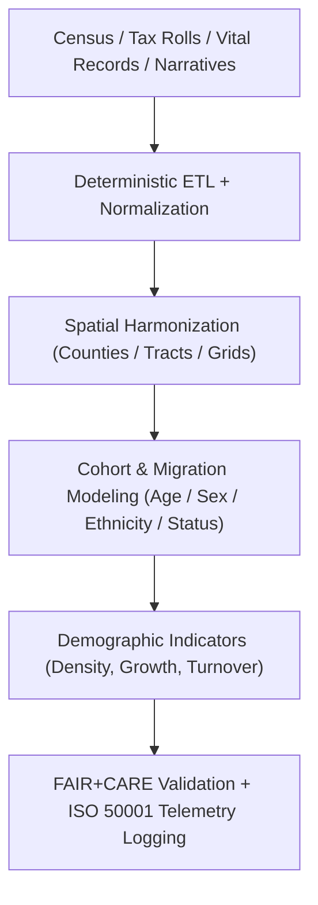

<div align="center">

# 🏺 **Kansas Frontier Matrix — Population Dynamics & Historical Demography Methods**  
`docs/analyses/historical/population-dynamics.md`

**Purpose:**  
Define the **population dynamics and historical demography methodologies** used in the Kansas Frontier Matrix (KFM).  
This framework integrates **census records, tax rolls, vital statistics, and migration narratives** to model how populations in Kansas changed over time, under **FAIR+CARE**, **CIDOC CRM**, and **ISO 19115/21127**–aligned standards.

[](../../../README.md)  
[](../../../LICENSE)  
[](../../standards/README.md)  
[](../../../releases/)

</div>

---

## 📘 Overview

The **Population Dynamics Module** reconstructs how people in Kansas moved, settled, and changed over time—by **place, community, and landscape**.  
It combines:

- Decennial and state census records  
- Tax and property rolls  
- Vital statistics (births, deaths, marriages where available)  
- Qualitative migration narratives and community histories  

to produce **spatially harmonized, temporally indexed population models**.  
These models are:

- Ingested into the **KFM Neo4j graph** as demographic Story Node backbones.  
- Governed under **FAIR+CARE ethics**, with special care for Indigenous, minoritized, and vulnerable populations.  
- Supported by **ISO 50001–style telemetry** to track energy and carbon impacts of modeling.

---

## 🗂️ Directory Layout

```text
📁 repo-root/
├── 📁 docs/
│   └── 📁 analyses/
│       └── 📁 historical/
│           ├── 📄 README.md                             # Historical analyses index
│           ├── 📄 archival-correlation.md               # Archival linkage & geospatial correlation
│           ├── 📄 cultural-landscapes.md                # Cultural geography & heritage sites
│           ├── 📄 population-dynamics.md                # This document
│           ├── 📄 validation.md                         # FAIR+CARE validation & ethics auditing
│           └── 📁 reports/                              # Analytical & visualization outputs
├── 📁 src/
│   ├── 📁 pipelines/
│   │   └── 📁 historical/
│   │       └── 📁 population_dynamics/
│   │           ├── 📄 config.yml                         # Deterministic ETL & model config
│   │           ├── 📄 etl_census.py                      # Census/tax/vital ETL & normalization
│   │           ├── 📄 spatial_harmonization.py           # Boundary alignment & grids
│   │           └── 📄 demography_models.py               # Cohort & migration modeling
│   ├── 📁 graph/
│   │   └── 📁 historical/
│   │       └── 📄 population_dynamics_schema.cypher      # Demography-related nodes/edges
│   ├── 📁 api/
│   │   └── 📁 historical/
│   │       └── 📄 population_dynamics_routes.py          # API endpoints for demographic queries
│   └── 📁 web/
│       └── 📁 historical/
│           └── 📄 PopulationDynamicsView.tsx             # Story Node / Focus Mode UI
├── 📁 data/
│   └── 📁 historical/
│       ├── 📁 raw/
│       │   └── 📁 population/
│       │       ├── 📁 census/                            # NARA, IPUMS, state census extracts
│       │       ├── 📁 tax_rolls/                         # Assessor/property/tax lists (where available)
│       │       └── 📁 vitals/                            # Vital statistics (where allowed)
│       ├── 📁 work/
│       │   └── 📁 population_dynamics/
│       │       ├── 📄 normalized_census.parquet
│       │       ├── 📄 boundary_crosswalk.csv
│       │       └── 📄 migration_flows_intermediate.parquet
│       ├── 📁 processed/
│       │   └── 📁 population_dynamics/
│       │       ├── 📄 population_grids.parquet
│       │       ├── 📄 migration_flows.parquet
│       │       ├── 📄 demographic_indicators.parquet
│       │       └── 📄 population_timeline.json
│       └── 📁 stac/
│           └── 📁 analyses/
│               └── 📁 population_dynamics/
│                   └── 📄 item-*.json                   # STAC Items for population outputs
├── 📁 schemas/
│   └── 📁 telemetry/
│       └── 📄 analyses-historical-population-dynamics-v3.json  # (telemetry_schema)
└── 📁 .github/
    └── 📁 workflows/
        └── 📄 historical-analyses-ci.yml               # Lint, schema, lineage & FAIR+CARE checks
```

- **Primary document:** `docs/analyses/historical/population-dynamics.md`  
- **Primary pipeline:** `src/pipelines/historical/population_dynamics/`  
- **Primary outputs:** `data/historical/processed/population_dynamics/` + STAC Items above  
- **Governance & validation:** `docs/standards/governance/ROOT-GOVERNANCE.md`, `docs/analyses/historical/validation.md`

---

## 🧭 Context

The population dynamics workflow is the **demography and migration layer** of the KFM stack:

> **Deterministic ETL → STAC/DCAT/PROV catalogs → Neo4j knowledge graph → API layer → React/MapLibre/Cesium frontend → Story Nodes → Focus Mode.**

- **Upstream:** raw censuses, state and federal enumerations, tax/property rolls, vital statistics, and qualitative accounts of migration.
- **Core processing:** normalization, spatial harmonization, cohort/migration modeling, and indicator computation.
- **Downstream:**  
  - Neo4j nodes & relationships representing **populations, cohorts, migration flows, and population events**.  
  - Story Nodes that narrate **population change, displacement, and growth**.  
  - FAIR+CARE + sustainability telemetry used in governance and audits.

This document defines the **canonical methodology** for building, validating, and governing population dynamics outputs in KFM.

---

## 🧱 Architecture

### 🧩 Analytical Framework



Architectural principles:

- **Config-driven & reproducible**  
  All transformations are driven by `config.yml` (datasets, years, geographies, model parameters, seeds).
- **Graph-compatible by design**  
  Outputs map cleanly onto Neo4j nodes (e.g., `:PopulationCell`, `:MigrationFlow`, `:Cohort`) and relationships (e.g., `:MOVED_TO`, `:RESIDES_IN`).
- **Ethics-aware modeling**  
  Sensitive categories (e.g., race, ethnicity, Indigenous communities, immigration status) are handled via FAIR+CARE conventions, aggregation, and/or controlled access.

---

### 🧠 Methodological Steps

#### 1️⃣ ETL & Normalization

- Ingest census tables, tax rolls, and vital records from `data/historical/raw/population/**`.  
- Normalize column names, coding schemes, and geographic identifiers.

```python
import pandas as pd

census = pd.read_csv("census_1880.csv")
norm = (
    census.rename(columns={"CNTY": "county_fips", "POP": "population"})
          .assign(year=1880)
)

norm.to_parquet("normalized_census_1880.parquet")
```

Outputs (under `data/historical/work/population_dynamics/`):

- `normalized_census_*.parquet`
- `tax_rolls_normalized.parquet`
- `vitals_normalized.parquet`

---

#### 2️⃣ Spatial Harmonization

- Harmonize historical geographies (changing county/tract boundaries) to a **common reference grid or crosswalk**.
- Use crosswalk tables to map historical units to KFM standard geographies.

```python
import pandas as pd

census = pd.read_parquet("normalized_census_1880.parquet")
xwalk = pd.read_csv("boundary_crosswalk.csv")  # historical → standard_id

merged = census.merge(xwalk, on="county_fips")
by_std = merged.groupby(["standard_geo_id", "year"], as_index=False)["population"].sum()
by_std.to_parquet("population_by_standard_geo.parquet")
```

Outputs:

- `boundary_crosswalk.csv`
- `population_by_standard_geo.parquet`
- `population_grids.parquet` (if using grid-based representation)

---

#### 3️⃣ Cohort & Migration Modeling

- Build **age–sex–other-cohort** structures where data allows.
- Derive **migration flows** using successive enumerations and, when possible, explicit migration questions or proxy indicators.

```python
import pandas as pd

prev = pd.read_parquet("population_by_standard_geo_1870.parquet")
curr = pd.read_parquet("population_by_standard_geo_1880.parquet")

flows = curr.merge(prev, on="standard_geo_id", suffixes=("_1880", "_1870"))
flows["net_change"] = flows["population_1880"] - flows["population_1870"]
```

Outputs:

- `migration_flows.parquet`
- `cohort_tables.parquet`
- `demographic_indicators.parquet` (growth rates, density, dependency ratios, etc.)

---

#### 4️⃣ Graph Construction (Neo4j)

- Convert tabular outputs into Neo4j nodes and edges for use in Story Nodes and Focus Mode.

```cypher
CREATE (g:GeoUnit {id:$standard_geo_id})
CREATE (p1880:PopulationSnapshot {year:1880, value:$pop_1880})
CREATE (p1870:PopulationSnapshot {year:1870, value:$pop_1870})

MERGE (g)-[:HAS_POPULATION]->(p1880)
MERGE (g)-[:HAD_POPULATION]->(p1870)
MERGE (p1870)-[:NET_CHANGE {delta:$net_change}]->(p1880)
```

Outputs:

- Graph load files (CSV/Parquet) for bulk import.
- `population_timeline.json` for direct Story Node timelines.

---

#### 5️⃣ Visualization & Interpretation

- Generate maps, charts, and Story Node–ready summaries:

Outputs (typically in `docs/analyses/historical/reports/`):

- `population_density_1880.png`
- `migration_flows_1870_1880.png`
- `demographic_trends_dashboard.json` (for UI configs)

---

## 📦 Data & Metadata

### ⚙️ Core Datasets

| Source                      | Dataset                                | Description                                   | Coverage           | FAIR+CARE Status |
|-----------------------------|----------------------------------------|-----------------------------------------------|--------------------|------------------|
| **NARA / IPUMS**            | Federal census microdata & aggregates  | Population counts, demographics, occupations  | 19th–20th c.       | ✅ Certified      |
| **Kansas State Census**     | State census rolls                     | Intermediate enumeration between federal cycles | Kansas-specific  | ✅ Certified      |
| **County Tax/Property Rolls** | Local tax & property assessments    | Property holders, sometimes inferred residents | County-level     | ✅ Certified      |
| **Vital Statistics**        | Birth/death/marriage records (where allowed) | Demographic events over time              | Select counties    | ⚠️ Restricted*    |

\* Restricted vital statistics may require **additional governance**, aggregation, or anonymization before use.

Metadata expectations:

- Source manifests in `data/sources/` with **license, provenance, and sensitivity** flags.
- STAC Items for **processed population outputs** in `data/historical/stac/analyses/population_dynamics/`.
- DCAT catalogs capturing **spatiotemporal coverage and access conditions**.

---

## 🌐 STAC, DCAT & PROV Alignment

- **STAC Items** (`data/historical/stac/analyses/population_dynamics/item-*.json`):
  - `id`: `population-dynamics-<run-id>`
  - `bbox` / `geometry`: Kansas-wide or subregion coverage.
  - `properties.datetime`: main analysis date; `properties["kfm:temporal_extent"]` for covered years.
  - `assets`:  
    - `population_grids.parquet`  
    - `migration_flows.parquet`  
    - Selected map PNGs and JSON dashboards.

- **DCAT**:
  - Catalog title: `"Kansas Population Dynamics & Historical Demography"`.
  - `dct:license`: `CC-BY 4.0`.
  - Distributions referencing:
    - STAC Items for outputs.
    - Neo4j export snapshots.
    - Reports and dashboards.

- **PROV-O**:
  - `prov:Entity`: input census/vital/roll datasets, intermediate tables, final indicators.
  - `prov:Activity`: ETL, normalization, harmonization, modeling, visualization.
  - `prov:Agent`: pipelines (`population_dynamics`), FAIR+CARE Council, auditors.
  - Core relations:
    - `prov:wasGeneratedBy`: outputs → model run.
    - `prov:used`: model run → raw/normalized data.
    - `prov:wasDerivedFrom`: derived indicators → specific input datasets.

---

## 🧪 Validation & CI/CD

### 🧮 FAIR+CARE Validation Record Example

```json
{
  "validation_id": "population-dynamics-2025-11-09-0196",
  "datasets": [
    "NARA Federal Census",
    "Kansas State Census",
    "County Tax Rolls",
    "Vital Statistics (Restricted)"
  ],
  "metrics": {
    "geo_harmonization_rmse_km": 0.8,
    "temporal_consistency_score": 0.95,
    "indicator_reproducibility": 1.0,
    "telemetry_coverage": 100
  },
  "energy_joules": 15.2,
  "carbon_gCO2e": 0.0061,
  "validation_status": "Pass_with_Notes",
  "notes": "Vital statistics only used in aggregated, anonymized form.",
  "auditor": "FAIR+CARE Council",
  "timestamp": "2025-11-09T18:40:00Z"
}
```

Validation & CI/CD:

- Enforced via `.github/workflows/historical-analyses-ci.yml`.
- CI must:
  - Validate telemetry against `telemetry_schema`.
  - Check that **sensitive categories** are only released in allowed aggregations.
  - Fail if metrics fall below configured thresholds.

---

## ⚖ FAIR+CARE & Governance

### FAIR+CARE & ISO Governance Matrix

| Principle         | Implementation                                                         | Verification Source     |
|-------------------|-------------------------------------------------------------------------|-------------------------|
| **Findable**      | STAC/DCAT indexes for population outputs, keyed by year & geography    | `datasets/metadata/`    |
| **Accessible**    | Public access for aggregated outputs; controlled access for restricted inputs | FAIR+CARE Ledger |
| **Interoperable** | Use of CSV/Parquet/GeoJSON + JSON-LD/RDF mappings to CIDOC/Geo ontologies | `telemetry_schema` |
| **Reusable**      | Complete provenance, model configs, and parameter logs                 | `manifest_ref`          |
| **Responsibility**| ISO 50001-style telemetry for ETL and modeling runs                    | `telemetry_ref`         |
| **Ethics**        | Aggregation, anonymization, & generalization of sensitive demographics | FAIR+CARE Ethics Review |

Governance constraints:

- No **row-level microdata** for sensitive attributes in public artifacts.
- Use **suppression, aggregation, or noise** as required for small counts.
- Explicitly mark generalized or redacted data in metadata (e.g., `"privacy_status": "aggregated_small_cells"`).

---

## 🌱 Sustainability Metrics

| Metric                    | Description                                          | Value  | Target | Unit   |
|---------------------------|------------------------------------------------------|--------|--------|--------|
| **Energy (J)**            | Energy used during ETL + modeling runs               | 15.2   | ≤ 16   | Joules |
| **Carbon (gCO₂e)**        | CO₂ equivalent emissions per full workflow           | 0.0061 | ≤ 0.007| gCO₂e  |
| **Telemetry Coverage (%)**| FAIR+CARE telemetry trace completeness               | 100    | ≥ 95   | %      |
| **Audit Pass Rate (%)**   | FAIR+CARE validation & governance checks passed      | 100    | 100    | %      |

Telemetry is **required** for any production-grade population dynamics run, and must be reproducible from logs, configs, and manifests.

---

## 🧠 Story Node & Focus Mode Integration

- Each **population episode** (e.g., late-19th-century growth, Dust Bowl out-migration, postwar suburbanization) is represented as a **Story Node** with:
  - Narrative text and contextual notes.
  - Temporal extent (years/decades).
  - Spatial extent (regions, counties, or grids).
  - Links to population snapshots, migration flows, and related historical events.

- Focus Mode draws from:
  - `population_timeline.json` for chronological structure.
  - `population_grids.parquet` + map assets for visual density & growth.
  - Migration flow outputs for **animated or interactive movement** layers.

Applications should access population dynamics through `population_dynamics_routes.py` (API) rather than directly querying Neo4j.

---

## 🕰️ Version History

| Version | Date       | Author / Steward           | Summary                                                                                              |
|--------:|-----------:|----------------------------|------------------------------------------------------------------------------------------------------|
| v10.2.2 | 2025-11-09 | FAIR+CARE Council          | Consolidated demography methods, ethics constraints, and sustainability metrics into stable model spec. |
| v10.2.1 | 2025-11-09 | Historical Demography Team | Added cohort & migration flow modeling, plus Neo4j schema integration.                              |
| v10.2.0 | 2025-11-09 | KFM Humanities Team        | Baseline population dynamics guide aligned with FAIR+CARE and archival/geospatial linkage modules.   |

---

<div align="center">

© 2025 Kansas Frontier Matrix Project  
Master Coder Protocol v6.3 · FAIR+CARE Certified · 🏺 Diamond⁹ Ω / 👑 Crown∞Ω Ultimate Certified  

[🏺 Historical Overview](./README.md) • [🏗️ Architecture Index](../../architecture/README.md) • [⚖️ Governance Charter](../../standards/governance/ROOT-GOVERNANCE.md)

</div>

