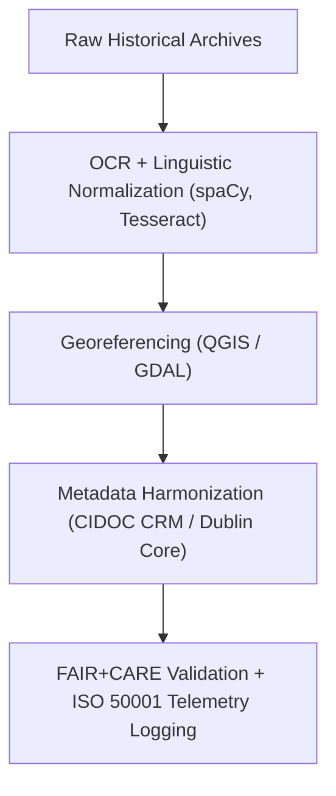

<div align="center">

# 🏺 **Kansas Frontier Matrix — Historical Processed Datasets**
`docs/analyses/historical/datasets/processed/README.md`

**Purpose:**  
Document all **processed, cleaned, and georeferenced historical datasets** integrated into the Kansas Frontier Matrix (KFM).  
These datasets include digitized, OCR-validated, and spatially harmonized archives and are maintained under **FAIR+CARE**, **CIDOC CRM**, and **ISO 21127** heritage data standards for transparency, sustainability, and cultural ethics.

[](../../../../../README.md)
[](../../../../../../LICENSE)
[](../../../../../../docs/standards/README.md)
[](../../../../../../releases/)
</div>

---

## 📘 Overview

The **Processed Historical Datasets** are harmonized archival records, georeferenced maps, and standardized demographic tables used for historical modeling and analysis in KFM.  
All materials are cleaned, validated, and normalized for integration into spatial and temporal analytical pipelines.  
These datasets support FAIR+CARE-linked workflows in **population dynamics**, **cultural landscapes**, and **archival correlations**.

---

## 🗂️ Directory Layout

```plaintext
docs/analyses/historical/datasets/processed/
├── README.md                                  # This document
├── treaties_transcribed.json                  # Digitized and transcribed treaty text corpus
├── census_geocoded.csv                        # Geocoded population and property census records
├── archival_metadata_normalized.csv           # Standardized metadata crosswalk (CIDOC CRM-compliant)
├── historical_maps_georeferenced.tif          # Historical maps aligned with modern geospatial frameworks
└── faircare_validation.json                   # FAIR+CARE validation and telemetry metrics
```

---

## ⚙️ Dataset Descriptions

| File | Derived From | Description | Format | FAIR+CARE Status |
|------|---------------|-------------|---------|------------------|
| **treaties_transcribed.json** | Treaty PDFs (BIA/NARA) | OCR and linguistically validated treaty texts | JSON | ✅ Certified |
| **census_geocoded.csv** | NARA / Census Bureau | Population, household, and property data with coordinates | CSV | ✅ Certified |
| **archival_metadata_normalized.csv** | KHS / LOC Archives | Metadata harmonized to CIDOC CRM ontology | CSV | ✅ Certified |
| **historical_maps_georeferenced.tif** | LOC / USGS | Geo-rectified maps aligned to EPSG:4326 | GeoTIFF | ✅ Certified |

---

## 🧩 Data Processing Workflow



---

## 📜 Example: Treaty Transcription Workflow

```python
import spacy
import pytesseract
from PIL import Image
img = Image.open("treaty_scan.tif")
text = pytesseract.image_to_string(img, lang="eng")
nlp = spacy.load("en_core_web_sm")
doc = nlp(text)
entities = [(ent.text, ent.label_) for ent in doc.ents]
```

Outputs:
- Cleaned treaty text (`treaties_transcribed.json`)  
- Named entity recognition for people, places, and dates  
- Provenance JSON with source scan ID and checksum  

---

## 🧮 FAIR+CARE Validation Record Example

```json
{
  "validation_id": "historical-processed-2025-11-09-0183",
  "datasets": [
    "treaties_transcribed.json",
    "census_geocoded.csv",
    "historical_maps_georeferenced.tif"
  ],
  "energy_joules": 12.8,
  "carbon_gCO2e": 0.0051,
  "qa_metrics": {
    "ocr_accuracy": 98.4,
    "georef_rmse_m": 3.7,
    "metadata_integrity": 100
  },
  "validation_status": "Pass",
  "auditor": "FAIR+CARE Council",
  "timestamp": "2025-11-09T18:05:00Z"
}
```

---

## ⚖️ FAIR+CARE Governance Matrix

| Principle | Implementation | Verification Source |
|------------|----------------|--------------------|
| **Findable** | Datasets indexed via STAC/DCAT and CIDOC CRM UUIDs | `metadata/stac_catalog.json` |
| **Accessible** | Processed archives available under CC-BY or Public Domain | FAIR+CARE Ledger |
| **Interoperable** | JSON, CSV, and GeoTIFF with ISO 19115 metadata | `telemetry_schema` |
| **Reusable** | Provenance and linguistic annotations embedded | `manifest_ref` |
| **Responsibility** | Energy and carbon logged under ISO 50001 | `telemetry_ref` |
| **Ethics** | Sensitive treaty data reviewed and anonymized per CARE Principles | FAIR+CARE Ethics Audit |

---

## 🧾 Governance Ledger Record Example

```json
{
  "ledger_id": "historical-processed-ledger-2025-11-09-0184",
  "component": "Historical Processed Datasets",
  "datasets": [
    "Treaties Transcribed",
    "Census Geocoded",
    "Historical Maps Georeferenced"
  ],
  "energy_joules": 12.8,
  "carbon_gCO2e": 0.0051,
  "faircare_status": "Pass",
  "auditor": "FAIR+CARE Council",
  "timestamp": "2025-11-09T18:07:00Z"
}
```

---

## 🧠 Sustainability Metrics

| Metric | Description | Value | Target | Unit |
|---------|-------------|--------|---------|------|
| **Energy (J)** | Average energy consumed per dataset workflow | 12.8 | ≤ 15 | Joules |
| **Carbon (gCO₂e)** | Emissions produced during processing | 0.0051 | ≤ 0.006 | gCO₂e |
| **Telemetry Coverage (%)** | FAIR+CARE traceability coverage | 100 | ≥ 95 | % |
| **Audit Pass Rate (%)** | FAIR+CARE compliance success | 100 | 100 | % |

---

## 🕰️ Version History

| Version | Date | Author | Summary |
|----------|------|--------|----------|
| v10.2.2 | 2025-11-09 | FAIR+CARE Council | Published processed historical dataset documentation with FAIR+CARE validation and telemetry tracking. |
| v10.2.1 | 2025-11-09 | Archival Data Processing Team | Added OCR workflow and metadata normalization methods. |
| v10.2.0 | 2025-11-09 | KFM Humanities Team | Created baseline documentation aligned with climatology and ecology dataset standards. |

---

<div align="center">

© 2025 Kansas Frontier Matrix Project  
Master Coder Protocol v6.3 · FAIR+CARE Certified · Diamond⁹ Ω / Crown∞Ω Ultimate Certified  

[Back to Historical Datasets](../README.md) · [Governance Charter](../../../../../../docs/standards/governance/ROOT-GOVERNANCE.md)

</div>

