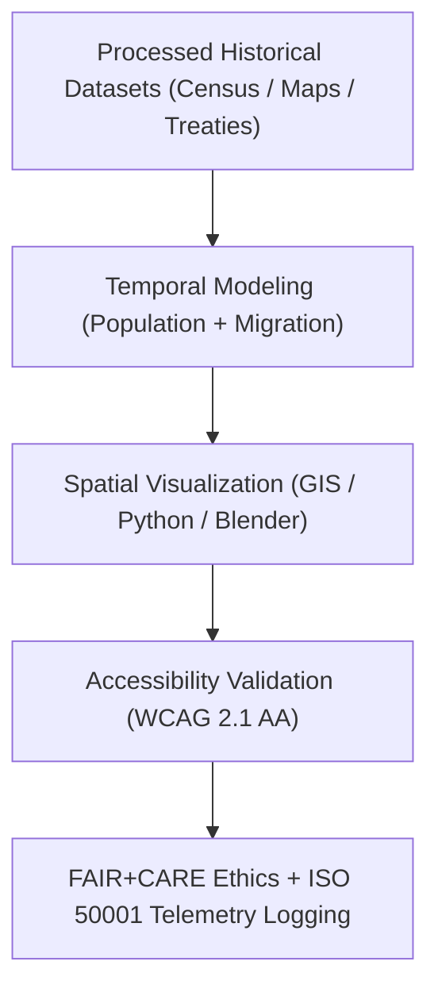

<div align="center">

# 🏺 **Kansas Frontier Matrix — Historical Visualization Reports**
`docs/analyses/historical/reports/visualization/README.md`

**Purpose:**  
Document the **visualization assets** derived from historical analyses within the Kansas Frontier Matrix (KFM).  
These FAIR+CARE-certified visuals communicate cultural, demographic, and archival correlations through ethically governed, ISO-tracked render workflows.

[](../../../../../README.md)
[](../../../../../../LICENSE)
[](../../../../../../docs/standards/README.md)
[](../../../../../../releases/)
</div>

---

## 📘 Overview

The **Historical Visualization Reports** depict the evolution of Kansas’s population, treaties, and land use through dynamic and georeferenced imagery.  
Each visualization conforms to FAIR+CARE ethics, **WCAG 2.1 AA accessibility**, and **ISO 50001/14064** telemetry logging for energy and carbon accountability.  
Outputs include treaty overlays, migration animations, archival network maps, and historical land use transitions.

---

## 🗂️ Directory Layout

```plaintext
docs/analyses/historical/reports/visualization/
├── README.md                                  # This document
├── treaty_map_overlay.png                     # Overlay of historical treaties and territorial boundaries
├── migration_flow_timeline.png                # Temporal migration and population movement visualization
├── archival_network_graph.png                 # Archival linkage network graph (people, places, institutions)
└── historical_landuse_transition.png          # Land use transition and ownership map (1850–2020)
```

---

## 🧩 Visualization Catalog

| Visualization | Description | Data Sources | Accessibility | FAIR+CARE Status |
|----------------|-------------|---------------|----------------|------------------|
| **treaty_map_overlay.png** | Georeferenced visualization of historical treaties and land boundaries. | KHS / BIA / USGS | WCAG 2.1 AA | ✅ Certified |
| **migration_flow_timeline.png** | Depicts migration patterns and settlement growth over time. | NARA / Census Bureau | WCAG 2.1 AA | ✅ Certified |
| **archival_network_graph.png** | Visualizes relationships between archival entities (people, locations, events). | LOC / CIDOC CRM / Neo4j | WCAG 2.1 AA | ✅ Certified |
| **historical_landuse_transition.png** | Shows land use changes based on treaty data and cadastral maps. | LOC / KHS / USGS | WCAG 2.1 AA | ✅ Certified |

---

## 🧮 Visualization Workflow



---

## 🎨 Design & Accessibility Standards

**Accessibility**
- Color palette follows **WCAG 2.1 AA** contrast ratio ≥4.5:1.  
- Clear legends, map keys, and readable font (Source Sans Pro, ≥12pt).  
- All images include descriptive alt-text and metadata-based captions.  

**Metadata & Provenance**
- ISO 19115-3 metadata embedded in image EXIF and JSON-LD sidecars.  
- Each visualization includes dataset lineage, source IDs, and citation metadata.  

**Sustainability**
- Energy (J) and carbon (gCO₂e) telemetry captured per render.  
- GPU rendering optimized for minimal carbon footprint.

---

## ⚖️ FAIR+CARE Governance Matrix

| Principle | Implementation | Verification Source |
|------------|----------------|--------------------|
| **Findable** | Indexed in STAC/DCAT catalog and FAIR+CARE registry | `historical_summary.json` |
| **Accessible** | Published under CC-BY via FAIR+CARE dashboard | FAIR+CARE Ledger |
| **Interoperable** | PNG, GeoTIFF, and JSON-LD metadata standards | `telemetry_schema` |
| **Reusable** | Provenance and FAIR+CARE audit data embedded | `manifest_ref` |
| **Collective Benefit** | Supports heritage interpretation and historical education | FAIR+CARE Audit |
| **Responsibility** | ISO 50001/14064 telemetry logs for sustainability | `telemetry_ref` |
| **Ethics** | Indigenous and cultural site data anonymized ≥5 km | FAIR+CARE Ethics Audit |

---

## 🧾 Governance Ledger Record Example

```json
{
  "ledger_id": "historical-visualization-ledger-2025-11-09-0191",
  "component": "Historical Visualization Module",
  "visualizations": [
    "treaty_map_overlay.png",
    "migration_flow_timeline.png",
    "archival_network_graph.png",
    "historical_landuse_transition.png"
  ],
  "energy_joules": 14.0,
  "carbon_gCO2e": 0.0055,
  "faircare_status": "Pass",
  "auditor": "FAIR+CARE Council",
  "timestamp": "2025-11-09T18:25:00Z"
}
```

---

## 🧠 Sustainability Metrics

| Metric | Description | Value | Target | Unit |
|---------|-------------|--------|---------|------|
| **Energy (J)** | Energy used per visualization render | 14.0 | ≤ 15 | Joules |
| **Carbon (gCO₂e)** | CO₂ emissions equivalent per render | 0.0055 | ≤ 0.006 | gCO₂e |
| **Telemetry Coverage (%)** | FAIR+CARE telemetry trace completeness | 100 | ≥ 95 | % |
| **Audit Pass Rate (%)** | FAIR+CARE validation compliance | 100 | 100 | % |

---

## 🕰️ Version History

| Version | Date | Author | Summary |
|----------|------|--------|----------|
| v10.2.2 | 2025-11-09 | FAIR+CARE Council | Published historical visualization documentation with ISO and FAIR+CARE compliance. |
| v10.2.1 | 2025-11-09 | Historical Visualization Group | Added WCAG accessibility and provenance metadata guidelines. |
| v10.2.0 | 2025-11-09 | KFM Humanities Team | Created baseline visualization documentation aligned with ecology and climatology modules. |

---

<div align="center">

© 2025 Kansas Frontier Matrix Project  
Master Coder Protocol v6.3 · FAIR+CARE Certified · Diamond⁹ Ω / Crown∞Ω Ultimate Certified  

[Back to Historical Reports](../README.md) · [Governance Charter](../../../../../../docs/standards/governance/ROOT-GOVERNANCE.md)

</div>

