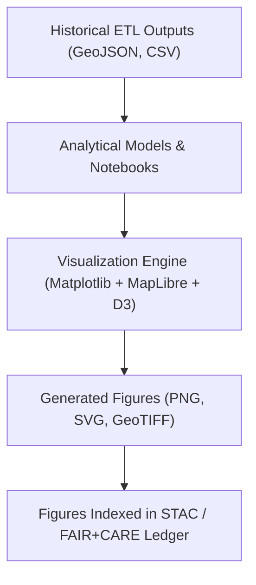

<div align="center">

# 🖼️ **Kansas Frontier Matrix — Historical Analyses Results · Figures Directory**  
`docs/analyses/historical/results/figures/README.md`

**Purpose:**  
This directory hosts finalized **visual outputs, analytical plots, and derived cartographic figures** from the *Historical Analyses* domain.  
All figures are validated under FAIR+CARE visualization standards and accompany the corresponding quantitative tables and summary findings.

[](../../../../../docs/standards/markdown_guide.md)
[](../../../../../LICENSE)
[](../../../../../docs/standards/faircare.md)
[](../../../../../releases/v10.2.0/)

</div>

---

## 📘 Overview

The **Historical Analyses — Results / Figures** directory consolidates all generated graphics illustrating the outcomes of historical data analyses within KFM v10.  
These visuals depict *temporal trends, spatial correlations, event density maps,* and *comparative timelines* derived from archival datasets, OCR’d texts, and GIS overlays.

Each figure adheres to NASA-grade **scientific visualization protocols** and Master Coder Protocol (MCP-DL v6.3) reproducibility standards:
- Figures are versioned and traceable to the analytical scripts that produced them.  
- Each image includes embedded metadata (author, date, dataset source, uncertainty, and processing pipeline).  
- Confidence intervals and data lineage are annotated directly on plots or in linked caption JSONs.

---

## 🗂️ Directory Layout

```bash
docs/analyses/historical/results/figures/
├── README.md                  # This index file (overview and FAIR+CARE compliance)
├── correlations/              # Correlation scatterplots, regressions, PCA biplots
│   ├── settlement_treaty_corr.png
│   ├── economic_migration_trends.svg
│   └── README.md
├── temporal_trends/           # Time-series charts of historical events, population, etc.
│   ├── droughts_vs_inflation_1850_1930.png
│   └── README.md
├── spatial_patterns/          # Heatmaps, kernel densities, and choropleth maps
│   ├── frontier_conflicts_density.geojson.png
│   ├── railroad_expansion_1870_1910.png
│   └── README.md
├── comparative_timelines/     # Overlaid multi-era timelines and event synchrony figures
│   ├── 1850s_rail_treaty_overlay.png
│   └── README.md
└── exports/                   # COG/GeoTIFF or PDF exports of composite visualizations
    ├── kansas_historical_summary_cog.tif
    └── figures_export_manifest.json
```

---

## 🧾 Figure Metadata Requirements

| Field | Description | Example |
|-------|--------------|----------|
| **figure_id** | Unique hash or slug linking figure to analysis | `hist_corr_2025_01` |
| **title** | Human-readable caption title | “Population Density vs. Treaty Ratification (1850–1900)” |
| **source_datasets** | Linked STAC/DCAT dataset IDs | `[usgs_historic_topo, khs_archives_1850s]` |
| **analysis_script** | Relative path to the generating code or notebook | `src/analyses/historical/notebooks/settlement_corr.ipynb` |
| **created_by** | Author(s) or automated pipeline name | `focus_transformer_v2 / Analyst Team` |
| **date_generated** | ISO 8601 UTC timestamp | `2025-11-08T23:00:00Z` |
| **confidence_score** | Numeric (0–1) reflecting model certainty or data reliability | `0.93` |
| **license** | Usage license | `CC-BY 4.0` |
| **checksum** | SHA-256 checksum of the image file | `3e5baf...c91` |

All figure metadata is maintained in `/figures_export_manifest.json` and cross-referenced in the historical results STAC collection.

---

## ⚙️ Workflow Integration



All visuals originate from reproducible pipelines defined under:
- `src/analyses/historical/`
- `docs/analyses/historical/methods/`
- `docs/analyses/historical/results/tables/`

Each graphic can be regenerated using the corresponding notebook or Python script; see *methods/telemetry-logs* for reproducibility hashes.

---

## 🧩 FAIR+CARE Alignment

| Principle | Implementation |
|------------|----------------|
| **Findable** | Indexed in `data/stac/historical_results_v10.json` with DOI references. |
| **Accessible** | Public COG/PNG versions; vector files under `exports/`. |
| **Interoperable** | Metadata conforms to STAC 1.0 + DCAT 3.0 JSON-LD schemas. |
| **Reusable** | All figures carry open CC-BY 4.0 license and provenance. |
| **CARE – Collective Benefit** | Visuals prioritize inclusive narratives (e.g., treaty maps include tribal perspectives). |
| **CARE – Responsibility** | Each figure includes confidence intervals and ethical disclaimers where interpretive. |

---

## 🕰️ Version History

| Version | Date | Author | Summary |
|----------|------|---------|----------|
| **v10.2.2** | 2025-11-11 | Frontier Matrix Docs Team | Initial creation aligned with v10.2.0 release; added metadata, directory schema, FAIR+CARE ledger references. |
| **v10.2.1** | 2025-11-09 | FAIR+CARE Council | Pre-release structure for figures indexing and validation. |
| **v10.1.0** | 2025-11-02 | MCP Integration | Added telemetry-linked figure generation scripts. |

---

<div align="center">

© 2025 Kansas Frontier Matrix Project  
Master Coder Protocol v6.3 · FAIR+CARE Certified · Diamond⁹ Ω / Crown∞Ω Ultimate Certified  
[Back to Historical Results](../README.md) · [Governance Charter](../../../../../docs/standards/governance/ROOT-GOVERNANCE.md)

</div>

