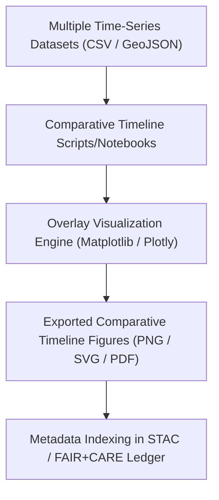

<div align="center">

# 🕰️ **Kansas Frontier Matrix — Historical Analyses Results · Figures · Comparative Timelines Directory**  
`docs/analyses/historical/results/figures/comparative_timelines/README.md`

**Purpose:**  
This directory contains figures that overlay and compare multiple temporal sequences and event-streams within the Historical Analyses domain of the Kansas Frontier Matrix (KFM). These timelines illustrate synchrony, lead/lag relationships, and comparative narratives—such as treaty ratification vs settlement expansion, railroad construction vs migration flows, or climate anomaly cycles vs economic change.

[](../../../../../../docs/standards/markdown_guide.md)  
[](../../../../../../LICENSE)  
[](../../../../../../docs/standards/faircare.md)  
[](../../../../../../releases/v10.2.0/)

</div>

---

## 📘 Overview

Comparative timeline figures facilitate insight into how disparate historical processes co-evolved or influenced one another across the Kansas frontier.  
Examples include:
- Overlaid timelines of treaty ratification events and settlement density growth (1850–1900)  
- Simultaneous graphs of railroad mileage expansion and agricultural land conversion  
- Multi-series visualisation of climate droughts, migration peaks, and economic downturns  

Each figure is:
- Recorded and version-controlled in notebooks/scripts under `src/analyses/historical/`  
- Annotated with metadata on dataset sources, temporal span, generation date, confidence metrics  
- Produced and exported in open formats (PNG, SVG, PDF) in accordance with FAIR+CARE and MCP-DL v6.3 standards  

---

## 🗂️ Directory Layout

```bash
docs/analyses/historical/results/figures/comparative_timelines/
├── 1850s_rail_treaty_overlay.png
├── migration_vs_agriculture_timeline.svg
├── climate_economy_migration_overlay.pdf
└── README.md                             # This index file
```

---

## ⚙️ Workflow Integration



Workflows integrate harmonised time-series, align temporal axes, annotate lead/lag relationships, and output figures that are reproducible and referenced in the project’s telemetry logs.

---

## 🧩 FAIR+CARE Alignment

| Principle            | Implementation                                                                 |
|-----------------------|--------------------------------------------------------------------------------|
| **Findable**         | Files named clearly with versioning; indexed in STAC catalogue and logs.        |
| **Accessible**       | Open formats and CC-BY 4.0 licensing; full metadata and provenance included.     |
| **Interoperable**    | Temporal axes use standard formats (ISO 8601); metadata conforms to JSON-LD / DCAT schemas. |
| **Reusable**         | Provenance (script path, dataset IDs, date) included; version control ensures traceability. |
| **CARE – Collective Benefit** | Visuals emphasise inclusive historical narratives, including Indigenous treaty contexts, migration, and environmental justice. |
| **CARE – Responsibility**      | Confidence bounds, dataset limitations, and methodological notes are clearly documented to mitigate mis-interpretation. |

---

## 🕰️ Version History

| Version   | Date       | Author                      | Summary                                                       |
|-----------|------------|------------------------------|----------------------------------------------------------------|
| **v10.2.2** | 2025-11-11 | Frontier Matrix Docs Team     | Created Comparative Timelines directory README aligned with v10.2 release. |
| **v10.2.1** | 2025-11-09 | FAIR+CARE Council             | Added FAIR+CARE table and workflow diagram.                     |
| **v10.1.0** | 2025-11-02 | MCP Integration Team          | Established directory structure for comparative timeline figures. |

---

<div align="center">

© 2025 Kansas Frontier Matrix Project  
Master Coder Protocol v6.3 · FAIR+CARE Certified · Diamond⁹ Ω / Crown∞Ω Ultimate Certified  
[Back to Figures Index](../README.md) · [Governance Charter](../../../../../../docs/standards/governance/ROOT-GOVERNANCE.md)

</div>

