<div align="center">

# 📈 **Kansas Frontier Matrix — Historical Analyses Results · Correlation Figures**  
`docs/analyses/historical/results/figures/correlations/README.md`

**Purpose:**  
This directory curates all **correlation and regression-based visual outputs** derived from Kansas Frontier Matrix (KFM) historical analyses.  
It includes scatterplots, regression lines, and principal-component biplots revealing relationships between key historical indicators—such as settlement density, treaty frequency, agricultural expansion, and climate variability.

[](../../../../../../docs/standards/markdown_guide.md)
[](../../../../../../LICENSE)
[](../../../../../../docs/standards/faircare.md)
[](../../../../../../releases/v10.2.0/)

</div>

---

## 📘 Overview

Correlation analysis within KFM’s *Historical Results* domain links quantitative trends extracted from archival, economic, environmental, and demographic datasets.  
These figures visualize **statistical relationships** central to understanding Kansas’s frontier development—illustrating how environmental, social, and economic variables evolved together.  
They support the interpretive narratives in the corresponding *summary-findings.md* and complement tabular regression outputs.

Each figure adheres to MCP-DL v6.3 reproducibility and NASA-grade analytical visualization protocols:
- Produced through version-controlled Jupyter notebooks or Python scripts in `src/analyses/historical/`.
- Contains FAIR+CARE-compliant metadata and embedded provenance.
- Generated reproducibly with dataset references and uncertainty bounds clearly annotated.

---

## 🗂️ Directory Layout

```bash
docs/analyses/historical/results/figures/correlations/
├── README.md                              # This index file
├── settlement_treaty_corr.png              # Population vs. treaty correlations
├── economic_migration_trends.svg           # Regression of migration vs. economic index
├── pca_biplot_frontier_economy.svg         # Multivariate relationships (PCA biplot)
└── exports/
    ├── corr_summary_manifest.json          # Metadata manifest for exported figures
    └── correlation_plots_highres.tif       # Composite high-resolution export
```

---

## ⚙️ Workflow Integration

```mermaid
flowchart TD
    A["Historical Datasets (CSV / GeoJSON)"] --> B["Correlation Analysis Notebooks"]
    B --> C["Statistical Models (OLS, PCA, Spearman)"]
    C --> D["Visualization (Seaborn · Matplotlib · Plotly)"]
    D --> E["Correlation Figures (PNG · SVG · GeoTIFF)"]
    E --> F["Indexed in STAC / FAIR+CARE Ledger"]
```



All figures originate from **validated ETL outputs** within `data/processed/historical/`.  
Each notebook logs dependencies, runtime parameters, and version tags.  
Analyses rely on reproducible random seeds and cross-validated regressions to ensure interpretive robustness.

---

## 🧾 Figure Metadata Schema

| Field | Description | Example |
|-------|-------------|----------|
| **figure_id** | Unique identifier linked to result table | `corr_treaty_settlement_1850_1900` |
| **title** | Descriptive title | “Settlement Density vs Treaty Ratification (1850–1900)” |
| **datasets_used** | IDs from `data/sources/*.json` | `[khs_treaty_records, census_pop_1850]` |
| **analysis_script** | Originating notebook or script | `src/analyses/historical/notebooks/corr_treaty.ipynb` |
| **method** | Statistical approach | `Pearson r + OLS fit` |
| **r2_score** | Coefficient of determination (if applicable) | `0.82` |
| **confidence_interval** | Range at 95% confidence | `[0.75, 0.89]` |
| **created_by** | Analyst or pipeline module | `historical_corr_pipeline_v2` |
| **date_generated** | ISO 8601 UTC timestamp | `2025-11-10T23:59:00Z` |
| **license** | Usage license | `CC-BY 4.0` |
| **checksum** | SHA-256 hash of file | `f3a4b5...29c8` |

---

## 🧩 FAIR+CARE Alignment

| Principle | Implementation |
|------------|----------------|
| **Findable** | All correlation figures are indexed within `data/stac/historical_results_v10.json` using persistent DOIs. |
| **Accessible** | Outputs are openly accessible via the repository and STAC endpoints. |
| **Interoperable** | Metadata follows STAC 1.0 + DCAT 3.0 JSON-LD. |
| **Reusable** | CC-BY 4.0 license with explicit provenance and checksums. |
| **CARE — Collective Benefit** | Analyses contextualize Indigenous treaties, migration, and resource change with cultural respect. |
| **CARE — Responsibility** | Visual outputs include data-confidence annotations to prevent misuse. |

---

## 🕰️ Version History

| Version | Date | Author | Summary |
|----------|------|---------|----------|
| **v10.2.2** | 2025-11-11 | Frontier Matrix Docs Team | Created full correlations index and metadata schema. |
| **v10.2.1** | 2025-11-09 | FAIR+CARE Council | Added STAC linking and FAIR+CARE alignment section. |
| **v10.1.0** | 2025-11-02 | MCP Integration | Initial structure for correlation analyses results. |

---

<div align="center">

© 2025 Kansas Frontier Matrix Project  
Master Coder Protocol v6.3 · FAIR+CARE Certified · Diamond⁹ Ω / Crown∞Ω Ultimate Certified  
[Back to Figures Index](../README.md) · [Governance Charter](../../../../../../docs/standards/governance/ROOT-GOVERNANCE.md)

</div>

