<div align="center">

# 📁 **Kansas Frontier Matrix — Historical Analyses Results · Correlation Figures · Exports Directory**  
`docs/analyses/historical/results/figures/correlations/exports/README.md`

**Purpose:**  
This directory stores all **high-fidelity exported correlation figures** generated from the Historical Analyses domain of the Kansas Frontier Matrix (KFM).  
Exports include archival-quality images (PNG, SVG, GeoTIFF) and composite PDFs generated by reproducible pipelines conforming to FAIR+CARE and MCP-DL v6.3 visualization standards.

[](../../../../../../../docs/standards/markdown_guide.md)
[](../../../../../../../LICENSE)
[](../../../../../../../docs/standards/faircare.md)
[](../../../../../../../releases/v10.2.0/)

</div>

---

## 📘 Overview

The *Exports* directory provides publication-ready outputs for the **correlation analyses** figures, ensuring long-term preservation and interoperability.  
All files originate from validated analytical notebooks under `src/analyses/historical/` and include embedded metadata such as provenance, dataset links, creation date, and checksum.  

Formats include:
- **COG GeoTIFFs** for spatial plots and heatmaps  
- **High-resolution PNG/SVG** for statistical graphics  
- **PDF bundles** for archival or print use  
- **JSON manifests** recording provenance, checksums, and FAIR+CARE attributes  

---

## 🗂️ Directory Layout

```bash
docs/analyses/historical/results/figures/correlations/exports/
├── README.md                         # This index file
├── corr_settlement_treaty_highres.tif
├── corr_economic_migration_highres.png
├── pca_biplot_frontier_economy.pdf
└── manifest_corr_exports.json         # Metadata and provenance manifest
```

---

## ⚙️ Export Workflow Integration

```mermaid
flowchart TD
    A["Correlation Figures (PNG / SVG)"] --> B["Export Engine (Metadata Embed · Rasterize)"]
    B --> C["High-Resolution Outputs (TIFF / PDF)"]
    C --> D["Manifest Generation (JSON · Checksums)"]
    D --> E["Ingestion to STAC / FAIR+CARE Ledger"]
```



**Process Summary**
1. Figures generated by analysis notebooks are rendered in multiple output formats.  
2. Metadata (creator, dataset references, analysis script path) is embedded using EXIF/XMP.  
3. The manifest JSON records each export’s filename, checksum, version, and confidence metrics.  
4. Exports are indexed in the project’s STAC catalog and FAIR+CARE ledger for traceability.

---

## 🧾 Manifest Schema

| Field | Description | Example |
|-------|-------------|----------|
| **file_name** | Exported file name | `corr_settlement_treaty_highres.tif` |
| **format** | MIME type | `image/tiff` |
| **figure_id** | Reference to source figure | `corr_treaty_settlement_1850_1900` |
| **checksum** | SHA-256 hash | `4c29b0e...8a6f` |
| **created_by** | Pipeline or analyst | `historical_corr_export_v2` |
| **export_date** | ISO 8601 UTC timestamp | `2025-11-10T22:15:00Z` |
| **license** | Usage license | `CC-BY 4.0` |
| **provenance** | Path to source analysis | `src/analyses/historical/notebooks/corr_treaty.ipynb` |
| **confidence_score** | Derived analysis reliability (0-1) | `0.91` |

---

## 🧩 FAIR+CARE Alignment

| Principle | Implementation |
|------------|----------------|
| **Findable** | Indexed via `manifest_corr_exports.json` and referenced in `data/stac/historical_results_v10.json`. |
| **Accessible** | Distributed in open formats; accessible through repo and STAC endpoints. |
| **Interoperable** | JSON-LD metadata and consistent file naming (kebab-case + version). |
| **Reusable** | Embedded provenance and CC-BY 4.0 licensing ensure open reuse. |
| **CARE – Collective Benefit** | Visuals present inclusive historical narratives with contextual integrity. |
| **CARE – Responsibility** | Confidence metrics and disclaimers included to prevent misuse. |

---

## 🕰️ Version History

| Version | Date | Author | Summary |
|----------|------|---------|----------|
| **v10.2.2** | 2025-11-11 | Frontier Matrix Docs Team | Initial Exports README; aligned with v10.2 release. |
| **v10.2.1** | 2025-11-09 | FAIR+CARE Council | Added manifest schema and workflow diagram. |
| **v10.1.0** | 2025-11-02 | MCP Integration | Created export automation within correlation pipeline. |

---

<div align="center">

© 2025 Kansas Frontier Matrix Project  
Master Coder Protocol v6.3 · FAIR+CARE Certified · Diamond⁹ Ω / Crown∞Ω Ultimate Certified  
[Back to Correlation Figures Index](../README.md) · [Governance Charter](../../../../../../../docs/standards/governance/ROOT-GOVERNANCE.md)

</div>
