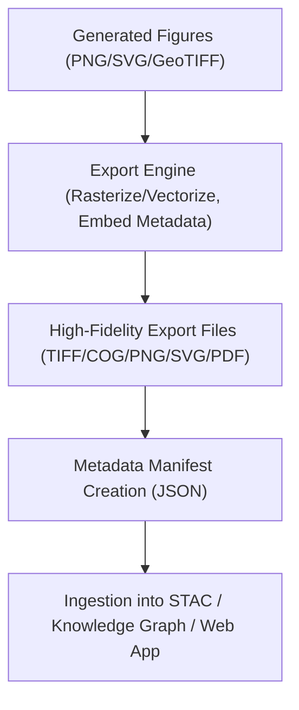

<div align="center">

# 📁 **Kansas Frontier Matrix — Historical Analyses Results · Figures · Exports Directory**  
`docs/analyses/historical/results/figures/exports/README.md`

**Purpose:**  
This directory holds *publication-ready, high-fidelity exported versions* of the figures generated across all sub-folders of the Historical Analyses Results → Figures domain. These exports include high resolution raster (PNG, TIFF), vector (SVG, PDF), cloud-optimized geospatial formats (COG/GeoTIFF), and an associated manifest JSON cataloging each file’s metadata, provenance, and checksum.

[](../../../../../docs/standards/markdown_guide.md)  
[](../../../../../LICENSE)  
[](../../../../../docs/standards/faircare.md)  
[](../../../../../releases/v10.2.0/)

</div>

---

## 📘 Overview

The *Exports* directory serves as the archival and dissemination endpoint for all figures produced within the Historical Results → Figures workflow. Each file in this folder is derived from a reproducible notebook or script, has version control metadata, and is ready for sharing, publication or ingestion into downstream systems (knowledge graph, web app, journal supplement).  
Files conform to the following practices:  
- Naming conventions: kebab-case, version-tagged, domain-qualified  
- Metadata embedded or side-car: creation date, generating script, dataset references, license, checksum  
- Output formats align with FAIR+CARE and MCP-DL standards (open formats, clear provenance)  
- A manifest JSON (`manifest_exports.json`) resides here listing every file, its metadata and status.

---

## 🗂️ Directory Layout

```bash
docs/analyses/historical/results/figures/exports/
├── README.md                            # This index file
├── figure_settlement_treaty_highres.tif
├── figure_temporal_trend_population_highres.png
├── figure_spatial_frontier_density_highres.svg
├── manifest_exports.json                 # Metadata catalog for all exports
└── pdf_bundle_all_figures_v10.2.pdf
```

---

## ⚙️ Workflow Integration



This workflow ensures that each figure’s export is traceable, versioned, and reproducible — from raw notebook to final shareable asset.

---

## 🧩 FAIR+CARE & Archival Compliance

| Principle            | Implementation                                                                 |
|------------------------|--------------------------------------------------------------------------------|
| **Findable**            | Files listed in manifest with persistent identifiers and version tags.        |
| **Accessible**          | Formats are open (PNG, SVG, GeoTIFF, PDF); licensed CC-BY 4.0.                |
| **Interoperable**       | Metadata follows JSON-LD/STAC conventions; clear dataset links.              |
| **Reusable**            | Provenance, script paths, checksums, and licenses documented.                 |
| **CARE – Collective Benefit** | Outputs provide inclusive, culturally respectful narratives (e.g., Indigenous frontiers, treaties). |
| **CARE – Responsibility**        | Uncertainty and data quality flags are documented; only approved figures are exported. |

---

## 🕰️ Version History

| Version   | Date       | Author                    | Summary                                           |
|-----------|------------|----------------------------|---------------------------------------------------|
| **v10.2.2** | 2025-11-11 | Frontier Matrix Docs Team   | Created exports directory README aligned with v10.2 release. |
| **v10.2.1** | 2025-11-09 | FAIR+CARE Council           | Added metadata manifest and export workflow diagram. |
| **v10.1.0** | 2025-11-02 | MCP Integration Team        | Established export folder structure for figures.    |

---

<div align="center">

© 2025 Kansas Frontier Matrix Project  
Master Coder Protocol v6.3 · FAIR+CARE Certified · Diamond⁹ Ω / Crown∞Ω Ultimate Certified  
[Back to Figures Index](../README.md) · [Governance Charter](../../../../../docs/standards/governance/ROOT-GOVERNANCE.md)

</div>

