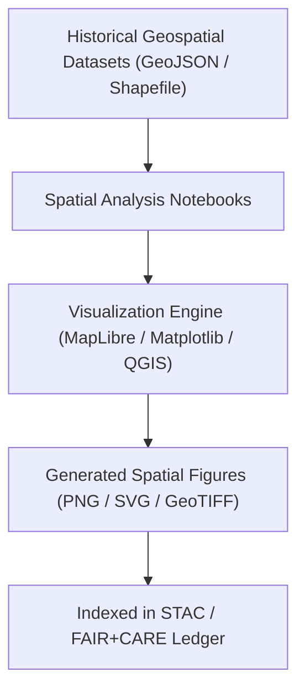

<div align="center">

# 🌍 **Kansas Frontier Matrix — Historical Analyses Results · Figures · Spatial Patterns Directory**  
`docs/analyses/historical/results/figures/spatial_patterns/README.md`

**Purpose:**  
This directory contains **map-based and geospatial visualizations** from the *Historical Analyses* domain of the Kansas Frontier Matrix (KFM).  
Figures display spatial distributions, clustering, and geographic relationships among historical events, settlements, treaties, transportation networks, and environmental factors across Kansas.

[](../../../../../../docs/standards/markdown_guide.md)
[](../../../../../../LICENSE)
[](../../../../../../docs/standards/faircare.md)
[](../../../../../../releases/v10.2.0/)

</div>

---

## 📘 Overview

Spatial pattern figures portray how frontier-era processes and phenomena manifested geographically through time.  
They visualize relationships such as:
- Density of frontier conflicts and migration paths.  
- Expansion of railroads, trails, and townships (1850–1910).  
- Overlay of treaty boundaries and county-level land transfers.  
- Spatial coincidence of ecological or climatic patterns with demographic change.  

Each figure:
- Is generated from reproducible notebooks in `src/analyses/historical/`.  
- Includes embedded metadata (CRS, bounding box, dataset references, creation timestamp).  
- Conforms to FAIR+CARE visualization standards for ethical representation of cultural and environmental data.  

---

## 🗂️ Directory Layout

```bash
docs/analyses/historical/results/figures/spatial_patterns/
├── README.md                             # This index file
├── frontier_conflicts_density.geojson.png
├── railroad_expansion_1870_1910.png
├── settlement_choropleth_1900.svg
└── exports/
    ├── spatial_frontier_summary_cog.tif
    └── manifest_spatial_exports.json
```

---

## ⚙️ Workflow Integration



Spatial datasets are reprojected to EPSG:4326 (WGS84) and harmonized before visualization.  
All workflows are reproducible, validated, and logged within the project’s telemetry schema under MCP-DL v6.3.

---

## 🧾 Figure Metadata Schema

| Field | Description | Example |
|-------|-------------|----------|
| **figure_id** | Unique identifier for figure | `spatial_frontier_conflicts_1850_1900` |
| **title** | Caption title | “Frontier Conflict Density, 1850–1900” |
| **datasets_used** | Source dataset IDs | `[khs_conflict_records, usgs_topo_1890]` |
| **projection** | Coordinate reference system | `EPSG:4326` |
| **resolution_meters** | Pixel resolution for raster exports | `250` |
| **analysis_script** | Notebook or script path | `src/analyses/historical/notebooks/conflict_density.ipynb` |
| **created_by** | Author or pipeline module | `spatial_analysis_pipeline_v2` |
| **date_generated** | ISO 8601 timestamp | `2025-11-09T18:00:00Z` |
| **license** | Usage license | `CC-BY 4.0` |
| **checksum** | SHA-256 file hash | `c4f91d7a1b...aa5e` |

---

## 🧩 FAIR+CARE Alignment

| Principle | Implementation |
|------------|----------------|
| **Findable** | Indexed via STAC v1.0 catalog and referenced in `data/stac/historical_results_v10.json`. |
| **Accessible** | Provided in open raster/vector formats with full metadata and CC-BY 4.0 licensing. |
| **Interoperable** | Uses standard CRS (EPSG:4326), JSON-LD metadata, and OGC STAC compliance. |
| **Reusable** | Provenance, script path, and checksum embedded; reproducible through documented workflow. |
| **CARE – Collective Benefit** | Maps acknowledge Indigenous territories and cultural geographies respectfully. |
| **CARE – Responsibility** | Confidence intervals and source limitations are disclosed within figure metadata. |

---

## 🕰️ Version History

| Version | Date | Author | Summary |
|----------|------|---------|----------|
| **v10.2.2** | 2025-11-11 | Frontier Matrix Docs Team | Created compliant Spatial Patterns README for v10.2 release. |
| **v10.2.1** | 2025-11-09 | FAIR+CARE Council | Added metadata schema and improved ethical guidance section. |
| **v10.1.0** | 2025-11-02 | MCP Integration Team | Established spatial_patterns directory structure and telemetry linkage. |

---

<div align="center">

© 2025 Kansas Frontier Matrix Project  
Master Coder Protocol v6.3 · FAIR+CARE Certified · Diamond⁹ Ω / Crown∞Ω Ultimate Certified  
[Back to Figures Index](../README.md) · [Governance Charter](../../../../../../docs/standards/governance/ROOT-GOVERNANCE.md)

</div>
