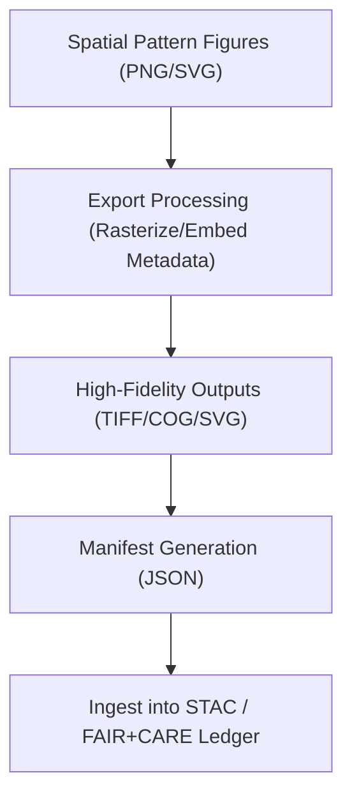

<div align="center">

# 📁 **Kansas Frontier Matrix — Historical Analyses Results · Figures · Spatial Patterns · Exports Directory**  
`docs/analyses/historical/results/figures/spatial_patterns/exports/README.md`

**Purpose:**  
This directory contains all **publication-ready, high-fidelity export files** derived from the spatial patterns figures of the Historical Analyses domain of the Kansas Frontier Matrix (KFM). These exports include high resolution raster/vector outputs, COG/GeoTIFF formats, and the manifest file that indexes checksums, provenance, licensing, and metadata.

[](../../../../../../../docs/standards/markdown_guide.md)  
[](../../../../../../../LICENSE)  
[](../../../../../../../docs/standards/faircare.md)  
[](../../../../../../../releases/v10.2.0/)

</div>

---

## 📘 Overview

The *Exports* directory within the Spatial Patterns figures section is designed for archival, publication, and dissemination readiness. It houses final outputs from visualization workflows in formats suited for both print and web reuse, along with metadata manifests to support reproducibility and indexing.

Key features:
- Files in GeoTIFF/COG format (for geospatial maps) and high-resolution PNG/SVG (for graphics)  
- Embedded metadata including dataset sources, coordinate reference systems (CRS), generation timestamps, and checksums  
- A manifest JSON that catalogs each export, with links to the generating script, provenance details, and licensing  
- Version control tracking to ensure each export corresponds to a specific analysis script and dataset version  

---

## 🗂️ Directory Layout

```bash
docs/analyses/historical/results/figures/spatial_patterns/exports/
├── spatial_frontier_summary_cog.tif
├── settlement_expansion_highres.png
├── railroad_expansion_map_highres.svg
├── manifest_spatial_exports.json
└── README.md                               # This index file
```

---

## ⚙️ Workflow Integration



Steps:
1. Final rendered visuals are processed into high-fidelity formats with consistent naming and embedded metadata.  
2. Metadata includes generation script reference, dataset version, CRS, resolution, checksum.  
3. A manifest JSON (`manifest_spatial_exports.json`) indexes all files and their provenance.  
4. Exports and manifest are recorded in the project’s STAC catalogue and knowledge graph for traceability.

---

## 🧩 FAIR+CARE & Archival Compliance

| Principle               | Implementation                                              |
|--------------------------|-------------------------------------------------------------|
| **Findable**            | Files named with clear versioning, serialized in manifest. |
| **Accessible**          | Open formats (GeoTIFF, PNG, SVG), CC-BY 4.0 license.        |
| **Interoperable**       | Embedded CRS, standard metadata schemas, JSON-LD manifest. |
| **Reusable**            | Provenance, dataset IDs, version & checksums documented.    |
| **CARE – Collective Benefit** | Visuals include cultural and historical perspectives respectfully. |
| **CARE – Responsibility**      | Data quality, limitations, and uncertainty explicitly annotated. |

---

## 🕰️ Version History

| Version  | Date       | Author                  | Summary                                        |
|----------|------------|--------------------------|------------------------------------------------|
| **v10.2.2** | 2025-11-11 | Frontier Matrix Docs Team | Created Exports README for spatial_patterns section aligned to v10.2 release. |
| **v10.2.1** | 2025-11-09 | FAIR+CARE Council         | Added metadata manifest schema and archival export workflow details. |
| **v10.1.0** | 2025-11-02 | MCP Integration Team      | Established export folder structure for spatial patterns figures. |

---

<div align="center">

© 2025 Kansas Frontier Matrix Project  
Master Coder Protocol v6.3 · FAIR+CARE Certified · Diamond⁹ Ω / Crown∞Ω Ultimate Certified  
[Back to Spatial Patterns Figures Index](../README.md) · [Governance Charter](../../../../../../../docs/standards/governance/ROOT-GOVERNANCE.md)

</div>
```
::contentReference[oaicite:0]{index=0}

