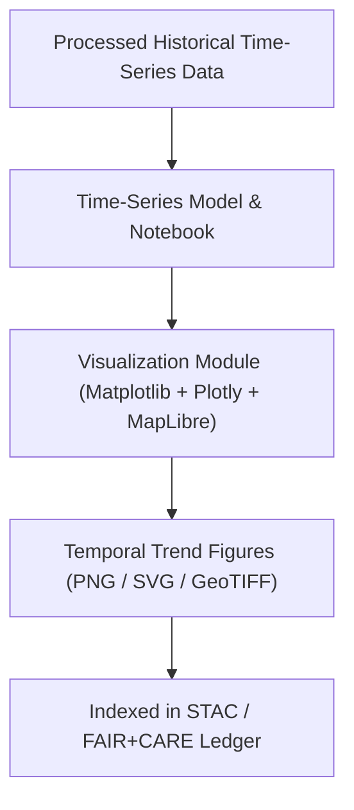

<div align="center">

# 📉 **Kansas Frontier Matrix — Historical Analyses Results · Figures · Temporal Trends Directory**  
`docs/analyses/historical/results/figures/temporal_trends/README.md`

**Purpose:**  
This directory houses all figures illustrating **temporal trajectories and time-series analyses** derived from the Historical Analyses domain of the Kansas Frontier Matrix project. These visuals chart the evolution of key variables (population change, settlement spread, treaty ratifications, climate events, economic indices) through time, supporting narrative interpretation and quantitative findings.

[](../../../../../docs/standards/markdown_guide.md)  
[](../../../../../LICENSE)  
[](../../../../../docs/standards/faircare.md)  
[](../../../../../releases/v10.2.0/)

</div>

---

## 📘 Overview

Temporal trends figures provide visualizations of how historical processes unfolded over time within the Kansas frontier context. The analyses behind these figures use harmonised archival data, geospatial overlays, and time-series modelling to depict trajectories such as:

- Settlement density growth from 1850-1910  
- Treaty ratification events by year  
- Railroad expansion versus agricultural land conversion over decades  
- Climate anomaly cycles (drought/wet periods) and their relation to migration waves  

Each figure is:
- Generated via reproducible notebooks or scripts under `src/analyses/historical/`  
- Annotated with metadata capturing dataset sources, generation timestamps, and confidence scores  
- Supplied in open formats (PNG, SVG, GeoTIFF) and versioned for traceability  

---

## 🗂️ Directory Layout

```bash
docs/analyses/historical/results/figures/temporal_trends/
├── settlement_density_1850-1910.png
├── treaty_ratifications_time_series.svg
├── railroad_vs_agriculture_1870-1910.png
├── climate_anomalies_migration_1850-1900.svg
└── README.md            # This index file
```

---

## ⚙️ Workflow Integration



This directory links the cleaned time-series datasets (see `data/processed/historical/`) via modelling workflows to final visualization outputs, ensuring reproducibility and traceability.

---

## 🧩 FAIR+CARE Alignment

| Principle            | Implementation                                                                 |
|-----------------------|--------------------------------------------------------------------------------|
| **Findable**          | Figures are indexed in the STAC catalogue and named consistently using kebab-case with version tags. |
| **Accessible**        | All outputs are openly licensed under CC-BY 4.0 and available in standard formats. |
| **Interoperable**     | Metadata conforms to STAC/JSON-LD schemas; time axes and units follow ISO standards. |
| **Reusable**          | Full provenance (script path, dataset IDs, date-generated) included; version control ensures reproducibility. |
| **CARE — Collective Benefit** | Visualizations include narratives of Indigenous treaty processes, migration, and frontier change in an inclusive manner. |
| **CARE — Responsibility**      | Confidence scores and data-quality disclaimers are embedded; visual interpretations are conservative and documented. |

---

## 🕰️ Version History

| Version   | Date       | Author                      | Summary                                            |
|-----------|------------|------------------------------|----------------------------------------------------|
| **v10.2.2** | 2025-11-11 | Frontier Matrix Docs Team     | Created temporal_trends directory README aligned with v10.2 release. |
| **v10.2.1** | 2025-11-09 | FAIR+CARE Council             | Added modelling workflow diagram & FAIR+CARE table. |
| **v10.1.0** | 2025-11-02 | MCP Integration Team          | Established base directory structure for temporal trend figures. |

---

<div align="center">

© 2025 Kansas Frontier Matrix Project  
Master Coder Protocol v6.3 · FAIR+CARE Certified · Diamond⁹ Ω / Crown∞Ω Ultimate Certified  
[Back to Figures Index](../README.md) · [Governance Charter](../../../../../docs/standards/governance/ROOT-GOVERNANCE.md)

</div>

