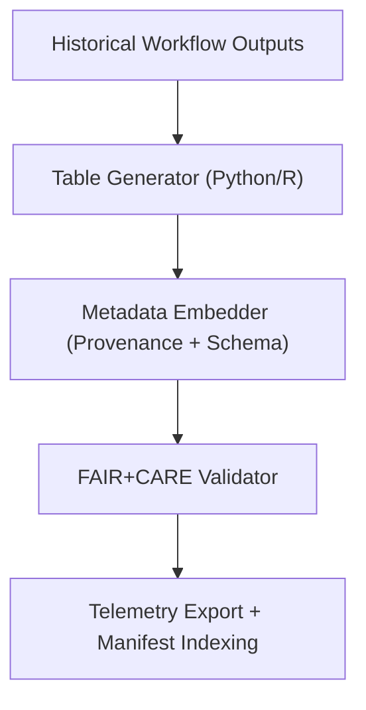

<div align="center">

# 📊 **Kansas Frontier Matrix — Historical Results: Tables**  
`docs/analyses/historical/results/tables/README.md`

**Purpose:**  
Document and catalogue all **tabular output artifacts** generated within the Historical Domain Results workflows of the Kansas Frontier Matrix (KFM).  
These tables capture population dynamics, archival correlations, sustainability audits, and governance summaries under FAIR+CARE and MCP-DL v6.3 certification.

[](../../../README.md)
[](../../../../docs/standards/faircare.md)
[](../../../../LICENSE)
[](../../../../releases/v10.2.0/manifest.zip)

</div>

---

## 📘 Overview

The **Historical Results Tables** directory contains structured CSV/TSV files derived from archival correlation, population dynamics modelling, and governance telemetry analyses.  
Each table adheres to FAIR+CARE metadata conventions, embedding provenance, licensing, and validation schema compliance for interoperability across domains.

---

## 🗂️ Directory Layout

```bash
docs/analyses/historical/results/tables/
 ├── README.md
 ├── population-dynamics-model.csv          # Modelled population and migration trends (1850–1950)
 ├── archival-correlation-results.csv       # Harmonised archival record metadata
 ├── energy-sustainability-log.csv          # Energy and sustainability audit logs
 └── method-validation-summary.csv          # FAIR+CARE model validation metrics
```

Each dataset is accompanied by JSON-LD or YAML metadata sidecars describing columns, units, dataset lineage, and FAIR+CARE compliance metrics.

---

## 🧾 Table Descriptions

| File | Description | Format | Validation |
|------|--------------|---------|-------------|
| `population-dynamics-model.csv` | Modeled demographic outcomes and migration rates 1850–1950. | CSV | FAIR Schema Validator |
| `archival-correlation-results.csv` | Metadata harmonization of archival sources and treaties. | CSV | FAIR+CARE Compliance Pipeline |
| `energy-sustainability-log.csv` | Energy and carbon footprint metrics from result workflows. | CSV | ISO 50001/14064 Audit |
| `method-validation-summary.csv` | Validation results for FAIR+CARE workflow integrity. | CSV | FAIR+CARE Validator |

---

## ⚙️ Workflow and Validation



Telemetry ensures full traceability between data production, energy metrics, and governance audits.

---

## ⚖️ FAIR+CARE Governance Matrix

| Principle | Implementation | Verification Source |
|------------|----------------|--------------------|
| **Findable** | Indexed under STAC/DCAT with persistent identifiers. | `manifest_ref` |
| **Accessible** | Publicly available CSVs under CC-BY 4.0 license. | FAIR+CARE Ledger |
| **Interoperable** | JSON-LD sidecars ensure schema consistency. | `telemetry_schema` |
| **Reusable** | Full provenance, versioning, and checksums provided. | FAIR+CARE Audit |
| **Collective Benefit** | Enables interdisciplinary historical research and public education. | Governance Council |
| **Authority to Control** | Indigenous consent managed through data-use metadata. | IDGB Records |
| **Responsibility** | Telemetry logs record sustainability and energy metrics. | `energy-sustainability-log.csv` |
| **Ethics** | Sensitive cultural and archival data anonymized. | Governance Reports |

---

## 🧠 Example Metadata (Excerpt)

```json
{
  "dataset_id": "historic_population_trends_1850_1950",
  "created_by": "FAIR+CARE Historical Results Council",
  "license": "CC-BY-4.0",
  "columns": [
    "Region", "Year", "Population", "Migration_Rate", "Confidence_Score"
  ],
  "provenance": {
    "source_archives": ["US Census Bureau", "Kansas Historical Society"],
    "processing_tools": ["Python Pandas 2.1", "R tidyverse 4.3"],
    "checksum_sha256": "a7e4b13f2c0198d3..."
  },
  "energy_kWh": 0.0042,
  "carbon_gCO2e": 0.0057,
  "faircare_compliance": 98.9,
  "timestamp": "2025-11-11T14:20:00Z"
}
```

---

## 🕰️ Version History

| Version | Date | Author | Summary |
|----------|------|--------|----------|
| v10.2.2 | 2025-11-11 | FAIR+CARE Historical Results Council | Created documentation for Historical Results Tables with FAIR+CARE and ISO compliance integration. |

---

<div align="center">

© 2025 Kansas Frontier Matrix · Master Coder Protocol v6.3 · FAIR+CARE Certified  
Diamond⁹ Ω / Crown∞Ω Ultimate Certified  

[Back to Historical Results](../README.md) · [Governance Charter](../../../../docs/standards/governance/ROOT-GOVERNANCE.md)

</div>
