<div align="center">

# ✅ **Kansas Frontier Matrix — Historical Analyses Validation**  
`docs/analyses/historical/validation.md`

**Purpose**  
Define the **validation, QA, and CI/CD framework** for historical analyses in the Kansas Frontier Matrix (KFM), ensuring that:

- Historical datasets, methods, and Story Nodes are **accurate, governed, and ethically safe**.  
- All historical outputs are **cataloged, provenance-traceable, and FAIR+CARE aligned**.  
- CI pipelines enforce **risk, sovereignty, and quality checks** before historical content is surfaced to users or Focus Mode.

This guide is **normative** for all work under `docs/analyses/historical/` and associated datasets in `data/*/historical/`.

[](../../README.md)  
[](../../../LICENSE)  
[](../../standards/faircare.md)  
[](../../../releases/)

</div>

---

## 📘 Overview

This document explains **how we validate historical analyses** in KFM, including:

- Datasets (archival maps, treaties, census tables, newspapers).  
- Methods (correlation, population dynamics, cultural landscape models).  
- Story Nodes and narrative reports referencing historical content.  

Goals:

- Ensure historical outputs are **factually grounded**, **traceable**, and **respect cultural and community governance**.  
- Provide a standard set of **automated tests** and **human reviews** that run during CI.  
- Encode validation results into **STAC/DCAT metadata**, **PROV bundles**, and **telemetry** so they are queryable and auditable.  

This guide should be used alongside:

- `docs/analyses/historical/README.md` – Historical Analyses Overview.  
- `docs/analyses/historical/governance.md` – Historical governance, risk, and sovereignty rules.  
- `.github/workflows/lineage.yml` – OpenLineage and provenance CI integration.

---

## 🗂️ Directory Layout

Validation for historical analyses uses the following structure (emoji layout profile):

```text
📁 Kansas-Frontier-Matrix/
├── 📁 docs/
│   └── 📁 analyses/
│       └── 📁 historical/
│           ├── 📄 README.md                    # Historical Analyses Overview
│           ├── 📄 governance.md               # Governance & risk rules
│           ├── 📄 validation.md               # This validation guide
│           ├── 📁 datasets/
│           │   ├── 📄 README.md               # Dataset catalog descriptions
│           │   └── 🧾 risk-register.json      # Machine-readable risk & governance registry
│           ├── 📁 methods/                    # Methods (archival-correlation, population, etc.)
│           │   └── 📄 README.md               # Methods index
│           └── 📁 reports/
│               └── 📄 README.md               # Historical reports & Story Node bundles
├── 📁 data/
│   ├── 📁 sources/
│   │   └── 📁 historical/                     # Source manifests (license, rights, lineage)
│   ├── 📁 raw/
│   │   └── 📁 historical/                     # Raw archives (restricted, LFS/DVC)
│   ├── 📁 processed/
│   │   └── 📁 historical/                     # Cleaned & normalized historical datasets
│   └── 📁 stac/
│       └── 📁 historical/                     # STAC Items with governance & validation fields
├── 📁 dist/
│   └── 📁 historical/
│       ├── 🧾 provenance/                     # PROV-O bundles for historical workflows
│       └── 🧾 validation/                     # Validation reports (JSON) per commit/run
└── 📁 .github/
    └── 📁 workflows/
        └── 📄 historical-validation.yml       # CI workflow for historical validation checks
```

**Directory rules:**

- `dist/historical/validation/` **MUST** contain machine-readable validation reports, keyed by commit SHA or dataset ID (e.g., `validation-<sha>.json`).  
- The **risk register** and **governance doc** are authoritative for deciding **what tests are required** for each dataset or Story Node.  
- `.github/workflows/historical-validation.yml` must implement the CI pattern described in this doc and run alongside lineage workflows.

---

## 🧭 Context

Historical validation sits between:

- **Data production** (ETL, digitization, georeferencing, OCR) and  
- **Data consumption** (analyses, Story Nodes, Focus Mode maps/timelines).

It complements:

- `docs/analyses/historical/governance.md` – which decides **what is allowed** and **how it must be generalized**.  
- OpenLineage CI integration – which captures **how outputs were produced**.  
- KFM-MDP v11.2.5 – which ensures documentation itself is structurally valid and machine-readable.

This doc answers:

- “How do we know a historical dataset is **good enough** to use?” 
- “How do we **prove** that a Story Node respects governance and sovereignty decisions?” 
- “How do we **re-run** and **compare** validation results over time?”

---

## 🗺️ Diagrams

### Historical Validation Flow

```mermaid
flowchart LR
    A["Change Detected\nDataset / Method / Story Node"]
        --> B["CI: Historical Validation Workflow\n.historical-validation.yml"]
    B --> C["Automated Checks\nSchema · Metadata · Governance Links"]
    C --> D["Domain Checks\nCounts · Coverage · Temporal Plausibility"]
    D --> E["Governance & Risk Checks\nRisk Register · Sovereignty Policy"]
    E --> F["Validation Report\n(dist/historical/validation/validation-<sha>.json)"]
    F --> G{"Pass All Gates?"}
    G -->|Yes| H["Mark Catalog Items Valid\nSTAC/DCAT + PROV Updated"]
    G -->|No| I["Block Merge\nRequest Fixes or Governance Review"]
```



This flow is implemented as part of CI/CD and may also be invoked manually by maintainers for audits or revalidation.

---

## 🧠 Story Node & Focus Mode Integration

Validation is not only about datasets and methods; it extends to **narrative content**:

- Every Story Node referencing historical content should be covered by validation checks that confirm:
  - It only references **approved datasets** (per risk register and governance decisions).  
  - It does **not leak restricted details** (e.g., exact locations, personal identifiers).  
  - It provides **appropriate caveats** regarding uncertainty, bias, and data gaps.

**Focus Mode** uses validation metadata to:

- Indicate when a historical view is backed by a **recent, passing validation report**.  
- Warn users when content is **experimental**, **partial**, or **under review**.  
- Avoid drawing strong conclusions from datasets that fail critical quality or governance checks.

Story Node bundles in `dist/historical/storynode/` should reference:

- Validation report IDs (e.g., `validation_report_id`) for the datasets they rely on.  
- The `risk_tier` and `governance_decision` associated with those datasets.

---

## 🧪 Validation & CI/CD

This section defines **what** we validate and **how**.

### Validation Dimensions

Historical validation spans several dimensions:

1. **Structural & Schema Validation**  
   - JSON/CSV/GeoJSON/JSON-LD structure matches defined schemas.  
   - Required fields (IDs, dates, locations, rights) are present and correctly typed.

2. **Metadata & Catalog Validation**  
   - STAC Items and DCAT Datasets for historical assets include:
     - Risk & governance fields (see governance & STAC sections).  
     - Provenance references (OpenLineage `runId`, PROV bundles).  
     - Correct spatial/temporal coverage and licensing.

3. **Content & Domain Sanity Checks**  
   - Record counts, temporal spans, and attribute ranges are plausible.  
   - No obviously corrupt or impossible values (e.g., dates far outside expected ranges).  

4. **Governance & Sovereignty Checks**  
   - Datasets with risk tiers ≥ 2 have appropriate generalization/masking.  
   - Required approvals (Sovereignty Board, FAIR+CARE Council) are recorded for restricted materials.  

5. **Story Node & Focus Mode Checks**  
   - Story Node bundles reference only approved datasets.  
   - Narrative summaries do not contradict governance notes (e.g., they must mention generalized locations when applicable).

### Example Validation Matrix

| Category          | Check                                      | Source / Tool                              | Outcome                             |
|-------------------|--------------------------------------------|--------------------------------------------|-------------------------------------|
| Schema            | JSON/GeoJSON/CSV schemas                   | `jsonschema`, custom validators            | pass / fail + error list            |
| Metadata          | STAC/DCAT required fields                  | STAC/DCAT validators                       | pass / fail                         |
| Governance        | Risk register consistency                  | custom `historical_risk_check.py`          | pass / fail + missing/invalid IDs   |
| Sovereignty       | Masking where required                     | custom generalization/masking checks       | pass / fail + diff of sensitive rows|
| Domain            | Counts, ranges, temporal coverage          | domain validation scripts                  | pass / fail + metrics               |
| Story Nodes       | Dataset references + risk compatibility    | Story Node validator                       | pass / fail + offending Node IDs    |

### Validation Report (Canonical Shape)

Validation results are stored as JSON under `dist/historical/validation/validation-<sha>.json`. Example:

```json
{
  "validation_id": "hist-validation-2025-12-07-0001",
  "commit_sha": "<latest-commit-hash>",
  "timestamp": "2025-12-07T21:15:00Z",
  "scope": {
    "datasets": ["kfm-hist-treaty-maps-khs-v1", "kfm-hist-census-1890-v2"],
    "story_nodes": ["hist-treaty-sequence-v1", "hist-railroad-expansion-v2"]
  },
  "results": {
    "schema": { "status": "pass", "issues": [] },
    "metadata": { "status": "pass", "issues": [] },
    "governance": {
      "status": "warning",
      "issues": [
        "kfm-hist-census-1890-v2 missing explicit sovereignty_scope; defaults applied."
      ]
    },
    "sovereignty": { "status": "pass", "issues": [] },
    "domain": { "status": "pass", "issues": [] },
    "story_nodes": { "status": "pass", "issues": [] }
  },
  "overall_status": "warning",
  "notes": "Merge allowed only with FAIR+CARE sign-off for governance warnings."
}
```

CI gates interpret `overall_status` (e.g., `pass`, `warning`, `fail`) and may require human approval for warnings, while failing merges outright on `fail`.

---

## 📦 Data & Metadata

Validation relies on:

- **Schemas** under `schemas/json/` and `schemas/telemetry/` for:
  - Historical dataset formats.  
  - STAC/DCAT fields with governance extensions.  
  - Validation report structure (`analyses-historical-validation-v1.json`).  

- **Risk register** entries describing:
  - Expected validation rigor per risk tier.  
  - Required generalization/masking profiles.  

### Validation Telemetry

Telemetry for historical validation is aggregated into the bundle referenced by `telemetry_ref` and may include:

- Number of datasets and Story Nodes validated.  
- Distribution of `overall_status` (pass/warning/fail).  
- Counts of governance/sovereignty issues.  
- Optional energy/carbon metrics tied to validation runs.

This telemetry enables **meta-validation**: assessing how well the project is doing at catching issues and respecting governance at scale.

---

## 🌐 STAC, DCAT & PROV Alignment

Validation status is propagated to catalogs and provenance:

### STAC Properties

Historical STAC Items should include validation fields such as:

```json
{
  "kfm:validation_status": "pass",
  "kfm:validation_report_ref": "dist/historical/validation/validation-<sha>.json",
  "kfm:risk_register_id": "kfm-hist-treaty-maps-khs-v1",
  "kfm:governance_ref": "docs/analyses/historical/governance.md@v11.2.4"
}
```

These properties must be:

- Updated when validation is re-run or when risk/governance decisions change.  
- Consistent with `risk-register.json` and `validation-<sha>.json`.

### DCAT & PROV

In DCAT:

- Historical datasets appear as `dcat:Dataset` with:
  - `dct:provenance` linking to validation reports and PROV bundles.  
  - `dcat:qualityMetadata` referencing validation results.

In PROV-O:

- Validation activities are modeled as `prov:Activity`, e.g., `hist:ValidationRun_2025_12_07`.  
- Datasets are `prov:Entity` with `prov:wasDerivedFrom` the original data and `prov:wasGeneratedBy` the validation run (for derived QA metrics).  
- Agents (CI workflow, maintainers, councils) are `prov:Agent` linked via `prov:wasAssociatedWith`.

This allows queries like:

- “Show all historical datasets currently marked as `validation_status = fail`.” 
- “List Story Nodes built on datasets with validation warnings.”

---

## 🧱 Architecture

From an architecture perspective, historical validation is a **KFM pipeline**:

- **Inputs:**  
  - Historical datasets and their manifests.  
  - STAC/DCAT records for historical assets.  
  - Risk register and governance policies.  
  - Story Node bundles.

- **Processing:**  
  - Schema checks, metadata checks, governance & sovereignty checks, domain sanity checks.  
  - OpenLineage integration (validation runs emit `RunEvent`s with their own `runId`).  
  - Export of PROV-O and validation JSON.

- **Outputs:**  
  - Validation reports in `dist/historical/validation/`.  
  - Updated STAC/DCAT metadata with validation status.  
  - Updates to PROV graphs.

All of this is wired into CI through `.github/workflows/historical-validation.yml` and must be **fully deterministic** given the same inputs and config.

---

## ⚖ FAIR+CARE & Governance

Validation is a primary enforcement mechanism for FAIR+CARE in historical analyses:

- **FAIR**  
  - **Findable:** Validation status and reports are attached to datasets via STAC/DCAT and PROV.  
  - **Accessible:** Clearly documented in this file; available in machine-readable form.  
  - **Interoperable:** Uses standard vocabularies and schemas.  
  - **Reusable:** Gives downstream users clarity about quality and governance constraints.

- **CARE**  
  - **Collective Benefit:** Blocks or warns on uses that would expose communities to harm.  
  - **Authority to Control:** Enforces sovereignty decisions from governance and risk register.  
  - **Responsibility:** Makes responsibilities explicit in CI and validation reports.  
  - **Ethics:** Prevents the publication of sensationalized or decontextualized historical content.

Any override of validation gates for historical content **must** be documented:

- In the validation report (`notes` and `overall_status`).  
- In governance decision logs (e.g., additional sign-off stored in the risk register or governance minutes).

---

## 🕰️ Version History

| Version   | Date       | Author / Steward                              | Summary                                                                                               |
|----------:|-----------:|-----------------------------------------------|-------------------------------------------------------------------------------------------------------|
| **v11.2.4** | 2025-12-07 | FAIR+CARE Council · Historical Governance WG | Initial historical validation guide; integrated with Historical Analyses Overview and Governance; defined directory layout, CI validation flow, STAC/DCAT/PROV hooks, Story Node & Focus Mode rules, and FAIR+CARE alignment. |

---

<div align="center">

✅ **Kansas Frontier Matrix — Historical Analyses Validation**  
FAIR+CARE · Sovereignty-Respecting · CI-Enforced · Provenance-Aware  

[🔙 Back to Historical Analyses](./README.md) · [⚖ Historical Governance](./governance.md) · [📘 Markdown Protocol v11.2.5](../../standards/kfm_markdown_protocol_v11.2.5.md)

</div>

