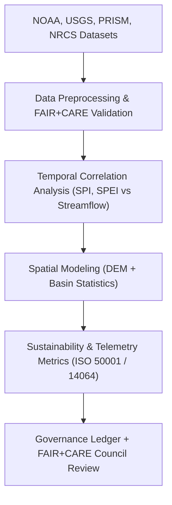
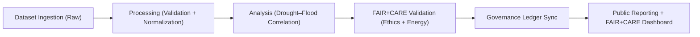

<div align="center">

# 💧 **Kansas Frontier Matrix — Hydrology Analyses Overview**
`docs/analyses/hydrology/README.md`

**Purpose:**  
Summarize all **hydrology-focused analytical workflows, datasets, and FAIR+CARE validations** within the Kansas Frontier Matrix (KFM).  
This module studies **drought–flood interactions**, **basin resilience**, and **sustainability metrics** under **FAIR+CARE**, **ISO 19115**, and **MCP-DL v6.3** frameworks.

[](../../../README.md)
[](../../../../LICENSE)
[](../../../../docs/standards/README.md)
[](../../../../releases/)
</div>

---

## 📘 Overview

The **Hydrology Analysis Module** integrates multi-source environmental datasets to quantify drought–flood cycles and hydrological behavior across Kansas.  
These analyses combine **NOAA precipitation**, **USGS streamflow**, **PRISM drought indices**, and **NRCS soil data** under strict FAIR+CARE and ISO governance.

**Core Objectives**
- Correlate drought and flood events over historical and modern timelines  
- Apply FAIR+CARE and ISO ethics in hydrological model development  
- Maintain provenance and telemetry for sustainable research transparency  

---

## 🗂️ Directory Layout

```plaintext
docs/analyses/hydrology/
├── README.md                                   # This overview
├── drought-flood-correlation/                  # Primary correlation and modeling suite
│   ├── README.md                               # Drought–flood study overview
│   └── methods/                                # Methods and dataset details
│       ├── README.md                           # Methodological documentation
│       ├── datasets/                           # Raw, processed, and derived datasets
│       │   ├── README.md
│       │   ├── raw/                            # Original data inputs
│       │   ├── processed/                      # Normalized datasets
│       │   ├── derived/                        # Analytical outputs
│       │   └── metadata/                       # Metadata registry (STAC/DCAT/FAIR+CARE)
│       └── validation/                         # Validation and FAIR+CARE reporting
│           ├── README.md
│           └── faircare_audit.json
└── reports/                                    # Analytical and sustainability summaries
    ├── README.md
    ├── correlation_summary.json
    ├── sustainability_audit.json
    └── visualization/                          # Maps, charts, and dashboards
        ├── flood_risk_index_map.png
        ├── drought_overlay_map.png
        └── hydrology_dashboard_snapshot.png
```

---

## 🧩 Analytical Framework



---

## ⚙️ Data Sources

| Source | Dataset | Format | FAIR+CARE Status |
|---------|----------|--------|------------------|
| **NOAA NCEI** | Historical precipitation and temperature | CSV / NetCDF | ✅ Pass |
| **USGS NWIS** | Streamflow and discharge time series | CSV / GeoPackage | ✅ Pass |
| **PRISM** | Drought indices (SPI, SPEI) | NetCDF | ✅ Pass |
| **NRCS SSURGO** | Soil moisture and infiltration data | GeoPackage | ✅ Pass |
| **FAIR+CARE Ledger** | Provenance, ethics, and telemetry records | JSON-LD | ✅ Certified |

---

## 🧾 FAIR+CARE Hydrology Governance Matrix

| Principle | Implementation | Verification Source |
|------------|----------------|--------------------|
| **Findable** | STAC/DCAT metadata with UUIDs and version tags | `datasets/metadata/` |
| **Accessible** | Public FAIR+CARE datasets and dashboards | Governance Ledger |
| **Interoperable** | Uses GeoPackage, Parquet, NetCDF, GeoTIFF | `data-contracts.md` |
| **Reusable** | Lineage and methods included in metadata | `manifest_ref` |
| **Collective Benefit** | Supports water management and research transparency | FAIR+CARE Audit |
| **Authority to Control** | FAIR+CARE Council oversees dataset and analysis release | Governance Charter |
| **Responsibility** | Tracks telemetry and energy sustainability | `telemetry_ref` |
| **Ethics** | Site data masked for cultural sensitivity | `faircare_audit.json` |

---

## 🧮 Sustainability Metrics

| Metric | Description | Target | Unit |
|---------|-------------|---------|------|
| **Energy Consumption** | Power used during model runs | ≤ 15 | Joules |
| **Carbon Output** | CO₂ equivalent per workflow | ≤ 0.006 | gCO₂e |
| **Telemetry Coverage** | % of analyses tracked for sustainability | ≥ 95 | % |
| **FAIR+CARE Validation** | Audit compliance rate | 100 | % |

---

## 🧩 Governance Ledger Record Example

```json
{
  "ledger_id": "hydrology-analysis-ledger-2025-11-09-0005",
  "component": "Hydrology Drought–Flood Correlation Module",
  "datasets": [
    "NOAA Precipitation",
    "USGS Streamflow",
    "PRISM Drought Index",
    "NRCS Soil Data"
  ],
  "energy_joules": 14.3,
  "carbon_gCO2e": 0.0058,
  "faircare_status": "Pass",
  "auditor": "FAIR+CARE Council",
  "timestamp": "2025-11-09T12:55:00Z"
}
```

---

## ⚙️ Validation Workflows

| Workflow | Function | Output |
|-----------|-----------|--------|
| `hydrology-ingest.yml` | Collects and normalizes hydrology datasets | `reports/data_ingest_log.json` |
| `hydrology-validate.yml` | Runs FAIR+CARE and ISO validation checks | `reports/validation_audit.json` |
| `ledger-sync.yml` | Updates Governance Ledger for analysis entries | `docs/standards/governance/LEDGER/hydrology-ledger.json` |

---

## 🧠 FAIR+CARE Hydrology Analysis Lifecycle



---

## 🕰️ Version History

| Version | Date | Author | Summary |
|----------|------|--------|----------|
| v10.1.0 | 2025-11-09 | Hydrology Working Group | Updated hydrology documentation structure with dashboard integration and telemetry metrics |
| v10.0.0 | 2025-11-09 | KFM Data Team | Added FAIR+CARE governance alignment for hydrology datasets and analyses |
| v9.8.0  | 2025-11-02 | FAIR+CARE Council | Introduced sustainability telemetry for hydrological models |

---

<div align="center">

© 2025 Kansas Frontier Matrix Project  
Master Coder Protocol v6.3 · FAIR+CARE Certified · Diamond⁹ Ω / Crown∞Ω Ultimate Certified  

[Back to Analyses Index](../README.md) · [Governance Charter](../../../../docs/standards/governance/ROOT-GOVERNANCE.md)

</div>
